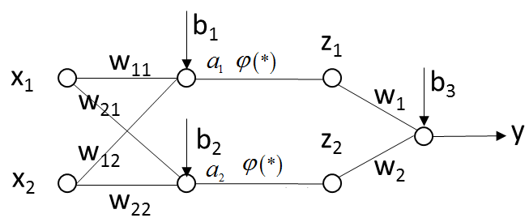
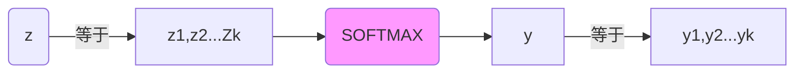

## 学习周总结

> #### 浙大公开课——机器学习
>

##### 学习识别率的理解：

单纯用识别率来判断系统的好坏是没有意义的。

- 混淆矩阵

  

  TP: 将正样本识别为正样本的数量（或概率）
  FN: 将正样本识别为负样本的数量（或概率）
  FP: 将负样本识别为正样本的数量（或概率）
  TN: 将负样本识别为负样本的数量（或概率）

  我们以行做归一化，则可以获得混淆矩阵的概率形式：
  $$
  TP+FN = 1\\
  FP+TN = 1
  $$

- ROC曲线

  四个概率$TP, FN, FP, TN$的关系有上述(1)式子，且对同一个系统如果我们把更多的正样本识别为正样本（$TP$增加），则我们一定把更多的负样本识别为正样本($FP$增加）

  

  我们要从算法本身入手，才可以使$TP$增加，$FP$增加幅度最小

  曲线图中，蓝色线最好，紫色线最差

##### 关于人工神经网络的理解：

上述两层神经网络中，$X_1\ X_2$是训练样本输入向量，$y$ 为神经网络的输出，即通过正负性来分类。那么有：
$$
\begin{array}{1}
𝑎_1=𝜔_{11} 𝑥_1+𝜔_{12} 𝑥_2+𝑏_1 \\
𝑎_2=𝜔_{21} 𝑥_1+𝜔_{22} 𝑥_2+𝑏_2 \\
𝑧_1=𝜑(𝑎_1 )\\
𝑧_2=𝜑(𝑎_2 )\\
𝑦=𝜔_1 𝑧_1+𝜔_2 𝑧_2+𝑏_3
\end{array}
$$
其中$φ(∗)$==为非线性函数==，其中，当其为阶跃函数时，三层网络可以模拟任意决策面。

我们可以通过增加神经元个数来平滑决策面，也可以增加层数来增加多个决策面。

神经网络的参数设置不是科学而是经验，或者说是艺术。

##### 梯度下降法

我们最终的目的是调整参数，使输出结果y和标签Y尽可能的接近：
$$
Minimize:E(w,b)=E_{(X,Y)}[(Y-y)]^2
$$
$E_{(X,Y)}$ 是所有训练样本取平均值

利用梯度下降法获得局部的极小值，其中 $𝛼$ 称作学习率
$$
𝜔^{(𝑛𝑒𝑤)}=𝜔^{(𝑜𝑙𝑑)}−𝛼\frac{𝜕𝐸}{𝜕𝜔}|_{𝜔^{(𝑜𝑙𝑑)},𝑏^{(𝑜𝑙𝑑)} }\\
b^{(𝑛𝑒𝑤)}=b^{(𝑜𝑙𝑑)}−𝛼\frac{𝜕𝐸}{𝜕b}|_{𝜔^{(𝑜𝑙𝑑)},𝑏^{(𝑜𝑙𝑑)} }
$$
不用每输入一个样本就去变换参数，而是输入一批样本（Batch）求出这些样本的梯度平均值后，根据这个平均值改变参数。

###### 常见非线性函数$φ(x)$的选择

- Sigmoid
  $$
  𝜑(x)=\frac{1}{1+𝑒^{−x} }\\
  𝜑^′(x)=𝜑(x)[1−𝜑(x)]
  $$
  
- tanh
  $$
  𝜑(𝑥)=\frac{𝑒^𝑥−𝑒^{−𝑥}}{𝑒^𝑥+𝑒^{−𝑥}}\\
  𝜑^′(𝑥)=1−[𝜑(𝑥)]^2
  $$
  

##### 均值方差归一化

$$
newX = \frac{X-mean(X)}{std(X)}
$$

##### 目标函数选择

在分类问题中，我们经常采用**SoftMax和交叉熵的目标函数**

**SOFTMAX**的函数形式为：
$$
y_i = \frac{exp(z_i)}{\sum^{K}_{j=1}exp(z_i)},i=1,2,...,K
$$
可以理解为y的每一个分离，是z的每一个分类取$exp$后，再归一化。容易证明：$\sum^{K}_{i=1}y_i = 1$

基于**交叉熵**的目标函数：
$$
E(y) = -\sum^{K}_{i=1}Y_ilog(y_i)
$$
在信息论中，它反应两个概率分布Y与y之间的相似程度。

**目标函数可以加入正则项**

例如：
$$
MinimizeE(w,b) = L(w,b)+\frac{\lambda}{2}{\parallel{w}\parallel}^2
$$
其中$L(w,b)$ 是原来的目标函数，另一个为正则项，$\lambda$ 为权值衰减系数

