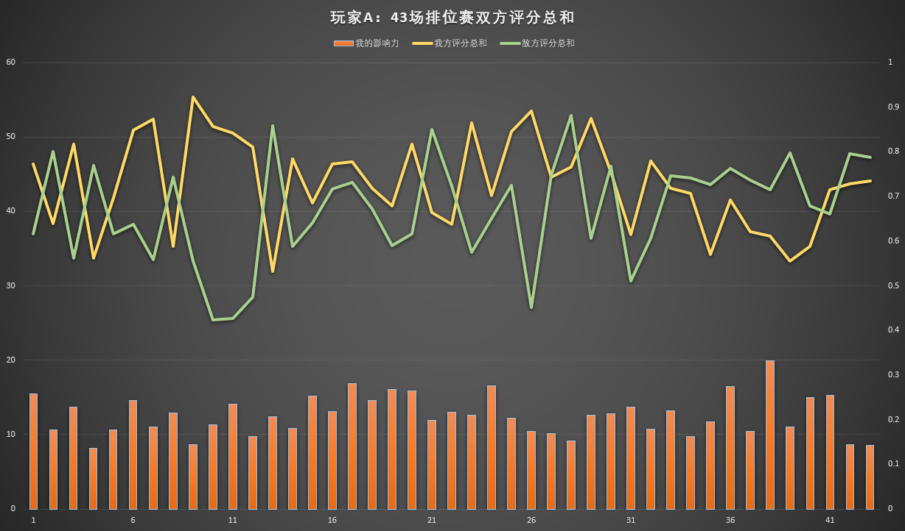

## 王者荣耀ELO闲扯

1. 引言

   让人又爱又恨的游戏是什么，我作为一个准小学毕业生，王者荣耀自然是学习时间以外必不可少的休闲项目。但是，最近的排位战况让人惨不忍睹。我不禁感叹，队友的演技不考北影中戏简直是对人才的浪费。但是队友欠费的智商就算考也是徒劳了。

   言归正传，有没有身边的一些人和我有着上述相同的感触？峡谷里也传出了各种谣言。例如：连胜之后必定连败的平衡学，MVP拿多了会给你匹配幼儿园队友的玄学，营地战力相关性匹配的力学。到底那一个才是服务器制裁玩家的真实机制？一时间众说纷纭，我不敢贸然认同。本着老师曾经的教诲，只有数据才是强有力的话语。咱们今天对匹配机制的闲扯，就从数据开扯！

2. 什么是ELO

   首先呢，我们先简单了解一下网友所说的ELO是什么。想必看到一大堆公式之类的着实会让人头疼。通俗的讲，就是你的号有一个隐藏分数。这个分数是你以往的战绩计算出来的。通过大家的隐藏分数，以及你赢取这局比赛的概率值的估计，来进行队友和对手的匹配。最终比赛结束后，根据概率下的结果，更新你的隐藏分数。所以在这个匹配机制下，服务器就悄无声息将玩家牢牢控制了。

3. 数据分析

   - **数据观察——玩家A**

      从王者拉取数据非常困难，只能手动记录。

      从中记录了玩家A最近的五十场数据，其中排除了匹配局和巅峰赛共计七场，现在还剩下四十三场数据。

      

      先解释一下上述图表，黄线是我方评分的总和，绿线是敌方评分的总和。下方的柱状图是玩家A的评分占据友方评分的百分比，换句话说，可以理解为：玩家A在本场比赛中为团队做出的贡献值（右侧是0~1区间是它的标尺）。

      > 我们知道王者同阵营有五位玩家，理想状态下的平均贡献应该为0.2，即20%。
      >

      观察敌我双方的评分图表，两条线应该差距越小，对玩家的体验是越好的，敌我双方势均力敌，才有一种博弈和竞技的感觉。经过统计玩家A参与的45场排位赛数据，我方评分平均值为43.78，方差为38.34。敌方评分平均值为40.25，方差为47.77。敌我评分差距（绝对值）的平均值为9.72，方差为52.31。玩家A的胜率为51.2%，为近期的体验感（1分至5分）打分的结果为2分。

   - **数据观察——玩家B**

     

     经过统计玩家B参与的52场排位赛数据，我方评分平均值为40.23，方差为42.46。敌方评分平均值为41.15，方差为51.61。敌我评分差距（绝对值）的平均值为9.89，方差为61.28。玩家B玩家A的胜率为53.8%，近期的体验感打分的结果为1分。

     玩家B虽然胜率高于玩家A，但是由于敌我评分差距的方差较大，导致玩家B的体验感不及玩家A的。

4. 匹配机制是好是坏

   - 判别事物的好坏这个问题是很有难度的，因为立场的不同，所以对同一个事物的判别差距是非常大的。我们作为玩家，只能从玩家的角度来分析。通过不成熟的一个问卷调查，看看大家对匹配机制的一些看法：
   - 我认为，这样的匹配机制对玩家而言，劣大于优。作为一个老玩家，苦练技术，想在排位赛得到胜利的喜悦，但是往往换来的是失败的伤痛。而且作为伤痛是比快乐更容易让人记忆深刻的。缺少成就感，在一次胜利后连续的大量负反馈，会让老玩家游戏体验变的非常差。而这个机制对于保护新玩家反而是易如反掌。（怎么听上去像服务器噶韭菜），老玩家被安排进局部分数的陷进中上下徘徊。虽然对战体验差，但是又无法卸载游戏。
   - 还有就是偷偷摸摸的来控制玩家的胜利，感觉是小人之事。不能将隐藏分及其官方的计算方法公之于众，仿佛这种手段就连官方自己也认为拿不到台面。

5. 排位怎么获胜

   最后是大家最关心的如何上分。我认为有以下三点：

   1. 多于队友沟通，让队友充分知道你的意图。通过这个良好的开始，劲儿往一处使，提升获胜的概率。
   2. 别过多的在意游戏的输赢，是我们在玩游戏，而不是游戏玩我们。如果被游戏所控制了自己的情绪就得不偿失了。
   3. 最后，失败了不要紧，虽然看到了许多智力缺陷的队友，但是要对他们信心，相信他们终究会康复的。同时要给自己一点信心，当你发现了峡谷的离谱百态，或许是时候该回到真实的生活中了。

