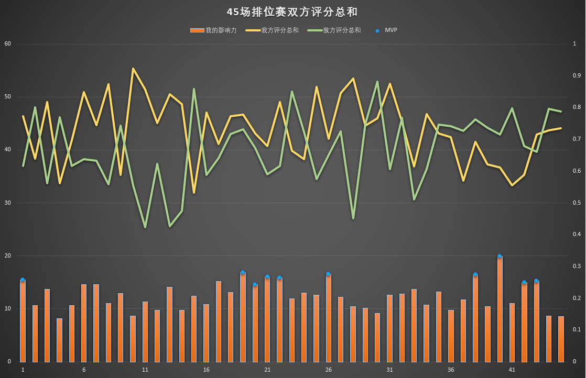
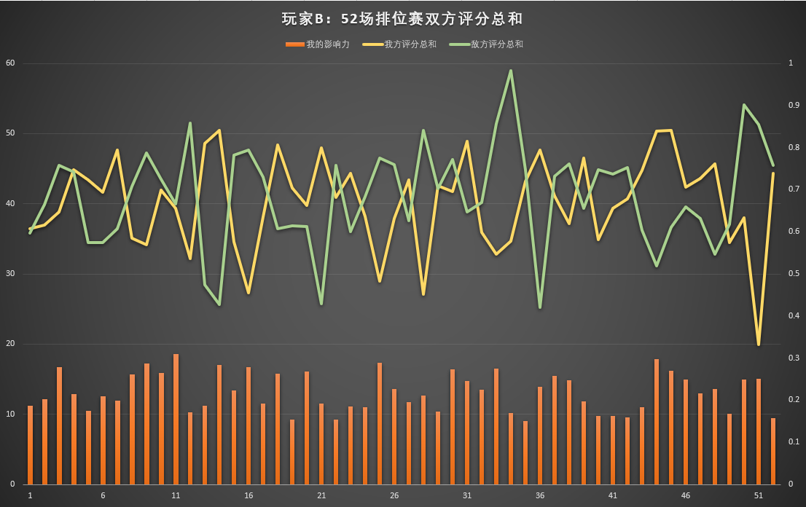

## 王者荣耀ELO闲扯

1. 引言

2. 什么是ELO

3. 数据分析

   - **数据观察——玩家A**

      王者拉取数据非常困难，只能手动记录。从中记录了玩家A最近的五十场数据，其中排除了匹配局和巅峰赛共计五场，现在还剩下四十五场数据。

      

      先解释一下上述图表，黄线是我方评分的总和，绿线是敌方评分的总和。下方的柱状图是玩家A的评分占据友方评分的百分比，换句话说，可以理解为：玩家A在本场比赛中为团队做出的贡献值（右侧是0~1区间是它的标尺）。

      我们知道王者同阵营有五位玩家，理想状态下的平均贡献应该为0.2，即20%。

      观察敌我双方的评分图表，两条线应该差距越小，对玩家的体验是越好的，敌我双方势均力敌，才有一种博弈和竞技的感觉。经过统计玩家A参与的45场排位赛数据，我方评分平均值为43.83，方差为36.66。敌方评分平均值为40.14，方差为45.89。敌我评分差的平均值为9.6，方差为50.22。

   - **数据观察——玩家B**

     

     经过统计玩家B参与的52场排位赛数据，我方评分平均值为40.23，方差为42.46。敌方评分平均值为41.15，方差为51.61。敌我评分差的平均值为9.89，方差为61.28。

   - 数据分析

4. ELO是好是坏

   - 大家满意ELO机制么？

5. 排位怎么获胜

