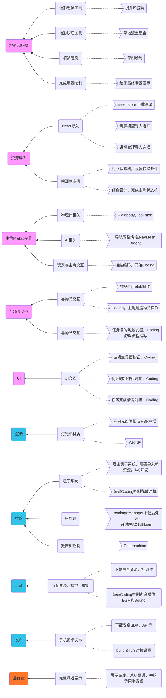

## 英文慕课调研

> written by wwh 	2021-5-31updated

### Unity的多人联网游戏开发

##### 1.先说说Unity官方

**UNet**已经被放弃，且在Unity2018.3的文档中就说明不建议使用了。

**HLAPI**和**LLAPI**也在两个LTS后不再发布，只是会支持到2022年初。


**NetCode**是现在最新的官方组件，但是这个是基于DOTS模式的。

> DOTS，数据导向型技术栈。基于ECS，Jobs System、Burst技术的一种面向数据的开发模式，门槛高上手慢，新人几乎无法接手项目。优点则是，数据（ComponentData）与行为（System）是分离的（减少大量系统间的耦合度），缓存命中率高，CPU使用效率高（多线程，SIMD），数据回滚方便。


目前，对于游戏开发，大公司有自己的网络框架和服务器等一整套解决方案，小工作室和公司会在Asset Store上利用第三方的插件寻找UNet的代替方案。

##### 2.第三方插件

**Mirror** 

免费插件，Mirror是基于Unity的废弃UNET网络系统。我们修复了它并将其扩展到MMO的规模。

**Photon Unity Networking(PUN)**

OTS（off-the-shelf）的解决方案，很多商业游戏都在使用，分为收费和免费版本。低延迟，全平台。

**Smooth Sync**

致力于改进所有场景下的 NetworkTransform 性能，适合于同步任何移动的物体。车辆、角色控制器，甚至是物理控制的对象。低发送率下也有很好的效果。是收费插件。

##### 3.unity论坛调研

###### Navigating Unity’s multiplayer Netcode transition

> https://blog.unity.com/games/navigating-unitys-multiplayer-netcode-transition （2020-4-27更新）

当你试图同时同步超过24个玩家时，点对点(P2P)拓扑通常会遇到困难，延迟会>200ms，所以对于支持25个或更多玩家的会话，我们建议转移到专用游戏服务器(DGS)拓扑。

对于目前要发布的游戏而言，考虑到这些库的预览状态，如果需要立即使用更稳定的API，您可以使用LLAPI或外部库。

###### What will the deprecated UNet features be replaced with?

The HLAPI and LLAPI will be replaced with a new networking layer, with development focused first on a fast and minimal transport layer. The P2P Relay service will be replaced with a Game Server Hosting service, enabling server-authoritative games

### 中国风游戏

##### 中国风

视觉：水墨，汉字，云，红+黄，龙，鹤，锦鲤，脸谱，军队。

听觉：国风的乐器和音色，戏曲，汉语。

实体：瓷器，木雕，剪纸，传统美食，建筑风格，茶，旗袍。

非实体：节日，历史事件，经典故事，武侠功夫。

##### 游戏

1、美术是中国风

2、游戏元素是中国风

### 游戏策划案思考

限制条件：中国元素，突出和弘扬中国文化，弱联网，3D游戏。游戏玩法明确简单。

1. 中国象棋3D版，中国传统棋类游戏，规则明确。可以和AI对战。棋子和下棋时手势动作为3D模型和动画
   - 优势：中国文化色彩浓厚，容易发布成移动端，弱联网以胜利后的ID和回合数作为数据排行榜，美术资源应该可以购买的到。
   - 劣势：代码量会比较大，数据结构复杂，在AI部分讲解和编写难度大。容易乏味。
2. 类大富翁游戏，地图以小吃街为背景，购买小吃街的商铺出售中国美食，玩法即大富翁的精简版。其中角色3D模型和动画，特效，
   - 优势：突出多样中国元素，游戏开发量级相对简单，容易表现效果，且容易发布成移动端，AI编写相对简单，弱联网以游戏结束后的ID和金钱数作为数据排行榜。
   - 劣势：代码量仍然不少，美术资源定制量多（可以做成lowpoly的，但是仍需要定制）
3. 解谜游戏，以熊猫为主角，在固定地图中收集竹子为目标。鼠标点击地图，熊猫进行移动，到关键点可以触发(调查/行动)按钮。
   - 优势：游戏相对简单，如果不注重游戏代码系统化的编写，代码编写量少，可以多对象脚本挂接。游戏元素中国风也容易表达。弱联网以游戏通关后的ID和花费时间数作为数据排行榜。
   - 劣势：游戏的可玩性完全在于关卡的设计。解谜元素是关键，且此类型游戏注重美术的表现表达。

--------------

###### 调研了一些youtube上的unity非官方的教程

其中，以Brackeys为例，粉丝量100W+，他的教程早期还是以一个特定类型的游戏为主，后期专门以特定的技术点或者是热点为主。通过对他早期的几款特定游戏类型的教程系列来看，平均时长每节课大多20+min，课程数在30+，总时长为7~10小时，量级较大。然后观察其课程运作趋势，从2014~2018年，逐步每节课时长减少为10+min，课程数在10+，此课程时长感觉相对合理。 同比咱们之前的第三人称游戏教程总时长60min，在此量级上加入简单的弱联网，课时和内容也会比较丰满。

同时调研了几个粉丝10W+的教程博主，或以美术建模为游戏教程核心，或以代码编写为游戏教程核心。但是其播放量不多，除视频质量程度的因素外，大时长枯燥的教学会"劝退"学生。

_________

### 慕课设计

#### 设计思路

- 针对人群：针对刚刚接触游戏的初学者（包括但不限于：对开发游戏感兴趣的玩家，希望掌握Unity的游戏开发人员，对Unity有初步了解的同学）

- 课程目标：让上述人群在学完后可以独立完成课程项目，掌握项目中引擎的技术点，使部分学生用Unity可以开发出自己设计的游戏。

- 课时总量：教师出镜讲述120~150分钟，软件实操120~150分钟。

- 设计思路：课程以游戏案例为基础，在完整的游戏开发的流程中，来逐步完成对Unity引擎知识点的教学计划。项目会以：

  ```mermaid
  graph LR
  start(游戏前期设计) --> model(游戏逻辑交互)
  model --> out(游戏内容表现)
  ```

- 限制条件：

  1. 资源选择Asset Store 中 Free 版本的，以供学生可以跟随课程完成游戏。
  2. 本着功能代码原生开发，且代码量必须要少，多利用引擎自带功能。
  3. 尽可能多的吸引同学观看慕课，并完成整个慕课。
  4. 弘扬正能量。

#### 游戏设计

此课程的游戏项目，会以动作解谜游戏项目出发。在设计好的地图中，玩家点击屏幕控制角色在地图中行走，在特定道具前，点击UI进行交互搬运道具到指定位置，搬运达到一定的道具数目后，游戏成功。再倒计时结束前，没有搬运规定数目的道具，游戏失败。

Unity选用最新版本。

#### 知识点拆分




