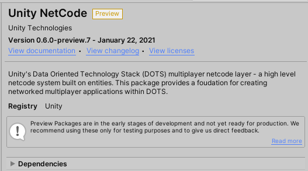

## 英文慕课调研

### Unity的多人联网游戏开发

##### 1.先说说Unity官方

**UNet**已经被放弃，且在Unity2018.3的文档中就说明不建议使用了。

**HLAPI**和**LLAPI**也在两个LTS后不再发布，只是会支持到2022年初。

**NetCode**是现在最新的官方组件，但是这个是基于DOTS模式的。

> DOTS，数据导向型技术栈。基于ECS，Jobs System、Burst技术的一种面向数据的开发模式，门槛高上手慢，新人几乎无法接手项目。优点则是，数据（ComponentData）与行为（System）是分离的（减少大量系统间的耦合度），缓存命中率高，CPU使用效率高（多线程，SIMD），数据回滚方便。

目前，对于游戏开发，大公司有自己的网络框架和服务器等一整套解决方案，小工作室和公司会在Asset Store上利用第三方的插件寻找UNet的代替方案。

##### 2.第三方插件

**Mirror** 

免费插件，Mirror是基于Unity的废弃UNET网络系统。我们修复了它并将其扩展到MMO的规模。

**Photon Unity Networking(PUN)**

OTS（off-the-shelf）的解决方案，很多商业游戏都在使用，分为收费和免费版本。低延迟，全平台。

**Smooth Sync**

致力于改进所有场景下的 NetworkTransform 性能，适合于同步任何移动的物体。车辆、角色控制器，甚至是物理控制的对象。低发送率下也有很好的效果。是收费插件。

##### 3.unity论坛调研

###### Navigating Unity’s multiplayer Netcode transition

> https://blog.unity.com/games/navigating-unitys-multiplayer-netcode-transition （2020-4-27更新）

当你试图同时同步超过24个玩家时，点对点(P2P)拓扑通常会遇到困难，延迟会>200ms，所以对于支持25个或更多玩家的会话，我们建议转移到专用游戏服务器(DGS)拓扑。

对于目前要发布的游戏而言，考虑到这些库的预览状态，如果需要立即使用更稳定的API，您可以使用LLAPI或外部库。

###### What will the deprecated UNet features be replaced with?

The HLAPI and LLAPI will be replaced with a new networking layer, with development focused first on a fast and minimal transport layer. The P2P Relay service will be replaced with a Game Server Hosting service, enabling server-authoritative games

### 中国风游戏

##### 中国风

视觉：水墨，汉字，云，红+黄，龙，鹤，锦鲤，脸谱，军队。

听觉：国风的乐器和音色，戏曲，汉语。

实体：瓷器，木雕，剪纸，传统美食，建筑风格，茶，旗袍。

非实体：节日，历史事件，经典故事，武侠功夫。

##### 游戏

1、美术是中国风

2、游戏元素是中国风

