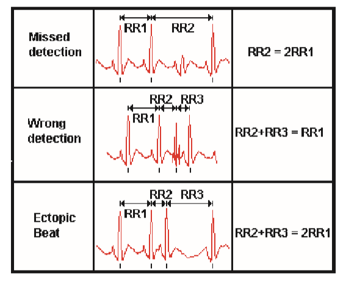

## An efficient algorithm for R-R intervals series filtering 

Proceedings of the 26th Annual International Conference of the IEEE EMBS（生物医学工程学会）

San Francisco, CA, USA • September 1-5, 2004 

#### 摘要

心率变异性(HRV)频谱分析是研究自主神经系统(ANS)活动的一种简单、无创的方法。

HRV的连续频谱分析不够可靠。

在本文中，我们描述了R-R区间序列的实时滤波算法。该滤波器能够检测每个受干扰的区域，并以最有可能的样本替换错误的样本。

#### INTRODUCTION 

HRV分析可以提供与交感神经和副交感神经活动[1]相关的定量信息，使用最广泛的是频域方法使用快速傅里叶变换(FFT)或Wigner-Ville变换给出同时在时间和频域分析，但是，这些技术最有趣的用途似乎是动态测量HRV。然而，在这种记录过程中，获得无噪声记录的概率非常低。事实上，心电信号通常受到各种扰动(异位搏动、电极运动)的干扰，这些扰动包括瞬时心脏频率曲线的突然变化，因此对频谱分析的评价是错误的。

我们描述了一种有效的R-R区间序列的实时滤波算法。该滤波器能够检测这种记录中遇到的主要伪像，并通过计算最可能的样本来重建R-R序列，同时保持真实的记录时间。

#### METHODOLOGY 

###### Filtering principle 

R-R系列中的任何伪影都使用移动窗口上的自适应阈值进行跟踪。第一个阈值的超出被标记为扰动期的开始。将扰动周期的结束标记为获得正确的样本，即该值在阈值区间内。此时，错误值被最可能的R-R样本取代，这些样本是利用扰动周期两侧的两个正确值通过线性近似计算出来的。最后，将计算得到的样本整合到移动窗口中，计算新的阈值

###### Artifacts classification 

用于R-R间隔计算的R波检测算法在长期记录中相对难以获得无噪声的心电信号，因此操作困难。在实践中，我们可以观察到不同种类的扰动，如:基线漂移或振幅变化可能导致漏检，电源噪声、外部噪声或电极运动可能导致检测不良，以及生理扰动，如异位搏动。研究这些不同的扰动对R-R级数的影响，我们将R-R级数伪影分为三类(图1)。

由于它们对R-R系列的特殊影响，我们使用这些类的规范来阐述一个选择性滤波器，作为对阈值集的补充，有助于使方法更加鲁棒。

###### Detection algorithm 

> 通过标记正确还是错误的采样，动态的调整窗口的阈值

###### Rebuilding algorithm 

###### Real time implementation 

实时监测的可能性分析

#### RESULTS

检测方法验证:

我们首先计算了每个系列的R-R值的总数和错误样本的数量。然后，在应用滤波器后，我们对检测到的错误样本数和检测到的正确样本数进行计数。表1给出了每条记录的总R-R样本和错误R-R样本的平均值以及真假检出率

重建方法验证:

#### DISCUSSION 

优势、劣势

#### CONCLUSION 

重新简述方法，此方法的可预知用途