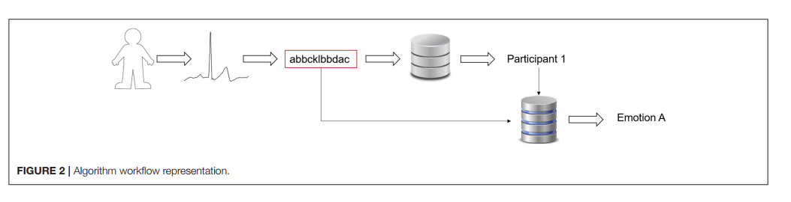

## Biometric and Emotion Identification: An ECG Compression Based Method

信息论数据模型的使用与数据压缩算法相结合，可以有效地比较心电图记录并推断出数据采集时的个人身份以及情绪状态。该方法不需要对心电波形进行勾画或对齐，减少了预处理误差。该方法分为三个步骤:(1)利用量化过程将实数心电记录转化为符号时间序列;(2)对心电信号的符号表示进行条件压缩，使用数据库中存储的符号心电记录作为参考;(3)心电记录类的识别，使用1-NN(最近邻)分类器。我们在生物特征识别上获得了98%以上的准确率，而在情绪识别上获得了90%以上的准确率。

####  INTRODUCTION

例如，我们可以根据玩家的状态调整游戏以增强体验。在家里，随着物联网的出现，我们可能会想到一间房子，根据不同的情绪状态，我们可以认出那个人，并知道他或她喜欢哪个电台。

心电图不仅具有互变性，而且具有内变性。因此，生物特征模型应该正确处理这种变异，找到每个人进行心电图的关键。

##### ECG Biometric Identification 

在生物特征识别中使用ECG的兴趣越来越大

为了克服这一缺点，心电图生物测量应用应该正确处理波动和噪声

因此，要掌握心电密钥，方法必须具有鲁棒性和抗波动能力。此外，系统应该正确处理可变性和不同的噪声源:肌肉、运动、电极放置或病理。为了获得一种可行而准确的生物特征识别系统，需要实施能够正确处理传统生物特征识别方法中存在的问题的方法。无参数方法的应用，如压缩算法，已被证明在分类中是有效的，因为没有关于前提的预先假设，从而允许真正的探索性数据挖掘。

##### Study Purpose

我们在这篇论文中提出了一种生物标志物，能够识别人和他/她的情绪状态。为了实现这一目标，我们设计了一个程序，它分为两个顺序步骤:

1. 首先，利用获得的心电片段，对人进行识别(生物特征识别)。
2. 然后，知道了这个人的身份，就确定了她/他的情绪状态(情绪识别)。

第一步(生物测定识别)，该人由属于她/他的一组ECG片段表示

第二步依赖于将这些心电片段分离成感兴趣的类别，以便创建(每个人)代表这个人所经历的情绪的心电片段集。

#### MATERIALS AND METHODS 

##### Our Approach 

我们提出使用与Kolmogorov复杂度概念相关的压缩方法进行基于心电图的生物特征识别和情绪识别。因此，我们采用无参数数据挖掘技术，克服了传统的基于心电图的问题。

(1)如果我们想要识别参与者，我们将获得的片段与每个参与者的特征数据进行比较;

(2)如果我们想要确定一种情绪，我们就看一看那个人的情绪特征的数据

##### The ECG

在这项工作中，使用了两个心电数据库。为了开发和验证方法，我们使用了一个在线数据库，即PTB数据库，可在Physionet网站上访问。我们还在我们大学采集的心电数据库上进行了测试，此后称为情绪数据库。该数据库具有不同的重要特点:心电图记录时间长;每人三个记录;每条记录都受到不同情绪条件的影响，丰富了数据，从而让使用的数据库接近真实情况。因此，该数据库允许验证该方法:

•在一个不同的数据库从一个方法被调优;

•不同天数收集的数据;

•暴露于不同外部条件下的数据。

使用预凝胶电极收集两个数据库的心电图。虽然这种配置设置具有侵入性，但它呈现出较低的噪声水平。由于本文的主要目的是给一个概念证明,例如,显示一个心电生物识别和情感识别方法基于压缩模型能够正确地识别和他的情感的人,我们决定验证方法在数据库与尽可能少的外部噪音。未来实现的想法是使用非侵入式设置收集数据。

###### The PTB Database

由对照组和不健康受试者组成，ECG信号进行预处理，滤波，分段等

###### The Emotional Database

本数据库收集25名健康受试者(10名男性)，每个参与者每周看一部电影，这三部电影分别引发了厌恶、恐惧和中性情绪。从六种最常被研究的基本情绪中(Ekman, 1992)，我们选择了两种厌恶情绪，恐惧和厌恶(以及中性情绪作为控制情绪)。我们从使用这两种消极情绪开始。

恶心的电影举例，恐惧的电影举例，中性的电影举例。每部电影的时长为25分钟，呈现顺序是平衡的。用的采集设备是专业的医用设备。

在播放每段视频(厌恶、恐惧和中性)之前，参与者被要求对自己的主观情绪进行评价，并观看一段4分钟的视频，播放的是沙滩日落和原声吉他音乐，这是休息的基线时间。在这段时间里，参与者被要求安静地坐着，尽可能地放松。他们还被告知，当看到令人痛苦的场景时，不要将目光从显示器上移开，或者闭上眼睛。在播放视频的过程中，不断地对生理通道进行采样。最后，参与者通过7分李克特量表(1 =完全没有;7 = very)，他们自述的厌恶、恐惧、快乐、愤怒、悲伤、惊讶和愉快的程度。这些参与者的测试结果表明，厌恶和恐惧的电影，相比中性的视频，成功地诱导了相应的情绪。

> 实验具体步骤的阐述，其中主观情绪有阶段性的对照实验。

然后分析有效性，将此ECG数据与PTB数据采样处理成相同分辨率。

##### ECG Processing

当使用压缩算法时，通常最好使用符号记录。心电是一个实数信号，在这项工作中，它必须被转换成一个符号时间序列。为了实现这一目标，采用了一种量化方法。

###### Quantization

图1举例说明了1 s的心电数据转换为符号，考虑6个字母的字母表大小和窗口大小w = 30

并不是所有的信息都会从实值心电传递到符号心电，因为在这个过程中会有信息的丢失，必须保证信息的丢失不会危及心电信息。

###### The Normalized Relative Compression Measure

Kolmogorov复杂度理论可以解决的最有趣和最重要的问题之一是二元对象之间相似性度量的定义。

一种基于信息距离是基于Kolmogorov复杂度(不可计算)，他们提出了一个基于标准压缩器的实际模拟，称为标准化压缩距离。

##### Biometric vs. Emotion Identification

##### Statistical Analysis

识别率的分析相关说明

#### RESULTS AND DISCUSSION

##### Biometric Identification Using the PTB Database

##### Biometric Identification Using the Emotional Database

##### Emotion Identification

#### CONCLUSION

我们的方法包括三个步骤:(1)量化过程，将实测值心电图转换为符号时间序列;(2)压缩，使用fcm，和量化的信息需要代表一个记录单独考虑模板记录，由NRC的手段;(3)使用1-NN分类器的分类步骤。

归一化相对压缩测量充分地比较了两个心电片段，量化了它们的相似性，从而允许在组之间分层。

文章方法贡献的说明

##### 

