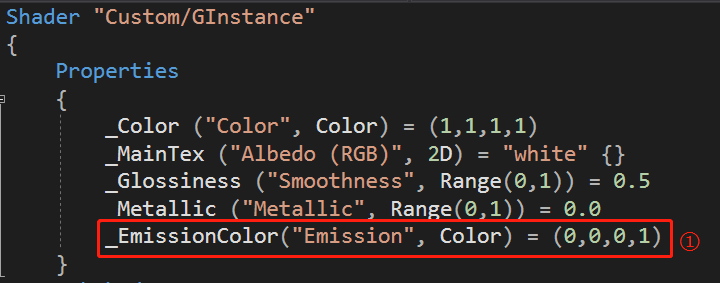

## GPU Instancing Research

> written by wenweihang

实际当中，有这样一个需求，精简后是这样：在Unity中，用100x100的立方体模拟一个彩色点阵屏，用来显示用外部加载的图片。其中每个立方体就好比点阵中的一个像素块。

大概分析之后，有几个关键点：

1. 在Unity中加载外部的图片。
2. 点阵屏发光的感觉。
3. 大量的同种材质但不同颜色的立方体。

我们来逐一进行分析。

#### 外部图片的加载和采样

加载外部图片到Texture2D，我们可以通过 FileStream 读取图片文件，然后传给Texture2D。

```c#
for (int i = 0; i< filePathes.Length;++i)
{
    var filePath = Application.dataPath + filePathes[i];
    FileStream fileStream = new FileStream(filePath, FileMode.Open, FileAccess.Read);
    fileStream.Seek(0, SeekOrigin.Begin);
    //创建文件长度缓冲区
    byte[] bytes = new byte[fileStream.Length];
    //读取文件
    fileStream.Read(bytes, 0, (int)fileStream.Length);
    //释放文件读取流
    fileStream.Close();
    fileStream.Dispose();
    fileStream = null;
    //创建Texture
    int width = 1;
    int height = 1;
    loadedPics[i] = new Texture2D(width, height);
    //将读取的图片数据传入Texture2D
    loadedPics[i].LoadImage(bytes);
}  
```

然后，遍历图片的长宽，从中得到对应的像素Color值。

```c#
for (int i = 0; i < 130; ++i)
{
    for (int j = 0; j < 130; ++j)
    {
        /* 此处的130是点阵屏的长宽，就可以简单进行一个粗糙的点采样。*/      
        var pixel = loadedPic.GetPixel(
                            (int)(i / 130.0f * loadedPic.width),
                            (int)(j / 130.0f * loadedPic.height));
    }
}
```

#### 点阵屏发光感觉

说起发光，首先想到的是光源，虽然我们可以调整渲染路径为deferred，但是有10000+的动态灯光也是吃不消的。我们可以考虑使用材质的自发光Emission，设置自发光的颜色。然后，在后处理中，添加一个Bloom效果，这样就稍微有那么点意思了。


#### 效率优化

我们不难发现，效率现在是一个超级大问题。如果我们进行一种直观的粗暴的解决方法，代码如下：

```c#
public void SetLatticeScreenColor_Rude(int row, int col, Color color)
{
    var cube = Cubes[row * 130 + col];
    var renderer = cube.GetComponent<MeshRenderer>();
    renderer.material.SetColor("_EmissionColor", color);
}
```


我们不难看到，DrawCall达到了16915次，帧数只有区区13帧，消耗在CPU和GPU的时间都是巨大的。我们需要一种快速有效简单的优化方式。那么我们可以使用 **GPUInstancing** 来优化材质。

我们先来看看优化后的效果：


帧数提升至100帧（提高了接近10倍），DrawCall 仅仅有了16次，CPU和GPU的消耗时间非常少。优化非常成功！接下来我们看看这个技术是如何使用的。

首先，我们新建一个Standard Surface Shader，然后打开这个Shader文件，在Properties增加一个自发光颜色。



然后在这里将我们的自发光属性添加到Instancing buffer props中


再然后在像素着色器中这样使用，读取自发光属性。


我们返回到Unity中，将应用此shader的材质开启GPU Instancing。


最后，我们需要在代码中给这个材质这样传参：

```c#
public void SetLatticeScreenColor_GPU(int row, int col, Color color)
{
    var cube = Cubes[row * 130 + col];
    MaterialPropertyBlock props = new MaterialPropertyBlock();
    props.SetColor("_EmissionColor", color);
    var renderer = cube.GetComponent<MeshRenderer>();
    renderer.SetPropertyBlock(props);
}
```

这样，我们的需求也顺利完成了。

下面扩展一下，搞一个体育馆座椅LED的模拟。


比如再播放一些序列图，让场景高级一些（ps:不会策划的程序不是好美术(●'◡'●) 

