## Simulating Artistic Media: Drawing

### 2.2 Simulating Pencil

##### 2.2.1 Observational Models of Graphite Pencil Materials

Mario Costa Sousa和John Buchanan设计了一个基于电子显微镜观察的模拟石墨铅笔绘画的系统[Sousa, Buchanan 99a] [Sousa, Buchanan 99b] [Sousa, Buchanan 00]。他们观察了实体铅笔绘图材料(铅笔、纸、橡皮、搅拌机)之间的交互作用，目的是生成模拟这些交互作用的算法。图2.1显示了使用的电子显微镜图像类型的一个例子。Sousa和Buchanan把模拟石墨铅笔绘图的问题分解成四个基本的子问题：

1. 绘图材料——这是一种算法，可以在较低水平上模拟石墨铅笔、绘图纸、搅拌机和揉捏橡皮。
2. 绘制原语——这些算法使用绘制材料算法构建色调和纹理。
3. 渲染方法——这些算法使用绘图原语基于参考图像或三维对象勾勒、着色、阴影或纹理图像，以一种模拟手绘铅笔渲染的方式。
4. 高级工具——这些工具允许用户通过排序和重复低级的绘图过程来交互式地控制绘图过程。

下面的一组艺术参考是由我们在本章中涉及的研究人员提到的

> **For charcoal pencil drawing:** 
>
> - Art of the Pencil: A Revolutionary Look at Drawing, Painting, and the Pencil by S.W. Camhy [Camhy 97]. 
> - The Drawing Process: Rendering by D. Douglas and D. van Wyk [Douglas, van Wyk 93]. 
> - Pencil Drawing by G. Franks [Franks 88]. 
> - Rendering in Pencil by A.L. Guptill [Guptill 97]. 
> - An Introduction to Drawing by J. Horton [Horton 94]. 
> - Pencil Drawing Techniques by D. Lewis [Lewis 84a]. 
> - An Introduction to Pencil Techniques: Easy Start Guide by H. Misawa [Misawa 93]. 
> - Barron's Art Handbooks: Drawing by the Parramon Editorial Team [Parramon 97]. • The Art of Drawing in Lead Pencil by J. Salwey [Salwey 25]. • Pencil Drawing (Trorn the Art Is... Video Series,) G. Price [Price 93]. 
> - Course in Pencil Sketching, Four Books in One by E.W. Watson [Watson 78].
>
> **For colored pencil drawing:** 
>
> - Colored Pencil Drawing Techniques by I. Hutton-Jamieson [Hutton-Jamieson 86]. 
> - The Encyclopedia of Colored Pencil Techniques by J. Martin [Martin 97].
>
> **For pen-and-ink drawing:**
>
> - Pen and Ink Techniques by F. Lohan [Lohan 78b]. 
> - Rendering in Pen and Ink by A. Guptill [Guptill 76]. 
> - Ink Drawing Techniques by H. Pitz [Pitz 57]. 
> - The Technical Pen by G. Simmons [Simmons 92].

石墨铅笔的模型考虑了两个因素:铅笔“铅”的硬度和削尖的铅笔尖的形状。绘图铅笔是由一个木制的外壳包裹着一根“铅”，而铅(铅笔的书写芯)是由石墨、蜡和粘土组成的。铅和粘土的相对百分比决定了铅笔的硬度，铅笔在纸上移动时，蜡是用来润滑笔尖的。粘土含量比石墨含量高的铅笔更硬，因此使用时在纸上沉积的铅更少。改变削铅笔的方式会影响石墨在纸表面沉积的方式。Sousa和Buchanan使用三维多边形来定义铅笔尖端的形状。根据引线类型、多边形尖端形状和压力分布，计算出纸张表面每个标记的引线分布。铅的分布决定了沉积在纸张表面的石墨粒子的数量。使用Sousa算法生成的铅笔标记示例如图2.2所示。

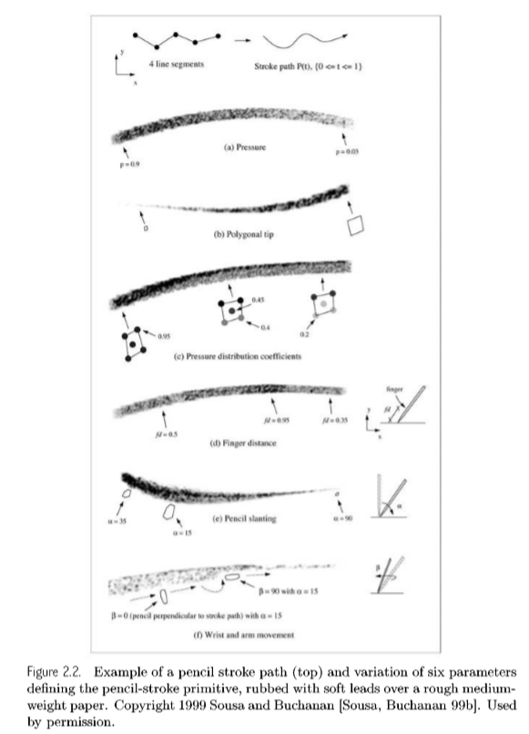

用三维高度场对图纸进行了模拟。纸张的颗粒被定义为特定纸张模拟的最小特征。然后根据模拟的纹理将要模拟的纸张网格化，并为每个网格点分配一个高度。每个单元的高度代表最大的局部铅体积。细胞中所含的铅、蜡和粘土的量是在运行时计算的，这些细胞与铅笔的尖端相互作用。Sousa和Buchanan称这些网格细胞为颗粒。Sousa和Buchanan采用Curtis等[Curtis等97]的伪随机纹理或阈值扫描绘图纸计算晶粒尺寸和高度场。

Sousa和Buchanan的算法的核心是纸和铅笔之间的交互作用。铅笔的硬度和施加在纸上的压力会对纸产生反应。铅笔的笔尖形状也会因这些相同的因素而改变，铅笔的笔画也会由于相互作用而留在纸上。Sousa和Buchanan定义了47个变量来描述纸、石墨铅笔以及它们之间的相互作用。由于系统的复杂性，我们只提供了一个轮廓的算法建模的纸和笔的交互。

**笔尖在纸上的每一个新位置：**

1. 计算铅笔的顶点的多边形尖端形状。
2. 计算纸张的局部铅含量阈值体积(每个格子能容纳多少材质。
3. 在笔尖形状上分配施加在铅笔上的压力。

**对于每一个与笔尖相互作用的纸张纹理：**

1. 计算纹理孔隙的阈值体积(每个格子能容纳多少材质)。
2. 计算被铅芯刺到的纹理。
3. 计算铅笔芯对纹理造成的损害

调和笔和橡皮使用相同的基本算法建模;然而，在与纸张的相互作用过程中，它们被允许吸收和分布铅粒子。调和笔被用来软化边缘和使色调之间的平滑过渡。橡皮擦除去石墨颗粒，使绘图变亮。混合和擦除的示例如图2.3、2.4和2.5所示。

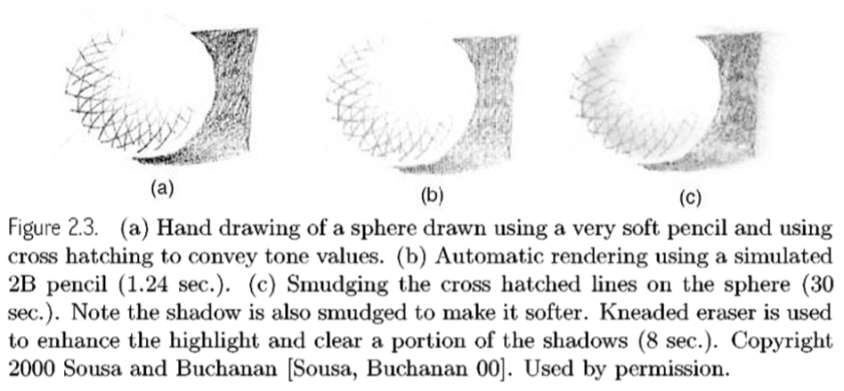

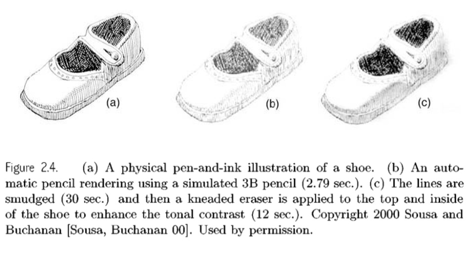

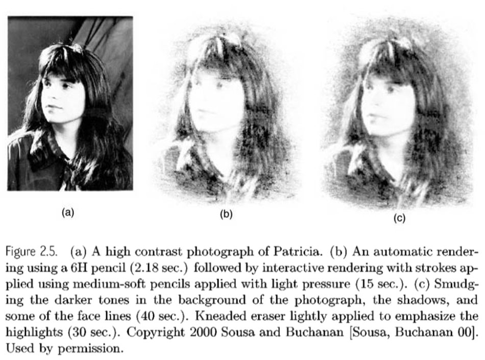

Sousa和Buchanan使用一种渲染一组笔画的原始标记来模拟艺术着色。这样做的原因是为了在屏幕空间中创建带有色调和纹理的区域。示例方法如图2.6所示。

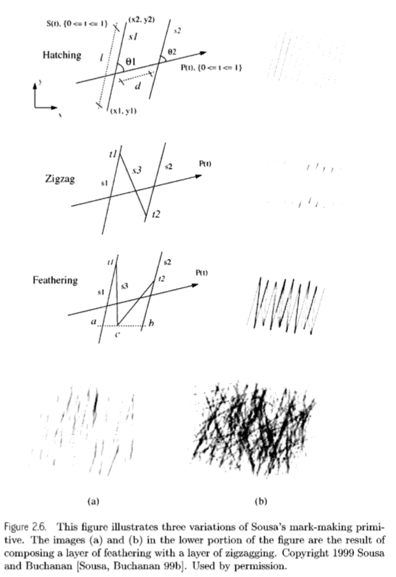

Sousa和Buchanan的系统允许使用两种方法将三维模型绘制成铅笔画。第一种方法是从三维模型中提取轮廓线和折痕线的轮廓草图。提取这些行的方法将在第8章中介绍。第二种方法是使用模拟色调对比绘图来渲染模型。首先使用Phong阴影生成灰度参考图像，然后在色调对比中渲染三维模型。然后，对于每个可见的多边形面和每个阴影，构造一个标记原语，用模拟铅笔线填充屏幕空间的区域。铅笔线可以被裁剪，以精确地填充该区域，或者允许在屏幕空间区域之外漫游，以创建一个粗略的渲染感觉。此外，两种绘制方法(轮廓绘制和色调对比)可以在单一图像中一起使用。语调匹配的工作是广泛的，有兴趣的读者应该研究Sousa的Eurographics 99论文[Sousa, Buchanan 99b]。图2.7显示了他从三维模型绘制铅笔草图的系统示例。

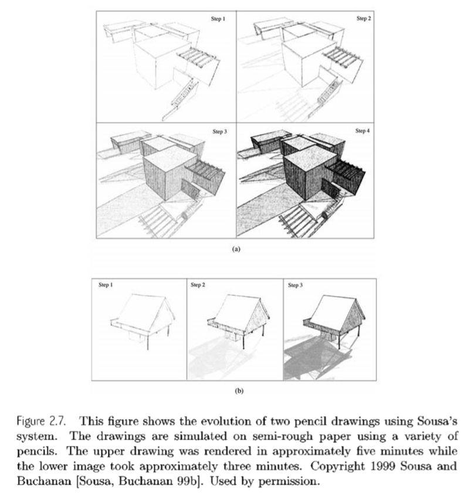

### 2.3 Simulating Pen-and-ink

##### 2.3.1 Pen-and-ink Illustrations

Georges Winkenbach和David Salesin描述了传统的笔墨插图原理，提出了在模拟笔墨中绘制多边形模型和自由曲面的算法和技术[Winkenbach, Salesin 94] [Winkenbach, Salesin 96]。他们介绍了在三维模型上创建色调和纹理的两个新想法:“描边纹理”用于在多边形模型上创建色调和纹理，以及“控制密度叠加”用于自由曲面。他们还演示了缩放渲染、生成轮廓、剪切和在曲面上投射弯曲阴影的方法。图2.10显示了这种类型的钢笔和墨水插图的一个例子。

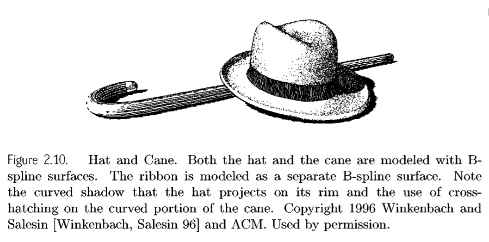

Winkenbach和Salesin的工作是非真实感渲染研究的一个很好的例子。他们研究一种艺术形式的方法和技术，编制艺术家使用这种形式创作图像所遵循的规则列表，然后编写计算机算法根据艺术规则渲染图像。Winkenbach和Salesin采用的方法还允许他们构建封装艺术方法的系统，使非艺术人员能够产生具有手工制作外观和感觉的图像。我们鼓励对非真实感渲染领域的研究感兴趣的读者阅读他们的论文并更仔细地检查他们的研究方法，特别是[Winkenbach, Salesin 94]和[Winkenbach, Salesin 96]。

钢笔和墨水插图通过轮廓和阴影传达形状信息。轮廓线是用来传达一个物体的轮廓和描绘内部区域。在插图中，着色区域被称为“色调”。色调是反映从物体表面的一点反射到观察者的光的数量。钢笔和墨水插图是由笔画组成的，因此传达了一个地区的平均反射光。此外，笔画的特征可以由艺术家操纵，以传达材料属性或表面的“纹理”的想法。无数的方法存在，以结合轮廓笔画和阴影笔画在一个插图。Winkenbach和Salesin在他们的论文中提出了一些共同的约定。轮廓、色调和纹理的示例如图2.11所示。

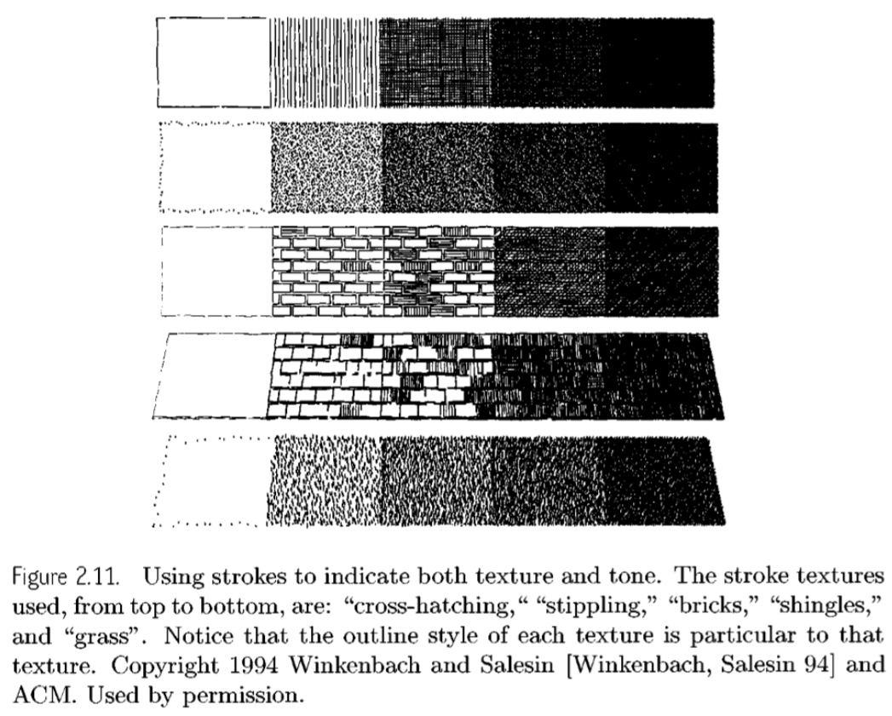

在标准的计算机图形渲染中，色调和纹理是渲染管道中独立的元素。在插图中，因为两者都是用笔触渲染的，所以它们必须紧密耦合。此外，模型对象或场景的标准计算机渲染中编码的三维信息，除了投影外，不需要与该对象或场景的二维图像交互。在插图中，情况并非如此，因为一个物体的轮廓会受到场景中其他物体的影响。Winkenbach和Salesin注意到，必须对标准图形管道做以下更改。

保持二维空间细分。在渲染时需要考虑二维邻接信息，这建议使用某种形式的空间细分可视表面。Winkenbach使用半边数据结构维护平面地图[Manyyla 88]。

纹理和色调的渲染。纹理和色调的传达与描边孵化，而不是扫描转换多边形。

剪裁。笔画必须裁剪到它们正在着色的区域。使用的算法必须快，因为涉及大量的笔画。

描绘轮廓。外部轮廓的绘制需要考虑封闭区域的纹理和相邻区域的纹理。内部轮廓可以在着色区域内使用，以建议阴影区域或给描边纹理以视相关的口音。

## Chapter 7 Feature Edges : Silhouettes, Boundaries, and Creases

### 7.1 Image Space Algorithms

##### 7.1.1Using First- and Second-Order Differentials in Image Space

斋藤和高桥是（Saito and Takahashi）进一步将边缘分为两类:外部轮廓边缘，即围绕物体外部边界的光晕；以及内部轮廓边缘，即从目前的观点来看属于边界内部的轮廓线。
$$
z_s = \frac{d^2}{wz_v} \tag{7.1}
$$
$d$是视点到屏幕的距离

$z_v$是物体的深度

$w$是屏幕上的像素长度

深度图是将$[d_{min},d_{max}]$ 映射到[0,255]的灰度图像

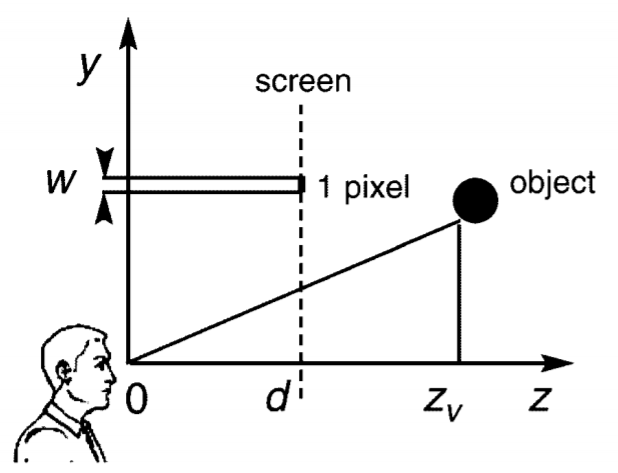

轮廓边缘被定义为$C^0$(0阶)在深度图中不连续的地方，而轮廓边缘又可以用深度图的一阶导数计算出来。内部边缘是$C^1$在深度图中不连续的地方，而其又可以在深度图的二阶偏导中获得。斋藤和高桥推荐用Sobel's过滤器，对于像素X和他的周围的(A-H)如下所示：
$$
A\quad B\quad C\\
D\quad X\quad E\\
F\quad G\quad H\tag{图}
$$
$C^0$ 不连续处可以被写成一个新的图像 $g$，有
$$
g(X) = (|A+2B+C-F-2G-H| + \\|C+2E+H-A-2D-F|)/8
\tag{7.2}
$$
这个公式7.2是归一化的，以至于符合每个像素的梯度。

$C^1$在深度图中的不连续处可以用二阶导数提取出：
$$
l = (8X-A-B-C-D-E-F-G- H)/3 \tag{7.3}
$$
在轮廓计算中仍然可能出现问题。利用一阶微分算子，很难区分不连续和大的连续变化。此外，二阶微分算子可能有一个双线伪影，如图7.6(c)所示。

斋藤和高桥单位化这两张图片,$g$ 和 $l$ ，如下：
$$
p = \left\{ 
\begin{array}{ll} 
\frac{g_{min}-g}{g_{max}-g_{min}}, & if(g_{max}-g_{min}>k_g) \\ 
\frac{g_{min}-g}{k_g}, & if(g_{max}-g_{min}<=k_g)\\ 
\end{array} 
\right. 
\tag{7.4}
$$

$$
e = \left\{ 
\begin{array}{ll} 
l, & if(g_{max}-g_{min}<=k_l) \\ 
\frac{l}{\frac{{g_{max}}^2}{k_l}}, & if(g_{max}>k_l)\\ 
\end{array} 
\right. 
\tag{7.5}
$$

这里的 $g_{max}$ 和 $g_{min}$ 是其周围3x3像素矩阵中的最大和最小的梯度值。常量$k_g$ 是从连续的变化中区分不连续，同时 $k_g$ 只依赖于原始图像。常数 $k_l$ 是为了消去0阶不连续的梯度的极限。在下图中 $k_g = 10\quad k_l=2$

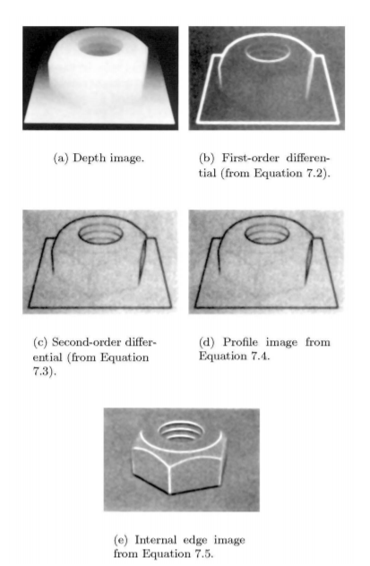

斋藤和高桥的方法的好处包括算法的稳定性和独立于模型的表面表示。然而，与任何图像空间的算法一样，特征边缘计算是不精确的。

##### 7.1.2 Using Normal Maps to Find Creases and Boundaries 

Philippe Decaudin提出了一种寻找折痕、$C^0$不连续处和物体边界的方法，这些可能不会被使用深度图的图像空间算法检测到。Decaudin的方法用表面法线或法线贴图来增强深度图。法线贴图表示物体上每一点的表面法线。每个像素由一个(R, G, B)值表示，该值对应于物体上相应点的$(x,y,z)$组成的表面法线。

法线映射使用以下算法获得。首先，物体的颜色被设置为白色，其材质属性为漫反射。然后在x轴上放一盏红灯，在y轴上放一盏绿灯，在z轴上放一盏蓝光，每一盏灯都朝向物体。接下来，负光源(强度为负的光源)被放置在物体与三种颜色光源相对的一侧。法线贴图是通过使用这6盏灯渲染场景产生的，如图7.7所示。

通过使用Decaudin的法线映射扩展标准图像空间算法，现在可以在图像空间中找到$C^0$和$C^1$不连续处(轮廓和折痕)。

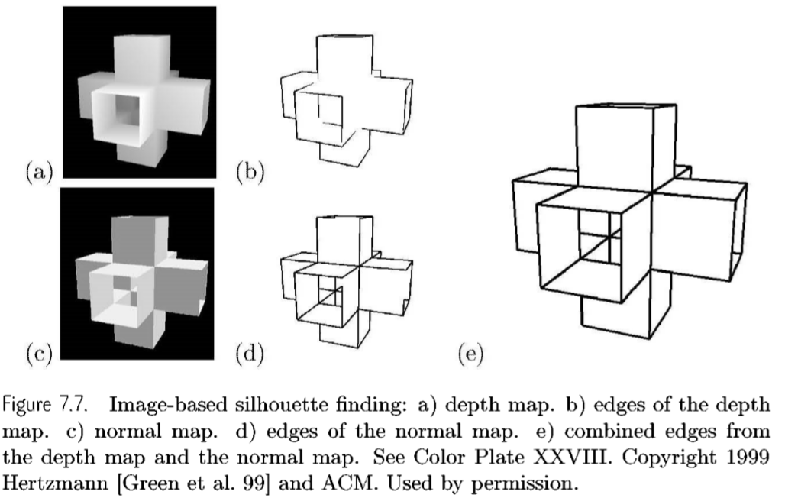

##### 7.1.3 Image Processing with a Particle System

Cassidy Curtis的“loose and sketchy”滤镜自动绘制三维模型的可见轮廓边缘。他的方法使用图像处理和随机的(stochastic)、基于物理的粒子系统。该方法从一个深度映射图像开始。然后将深度图转换为两个额外的图像，一个模板图像和一个力场图像，如图7.8所示。

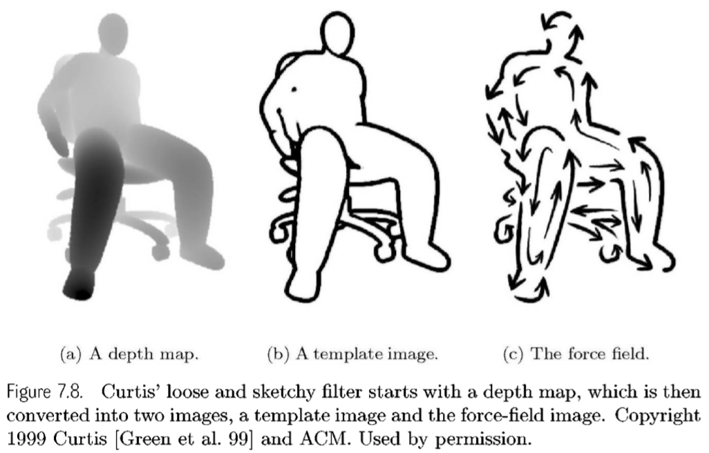

通过计算深度图的梯度大小，将其阈值化为二值(0或1)，并对结果进行模糊处理，得到**模板图像**。模板图像中的每个像素代表其邻近区域所需的墨水量。

通过计算垂直于深度图梯度的单位向量得到**力场图像**。这个矢量场用于沿轮廓边缘推动粒子。

Curtis的算法产生固定数量的粒子，每次一个。每个粒子的位置从模板图像中随机选择，只将粒子放置在模板图像的值为1的区域。在每一个时间步长，粒子的运动是基于力场和额外的用户操纵系数：如随机性和阻力。粒子在移动时从模板图像中擦除墨迹像素，粒子的运动用反锯齿线渲染。如果一个粒子游荡到一个不需要墨水的区域，当前的粒子就会消失，算法就会在一个随机的地方生成一个新的粒子。粒子也可能在用户确定的步骤数之后死亡，这取决于所需的笔画长度。

Curtis的方法允许软件用户创建各种线条风格，从精确到手势草图。Curtis在图7.9中展示了他的方法可以赋予线条画生命，即使是静态的图像，用一些简单的线条传达运动和情感。然而，该方法可能不能捕获所有的轮廓和折痕，因为计算是基于图像缓冲区的内容进行的。

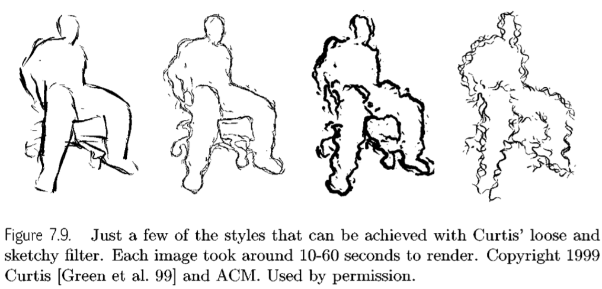

##### 7.1.4 Using Hardware 

绘制轮廓的硬件方法不需要预先了解模型，也不需要对模型进行预处理，并且在很大程度上利用了普通图形硬件。这些方法之所以有用，是因为它们易于实现。大多数依赖于多通道渲染来提取轮廓。

Ramesh Raskar和Michael Cohen给出了如何渲染多边形模型轮廓的简单算法概述:

生成两组多边形:

- P1：最接近视点的所有可见多边形的层。

  对于一组封闭物体的多边形模型，P1由完全可见的正面多边形和部分可见的正面多边形的可见子部分组成。

- P2：第二层的多边形从相同的视点。

  第二层的计算方法是删除P1中的所有多边形，并对剩余的多边形执行相同的可见性算法

轮廓是P1和P2的交点(假设用户不在一个封闭的物体中，并且多边形的内部不相交)。在图像空间中使用z-buffer, P1和P2深度值相等的位置对应于轮廓上的点。

在本节的其余部分中，我们提出了几种使用图形硬件来加速多边形模型轮廓计算的方法。

###### Algorithm 1 

在1999年的SIGGRAPH OpenGL课程中[Blythe et al. 99]提出了这种在白色背景上以黑色呈现轮廓边缘的方法，Raskar和Cohen 也提出了这种方法。由于像素采样和z-buffer量化，算法1可能会丢失靠近轮廓的像素。它也只生成最多一个像素宽的轮廓边缘。

- 用白色填充背景。
- 启用背面剔除，设置深度功能为“小于”。
- 用白色渲染正面多边形。
- 开启正面剔除，深度设置为“等于”。
- 用黑色绘制面向背面的多边形。
- 重复一遍，换一个新视角。

###### Algorithm 2 

一种改进的算法，设计用于渲染背面多边形的边缘，而不是填充背面多边形。它最初是由Rossignac提出的。算法2在与相应的多边形边缘深度值相同的情况下，创建具有恒定厚度的可见轮廓边缘。算法2易于实现，在相邻的前面和后面多边形之间的二面角不大的情况下可以很好地实现。然而，随着线条宽度的增加，轮廓边缘之间可能会出现缝隙。

- 用白色填充背景。
- 开启背面剔除，深度设置为“小于”。
- 用白色渲染正面多边形
- 开启正面剔除，深度设置为“小于或等于”
- 用黑色，在线框模式绘制面向后的多边形
- 重复一遍，换一个新视角。

###### Algorithm 3 

算法3由Raskar和Cohen提出，增加了轮廓处的交集区域。前面的多边形被渲染，然后后面的多边形被略微拉向相机，深度函数设置为“小于或等于”并渲染填充。算法3克服了深度缓冲区的精度问题，允许更多的背面多边形被渲染。

OpenGL API提供了glPolygonOffsetQ函数，可以用来偏移多边形。它允许z相关的缩放，并考虑到多边形相对于摄像机的方向。或者，所有的多边形都可以朝着摄像机移动一个固定的距离。然而，平移背向多边形并不会产生如图7.10所示的均匀宽度轮廓。

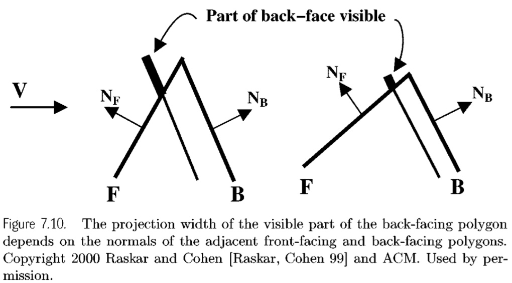

- 用白色填充背景
- 启用背面剔除，设置深度功能为“小于”
- 用白色渲染正面多边形。
- 开启正面剔除，深度设置为“小于或等于”
- 向相机偏移背向多边形
- 以黑色填充模式绘制面向背面的多边形
- 重复一遍，换一个新视角。

###### Algorithm 4 

Raskar和Cohen提出了一种使用“fat”背向多边形绘制等宽轮廓边缘的方法:

$z$ = 从相机到边缘中点的距离

$N_B$ = 面向后面的多边形的法线

$V$ = 视点的向量

$E$ = 边向量，使得$cos(\alpha)=V\cdot E$

那么，对边缘E所需的增肥与如下成正比
$$
z*sin(\alpha)/(V \cdot N_B)
$$
这一过程使每条边单独变粗，允许每条线以不同的数量加粗。Raskar和Cohen注意到，一般情况下，对于每个多边形的质心，$z$和$V$只能近似计算一次。

在增肥后，一个n边多边形有2n个顶点与n条原始边相连，这些边可能包含顶点之间的小间隙。通过连接移位的顶点和三角测量，任何潜在的间隙都被关闭。最有效的三角测量方法是从原始三角形的质心创建一个三角扇形。Raskar和Cohen的方法只涉及多边形的绘制，而不是像算法3那样使用多边形和线框。

###### Algorithm 5

Gooch等人[Gooch et al. 99]和Blythe等人[Blythe et al. 99]提出了一种使用模板缓冲和多边形偏移来创建均匀线宽轮廓的略微不同的算法

- 清除深度和颜色缓冲，并将模板缓冲设置为零
- 禁用颜色缓冲写入
- 使用glPolygonOffsetQ绘制深度缓冲的几何图形，使图像向远剪切平面偏移
- 禁止写入深度缓冲区和glPolygonOffsetQ。
- 设置模板功能为始终传递，并设置模板操作为倒置。
- 启用背面剔除。
- 使用glPolygonModeQ绘制几何线
- 启用写入颜色缓冲区，禁用背面剔除
- 如果模板值为1，则设置模板函数为传递
- 渲染一个矩形，填充整个窗口(这将产生剪影图像)。
- 绘制几何体的真实边缘
- 启用写入深度缓冲区

### 7.2 Object Space Algorithms

##### 7.2.1 Brute Force for Polygons 

绘制轮廓的一个简单技术是明确地测试多边形模型中的每条边。剪影边缘只能出现在正面和背面多边形之间的共享边缘上。当模型被渲染时，这种计算可以并行完成，特别是在z-buffer为消除隐藏表面而准备的情况下，或者如果模型要被着色。虽然蛮力计算很简单，但它可能成为大型模型的瓶颈。折痕和模型边界与视图无关，因此可以预先计算和存储。然而，剪影是视相关的，所以更有效的软件算法可能需要检测轮廓边缘在交互式帧率。

##### 7.2.2 Probabilistic Testing 

Lee Markosian [Markosian, et al. 97]演示了一种以精度换取速度的实时非真实感渲染方法。他们的方法通过对轮廓边缘进行快速概率识别，改进并简化了Appel的隐藏线算法[Appel 67]。利用轮廓边缘的帧间一致性和快速的能见度确定来进一步提高轮廓计算的速度。

Markosian等人的算法可以总结如下:

- 确定模型的轮廓边缘。
- 使用改进的Appel算法确定特征边缘的可见性。
- 渲染特征边缘。

###### Finding Silhouettes 

为了在大型多边形模型上保持实时帧率，Markosian等人开发了一种快速检测轮廓的随机算法。他们的方法在每个时间步中测试模型边缘的百分比，以确定任何被测试的边缘是否为轮廓。一旦发现轮廓的边缘，该算法通过递归测试邻边来跟踪轮廓曲线。使用这种方法，Markosian等人最有可能检测出一个给定视点的模型轮廓（更长、更视觉上重要的轮廓）。然而，他们的方法并不能保证能找到所有的轮廓边缘。

Markosian等人通过根据二面角排序边缘，从最大的开始，从而增加找到轮廓的机会。因此，边缘是轮廓的概率正比于$(\pi-\theta)$，其中 $\theta$ 是边缘的二面角。轮廓边缘的帧到帧的一致性是通过从前一帧检查轮廓边缘。

###### Visibility Testing in Image Space and Silhouette Linking 

在Markosian的论文和Northrup和Markosian的一篇论文[Northrup, Markosian 00]中，描述了一种确定轮廓可见度的新方法。每个多边形的面和轮廓边缘被标记为一个唯一的ID参考颜色。ID参考图像是通过渲染没有照明的场景生成的。利用ID参考图像，构造对图像 $L$ ，至少为其贡献了一个像素的边缘列表。$L$ 中的每个边缘都被扫描转换，并与ID参考图像进行比较，以确定每个边缘的哪些部分是可见的。每个可见的部分被记录为一个分段，它由两个图像空间端点和一个指向相关边缘的指针组成。

在连接图像空间段之前，Markosian和Northrup进行了两个校正步骤，使轮廓曲线更长更平滑。首先，通过删除较短的段来简化重叠和近似平行的段;如果两条边之间的夹角小于1度，则它们几乎是平行的。接下来，彼此相邻且几乎平行的段被合并，如图7.11所示。

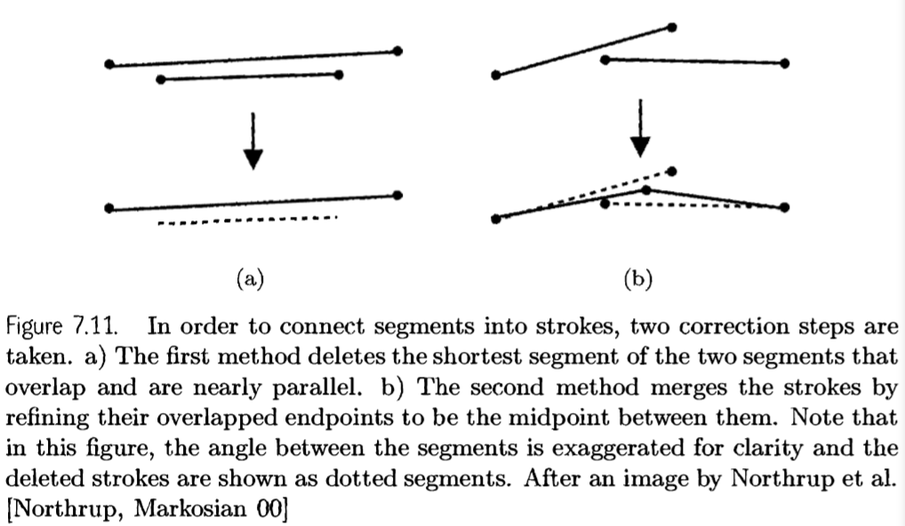

> 为了将部分连接成笔画，需要采取两个修正步骤。a)第一种方法删除两个重叠且几乎平行的线段中最短的线段。b)第二种方法合并笔画，将它们重叠的端点细化为它们之间的中点。请注意，在这个图中，段之间的角度被夸大了，并删除的笔画显示为虚线段。Northrup等人拍摄的图像后

为了将片段连接成路径，Northrup和Markosian搜索在每个片段的端点附近寻找潜在的邻居。搜索是对ID参考图像进行m x m次局部像素搜索，m = 3。下面的算法决定分段 $s$ 和 $n$ 是否适合连接：

给予了2个线段$\ s\ $和$\ n$

$\theta = s$ 和 $n$ 的角度 

$\theta_{max} = $ 允许连接的最大角度（他们用 45 度）

$D = s$ 和 $n$ 端点的距离

$D_{max} = $ 允许连接的最大距离（他们设置为2像素）

如果 $s$ 已经连接到 $n$，则拒绝 $n$

如果$\theta \geq\theta_{max}$，则拒绝$n$

如果$s $ 和 $n$ 的端点没有重叠，且 $D\leq D_{max}$ 且 $\theta \leq angle$ (s的邻居)

且 $\theta \leq angle$ (n的邻居)，那么连接 $s$ 和 $n$。

##### 7.2.3 Using Software Data Structures 

###### Gauss Map 

Bruce Gooch, Peter- pike Sloan, Amy Gooch, Peter Shirley, Richard Riesenfeld [Gooch et al. 99]在边缘分类成为瓶颈时，采用了更复杂的预处理和搜索算法。他们的算法在精神上与Zhang等人相似[Zhang, 97]，但需要在高斯图上观察弧而不是点。多面体模型上的一条边的高斯映射是一个方向球面上的大圆弧(图7.16)。在正交影下，一个穿过球面原点的平面定义了视图(view)。在平面的一侧，所有的面都是朝前的，在另一边，它们是朝后的。如果一条边对应的“弧”与该平面相交，则为轮廓边。为了搜索这样的边缘/平面相交，他们将弧线存储在球体上的层次结构中，以快速剔除不能形成轮廓的边缘。Gooch等人从一个柏拉图立体(八面体或二十面体)开始实现了球体的分解，所有连续的层都是由球面三角形构成的四比一的细分。弧线存储在层次结构中可能的最低层。这使得轮廓提取对数的边缘数量的光滑模型，其中弧往往是短的。这种层次结构的一个问题是，球体上的球面三角形的边缘会干扰弧线，并限制了它们向下推入层次结构的范围。存储在一个包含给定长度圆弧的叶节点中的概率随着三角形的缩小而减小，因为这些球面三角形的边界在递归中变得更密集。这个问题的一个特殊解决方案是使用多个层次结构，它们的球面三角形是不同的，并在层次结构中存储一个弧，其中球面三角形的面积最小。一个更有吸引力的替代方案是在球体上使用“箱子”来重叠和/或创建依赖数据的层次结构。

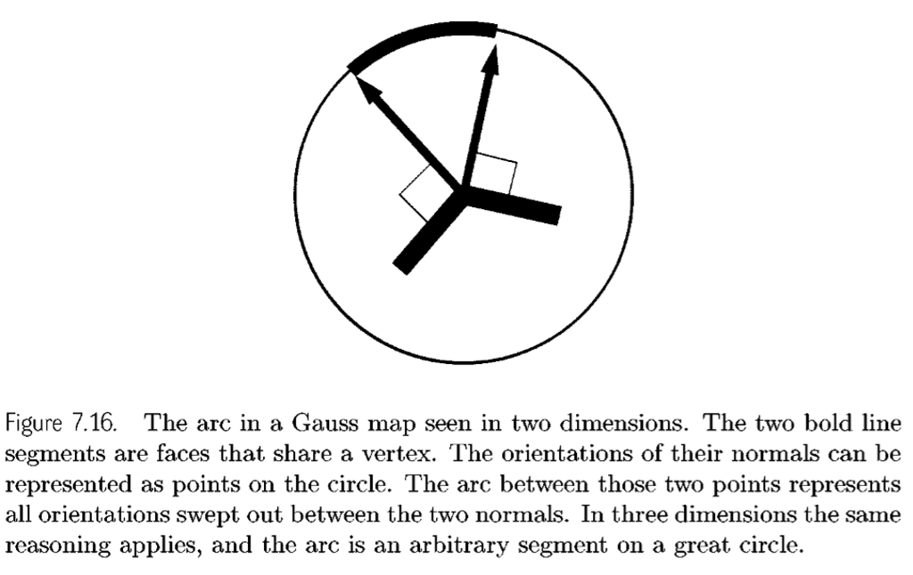

> 二维高斯图中的弧。两个粗体线段是共享一个顶点的面。它们法线的方向可以用圆上的点表示。这两点之间的弧代表了两个法线之间扫出的所有方向。在三维空间中，同样的推理也适用，弧是大圆上的任意一段。

在透视视图下，要检查的区域根据包含物体和与眼睛矢量相交的平面增长。如[Zhang, 97]所述，在模型上建立空间层次结构将使这种影响最小化。

##### 7.2.4 Calculating Silhouettes for Implicit Surface

David Bremer 和 John Hughes [Bremer, Hughes 98]探索了一种类似于Markosian [Markosian, et al. 97] 的方法，用于寻找隐式曲面的轮廓。他们的算法首先通过射线与曲面的交点在表面上定位一个点，从而找到近似的轮廓。然后沿着表面描到轮廓上的一点，然后描出轮廓，如图7.17所示

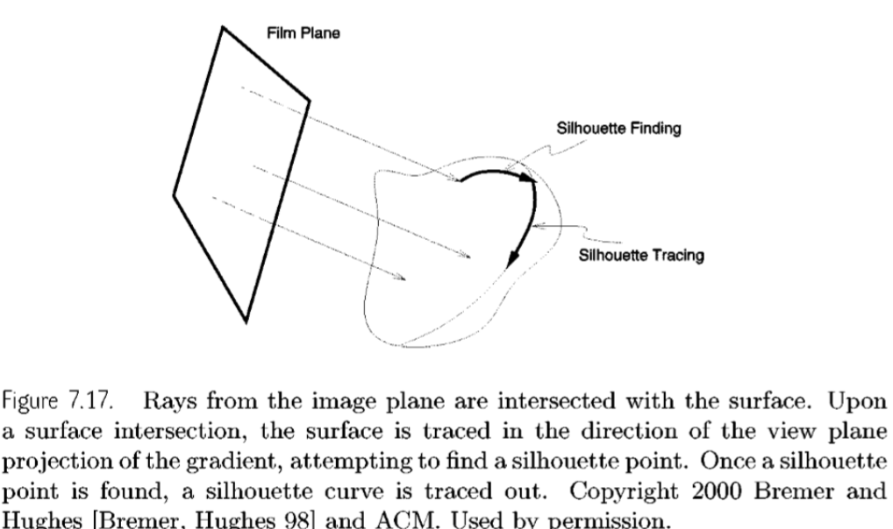

Bremer和Hughes的算法假设曲面模型 S 是 $R^3$上的二次连续可微函数 f 的零集。他们的算法将隐式函数视为一个“黑箱”，从中他们可以计算函数值、梯度和Hessian(二阶导数矩阵)在任意点的值。他们还使用视角方向为 v 的正交相机，并假设曲面适合相机的图像平面。给定p，坐标为p1,p2,p3，他们进一步假设存在一个常数K > 0，这样在每一点p处，f 的梯度由

##### 7.2.5 Calculating Silhouettes for NURBS Surfaces 

### 7.3 Summary

寻找特征边缘的方法有很多种，有图像空间算法，也有对象空间算法。图像空间方法无需了解表面表示，只要有深度缓冲可用。然而，这些方法受到深度图像分辨率的限制。

硬件方法使实现变得简单，利用了OpenGL等API的速度，但这些方法对线宽和样式的控制较少。软件对象空间方法允许对如何绘制特征边缘进行更多的控制，并且对于大型、复杂的模型可以更快。

虽然我们并不确定这些寻找特征边缘的方法中有一种肯定比另一种更适用于广泛的应用，但我们知道的一件事是，特征边缘的实时可见性剔除是非常困难的，而且还没有解决。这里的大多数例子都使用z-buffer来解决特征边缘的可见性，首先绘制这些边缘，然后用背景色或其他一些阴影方法渲染多边形。

## Automatic Systems: Illustration

通过检查技术手册、插图教科书和百科全书，可以发现与传统计算机图形惯例完全不同的阴影和线条说明惯例。与传统的计算机图形学方法相比，插图画家使用的线条和着色技术可以传达更准确的形状和材料属性表示。这些插图技术可以改进或取代传统的模型表示，如线框或Phong着色。

一些研究人员已经使用插画家的技术来改善思想的交流，从机械装配[Driskill 96]和用户界面，到物理对象[Seligmann, Feiner 91]，再到创造艺术图像，如鳗鱼动画[Lebaredian 96]。在本章中，我们介绍了线条渲染技术，NPR着色技术，画影线（hatching），卡通着色。

### 8.1 Artistic Line Drawing

##### 8.1.1 Which Lines to Draw

知觉领域的一些研究得出结论，当绘制边缘线(特征边缘)时，受试者至少也能识别出三维物体。Christou等人在一项知觉研究中得出结论:“用几条简单的线定义一个物体的轮廓就足以确定它的3-D结构。”从儿童的涂色书中可以看出，人类擅长从线描推断形状。线条有助于区分物体的不同部分和特征，并使人们注意到在着色中可能丢失的细节。

第7章描述了如何计算和绘制特征边缘，如轮廓、折痕和边界。剪影是视相关的，必须为每个新的对象视图重新计算，而线，如折痕和表面边界可以预先计算，是视不相关的。

一些研究人员也研究了特征边缘的替代方案。Gershon Elber对等参数曲线进行了广泛的研究。给定一个在u, v中参数化的表面，如图8.1所示，等值线需要谨慎绘制，以产生在对象上放置网格的效果，并可能强调形状的微妙之处，而只绘制特征边缘可能会错过

