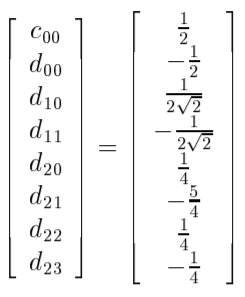

# WAVELETS FOR KIDS 

## A Tutorial Introduction

准确地说，小波是纯数学的主题，但在仅仅作为一种理论存在的几年时间里，小波在许多领域显示出巨大的潜力和适用性。

关于小波有很多优秀的专著和文章，本教程并不打算与它们中的任何一篇进行竞争。相反，它的目的是作为一个非常初级的阅读，提供了有趣的例子，为统计界。我们也提供了参考资料进一步阅读以及一些数学DIY程序。

#### 1 What are wavelets?

小波是满足特定要求的函数。小波的名字来自于这样的要求:它们应该积分到零，在x轴上下摆动。小波的微小内涵意味着函数必须很好地定位。其他要求是技术性的，主要是为了保证小波正逆变换的快速简便计算

小波有很多种。人们可以在光滑小波、紧支持小波、具有简单数学表达式的小波、带有简单相关滤波器的小波等之间进行选择。最简单的是Haar小波，我们将在下一节中作为介绍性示例进行讨论。图1给出了一些小波(来自Daubechies小波族)的例子。就像傅里叶分析中的正弦和余弦一样，小波被用作表示其他函数的基函数。小波(有时称为母小波)$\psi(x)$是固定的，一种是母小波的平移和扩张$\{\psi(\frac{x-b}{a}),(a,b)\in R^+\times R\}$。在定义小波基时，可以方便地取a和b的特殊值：$a = 2^{-j}$和 $b = k\cdot2^{-j}$ ，其中k和j均为整数。对a和b的选择称为临界抽样，它会给出一个稀疏基。此外，这种选择自然地将信号处理中的多分辨率分析与小波世界联系起来。

小波初学者经常会问，为什么不用传统的傅里叶方法呢?傅里叶分析与小波之间有一些重要的差异。傅里叶基函数在频率上是局部的，但在时间上不是。傅里叶变换中频率的小变化会在时域中产生变化。小波在频率/尺度(通过膨胀)和时间(通过平移)上都是局部的。在许多情况下，这种本地化是一种优势。

其次，许多类函数可以用小波以一种更紧凑的方式表示。例如，具有不连续和具有尖锐峰值的函数通常使用比正弦-余弦基函数少得多的小波基函数来实现类似的近似。这种稀疏编码使小波成为数据压缩的优秀工具。例如，联邦调查局已经标准化了小波在数字指纹图像压缩中的使用。压缩比在20:1的数量级，原始图像和解压后的图像之间的差异只有专家才能知道。小波还有很多其他的应用，其中一些非常令人愉快。Coifman和他的耶鲁团队使用小波来清除嘈杂的录音，包括勃拉姆斯在钢琴上演奏他的第一支匈牙利舞的旧录音。

这已经暗示了统计学家如何从小波中获益。大而有噪声的数据集可以通过离散小波变换(对应于离散傅里叶变换)轻松快速地进行变换。用小波系数对数据进行编码。此外，在大多数情况下，傅里叶变换的“快速”可以被小波变换的“更快”所取代。众所周知，快速傅里叶变换的计算复杂度为$O(n\cdot{log_2(n)})$。对于快速小波变换，计算复杂度为$O(n)$。

许多数据操作现在都可以通过处理相应的小波系数来完成。例如，可以通过对小波系数进行阈值化，然后将阈值码返回到“时域”来进行数据平滑。第3节给出了阈值的定义和不同的阈值方法。

#### 2 How do the wavelets work?

##### 2.1 The Haar wavelet

为了解释小波的工作原理，我们先从一个例子开始。我们选择了最简单和最古老的小波(我们想说：所有小波之母!)，Haar小波，$\psi(x)$: 它是一个阶跃函数，在$[0,\frac{1}{2})$上取值为1,在$[\frac{1}{2},1)$上取值为-1。
$$
\psi(x)=\begin{cases}
1\quad &0\leq x<\frac{1}{2}\\
-1\quad &\frac{1}{2}\leq x<1\\
0 \quad &others
\end{cases}
$$
Haar小波的图如图3所示。

Haar小波已有80多年的历史，并在各种数学领域中得到了应用。众所周知，任何连续函数都可以用哈尔函数(Haar function)一致地逼近。(布朗运动甚至可以用Haar小波来定义)，函数$\psi$的膨胀和平移，
$$
\psi_{jk}(x) = const\cdot\psi(2^jx-k)，
$$
在$L^2(R)$(所有平方可积函数的空间)中定义一个正交基。这意味着$L^2(R)$中的任何元素都可以表示为这些基函数的线性组合(可能是无限个)。

$\psi_{jk}$的正交性很容易检验。很明显有：
$$
\int\psi_{jk}\cdot\psi_{j^{'}k{'}} = 0,
$$
当$j = j^{'}$和$ k= k^{'}$不同时满足时候。

如果$j\not=j^{'}$，那么非零值的小波$\psi_{j^{'}k{'}}$被包含在小波$\psi_{jk}$为常数的集合中，这会让上面的积分等于0。

如果$j=j^{'}$但是$k\not=k^{'}$，那么至少乘积中的$\psi_{jk}\cdot\psi_{j^{'}k{'}}$的其中一个因子为0，因此函数$\psi_{jk}$是正交的。

这个常数使得正交基的标准化正交为$2^{\frac{j}{2}}$,事实上：
$$
1=(const)^2\int\psi^2(2^jx-k)dx = (const)^2\cdot2^{-j}\int\psi^2(t)dt = (const)^2\cdot2^{-j}
$$
函数$\psi_{10}\psi_{11}\psi_{20}\psi_{21}\psi_{22}\psi_{23}$在图4中描述，集合$\{\psi_{jk},j\in{Z},k\in{Z}\}$，在$L^2$上定义为一个标准正交基。或者，我们认为正交基的格式为$\{\phi_{j_0k},\psi_{jk},j\geq{j_0},k\in{Z}\}$，其中$\phi_{00}$被称作scaling function，它与小波基$\psi_{jk}$相关联。集合$\{\phi_{j_0k},k\in Z\}$跨越相同的子空间为$\{\psi_{jk},j<j_0,k\in Z\}$,接下来我们会使这个声明更正式和定义$\phi_{jk}$，对于haar小波基scaling function的而言是非常简单的：
$$
\phi_{jk}(x) = 1(0\leq x<1)
$$
统计学家可能对由数据集生成的函数的小波表示感兴趣。

让 $\bar{y} = (y_0,y_1,...,y_{2^n-1})$ 作为长度为$2^n$的数据向量，数据向量可以与分段常数函数 $f$ 在$[0,1)$区间由$\bar y$生成相关联，如下有：
$$
f(x) = \sum^{2^n-1}_{k=0}y_k\cdot1(k2^{-n}\leq x<(k+1)2^{-n})
$$
这个数据函数$f$显然在$L^2[0,1)$空间，同时，f的小波的分解形式为：
$$
f(x) = c_{00}\phi(x) + \sum^{n-1}_{j=0}\sum^{2^j-1}_{k = 0}d_{jk}\psi_{jk}(x)
$$
关于j的和是有限的，因为f是一个阶跃函数，其中任何都可以用分辨率$(n-1)-st$等级来精确的描述。对于对于每一层，关于k的和也是有限的因为f的定义域是有限的。特别是，缩放函数$\phi_{00}$不需要转换。

我们固定数据向量$\bar y$，明确地找到小波分解(2)，让$\bar y=(1,0,-3,2,1,0,1)$，相应的函数$f$在图5显示，下面的矩阵方程给出了 $\bar y$ 和小波系数之间的联系，注意在相应的分辨率$(j= 0,1\ and \ 2)$上使用Haar小波的常数$2^j (1,\sqrt{2}\ and\ 2)$ 

结果为：

因此有：
$$
f = \frac{1}{2}\phi- \frac{1}{2}\psi_{00}+\frac{1}{2\sqrt{2}}\psi_{10}-\frac{1}{2\sqrt{2}}\psi_{11}+\frac{1}{4}\psi_{20} - \frac{5}{4}\psi_{21}+\frac{1}{4}\psi_{22} - \frac{1}{4}\psi_{23}
$$
结果很容易检查，例如：当$x\in [0,\frac{1}{8})$
$$
f = \frac{1}{2} - \frac{1}{2}\cdot1 +\frac{1}{2\sqrt{2}}\cdot\sqrt{2} + \frac{1}{4}\cdot2 = 1
$$
读者可能已经准备好了下面的问题：我们将如何处理长度更大的向量$\bar y$，显然，解矩阵方程是不可能的。