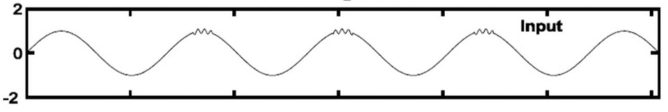
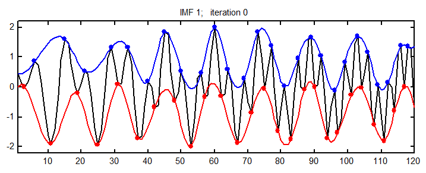
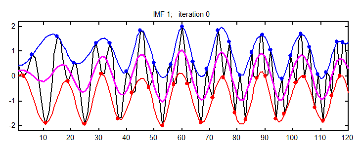
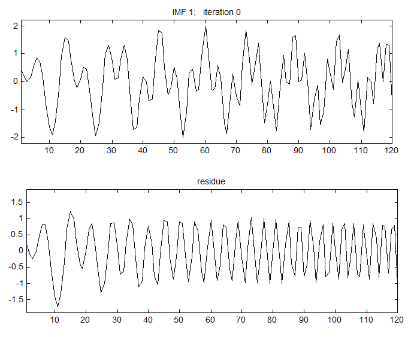
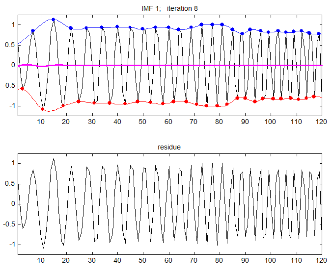
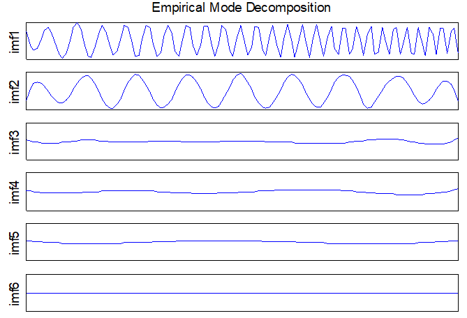

# 关于信号处理相关知识科普

### 经验模态分解（EMD）

**优势**：对于一段未知信号，不需要做预先分析与研究，就可以直接开始分解。这个方法会自动按照一些固模式按层次分好，而不需要人为设置和干预。

**劣势**：混叠模态就是其中之一，混叠模态问题最先在对含有间断的信号分解中发现的。 间断信号可以理解为在某一时刻或者某一很小时间间隔内出现了小幅值的高频信号。当混叠模态出现时，得到的 IMF 是没有意义的，如图：

> 

##### 内涵模态分量（Intrinsic Mode Functions, IMF）

内涵模态分量就是原始信号被EMD分解之后得到的各层信号分量。任何信号都可以拆分成若干个内涵模态分量之和。

1. 在整个数据段内，极值点的个数和过零点的个数必须相等或相差最多不能超过一个。
2. 在任意时刻，由局部极大值点形成的上包络线和由局部极小值点形成的下包络线的平均值为零，即上、下包络线相对于时间轴局部对称。

##### 筛选（Sifting）

###### 1、求极值点、拟合包络曲线

###### 2、均值包络线

###### 3、中间信号

原始信号减均值包络线，得到中间信号（对照图）

###### 4、判断IMF

若中间信号中还存在负的局部极大值和正的局部极小值（此判据等效于是否满足上述经验模态分解条件），说明这还不是一个本征模函数IMF，需要继续进行“筛选”。筛选的过程就是以该中间信号为新的输入信号继续重复1~4的步骤。筛选过程通常在残数只包含不超过两个极值时停止。

###### 5、迭代

用上述方法得到第一个IMF后，用原始信号减IMF1，作为新的原始信号，再通过上述的1~4步骤，可以得到IMF2，以此类推，完成EMD分解

### 小波阈值除噪

coming soon...

### Hilbert

coming soon...