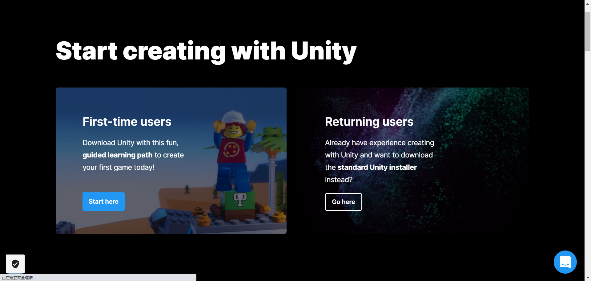
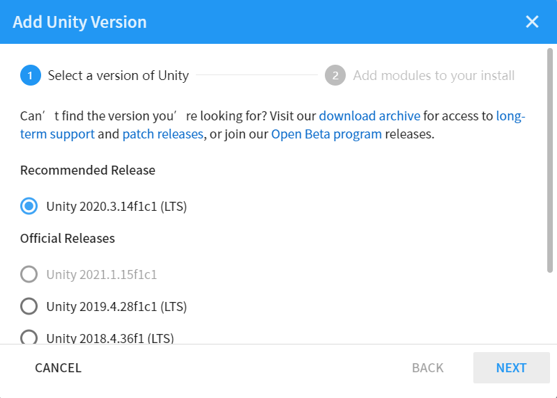
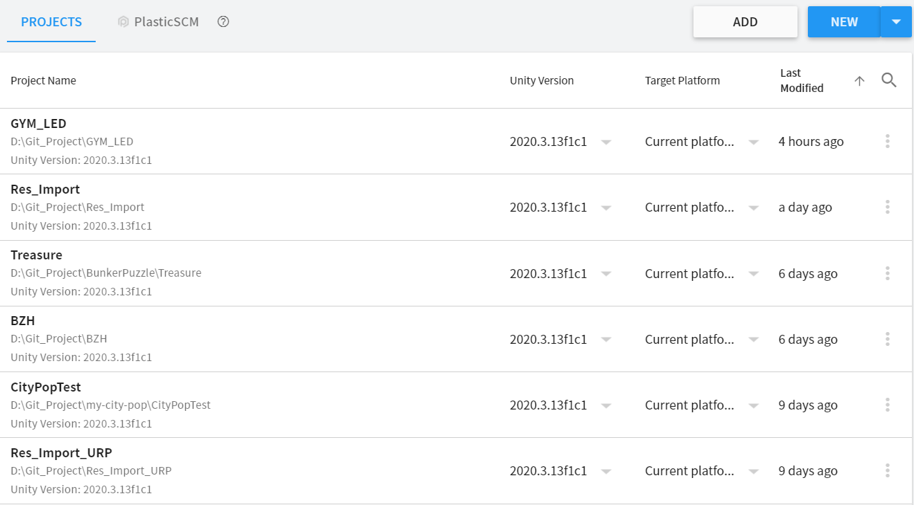
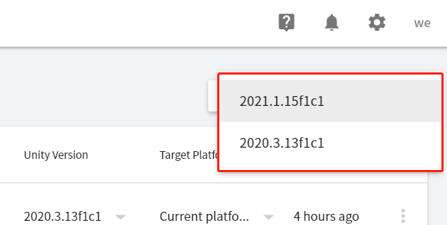
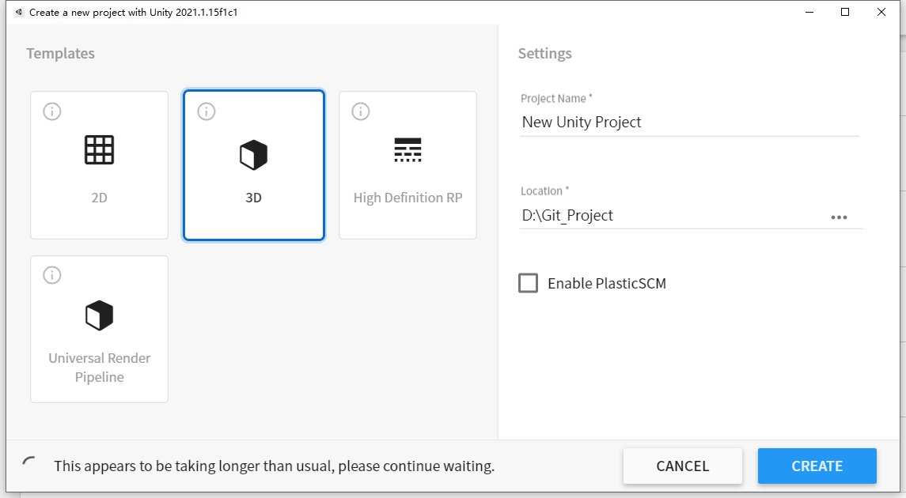
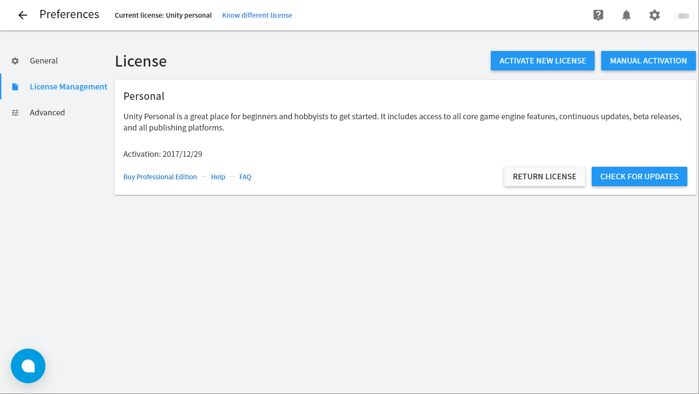

[toc]

## 游戏引擎基础

### 介绍及安装

#### 游戏引擎简介

Unity 是一款由 Unity Technologies 研发的跨平台2D / 3D 游戏引擎，可用于开发 Windows、MacOS 及 Linux 平台的单机游戏，PlayStation、XBox、Wii、3DS 和 任天堂Switch 等游戏主机平台的视频游戏，或是 iOS、Android 等移动设备的游戏。Unity 所支持的游戏平台还延伸到了基于 WebGL 技术的 HTML5 网页平台，以及 tvOS、Oculus Rift、ARKit 等新一代多媒体平台。除可以用于研发电子游戏之外，Unity 还是被广泛用于建筑可视化、实时三维动画等类型互动内容的综合型创作工具。

作为一款游戏引擎，Unity 拥有方便灵活的编辑器、友好的开发环境、丰富的工具套件，无论是程序员或美术师、独立制作人或大型团队的成员，都能使用 Unity 方便的制作游戏。

Unity 打造通用渲染管线、高清渲染管线、Shader Graph等工具，可以方便实现游戏中所需的图形功能。 Unity 的2D和3D专用工作流可以与各种图形模型处理软件（如Photoshop、Maya、3ds Max）无缝集成，方便您快速导入和更新资源。

本课程制作的时候，最新的官方正式版本是2021.1.15，由于Unity引擎更新频繁，建议大家在真实游戏开发时使用官方发布的最新 **LTS（Long Term Support）**版本。而我们的课程会使用最新的正式版本。

#### 下载及安装

Unity分为免费的个人版 (Personal)，付费的进阶版 (Plus)、专业版 (Pro)以及面向大型用户的企业版。作为个人学习使用，我们会介绍个人版的安装方法。

1. 首先登陆Unity官网，下载并安装Unity Hub（点击Start here），启动即可。根据Unity要求，需要注册一个开发者账号，用于管理许可证。

   

2. 通过Unity Hub，我们可以下载各个版本的Unity，例如这样：

   

3. 选择一个合适的版本下载（这里可以选择和教程一样的版本 2021.1.15），下载完成后我们即会看到项目列表。

   

4. 我们可以点击现有项目，则会启动Unity3D。或我们也可以新建项目，选择欲新建项目的合适的Unity3D的版本，新建即可。

   

5. 新建项目有几个模板，模板中2D，3D都是常用的，根据不同的项目类型，选择相应的模板就可以了。

   

6. 注：对于Unity注册License和管理License的内容，需要的话可以穿插演示

   

### 项目介绍

### 初识引擎

#### 简单制作场景地形

