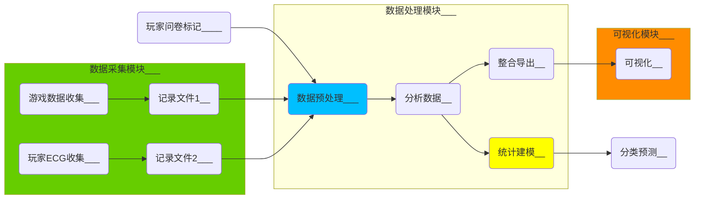

# 利用ECG信号对游戏测评的系统设计与实现

## 摘要

在游戏开发过程中，游戏设计人员给游戏注入了“灵魂”。在游戏中，玩家的情感体验是至关重要的，因为其反应了游戏设计是否达到了原本的设计预期。在目前，得到玩家情感体验结果的方法主要还是依靠事后访谈，问卷调查等形式。但是这些方法很难在游戏过程中实时的进行，否则会打破游戏的沉浸感和连续性。相反使用生理数据则可以客观且实时的反映玩家的体验情况[9]。与此同时，对于游戏设计人员，在游戏开发的中后期，能够对玩家在游戏中的量化数据进行可视化，则可以让游戏设计人员更形象直观的理解量化数据，并能反应玩家在游戏时域内各项数据的变化程度。 

本文开发的评测分析系统分为4个模块：游戏运行时游戏内数据采集、游戏运行时玩家ECG数据采集，事后数据分析，数据可视化。 其中采集到的游戏内数据和ECG数据都会保存为相应的数据文件，其内容数据标以时间戳。两份数据最终会在数据分析和可视化模块中进行处理。其中，ECG信号会依次进行去噪过滤，特征R-peak识别，得到在游戏标记事件前后的HR及HRV信息，并能够以可视化形式呈现。与此同时，系统可以结合玩家ECG数据和游戏内触发特殊事件的情绪评分，进行相关性建模和分类。

系统测试阶段，我们设计了一款自定义的恐怖游戏，在游戏中设计了一些调动玩家情绪的事件点，利用该系统，为设计人员提供数据的可视化显示，并对恐怖感程度与HR数学建模，其进行分类（回归），给出预测情感值。并对游戏中的营造恐怖气氛的方法进行分析。

本文的创新点如下：在信号去噪过滤器的算法上，我们改进IIR算法，然后进行有效的去噪。在ECG中R-peak特征识别算法上，我们基于传统的差分阈值法，进行相应的优化和创新，动态调节阈值及窗口识别。在数学建模计算模块中，基于ECG数据分类情绪算法上，我们对比了传统算法和机器学习类算法的优劣势。在自定义游戏是设计上，我们根据恐怖元素不同的设计方法，在游戏中利用多种呈现恐怖元素的方法，新建了一些游戏中的恐怖事件，根据试验后的问卷，验证了上述方法的呈现效果，同时又基于此游戏，利用我们的系统，对游戏中玩家的数据进行分析和可视化，为游戏设计人员提供客观游戏及玩家数据的整体感知。

## 绪论

##### 论文背景及研究意义

作为第九艺术的游戏产业，仅在国内2021年前半年，游戏市场销售达到1504.93亿[1]。以多样化的电子设备为载体，游戏逐渐突破了在时间和空间上束缚，使得人们无论在何时何地均可以享受到游戏带来的乐趣。在游戏行业和游戏市场的规模日渐庞大的当下，游戏也渗透到诸多领域进行融合，利用游戏中内在娱乐性和趣味性的特点，与教育、军事和医疗保健等不同行业结合而生的“严肃游戏”[2]。游戏无论是娱乐方向还是严肃方向，只是目的不同，而游戏可玩性的本质却并无变化。

玩家在进行游戏体验时，游戏的可玩性体现的至关重要。对于玩家来说，良好的游戏体验可以让其体验到诸多情感，直至心流[3]，同时对于游戏本身而言又可以达到其目的。但对于游戏设计者而言，能够在游戏开发中期或后期对游戏的可玩性进行针对性调整就非常有意义。

本文面向游戏设计者，设计并实现基于玩家ECG数据的游戏可视化测评系统。利用此系统对玩家在游戏过程中的ECG数据进行收集，进而对其进行识别，分析，可视化。通过玩家的生理数据预测游戏内特定事件触发后玩家的情绪变化，以便让游戏设计者更精确的对玩家的情绪调动进行分析[5]。同时，在游戏过程中对玩家的游戏内数据进行记录，借助可视化让游戏设计者从宏观视角[4]，了解游戏内玩家的空间内的热区、心跳等变化，获取到通过裸数据无法得到的信息。最终开发人员利用此系统使游戏设计量化可控。从而提升游戏质量（可玩性）。

##### 心电信号生理基础

介绍有哪些常见的生理信号可以在实验中获得，例如 ECG，EMG，EEG，GSR等，使用它们分别可以客观表现出情绪的某些方面或维度。但是获得其生理数据的设备有些具有侵入性EMG、EEG，使用其设备给玩家进行数据收集时非常不便捷，而且影响玩家在游戏时的体验效果；而GSR设备会被游戏体验中的轻微的运动摩擦和环境的湿度所干扰。那么ECG则是最好的选择，其特征值也非常多，便于进行数据采集。

介绍心电信号的生理基础P波，QRS波群，T波，U波。RR间期和HRV可以被识别作为参考点。

介绍心电信号设备的相关内容，为何选择文章中使用的双电极设备。设备的分类，根据侵入性不同，他们的便捷性和准确性的不同，如何处理其信号的噪音和找出RR的HRV相关算法

##### 数据可视化

数据可视化的相关研究，

这样让游戏设计者可以直观地了解到游戏中特定的设计带给玩家的生理变化和情感体验。

游戏设计者也可以了解到自己给玩家“模糊”安排的路线。

##### 论文的结构安排

第一章：绪论。论述了课题来源，研究意义以及此系统的大致规划。

第二章：国内外研究现状和关键技术：ECG与情绪的相关性研究，ECG的去噪技术，ECG特征值的识别技术，可视化研究。同时，基于本文自定义测试游戏的恐怖游戏及情节的相关研究。

第三章：介绍系统的总体方案设计。分别叙述了ECG以及游戏内数据的采集模块，数据预处理和分析模块，数据的可视化模块。

第四章：展开叙述ECG以及游戏内数据的采集模块。分为上位机应用程序开发来实时采集ECG数据并保存，游戏内事件点触发记录的玩家数据。

第五章：展开叙述ECG处理和分析模块，分为对ECG数据的去噪，R-peak特征识别，基于ECG数据和游戏内事件点评分的数学建模。便于游戏设计人员进行客观的分析。

第六章：展开叙述在游戏内，基于时序或空间的数据可视化，便于游戏设计人员直观获得游戏的设计效果。

第七章：基于我们自定义的游戏，对系统中上述模块进行测试，完成对系统的整体测试和验收。

总结：对整篇论文进行总结，提出未来目标。

## 国内外研究现状

1. ##### 设计可行性方面：

   在心理生理学上，研究人员使用心理生理学反馈设备，如皮肤电导(SC)、心电图(ECG)等来检测用户在执行任务时的情感状态。其主要优点是信号可以被自动实时记录，而不会干扰参与者的自然行为。心理生理测量的另一个优点是它可以检测到非常敏感的反应，相关综述中更详细的进行了讨论[7]

   ECG与心理变化的关系，ECG中BVP、HR和HRV分别可以反应的部分。  [7]

   - HR则用于测量情感、亲和力和注意力上的唤起（arousal in emotion，likeability，attention）；
   - HR和HRV用于评估压力和放松；
   - BVP可以通过信号处理变换而得到HR [8]

   

   多种生理数据结合游戏后问卷，通过机器学习进行预测，可以让游戏开发者在不需要问卷调查的情况下获得关于玩家在特定游戏事件中情绪的高质量数据[6]

   

   数据可视化中，可视化手段可以迅速让人们理解数据且分析出隐藏的价值[4]。同时，通过图形化手段，将数据映射为图形、符合和颜色等，清晰有效传达了信息[9]。

   在可视化设计中（颜色，数量关系）应充分考虑韦伯费希纳定理[10] [11]

   

2. ##### 算法应用方面：

   - 生理数据利用IIR去噪过滤 [27]，利用小波变换进行去噪 [19] [23]，
   - 在R-peak进行特征识别中，目前采用差分阈值法及其改进算法进行识别 [20] [21] [22]。
   - 机器学习识别生理数据特征。基于SVM [24] [25]，基于CNN LSTM [26] 等

## 系统的总体方案设计

##### 引言

该系统符合游戏的体验流程，以及事后的数据分析流程。游戏中的玩家在进行数据收集，同时玩家在游戏进行时的ECG数据被传感器收集。此时两份含有时间戳的数据记录文件交给数据处理模块，ECG作为传感器收集的自然数据，必然需要进行去噪处理，之后，对ECG进行特征识别。识别后的数据结合游戏内数据整合导出，进行可视化展示。该系统在进行大量的数据分析后，结合玩家的问卷调查的标记特征位后，可进行统计建模，对后续的ECG数据进行分类预测。

##### 数据的采集模块

##### 数据格式的设计

##### 数据预处理和分析模块

##### 数据的可视化模块

## 玩家的相关数据采集

##### ECG信号及其采集原理

ECG信号波介绍

基于电位差的ECG波产生原理

介绍基于电位差采集ECG数据的硬件，注意事项

##### ECG信号的上位机开发

ECG数据和游戏内数据的采集架构

传感器和PC的数据传输

ECG数据和游戏内数据的保存

##### 此模块流程总结

## ECG数据的处理和分析

##### 本文采用的去噪方法

噪声产生的原因和噪声分类

本文用改进的什么方法，回答为什么？

##### 现有ECG特征波的识别方法

差分阈值法

##### 本文采用的特征波识别方法

差分阈值法的改良

##### RR间隔与情绪（评价）的建模分类

游戏测试期间的评价系统。传统游戏问卷评价的主观性和延迟性导致的不准确，而生理数据是情绪的客观反映，通过玩家在游戏过程中进行非侵入式生理数据的采集，数据建模后可以不再进行问卷测评，直接通过生理数据计得出游戏的评价。且此系统整合得出的相关数据，进行时间和空间中的可视化，则便于策划人员进行游戏模块开发中进行分析。

###### 可行性分析：

数据分布分析，相关性分析

###### 常有的分类或者回归方法：

统计学常有线性回归、非线性回归进行数学建模。

机器学习中的梯度下降分类（SGD classifier）、随机森林分类（Random Forest Classifier），支持向量机分类（SVM）

但是上述机器学习都需要大量的数据量。

## 数据可视化

##### 生理数据可视化

##### 游戏内数据可视化

##### 在时间域上的表达

##### 在空间域上的表达

## 系统的实验和测试

##### 自定义恐怖游戏的设计

恐怖游戏会更容易的调动玩家的情绪，情感变化更加强烈[12]。在关于恐怖感及其文化的研究中，郭嘉琦[13]通过对恐怖电影中封闭空间类型的分析，来提升其叙事层，同时扩展恐怖电影类型；史修永[14]讨论在恐怖文化的审美体验以及对其客观的认识和反思。然而，这些工作是基于电影中的恐怖元素，或是对恐怖文化审美角度的分析，而未尝对恐怖游戏这一方面进行研究。而在一些基于恐怖游戏的研究中，Ewan Kirkland [15] 指出在生存恐怖类型分支中，很大程度上依赖于戏剧性的电影动画和逼真的美学来实现其效果，但是其中并无定量化的分析研究。Brandi J. David [16] 讨论了通过恐怖预期和文化恐怖，从而理解恐怖题材在电影和电子游戏中的应用。Andrew Dekker [17] 通过可变化的恐怖感与生物反馈相结合，来提升玩家对游戏的好评度。Rogers [18] 通过恐怖冒险游戏《Ethan Carter的消失》研究了VR游戏音频感知对玩家体验的影响。虽然上述学者对恐怖游戏进行了创作理论和技巧上分析，但对于在恐怖游戏中玩家体验方面的也鲜有研究和定量分析。本文则通过体验后问卷评分的方式，对玩家在恐怖游戏体验后的情感情绪和好评度方面进行定量分析，更具有说服力。

##### 测试实验安排

实验安排和流程，回答为什么。

##### 实验后问卷收集

##### 数据收集测试

##### 数据分析测试

##### 可视化效果测试 

##### 实验结果分析

分析得出系统在实际游戏开发中的应用价值，同时该实验得出此游戏开发中的设计结论。

## 总结与展望

##### 本文结论

##### 未来展望

## 参考文献

1. 柯文. 今年上半年我国移动游戏行业收入达1147.72亿元[N]. 人民邮电,2021-08-03(006).
2. Serious Games : An Overview[J]. Institutionen Fr Kommunikation Och Information, 2007.
3. Csikszentmihalyi M . Flow: The Psychology of Optimal Experience[J]. Design Issues, 1991, 8(1).
4. 斯蒂尔. 数据可视化之美[M]. 机械工业出版社, 2011.
5. Kivikangas J M, Chanel G, Cowley B, et al. A review of the use of psychophysiological methods in game research[J]. journal of gaming & virtual worlds, 2011, 3(3): 181-199.
6. Čertický M, Čertický M, Sinčák P, et al. Psychophysiological indicators for modeling user experience in interactive digital entertainment[J]. Sensors, 2019, 19(5): 989.
7. Baig M Z, Kavakli M. A survey on psycho-physiological analysis & measurement methods in multimodal systems[J]. Multimodal Technologies and Interaction, 2019, 3(2): 37.
8. Gokay R, Masazade E, Aydin C, et al. Emotional state and cognitive load analysis using features from BVP and SC sensors[C]//2015 IEEE International Conference on Multisensor Fusion and Integration for Intelligent Systems (MFI). IEEE, 2015: 178-183.
9. 裴丹丹. 基于ECharts的数据可视化实现[D].北京邮电大学,2018.
10. Dehaene S. The neural basis of the Weber–Fechner law: a logarithmic mental number line[J]. Trends in cognitive sciences, 2003, 7(4): 145-147.
11. Hecht S. The visual discrimination of intensity and the Weber-Fechner law[J]. The Journal of general physiology, 1924, 7(2): 235-267.
12. Pedro A. Nogueira, Vasco Torres, Rui Rodrigues, et al. Vanishing scares: biofeedback modulation of affective player experiences in a procedural horror game. 2016, 10(1):31-62.
13. 郭嘉琦. 恐怖电影封闭空间的叙事研究[D].西南大学,2018
14. 史修永.视觉文化与恐惧、焦虑体验的审美再生产——以恐怖电影为例[J].文化研究,2016(04):292-306.
15. Kirkland E. Gothic videogames, survival horror, and the Silent Hill series[J]. Gothic Studies, 2012, 14(2): 106-122
16. David B. When Running Isn't Enough: The Development of the Survival Horror Video Game Genre Through Transmedial Adaptation and Representations of Sexuality[D]. , 2015.
17. Dekker A, Champion E. Please biofeed the zombies: enhancing the gameplay and display of a horror game using biofeedback[C]//DiGRA'07-Proceedings of the 2007 DiGRA International Conference: Situated Play. 2007: 550-558.
18. Katja Rogers, Giovanni Ribeiro, Rina R. Wehbe, Michael Weber, and Lennart E. Nacke. 2018. Vanishing Importance: Studying Immersive Effects of Game Audio Perception on Player Experiences in Virtual Reality. In Proceedings of the 2018 CHI Conference on Human Factors in Computing Systems, CHI 2018, Montreal, QC, Canada, April 21-26, 2018. 328. 
19. 顾秀秀,朱明亮,王璐,史洪玮.基于小波变换的心电信号特征提取[J].软件导刊,2021,20(05):77-81.
20. 董春桃,隋伟,喻洪流.基于改进的差分阈值法心脏远程监测的实时与回顾性分析[J].中国医学装备,2014,11(11):52-54.
21. 赵羿欧,刘扬.一种改进的差分阈值心电检测算法[J].计算机工程,2011,37(S1):347-348+352.
22. 吴建,李康,庞宇,孙海霞.基于差分阈值与模板匹配的心电R波提取算法[J].重庆邮电大学学报(自然科学版),2015,27(03):372-376.
23. 彭自然,王国军.用小波变换对ECG信号进行去噪研究[J].信号处理,2017,33(08):1122-1131.
24. 张凯. 机器学习在心电数据分析中的研究和应用[D].北方工业大学,2019.
25. 徐银. ECG心跳分类算法及高能效架构研究[D].浙江大学,2018.
26. 梁小龙. 基于CNN和LSTM结合的心律失常分类研究[D].西南大学,2019.
27. Nancy Betancourt and Marco Flores-Calero and Carlos Almeida. ECG Denoising by using FIR and IIR Filtering Techniques[C]. , 2019.

