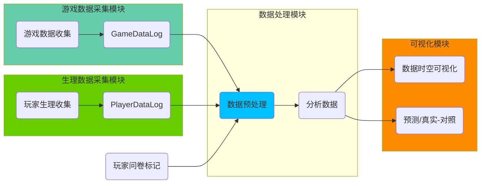
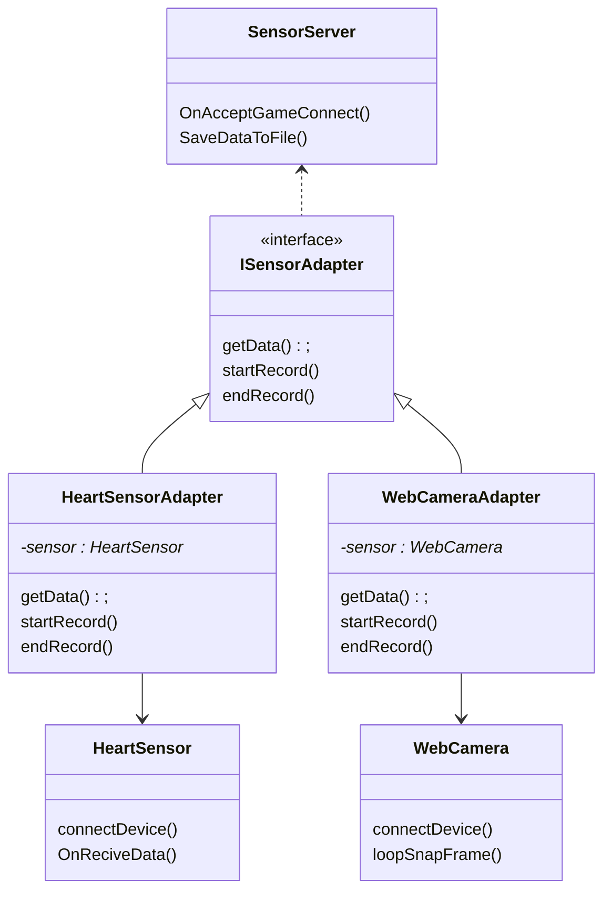
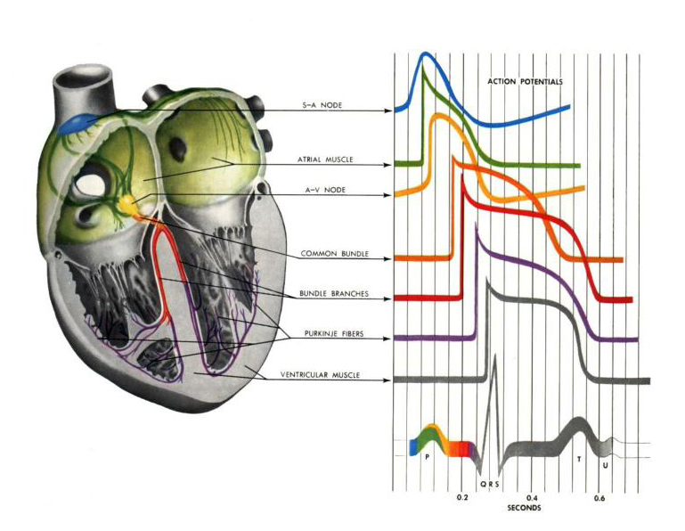
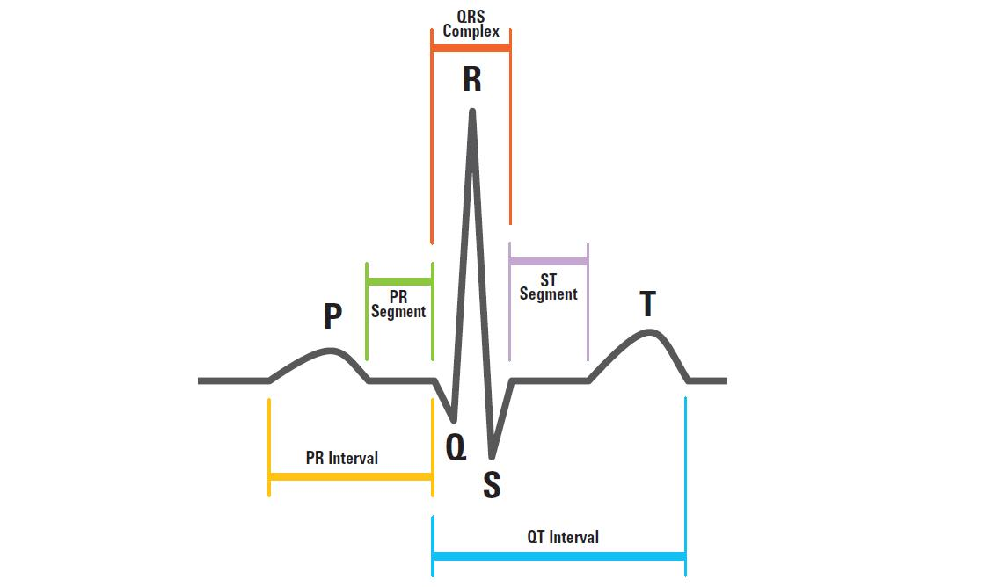

# 游戏可视化测评辅助系统的设计与实现

## 绪论

##### 论文背景及研究意义

游戏产业作为第九艺术，仅在国内2021年前半年，游戏市场销售达到1504.93亿[1]。以多样化的电子设备为载体，游戏逐渐突破了在时间和空间上束缚，使得人们无论在何时何地均可以享受到游戏带来的乐趣。在游戏行业和游戏市场的规模日渐庞大的当下，游戏也渗透到诸多领域进行融合，利用游戏中内在娱乐性和趣味性的特点，与教育、军事和医疗保健等不同行业结合而生的“严肃游戏”[2]。游戏无论是娱乐方向还是严肃方向，只是目的不同，而游戏可玩性的本质却并无变化。

在当下，游戏开发流程进行到体验测评阶段，游戏开发人员会收集一部分玩家的体验报告，对游戏可玩性以及相应的内容进行事后问卷调查和分析。然后根据分析后的结果，指导游戏关卡设计人员进行相关的修改和迭代。但对于游戏开发人员来说，在这样的工作流当中，有几处不足和可以提升之处。

1. 事后问卷作为量化体验程度的调研方法，可行性毋庸置疑。虽然精心设计的问卷可以反映一定程度的客观数据，但是仍然存在着一些主观成分。且仅利用单一的问卷结果来佐证游戏及其游戏内事件的体感程度，可信度是有待提高的。而且，在有限的问卷题目中很难反应出玩家在游戏中某些情感的连续变化。
2. 玩家在游戏中的数据没有很好的利用和挖掘。玩家在游戏中的数据不但可以反应玩家的行为，另一方面也可以反应关卡的路径和设计。而且，游戏数据没有噪音干扰，可自定义采样，是非常良好的玩家客观数据源。
3. 关卡设计人员需要直观地发现数据的统计情况，这样可以与自身对关卡的预测做对比。且最好可以利用对多种维度的数据挖掘结果，自动提供给游戏关卡设计人员修改方向

我们将优化和提升上述不足之处，即可以在一定程度上提升游戏迭代开发效率，为游戏关卡设计提供指向性的修改和优化方向，同时还可以为游戏表现的衡量提供较为客观的数据参考。

##### 本文的研究内容分析

我们针对上一小节提出三个问题，以面向游戏开发人员的角度进行如下分析：

***问题1分析***：众所周知玩家在进行游戏体验时才可以真正反映游戏的可玩性。对于玩家来说，良好的游戏体验可以让其体验到诸多情感直至心流。因此在游戏开发的中后期，游戏关卡设计者能够对游戏内的关卡设计进行针对性调整就非常有意义。在当下，事后问卷作为传统的玩家数据收集手段已有弊端，即它的非实时性和一定程度的主观性。而这些弊端在以游戏作为调查内容的载体上，明显无法满足关卡设计师的需求。因为作为游戏的设关卡计师，我们不但需要玩家体验的结论值，而且也需要玩家在游戏试玩中的某些情感的连续变化值。玩家生理数据的客观性和连续性，则可以满足上述需求。

在生理数据和情感体验相关性验证的研究中，玩家的生理数据 ECG、GSR可以产生某些情绪状态（诸如：高兴、愤怒、恐惧、悲伤、平静等）的相关性。如选用上述内在生理数据，则可以从客观上实时反映玩家在体验游戏时候的情感变化。 另一方面，作为外在生理数据的面部表情，在非主动控制（不自觉）的状态下，也可以对玩家的情绪状态加以验证。在游戏测试期间，将内外两种反映玩家情绪状态的生理数据与玩家的问卷进行补充验证，则可以提高玩家游戏评价的可信度。

***问题2分析***：玩家在游戏中的数据是非常重要的，我们可以用一定的采样频率直接记录玩家角色的空间位置，视野方向，以及触发事件的位置等.。游戏内数据具有无噪音，采样方便等优质数据的特质，而且也属于玩家的客观数据。我们通过对玩家时空数据的统计和挖掘，可以得到场景区块的访问量，场景的探索程度及其变化量，以及玩家在场景中的路径等。

鉴于玩家体验游戏时的特定情感也是随着时间而变化，我们可以将反应特定情绪的生理数据与游戏中的数据相结合，在语义层面还可以挖掘玩家的驻足区块和情感变化区块。

***问题3分析***：数据可视化的目的是以直观的，形象化的形式将数据展示给观者。对抽象数据的具象呈现，更有利于关卡设计者对玩家体验关卡结果的整体感知。同时将数据挖掘后的内容进行可视化，更会辅助关卡设计人员发现关卡设计中的细节和隐藏的内容。

数据可视化与交互结合，可以让关卡设计者指向性地关注场景的特定区域，或以不同的分辨率去关注时空生理数据。对游戏开发者提供调整和修改提供方向和指引

综上分析所述，本文面向游戏关卡设计师，设计并实现游戏的可视化测评辅助系统。在游戏测试阶段可以使用本系统，对玩家的游戏内数据以及生理数据进行采集和处理，同时录入有关场景设计和玩家体验的问卷评分数据。利用这些数据进行分析、挖掘、和可视化显示。通过对多个维度数据和统计挖掘结果的直观呈现，给予关卡设计师在场景设计上的修改方向。

##### 相关工作研究

###### 国内研究

国内在利用生理数据对情绪进行分类的研究中，在近些年开始有所发展。江苏大学流体中心生物医学工程室在对HR、HRV进等信号进行分析后，得出有效的情绪识别方法是以生理信号分析为主，表情行为观察和情绪主观感受报告为辅。

[^]: 陈继华,李岚,钱坤喜. 基于多生理信号的情绪初步识别[J]. 生物医学工程研究,2006,25(3):141-146. DOI:10.3969/j.issn.1672-6278.2006.03.003.

浙江大学的张乐凯利用生理信号进行产品设计和体验评估，利用机器学习的方法，对用户的情感进行分类和回归。但是其实验案例中的诱发素材主要是声音、视频以及实体交互产品。

[^]: 基于生理信号数据的产品设计与用户体验研究 张乐凯

而北京科技大学的叶晓帧基于多种生理信号，利用机器学习对游戏用户进行情绪的识别和分析。表明了用户的心流体验与SC和HR信号具有显著相关性。

[^]: 叶晓贞. 基于生理信号的游戏用户体验研究[D].北京科技大学,2021.DOI:10.26945/d.cnki.gbjku.2021.000137.

可见国内在心理生理的研究中，诱发素材开始从单向接收逐渐转变到双向交互相关的游戏产品中。同时已验证其可行性。

在另一方面，结合游戏开发实践中，游戏数据可视化的相关研究处于初级阶段。有学者指出游戏内数据可视化是为了解决游戏开发者的两大问题：评估游戏的表现和分析玩家的行为。

[^]: 兰吉,巫英才.游戏数据的可视分析J.计算机辅助设计与图形学学报,2017,29(04):699-706.

###### 国外研究

相比国内的研究情况，心理生理学在国外的研究已有很长的时间。

在国外一些学者在生理心理的研究中，可以用生理数据反应用户在人机交互中的情绪状态。Muhammad 列出了情绪状态和不同生理信号状态的关系：

| 情绪 |        生理反应         |
| :--: | :---------------------: |
| 压力 |     低SC和EMG，高HR     |
| 生气 |   高SC和EMG，高呼吸率   |
| 愉悦 | 高SC、EMG和HR，低呼吸率 |

[^]: Baig M Z , Kavakli M . A Survey on Psycho-Physiological Analysis & Measurement Methods in Multimodal Systems[J]. Multimodal Technologies and Interaction, 2019, 3(2):20.

游戏作为人机交互的子类，用户在游戏中的交互和体验也逐渐从传统的用户调研报告到心理生理的信号进行测量。

[^]: Bernhaupt, R.; Mueller, F.F. Game User Experience Evaluation. In Proceedings of the 2016 CHI Conference Extended Abstracts on Human Factors in Computing Systems, San Jose, CA, USA, 7–12 May 2016; pp. 940–943

Drachen等学者经过实验发现游戏体验问卷与心率的直接关系。

[^]: Drachen, A.; Nacke, L.E.; Yannakakis, G.; Pedersen, A.L. Correlation between heart rate, electrodermal activity and player experience in first-person shooter games. In Proceedings of the 5th ACM SIGGRAPH Symposium on Video Games, Los Angeles, CA, USA, 28–29 July 2010; pp. 49–54.

另外，Yannakakis指出，心率作为一种心理生理指标，与卷报告数据中的积极和消极体验有很强的相关性。

[^]: Yannakakis, G.N.; Hallam, J.; Lund, H.H. Entertainment capture through heart rate activity in physical interactive playgrounds. User Model. User-Adapt. Interact. 2008, 18, 207–243.

之后更深入的研究中，Harmat 指出心流状态与较低的HRV的低频功率有相关性。

[^]: Harmat L, de Manzano Ö, Theorell T, et al. Physiological correlates of the flow experience during computer game playing. International Journal of Psychophysiology : Official Journal of the International Organization of Psychophysiology. 2015 Jul;97(1):1-7.

然而，上述的研究内容尚无在游戏测试阶形成系统性的方法，游戏开发人员无法利用相对客观的生理信号数据来分析和佐证玩家的特定情感状态的体验效果。在我们的研究中，整合在游戏中心理生理数据的测量和手机方法，设计制作成完整的游戏测试辅助系统就非常有意义。

在游戏的测试阶段，相关的辅助系统也有很多学者进行研究，Paranthaman 通过名为ARAPID的系统对游戏进行高效的迭代测试，收集玩家的游戏数据，最终汇集到终端进行分析，为游戏开发者提供游戏测试和可视化结果。

[^]: Paranthaman P K , Cooper S . ARAPID: Towards Integrating Crowdsourced Playtesting into the Game Development Environment. 2019.
[^]: Paranthaman P K, Sarkar A, Cooper S. Applying Rapid Crowdsourced Playtesting to a Human Computation Game[C]//The 16th International Conference on the Foundations of Digital Games (FDG) 2021. 2021: 1-7.

Medler 利用视觉游戏分析系统对游戏中的数据进行可视化展示，以便让不同方向的开发人员增强他们对所关注数据的认知。

[^]: Medler B, Magerko B. Analytics of play: Using information visualization and gameplay practices for visualizing video game data[J]. Parsons Journal for Information Mapping, 2011, 3(1): 1-12.

对玩家的游戏数据进行空间分析和可视化的研究中，提出了四个关键领域：空间离群点检测、空间聚类、空间预测模型、空间模式和规则挖掘。这些领域的发展为游戏的分析提供了新的途径。

[^]: Drachen A, Schubert M. Spatial game analytics and visualization[C]//2013 IEEE Conference on Computational Inteligence in Games (CIG). IEEE, 2013: 1-8.

经过发展，时空可视化也在游戏数据分析中变得越来越流行，并通过可视化系统对玩家的交互数据中提取意义。

[^]: Kleinman E, Preetham N, Teng Z, et al. " What Happened Here!?" A Taxonomy for User Interaction with Spatio-Temporal Game Data Visualization[J]. Proceedings of the ACM on Human-Computer Interaction, 2021, 5(CHI PLAY): 1-27.

目前对于游戏内容开发而言，引擎强大且成熟，开发的流程已相对完整。但是在游戏测试阶段，却少有系统化的辅助方案。我们可从以往学者的研究中可知，达到心流是游戏体验的最佳状态，而玩家在游戏中的产生的情绪状态形成了最终的游戏体验。在基于生理数据的情绪分类和相关性方面，也积累了很多研究成果：

在心理生理学上，研究人员使用心理生理学反馈设备，如皮肤电导(SC)、心电图(ECG)等来检测用户在执行任务时的情感状态。其主要优点是信号可以被自动实时记录，而不会干扰参与者的自然行为。心理生理测量的另一个优点是它可以检测到非常敏感的反应，相关综述中更详细的进行了讨论[7]

##### 论文的结构安排

第一章：绪论。论述了课题来源，研究意义以及此系统的大致规划。

第二章：国内外研究现状和关键技术：ECG与情绪的相关性研究，ECG的去噪技术，ECG特征值的识别技术，可视化研究。同时，基于本文自定义测试游戏的恐怖游戏及情节的相关研究。

第三章：介绍系统的总体方案设计。分别叙述了ECG以及游戏内数据的采集模块，数据预处理和分析模块，数据的可视化模块。

第四章：展开叙述ECG以及游戏内数据的采集模块。分为上位机应用程序开发来实时采集ECG数据并保存，游戏内事件点触发记录的玩家数据。

第五章：展开叙述ECG处理和分析模块，分为对ECG数据的去噪，R-peak特征识别，基于ECG数据和游戏内事件点评分的数学建模。便于游戏设计人员进行客观的分析。

第六章：展开叙述在游戏内，基于时序或空间的数据可视化，便于游戏设计人员直观获得游戏的设计效果。

第七章：基于我们自定义的游戏，对系统中上述模块进行测试，完成对系统的整体测试和验收。

总结：对整篇论文进行总结，提出未来目标。

## 系统的总体方案设计

##### 引言

本文在第一章列出了游戏测试阶段的不足和问题，详细讨论并提出了相应优化和改进方法。在本章我们要对系统进行总体的规划和设计，首先需要连续记录玩家体验游戏时的心电信号和面部数据作为生理数据，与此同时，连续记录玩家所操控的虚拟角色在游戏中的属性数据和事件触发数据。且在记录之初，对生理信号数据和游戏数据进行时间同步，以便于在记录后进行时间匹配。接下来，通过对多个玩家生理数据和游戏数据的分析和挖掘，并将其进行可视化展示。

对于在游戏中玩家体验的表现呈现，我们会利用生理数据(HR和HRV)在时空域内的可视化，同时加以面部表情的辅助验证。最后，结合玩家的用户调研结果，给开发者直观形象地展示玩家的情绪变化。

对于玩家的行为，我们会对玩家在游戏内的时空数据进行分析，挖掘出语义信息，诸如：位置热点，驻足点等。让开发者对比于设计之初的意图，从而给予关卡设计人员在调整关卡设计时的修改方向。

##### 可行性验证

虽然，前期的文献调研中，我们已经得知心电信号和特定情绪的相关性。为确保真实性和可行性，我们在系统设计之初进行了前期的可行性实验。通过利用自定义的一款恐怖游戏作为情绪的诱发素材，对参与者21人（男生8人，女生13人）进行了数据收集。其中包含游戏体验前期平稳状态的ECG数据和情绪调查问卷数据（5分值李斯特量表），以及游戏体验过程中的ECG数据和游戏体验后的相关问卷数据（5分值李斯特量表）。事后对数据进行统计，以游戏内事件触发后的10次心跳间隔与事件的问卷评分进行相关性分析，分析情况如下：

> 统计数据·SPSS分析结果在这里展示…………

由此可知由玩家的ECG数据与玩家的恐惧程度有相关性。所以，我们的系统利用ECG信号来反映玩家的情绪变化是可行的。玩家的情绪变化与问卷调研结合，即可以给予游戏开发者渴望关注的游戏表现情况。

##### 系统模块设计

该系统符合游戏的体验流程，以及事后的数据分析流程。游戏中的玩家在进行数据收集，同时玩家在游戏进行时的ECG数据被传感器收集。此时两份含有时间戳的数据记录文件交给数据处理模块，ECG作为传感器收集的自然数据，必然需要进行去噪处理，之后，对ECG进行特征识别。识别后的数据结合游戏内数据整合导出，进行可视化展示。该系统在进行大量的数据分析后，结合玩家的问卷调查的标记特征位后，可进行统计建模，对后续的ECG数据进行分类预测。

我们将系统进行功能拆分，如**图2**所示：

###### 游戏数据采集模块：

记录玩家虚拟角色在游戏中的时空信息，以及游戏内的事件数据。以封装后以API的形式嵌入到游戏项目开发当中，此模块和生理数据采集模块进行时间同步。最终将数据保存为数据文件，供数据处理模块使用。

###### 生理数据采集模块：

利用外部的非侵入性传感器设备，对玩家的生理数据进行采集。将传感器的数据传输接口抽象封装，将数据流加以时间戳保存至文件中，供数据处理模块使用。且此程序会与游戏数据采集模块进行时间同步。

###### 数据处理模块：

此模块用于整个玩家的多个维度的数据信息，并对数据进行预处理：我们会进行去噪、特征值提取，格式化数据三部分使之成为可以被分析以及可视化的数据结构形式。在分析数据时，我们会进行差值对照分析，预测和真实值分析等。

###### 可视化模块：

时空数据可视化，展示玩家在游戏进程中的处理后的生理数据和游戏数据，开发人员的预测值与玩家测评问卷值的对比。以便可以让开发人员直观全面的了解玩家的数据，同时反映数据在时空中的变化情况。



[^图2]: 我们将整个系统分为四个功能性模块


## 玩家数据采集

##### 模块架构

针对玩家的生理数据采集模块，首先，为了便于扩展，我们对业务接口进行了抽象，在设计上我们选择了适配器模式(Adapter Pattern)，因为传感器芯片的厂商不同和业务逻辑不同，导致获得数据流和数据格式的方法均有差异，我们利用 ISensorAdapter 作为中间层，派生出适合多种传感器的Adapter，实现接口函数。然后SensorServer依赖对抽象接口的操作，从而获得数据后保存到文件中。其次，我们将Game和SensorServer进行网络C/S架构，校准时间。这样设计的意图在于可以将测试游戏和传感器空间解耦合，并且今后可以扩展至对网络游戏进行评测辅助。




##### 数据信号及其采集原理

###### ECG数据

心脏是人体的核心器官，而心电信号又是心脏完成一次搏动时，在心脏中不同位置的心肌细胞电激动一次动作的过程。在心电信号中，特征波有P波，QRS波群，T波，U波。其中，QRS 波是由一个向下的 Q 波，一个向上跳跃的 R 波和一个向下的 S 波组成的复合波，而我们想要采集的HR信息仅需要关注每相邻两个QRS波中的R峰值的间隔时间。

 

[^图1]: ECG电信号形成的原理

因为心肌细胞电激动一次产生的电位差，所以从人体体表通过金属传感器获得电位差的变化，即得到真实世界中的心电信号数据。ECG传感器设备的电极个数分为2、4、8、16等，这里我们可以理解为电极越多，从人体不同部分采集的电信号叠加后越准确。但是，多电级设备在人体不同位置的采集首先会影响玩家的体验状态，而且具有侵入性。我们在实验中选择利用双电极设备在玩家左右手指末端进行采集。因为，我们不需要过多的电信号细节，只需要获得R-Peak间隔数据，虽然心电信号是一种低频，微弱容易受到外界干扰的信号，但是它的准周期性会确保HR的准确性。故此方法可行。

###### 面部数据

> 有待填充

###### 游戏数据

在对游戏中玩家的位置数据的采集频率设置中，我们要考虑到位置的采样和未来可视化的关系，在游戏中虚拟角色的速度V（米每秒），场景的规模大小M（单位平方米），场景的细节等级 L，则有
$$
f = \frac{L}{\sqrt{M}}V
$$


##### 此模块流程总结

本章节从开发层面介绍了此模块是基于适配器模式架构，此模式非常适合于模块需要使用已知的类，而这些类的方法或接口不符合模块的需要。适配器模式利用后使得系统解耦、灵活又便于扩展开发。同时又利用Pipeline(或Socket)的通信功能，与游戏组件进行链接，从而进行时间和状态的同步。

接下来我们又从硬件传感器获取信号的设备及原理方面进行了分析，介绍了电极式ECG传感器的采集电信号的可行性，同时利用摄像头捕捉玩家面部表情的前后过程，最后分析了游戏中玩家虚拟角色的空间位置的采样频率的设置。

## 数据的处理和分析

##### 引言

在收集到玩家的多维度的数据后，需要对原始数据进行处理后，才可以进行后续的分析和可视化。对于心电信号来说，我们需要的HR信息的关键在于可以识别QRS波群中R波时域中的位置，并利用相邻的R波的时间差计算心率以及心率变异性。拿到原始数据先进行去噪处理，然后利用处理后的数据方可进行特征波的识别。典型的的识别算法有两种，差分阈值法和小波分析法。

##### 现有ECG中R波的识别方法

###### 差分阈值法

差分阈值法是一种可以对ECG中QRS波群进行检测的实时算法，因为回顾QRS波群的图像，不难发现R波的变化是最剧烈的，R波的上升斜率和下降斜率的变化也最强烈。此方法通过
$$
\begin{align}
\Delta X_t &= X_t - X_{t-1}\\
\Delta X_{t-1} &= X_{t-1} - X_{t-2}\\
\Delta^2 X_t &= X_t - 2X_{t-1} + X_{t-2}\\
\end{align}
$$

通过两次差分，可以反应斜率的变化程度。
$$
F_t = (\Delta X_t)^2 + (\Delta^2X_t)^2
$$
然后线性将一阶和二阶求平方和，即对信号中的R波信号进行了放大，但是同时也会受到高频噪声的干扰。最后我们设置阈值 $\lambda_t$ ，有 $F_t>\lambda_t$ 其中 $\lambda_t$ 是随着窗口可以动态调节的，连续三个采样点满足不等式，则 $t$ 时刻即为R峰值。

有学者改进计算复杂度和阈值动态调节，称作SC算法，斜率阈值 $\lambda_t$ ，当有连续两个符合 $F_t>\lambda_t$ 时
$$
\begin{align}
F_t &= -2X_{t-2} - X_{t-1} + X_{t+1} + 2X_{t+2}\\
\lambda_t &= (\frac{p}{16})max
\end{align}
$$

在程序中，我们可以动态更新 $max$ 值，初始时的 $max$ 值是前1秒内采样数值中斜率的最大值。其中 $f_m$ 是R波峰振幅值与QRS波群振幅值的差值，$f_p$ 是一个调节系数。算法中更新 $max$ 核心公式如下
$$
max = (\frac{f_m - max}{f_p}) + max
$$

###### 小波分析法

小波变换，对ECG信号而言，可以使用多分辨率，对频率进行分析。我们通过小波不但可以进行去噪，且在特殊范围的分辨率下，我们可以找到QRS波群。

##### 本文采用的特征波识别方法

因为差分阈值法容易受到高频噪声的影响，而小波变换时频窗口宽度与频率大小呈反比。我们也必须清楚，用设备采集来的自然信号必然会被噪声污染，去噪的必要性是毋庸置疑的。去噪的方式有很多种，可以利用IIR进行高频滤波，但是这种实时的滤波，会影响R波的信号质量。既然，我们是非实时状态下去对数据进行滤波去噪，我们则可以将小波变换和差分阈值法结合，利用小波变化去噪滤波，在特定分辨率窗口下，再利用差分阈值法进行R波的检测。

##### 数据挖掘

在数据挖掘的聚类算法中，k-means，k中心点等划分法，层次法有 BIRCH，密度法有 DBSCAN 和 OPTICS，网格法有 STING等。

我们选用改良后的STING进行对场景进行网格切分，3D游戏可以进行空间网格切分，2D游戏可以进行平面网格切分，切分过程类似于空间四叉树。我们可以对场景网格树层级的查询，即可以得出相应的分辨率。而且，通过对网格中时间的统计分析，则可以动态对玩家探索场景的过程进行动画预演。

## 数据可视化

##### 空间域上的可视化

在空间域上，我们可以利用数据挖掘后的数据网格图，进行基于颜色进行密度的表达，对于设置好的密度阈值为最大值，我们逐级对HSV颜色的饱和度S进行变化。

```glsl
s = max(s_min , clamp(n/threshold));
```

而且，网格图也有利于开发人员在数据可视化后发现问题时，回溯找出场景地图中的所在区域。而且，对于在空间数据中反映的热门区域和停留区域均可以进行不同程度的可视化展示。

##### 时间域上的可视化

在时间域上，因为时间是线性变化的，那么时序的前后关系就变的尤为重要，而且也是我们需要关注的。例如：设计师在游戏中插入了关卡引导，意图让玩家先去A然后再到B，而大部分玩家并未按照预定想法进行探索。如果在时序上进行挖掘和可视化后，可以给予开发人员发现问题和修改问题的提示和线索。

##### 

## 系统的实验和测试

##### 实验设计

我们将利用此系统对3个不同的游戏进行实验和测试。3个游戏分别为：

|      | 游戏类型 | 游戏视角 | 游戏维度 | 美术风格 |
| ---- | -------- | -------- | -------- | -------- |
| 1    | 恐怖解谜 | 第一人称 | 3D       | 写实     |
| 2    | 平台跳跃 | 第三人称 | 2D       | 卡通真实 |
| 3    | 平台跳跃 | 第三人称 | 2D       | 卡通抽象 |


##### 自定义恐怖游戏的设计

恐怖游戏会更容易的调动玩家的情绪，情感变化更加强烈[12]。在关于恐怖感及其文化的研究中，郭嘉琦[13]通过对恐怖电影中封闭空间类型的分析，来提升其叙事层，同时扩展恐怖电影类型；史修永[14]讨论在恐怖文化的审美体验以及对其客观的认识和反思。然而，这些工作是基于电影中的恐怖元素，或是对恐怖文化审美角度的分析，而未尝对恐怖游戏这一方面进行研究。而在一些基于恐怖游戏的研究中，Ewan Kirkland [15] 指出在生存恐怖类型分支中，很大程度上依赖于戏剧性的电影动画和逼真的美学来实现其效果，但是其中并无定量化的分析研究。Brandi J. David [16] 讨论了通过恐怖预期和文化恐怖，从而理解恐怖题材在电影和电子游戏中的应用。Andrew Dekker [17] 通过可变化的恐怖感与生物反馈相结合，来提升玩家对游戏的好评度。Rogers [18] 通过恐怖冒险游戏《Ethan Carter的消失》研究了VR游戏音频感知对玩家体验的影响。虽然上述学者对恐怖游戏进行了创作理论和技巧上分析，但对于在恐怖游戏中玩家体验方面的也鲜有研究和定量分析。本文则通过体验后问卷评分的方式，对玩家在恐怖游戏体验后的情感情绪和好评度方面进行定量分析，更具有说服力。

##### 测试实验安排

实验安排和流程，回答为什么。

##### 实验后问卷收集

##### 数据收集测试

##### 数据分析测试

##### 可视化效果测试 

##### 实验结果分析

分析得出系统在实际游戏开发中的应用价值，同时该实验得出此游戏开发中的设计结论。

## 总结与展望

##### 本文结论

##### 未来展望

## 参考文献

1. 柯文. 今年上半年我国移动游戏行业收入达1147.72亿元[N]. 人民邮电,2021-08-03(006).
2. Serious Games : An Overview[J]. Institutionen Fr Kommunikation Och Information, 2007.
3. Csikszentmihalyi M . Flow: The Psychology of Optimal Experience[J]. Design Issues, 1991, 8(1).
4. 斯蒂尔. 数据可视化之美[M]. 机械工业出版社, 2011.
5. Kivikangas J M, Chanel G, Cowley B, et al. A review of the use of psychophysiological methods in game research[J]. journal of gaming & virtual worlds, 2011, 3(3): 181-199.
6. Čertický M, Čertický M, Sinčák P, et al. Psychophysiological indicators for modeling user experience in interactive digital entertainment[J]. Sensors, 2019, 19(5): 989.
7. Baig M Z, Kavakli M. A survey on psycho-physiological analysis & measurement methods in multimodal systems[J]. Multimodal Technologies and Interaction, 2019, 3(2): 37.
8. Gokay R, Masazade E, Aydin C, et al. Emotional state and cognitive load analysis using features from BVP and SC sensors[C]//2015 IEEE International Conference on Multisensor Fusion and Integration for Intelligent Systems (MFI). IEEE, 2015: 178-183.
9. 裴丹丹. 基于ECharts的数据可视化实现[D].北京邮电大学,2018.
10. Dehaene S. The neural basis of the Weber–Fechner law: a logarithmic mental number line[J]. Trends in cognitive sciences, 2003, 7(4): 145-147.
11. Hecht S. The visual discrimination of intensity and the Weber-Fechner law[J]. The Journal of general physiology, 1924, 7(2): 235-267.
12. Pedro A. Nogueira, Vasco Torres, Rui Rodrigues, et al. Vanishing scares: biofeedback modulation of affective player experiences in a procedural horror game. 2016, 10(1):31-62.
13. 郭嘉琦. 恐怖电影封闭空间的叙事研究[D].西南大学,2018
14. 史修永.视觉文化与恐惧、焦虑体验的审美再生产——以恐怖电影为例[J].文化研究,2016(04):292-306.
15. Kirkland E. Gothic videogames, survival horror, and the Silent Hill series[J]. Gothic Studies, 2012, 14(2): 106-122
16. David B. When Running Isn't Enough: The Development of the Survival Horror Video Game Genre Through Transmedial Adaptation and Representations of Sexuality[D]. , 2015.
17. Dekker A, Champion E. Please biofeed the zombies: enhancing the gameplay and display of a horror game using biofeedback[C]//DiGRA'07-Proceedings of the 2007 DiGRA International Conference: Situated Play. 2007: 550-558.
18. Katja Rogers, Giovanni Ribeiro, Rina R. Wehbe, Michael Weber, and Lennart E. Nacke. 2018. Vanishing Importance: Studying Immersive Effects of Game Audio Perception on Player Experiences in Virtual Reality. In Proceedings of the 2018 CHI Conference on Human Factors in Computing Systems, CHI 2018, Montreal, QC, Canada, April 21-26, 2018. 328. 
19. 顾秀秀,朱明亮,王璐,史洪玮.基于小波变换的心电信号特征提取[J].软件导刊,2021,20(05):77-81.
20. 董春桃,隋伟,喻洪流.基于改进的差分阈值法心脏远程监测的实时与回顾性分析[J].中国医学装备,2014,11(11):52-54.
21. 赵羿欧,刘扬.一种改进的差分阈值心电检测算法[J].计算机工程,2011,37(S1):347-348+352.
22. 吴建,李康,庞宇,孙海霞.基于差分阈值与模板匹配的心电R波提取算法[J].重庆邮电大学学报(自然科学版),2015,27(03):372-376.
23. 彭自然,王国军.用小波变换对ECG信号进行去噪研究[J].信号处理,2017,33(08):1122-1131.
24. 张凯. 机器学习在心电数据分析中的研究和应用[D].北方工业大学,2019.
25. 徐银. ECG心跳分类算法及高能效架构研究[D].浙江大学,2018.
26. 梁小龙. 基于CNN和LSTM结合的心律失常分类研究[D].西南大学,2019.
27. Nancy Betancourt and Marco Flores-Calero and Carlos Almeida. ECG Denoising by using FIR and IIR Filtering Techniques[C]. , 2019.

