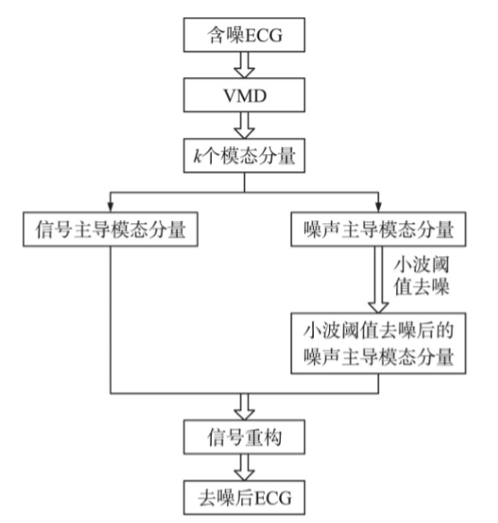
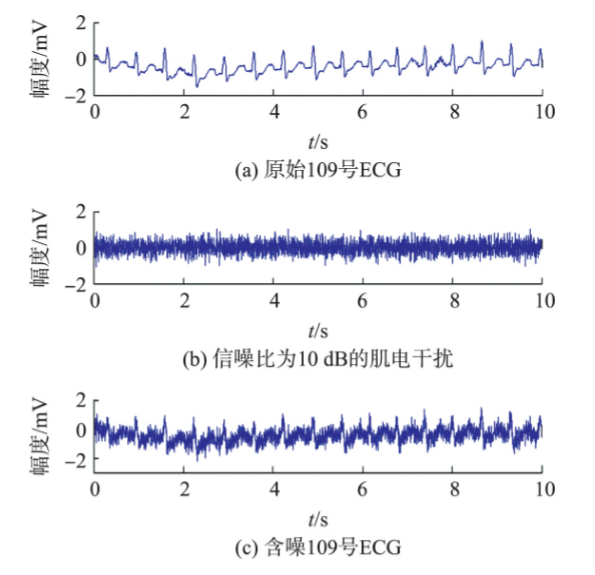
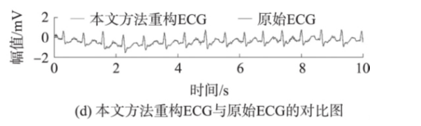
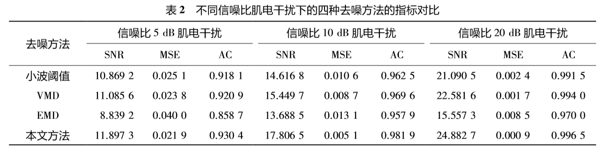
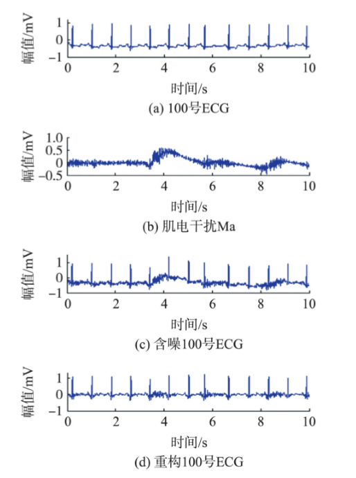
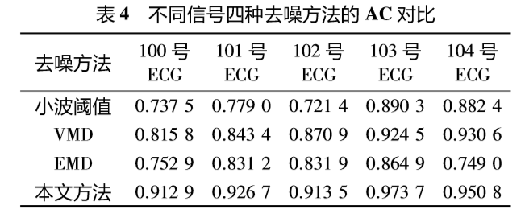

## 基于 VMD 和小波阈值的 ECG 肌电干扰去噪处理

传感技术学报 2020 年 6 月 项目来源:国家自然科学基金项目( 61842103) ; 山西省高等学校科技创新项目( 2020L0389) 

#### 摘要

本文提出利用变分模态分解（VMD）和小波阈值相结合的方法对心电信号肌电干扰进行去噪处理。

> 有现有的经典方法的结合，解决问题

#### 相关工作

ECG 作为一种典型的生物医学信号，具有非线性、非平稳、信号微弱、易受噪声污染的特点。

###### EMD法：

将带噪 ECG 自适应分 解为一系列(IMF) 分量，舍弃被判断为噪声的 IMF 分量，剩余 IMF 分量重构得到去噪信号，但 IMF 分量之间通常 会出现模态混叠，影响去噪效果

###### 小波阈值法：

小波阈值法的局部时频分析能力较强，但其小波基和阈值的选择 均会影响去噪效果，即使一些文献构建了新的阈值函数，但小波基与阈值仍需经验性选择，影响去噪效果。

###### VMD法（2014）：

可确定每个模态分量的中心频率和带宽，它可以有效地缓解 EMD 中的模态混叠。但即使在 VMD 分解得到的每一个模态分量中，也将同 时包含信号与噪声。随意地去除任一个模态分量， 都可能显著地影响重建 ECG 信号的准确性。

#### VMD 与小波阈值去噪理

###### VMD

###### 小波阈值去噪 

#### 基于 VMD 和小波阈值的 ECG 肌电 干扰去噪方法与评价指标 

###### 基于VMD和小波阈值的ECG肌电干扰去噪方法 

###### 评价指标 

为了充分地评估提出的方法在 ECG 肌电干扰 去噪中的有效性，本文采用信噪比( Signal to Noise，SNR) 、均方误差( Mean Square Error，MSE) 、自相关系数( Autocorrelation Coefficient， AC) 作为评价指标。

SNR越大， MSE 越小，意味着方法的去噪能力越强。AC 越大，方法去噪后重建的 ECG 与原始 ECG 的偏差越小，相似度越高

#### 仿真实验及结果分析 

“MIT-BIH Arrhythmia Database”中的107、 109、 119 号 ECG

###### 典型 109 号 ECG 的去噪处理实验 

- 确定 k 值，并将含噪 109 号 ECG 经过 VMD 自适应分解为 k 个模态分量。 

- 判断模态分量属于信号主导或噪声主导

- 重构得到去噪后的109 号 ECG

  

###### 四种方法对多个含噪 ECG去噪的结果对比分析 

- ​	四种方法对含有 10 dB 肌电干扰的 109 号 ECG 去噪效果对比 
- ​	四种方法对含有不同信噪比肌电干扰的 109 号 ECG 去噪效果对比 
- ​	四种方法对含有10dB 肌电干扰的不同 ECG 去噪效果对比 

#### 真实 ECG 实验及结果分析 

选 取“MIT-BIH Arrhythmia Database”中的 100 号 ECG 与“MIT-BIH Noise Stress Test Database”中的肌电干 扰 ma 构成真实含噪100 号ECG

#### 结论 

现实中，良好采集的 ECG 信号，一般 混叠的肌电干扰噪声幅值为 ECG 峰峰值的 10%，本文提出的去噪方法可以有效地去除。但对一些采集 不好的 ECG，肌电干扰噪声将 ECG 信号完全淹没， 使得含噪 ECG 不具有明显 ECG 信号的 QRS 特征波，经 VMD 分解后的模态分量都表现为近似白噪声特性，此时，本方法去噪效果较差，甚至失效

> 这个属于设备得到数据的严重偏差导致的，非算法本身