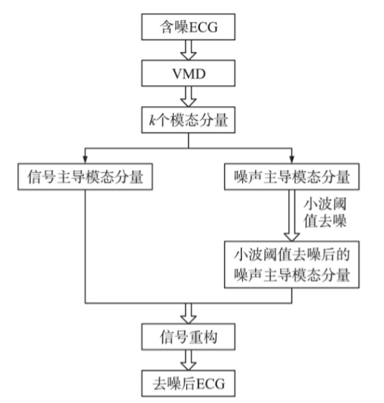

### Effect of horror clips on the physiology of ANS & Heart using ECG signal classification 

#### 引用

[1] Nayak S ,  Sahoo S ,  Champaty B , et al. Effect of horror clips on the physiology of ANS & Heart using ECG signal classification[C]// International Conference on Control. IEEE, 2014.

#### 研究问题

通过恐怖片段对自主神经系统(ANS)和ECG的影响，利用心率变异性(HRV)特征对ANS的生理学进行无创研究，利用心电特征和小波处理的心电信号监测传导通路的生理变化，HRV特征提示副交感神经在刺激后占优势，使用非线性分类器时，发现其时域特征有显著差异。

#### 研究意义

以非侵入性的手段了解恐怖电影片段对ANS和ECG的影响，通过基于神经网络进行分类。

#### 文章思路

###### 实验规划和步骤

###### 特征值分类

- 正确采集ECG信号
- 分析ECG信号，得到RR-interval 和 HRV 的相关数据，进行相关性分析和特征提取，进行ANN分类。
- 分析ECG信号，切片信号，进行小波处理，得到参数后进行统计学分析，找到特征值，进行ANN分类。

###### 得出数据并总结

分析上述实验得到的数据，并总结。

> **个人心得**：
>
> 印度产出的一篇论文，实验流程是比较完整的，数据和结果分析相对完整，但是研究意义并未突出。其中实验对ECG信号的去噪和分析的细节并未写出，ANN分类也只是提及。

### Biometric and Emotion Identification: An ECG Compression Based Method

#### 引用

[1]Brás Susana,Ferreira Jacqueline H T,Soares Sandra C,Pinho Armando J. Biometric and Emotion Identification: An ECG Compression Based Method.[J]. Frontiers in psychology,2018,9.

#### 研究问题

信息论数据模型的使用与数据压缩算法相结合，可以有效地比较心电图记录并推断出数据采集时的个人身份以及情绪状态。

#### 研究意义

该方法不需要对心电波形进行勾画或对齐，减少了预处理误差。所提出的方法灵活，可以适应不同的问题，通过改变模板训练模型即可。

#### 文章思路

###### ECG的获取：

使用了两个心电数据库。为了开发和验证方法。

1. 使用了一个在线数据库，即PTB数据库，可在Physionet网站上访问。
2. 采集的心电数据库上进行了测试，称为情绪数据库，数据库接近真实情况，每条数据中有三种情绪的影响等。（侵入性，低噪声）

并且详细阐述了两者的获取方式和相关预处理。

###### 提出方法：

1. 利用量化过程将实数心电记录转化为符号时间序列;
   - 采用无参数数据挖掘技术，克服了传统的基于心电图的问题。
   - 并不是所有的信息都会从实值心电传递到符号心电，因为在这个过程中会有信息的丢失，必须保证信息的丢失不会危及心电信息。
2. 对心电信号的符号表示进行条件压缩，使用数据库中存储的符号心电记录作为参考
   - 一种基于信息距离是基于Kolmogorov复杂度的标准压缩器
   - 此处是本文核心，压缩算法的详细介绍
3. 心电记录类的识别，使用1-NN(最近邻)分类器。
   - 1-NN分类器的分类步骤
   - 用两组数据来统计和验证上述方法的准确性

> **个人心得**：
>
> 摘要层次完整，方法新颖，完整详细。实验设备优劣阐述且合理。 公式和实验数据完整。

### An efficient algorithm for R-R intervals series filtering 

#### 引用

[1]Logier R,De Jonckheere J,Dassonneville A. An efficient algorithm for R-R intervals series filtering.[J]. Conference proceedings : ... Annual International Conference of the IEEE Engineering in Medicine and Biology Society. IEEE Engineering in Medicine and Biology Society. Annual Conference,2004,2004.

#### 研究问题

在本文中，我们描述了R-R区间序列的实时滤波算法。该滤波器能够检测每个受干扰的区域，并以最有可能的样本替换错误的样本。

#### 研究意义

心电信号通常受到各种扰动的干扰，这些扰动包括瞬时心脏频率曲线的突然变化，因此对频谱分析的评价是错误的。本文滤波器能够检测这种记录中遇到的主要伪像，并通过计算最可能的样本来重建R-R序列，同时保持真实的记录时间。

#### 文章思路

滤波原理——>伪影分类——>检测算法——>重建算法——>算法的验证

其中的检测算法，通过标记正确还是错误的采样，动态的调整窗口的阈值。本文核心之一。

其中的重建算法，在两个正确样本之间进行线性插值，将错误的样本替换为正确的样本，对频率含量没有任何影响。本文核心之二。

然后分析实时监测的可能性。

### 基于 VMD 和小波阈值的 ECG 肌电干扰去噪处理

#### 引用

[1]卢莉蓉,王鉴,牛晓东.基于VMD和小波阈值的ECG肌电干扰去噪处理[J].传感技术学报,2020,33(06):867-873.

######  项目来源

国家自然科学基金项目(61842103) ; 山西省高等学校科技创新项目(2020L0389) 

#### 研究问题

本文提出利用变分模态分解（VMD）和小波阈值相结合的方法对心电信号肌电干扰进行去噪处理。

#### 研究意义

首先ECG 作为一种典型的生物医学信号，具有非线性、非平稳、信号微弱、易受噪声污染的特点。

现有的EMD、小波阈值、VMD去噪均有局限性，本文使用了VMD 与小波阈值结合去噪。

#### 文章思路

###### 验证方法的评价指标

为了充分地评估提出的方法在 ECG 肌电干扰 去噪中的有效性，本文采用信噪比( Signal to Noise，SNR) 、均方误差( Mean Square Error，MSE) 、自相关系数( Autocorrelation Coefficient， AC) 作为评价指标。

SNR越大， MSE 越小，意味着方法的去噪能力越强。AC 越大，方法去噪后重建的 ECG 与原始 ECG 的偏差越小，相似度越高

##### 通过仿真实验，结果分析

##### 通过真实实验，结果分析

> **个人心得**：
>
> 用新老方法的结合，有效的解决经典问题，效果良好。
>
> 文末结论提出的“但对一些采集不好的 ECG，肌电干扰噪声将 ECG 信号完全淹没，使得含噪 ECG 不具有明显 ECG 信号的 QRS 特征波”是硬件或实验的非正确性造成，并非文章方法的问题。

