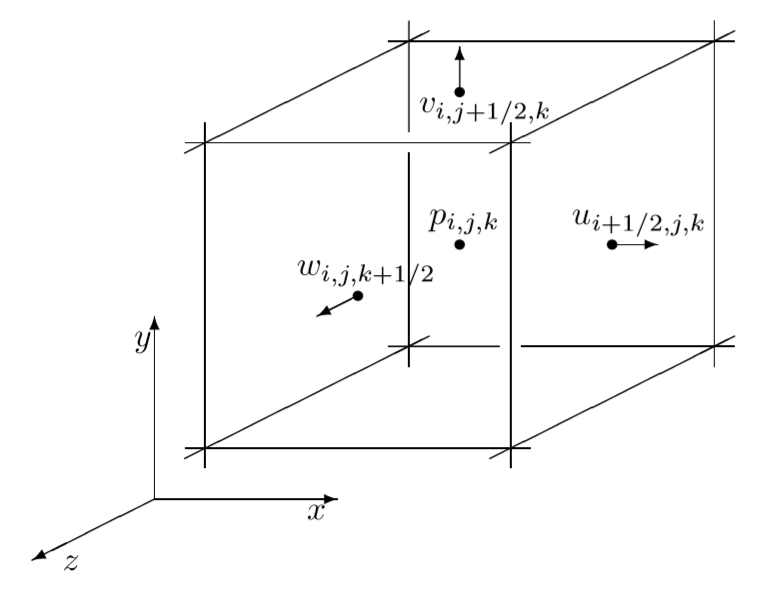

# Fluid Simulation for Computer Graphics

## 流体等式

$$
\frac{\partial \vec u}{\partial t } + \vec u \cdot \nabla\vec u + \frac 1\rho\nabla p = \vec g + \nu\nabla\cdot\nabla\vec u\\
$$

$$
\nabla\cdot\vec u = 0
$$

其中，$\vec u$代表一个3D的速度$(u,v,w)$，就好像用$\vec x$代表一个3D中的位置一样$(x,y,z)$.

$\rho$代表流体的密度，例如立方米的水和空气的密度就是$1000kg/m^3 : 1.3kg/m^3$大约是$700:1$。

$p$代表**压力**，是单位区域上流体施加的力。

$\vec g$就是我们熟知的重力$(0,-9.81,0) m/s^2$，在本书提到的这个系统中，我们以XZ为横平面，Y为垂直方向。而且这个力也被称作body forces。因为它作用于液体整体，并非仅仅是表面。

$\nu$为运动学黏度（kinematic viscosity），可以理解为它是液体抵抗变形的程度。像糖浆一样的液体有高粘稠度，像水银一样的液体有低粘稠度。

## 动量等式

**上述的第一个等式(1)，是三合一的向量等式，被称作动量等式(momentum equation)。**

**上述的第二个等式(2)，是叫做不可压缩条件(incompressibility condition)**

把模拟的流体想成是一个粒子系统，每一个粒子表达了液体中的一滴，且每一个粒子都有一个质量 $m$，一个体积 $V$，一个速度 $\vec u$，整体看这个系统在同一时间向前，我们需要知道，每一个粒子的：$\vec F = m\vec a$。，然后会得知粒子在它移动在某处的加速度是情况。
$$
\vec a \equiv \frac{D\vec u}{Dt}
$$
其中大写D的导数标记被称作**材质导数（material derivative）**，所以牛顿法则就变成：
$$
m \frac{D\vec u}{Dt} = \vec F
$$
那么什么力会施加在粒子上呢？最简单的就是 $m\vec g$ 这个力，其次我们还要考虑粒子间的相互作用力。

液体力的第一个就是压力，注意，此处我们关心的是净力(net force)，虽然上方的压力区域在压着下方的压力区域，但是，净力为0，压力没有产生加速度。我们会关心一侧的压力大于另一边，从而使其不平衡(imbalance)。也就是说，粒子一侧的压力大于另一侧，所导致一个力从高压力方向指向低压力方向。在附录中我们展示了严格的推导，但是现在我们要指出一个简单方法去测量每个粒子位置上的不平衡的力，用负的压力梯度 $-\nabla p$。我们要积分整个液体体积 $V$ 内所有的压力，此时我们要认为液体是不可压缩的。

另一个流体的力是由粘稠度产生的，黏度流体尝试抵抗形变。我们先直觉的的理解到力尝试让我们的粒子以周围粒子的平均速度移动，换句话说，就是尝试要使其和周围粒子的速度差最小化。我们在某些领域用测量一个量与平均值的距离的微分算子是拉普拉斯算子 $\nabla\cdot\nabla$，这会给我们提供一个黏着力，我们在积分整个体积的时候，我们会用到**动态黏着度因子**(dynamic viscosity coefficient)，我们会用 $\mu$ 来表示（之前的运动学的粘稠度会被加速度取代），把他们放在一起，就有了液体中一滴水的流动：
$$
m\frac{D\vec u}{Dt} = m\vec g-V\nabla p + V\mu\nabla\cdot\nabla\vec u
$$

[^Laplacian]: 拉普拉斯算子被理解为是梯度的散度，它有时会写成$\nabla^2$或者$\Delta$，但在文中强烈建议写成$\nabla\cdot\nabla$

对于粒子来说，一滴水中的粒子数趋近于无穷，它的体积会趋近于0。我们称之为**连续介质模型(continuum model)**，此模型有数学上简洁性和独立于水粒子的确切数目的优点，而且实验证明，在很多情况下它都与现实非常接近。取连续极限剂量给我们的粒子方程带来了一个问题，因为粒子的质量m和体积V必须趋于零，这样我们就什么都没有意义了。我们可以用先把方程除以体积然后去极限的方法来修正。我们等式除以V，得到：($m/V=\rho\text{ 液体的密度}$)
$$
\rho\frac{D\vec u}{Dt} = \rho\vec g - \nabla p + \mu\nabla\cdot\nabla\vec u
$$
我们除以$\rho$，整理等式有：
$$
\frac{D\vec u}{Dt}+\frac1\rho\nabla p  = \vec g + \frac{\mu}{\rho}\nabla\cdot\nabla\vec u
$$
我们再用运动学的粘稠度 $\nu = \mu / \rho$得到：
$$
\frac{D\vec u}{Dt}+\frac1\rho\nabla p  = \vec g + \nu\nabla\cdot\nabla\vec u
$$
其中材质微分$D/Dt$对计算机图形学来说非常重要，还会解决一些数值方程。但是我们要理解这个材质微分是什么，**就要从拉格朗日和欧拉不同的视角理解入手了。**

## 拉格朗日和欧拉的视角

当我们去考虑一个连续介质（如流体和变形实体），我们可以从拉格朗日和欧拉两个视角上用方法来跟踪运动。

拉格朗日的方法是会把连续介质当成一个粒子系统，每个粒子拥有速度 $\vec u$ 和位置 $\vec x$ ，实体几乎也可以用此方法模拟，那些离散的粒子集合通常会连接成一个网格。

欧拉方法是会观察空间中一些固定的点，然后会去测量液体的量，例如：密度，速度，温度等等。即当液体流过这些点时贡献出的那一点点变化。

在数值上，拉格朗日相当于一个粒子系统，无论是否可以用网格(mesh)连接这些粒子；欧拉的视角相当于使用一个固定的网格，即使流体流过它，它也不会在空间中改变。

看上去欧拉的方法是不必要且复杂的，为什么不直接使用拉格朗日的粒子系统呢？有一些方案例如涡流和SPH会这么做，但是，这些也是依赖于流体中力的欧拉微分等式，我们坚持使用欧拉方法的2个原因：

- 更容易的去分析空间中的微分：例如压力梯度和粘稠度
- 在数值上，相比一大群移动的粒子，更容易去近似得到固定的欧拉网格的值。

而连接两个方法的关键就是这个材质导数。先从拉格朗日的描述中：粒子有位置 $\vec x$ 和速度 $\vec u$，我们考虑到一个一般量 $q$ (可以是密度，速递，温度或是其他什么)，每个粒子都有 $q$ 值。有函数 $q(t,\vec x)$会告诉我们在 $t$ 时刻，粒子在 $\vec x$ 位置上时$q$ 的值。当这个函数在空间中时，这就是一个欧拉变量，不再是粒子的。那么 $q$ 的变化速度，对于粒子在位置 $\vec x(t)$ 是多快？我们可以用一个全微分(又名：链式规则)：
$$
\begin{aligned}
\frac d{dt}q(t,\vec x(t)) &= \frac{\partial q}{\partial t} + \nabla q\cdot\frac{d\vec x}{dt}\\
&=\frac{\partial q}{\partial t} + \nabla q\cdot\vec u \\
&\equiv \frac{Dq}{Dt}
\end{aligned}
$$
这就是材质导数。

让我们回顾一下这个材质导数的两个部分。第一个是 $\partial q/\partial t$ 表示 $q$ 在空间固定点的变化快慢，第二个部分是$\nabla q\cdot\vec u$ 是修正由于流体流过时的偏差而导致的变化的改变。（例如：温度的改变是因为热空气被冷空气取代，而不是因为分子的温度变化了）

我们把这个材质导数写全，则它的所有的偏微分为：
$$
\frac{Dq}{Dt} = \frac{\partial q}{\partial t}+u\frac{\partial q}{\partial x}+v\frac{\partial q}{\partial y} +w\frac{\partial q}{\partial z}
$$
在2D中观察，我们可以消除掉 $w-$ 和 $z-$ 的部分。

我们一直讨论的无论是指分子还说粒子的量，他们随着速度场 $\vec u$ 移动，被称作**水平对流(advection)**，这个对流等式就是用到了一个材质导数，它最简单的情况就是设置为0。
$$
\begin{aligned}
\frac {Dq}{Dt} = 0&,&\\
i.e.,\frac{\partial q}{\partial t} + \vec u\cdot\nabla q = 0&.&
\end{aligned}
$$

#### 一个案例

我们通过一维案例来解释这个事情。用 $T$ 来表示温度代替 $q$，在某一时刻，温度可以表示为：$T(x) = 10x$ 。这就是，在原点的时候是冰点，而随着我们向右侧走，温度在上升，例如：$x = 10$ 的时候温度为100。我们会说，有一个风速为 $c$ 的稳定风在吹，换句话说，就是流体的速度在任何地方的速度都为 $c$ 有
$$
\vec u = c
$$
我们假设每一个温度的粒子是不变的，他们仅仅是移动。所以有材质导数，在拉格朗日视角下，有：
$$
\frac{DT}{Dt} = 0
$$
我们展开这个式子有：
$$
\begin{aligned}
&\frac{\partial T}{\partial t} + \nabla T\cdot\vec u = 0\\
&\frac{\partial T}{\partial t} + 10\cdot c = 0\\
\Rightarrow\quad &\frac{\partial T}{\partial t} = -10c
\end{aligned}
$$ {W}

在固定点的空间中，温度的变化速度是 $-10c$ ，如果风停了，$c= 0$ 什么都没有改变。如果风吹向右方速度 $c = 1$ ,温度在固定点位将会掉到速度 $-10$ ，如果风吹向左方速度 $c = -2$ ,温度在固定点位将会提升到速度 $2$0 。即使拉格朗日导数是0，但是在这个案例中，欧拉导数可以是任意值，其依赖于流体移动的速度和方向。

#### Advecting Vector Quantities

一个困惑是，材质导数如果应用在一个向量上，意味着什么。例如：RGB颜色，向量域速度 $\vec u$ 本身。简单的回答就是分别对待其中每一个分量。首先有颜色向量 $\vec C = (R,G,B):$
$$
\frac{D\vec C}{Dt}=\begin{bmatrix} {DR/Dt}\\{DG/Dt\\{DB/Dt}}\end{bmatrix} = \begin{bmatrix} {\partial R/\partial t+\vec u\cdot\nabla R}\\{\partial G/\partial t+\vec u\cdot\nabla G}\\{\partial B/\partial t+\vec u\cdot\nabla B}\end{bmatrix} = \frac{\partial\vec C}{\partial t}+\vec u\cdot\nabla\vec C
$$

## 不可压缩性

压缩流动的模拟是非常复杂且代价昂贵的（如：音爆和爆炸气浪）

> 从艺术表现，感知程度，经济成本的角度去看，上面的这些情况的表现力的酷炫比要真实模拟他们更有意义。

我们在一个时刻去取流体中的任意一块来观察。我们称作这个体积为 $\Omega$ ,同时它的边界表面为 $\partial\Omega$。我们可以通过对流体在边界上速度的法向分量积分来测量流体体积的变化速度
$$
\frac d{dt}\text{volume}(\Omega) = \iint_{\partial\Omega}\vec u\cdot\hat n
$$

如果表面是切线运动的，则并不会影响体积。如果运动方向是向外或向内，相应的体积就会增加或减少。对于一个不可压缩的液体，体积是保持恒定的，也就是变化率为0。
$$
\iint_{\partial\Omega}\vec u\cdot\hat n = 0
$$
我们可以利用散度定理将它变为体积积分。如果你对一个函数的导数积分，你会得到原始函数在积分限处的值。在这个案例中有：
$$
\iiint_\Omega\nabla\cdot\vec u = \iint_{\partial\Omega}\vec u\cdot\hat n = 0
$$
这里有个神奇的地方，这个等式在取 $\Omega$ 中任意区域的时候都是成立的。唯一的连续函数是0本身，这个函数与积分区域无关且积分到0(integrates to zero)。这个被积函数应该处处为0。
$$
\nabla\cdot\vec u = 0
$$
这个就是不可压缩的条件，斯托克斯方程的另一部分。满足不可压缩条件的向量域被称作无散度场，原因显然易见。模拟不可压缩流体的一个棘手的部分是确保速度场保持无发散。这就是压强（压力）的作用。考虑压强的方法就是保持速度不发散所需要的力。

压强会在动量方程中体现，我们想把它和速度的散度联系起来。因此，我们取动量方程两边的散度：
$$
\nabla\cdot\frac{\partial\vec u}{\partial t}+\nabla\cdot(\vec u \cdot \nabla\vec u) + \nabla\cdot\frac 1\rho\nabla p = \nabla\cdot(\vec g + \nu\nabla\cdot\nabla\vec u)
$$
我们可以更换第一部分的微分顺序：
$$
\frac {\partial}{\partial t}\nabla\cdot\vec u
$$
如果要保持不可压缩条件，它最好为0，我们则可以梳理等式得到：
$$
 \nabla\cdot\frac 1\rho\nabla p = \nabla(-\vec u\cdot\nabla\vec u + \vec g + \nu\nabla\cdot\nabla\vec u)
$$
这和我们的数值模拟没有太大关系，但值得一看，因为当我们离散化时，从观察体积变化到压强方程的速度，我们会经历几乎完全相同的步骤。

## Dropping Viscosity

## 边界条件

我们关注两个边界条件，实体墙和自由表面。

最简单的术语解释边界时的速度：流体最好不要流入实体内也从远离实体，因此速度的法向分量必须为零：
$$
\vec u\cdot \hat n = 0
$$
当实体也在移动的时候，情况就变得复杂了。通常我们需要速度的法向分量匹配实体速度的法向分量，这样，他们的相对速度为0：
$$
\vec u\cdot \hat n = 0 = \vec u_{solid}\cdot \hat n
$$
等式中 $\hat n$ 就是固体边界的法线，这个常被称作不粘的(no-stick)条件。我们只限制了速度的法向分量，允许流体沿切线方向自由滑动。需要记住的重要一点：流体的切向速度可能与固体的切向速度完全没有关系。粘性和无粘性条件只在固体周围的极薄的边界层中可见。

上面就是对于无粘性液体的实体墙边界。如果我们有一个粘性的，就会变的复杂了，在这个案例中，黏住实体通常会影响流体速度的切向组件，强迫它匹配。这被称作无滑动（no-slip）的边界调节，简单来说就是：
$$
\vec u = 0
$$
或者实体在移动
$$
\vec u = \vec u_\text{solid}
$$
对于液体有一个非常小但非零的黏度，当我们从微观上观察液体和实体接触时，这个描述比起无粘性的条件更真实精确。但是通常来说，黏度的效果和无黏性条件只能在实体周围消失的薄边界层被看到。在流体的其他地方，似乎我们有一个不粘的边界。边界层对于研究来说是一个复杂的区域，但是它比我们在动画模拟中能解决的要薄得多，我们不需要太担心，只需要用无粘性的代替，除了那种黏糊糊的东西。再次，我们将避免讨论精确的细节，直到可以实现出数值即可。

你也许会非常困惑，当一滴液体从实体上脱离时的，你思考这个边界条件：它是怎么样从实体上脱离，当它在实体表面的速度的法线分量为0。在某种程度上，答案是连续体模型并没有真正正确地处理分离：这是一个分子尺度的过程，不能被抽象掉。通常的，我们要么会得到一个数值上几乎没有错误的貌似真实的分离，要么我们会用技巧得到一个看上去真实的结果。Batty 介绍了一种更有原则的“微观”在画面上的分离模型，利用一个不等式条件允许流体移动离开墙壁而不是进入它：
$$
\vec u \cdot \hat n \geq\vec n_\text{solid}\cdot \hat n
$$
作为旁注，有时候实体墙其实是流体可以穿过的一个通风口或是排水口：在这个情况下，我们显然希望 $\vec u\cdot\hat n$ 不同于墙体的速度。它应该是流体在那一点被泵入或泵出模拟的速度

另一个我们感兴趣的边界条件是在自由表面上。这是我们停止模拟流体的地方。例如：如果我们想要模拟水的四处飞溅，同时水的表面是不接触到任何实体的自由表面。在这个例子中，这里其实还有另外一个流体——空气，但是我们可能不想进行复杂的模拟空气。同时，空气又比水轻700倍，它不会对水的任何地方产生很大的影响（需要排除掉那些泡泡）。所以我们会简单的模拟，即把空气理解成一个有常量大气压强的区域。事实上，只有压力的差异才重要，所有我们会设置空气压力为任意的常量：0是最方便的一个值。自由表面是 $p = 0$ 的表面，我们不以任何特定的方式控制速度。

另一个案例是自由表面的上升，我们尝试模拟一点流体是一个大领域的一部分：例如，模拟烟雾在户外。我显然不希望承担模拟整个地球的大气，我们仅仅需要模拟网格覆盖的“我们感兴趣的”区域。流体越过模拟区域的边界继续流动，但是我们就不再追踪它。我们允许流体进出区域，一次他自然被认为是自由表面，$p=0$ ,甚至这里都是不是可见的表面。

# 2 Overview of Numerical Simulation

我们要用计算机离散它们来数值模拟流体，这里有非常多的选择，而且人们也一直再持续的发明出新的方法，我们无法涉及到这个领域的每个细节，而是将重点放在一些行之有效的图形处理方法上。

## 2.1 Splitting

 我们第一个选择的事情称作“拆分”：我们把复杂的等式拆分成一些可以被分开解决的部分。如果我们说一个数量的变化率是一系列项的总和，则我们可以通过计算每一项在数值上更新它。同时包括它一个接一个的效果。

让我们用过一个非常简单的“玩具”例子来清晰的表述，一个一阶的导数等式：
$$
\frac{dq}{dt} = 1+2
$$
你当然已经知道了结果 $q(t) = 3t + q(0)$ ，让我们算出数字方法上的拆分。我们将拆分它成为2步，每一步都看上去像简单的*前向欧拉*更新：
$$
\begin{align}
\widetilde q &= q^n + 1\Delta t \tag{2.1}\\
q^{n+1}&=\widetilde q+2\Delta t \tag{2.1}
\end{align}
$$
在这里的记号 $q^n$ 是 $q$ 计算了 $n$ 步的值，$\Delta t$ 是连贯时间步长的时间量。把这个等式拆分成两步我们都做了什么？在第一步（2.1）之后，我们获得了一个中间量 $\widetilde q$ ，这个量包含了第一项（=1）的贡献，但是没有包含第二项（=2）。然后在第二步（2.2）时有从中间值到最后加上缺失项的贡献。在这个例子中，显然我们得到了精确的答案，拆分对我们并没有什么帮助。

让我们升级我们的例子，变的有趣一些：
$$
\frac {dq}{dt} = f(q) + g(q)
$$
这里的 $f()$ 和 $g()$ 都是黑盒函数表示独立的软件模块。我们可以用 *前向欧拉* 进行拆分。
$$
\begin{align}
\widetilde q &= q^n + \Delta tf(q^n) \tag{2.4}\\
q^{n+1} &= \widetilde q + \Delta tg(\widetilde q)\tag{2.5}\\
\end{align}
$$
简单的泰勒级数分析说明了这仍是一阶准确的算法：
$$
\begin{aligned}
q^{n+1} &= (q^n+\Delta tf(q^n)) + \Delta tg(q^n+\Delta tf(q^n))\\
&=q^n+\Delta tf(q^n) + \Delta t(g(q^n) + O(\Delta t))\\
&=q^n+\Delta t(f(q^n) + g(q^n)) + O(\Delta t^2))\\
&=q^n+ \frac{dq}{dt}\Delta t + O(\Delta t^2))
\end{aligned}
$$
让我们假设我们把 $f()$ 和 $g()$ 分成单独的软件模块的原因是我们有特殊的数值方法能够很好地解决更简单的方程。
$$
\begin{align}
\frac{dr}{dt} = f(r)\\
\frac{ds}{dt} = f(s)
\end{align}
$$
这正是拆分的动机：我们也许不能简单的处理一整个复杂的方程，但是我们可以构造出我们更容易解决的，我将称其为整合算法 $F(\Delta t,r)$ 和 $G(\Delta t,s)$ ，我们拆分的方法是这样的：

$$
\begin{align}
\widetilde q &= F(\Delta t,q^n) \tag{2.6}\\
q^{n+1}&=G(\Delta t,\widetilde q) \tag{2.7}
\end{align}
$$

如果 $F()$ 和 $G()$ 是前向欧拉，那么这就如同等式（2.4）（2.5）一样准确。

拆分是真正用分而治之逐个击破的原则去处理微分等式：解决整个等式很难，但是拆分成几个部分就容易去解决了，最后再把解决后的情况结合起来。

## 2.2 Splitting the Fluid Equations

我们将要拆分无压缩液体等式。尤其是，我们将要分离出平流部分，body forces(重力)部分，和压力部分。如果黏度是重要的，我们也可以将其分离出：参见第十章

我们将计算出方法为了解决这些简单的等式：
$$
\begin{align}
\frac{Dq}{Dt} &= 0 \quad\quad\text{(advection)} \tag{2.8}\\
\frac{\partial\vec u}{\partial t} &=\vec g\quad\quad\text{(body forces)}\tag{2.9}\\
\frac{\partial\vec u}{\partial t} + \frac{1}{\rho}\Delta p &= 0\tag*{} \\
\text{such that}\quad\nabla\cdot\vec u &= 0\quad\quad\text{(pressure/incompressibility)} \tag{2.10}\\
\end{align}
$$

我们用一个通用数量 $q$ 在平流等式，因为我们对平流的其他内容感兴趣，而不仅仅是速度 $\vec v$.

让我们用我们的算法解决平流层问题，等式（2.8），$\text{advect}(\vec u,\Delta t,q)$ ：它的平流输送量 $q$ 通过速度场 $\vec u$ 的时间间隔 $\Delta t$ 。第三章中将会涉及一些狠好的方法。

针对body force，等式（2.9）前向欧拉 $\vec u \gets\vec u + \Delta t\vec g$ 是可以的

针对pressure/incompressibility部分，等式（2.10），我们要开发一个算法，名为 $\text{project}(\Delta t.\vec u)$，这个算法会计算和应用正确的压力去使 $\vec u$ 散度自由和执行实体墙边界的条件/第五章处理这个部分（同时解释了我们为什么选择这个奇怪的单词“project”）。

我们在前面章节中提到的这个重要的 precondition/guarantee 问题是平流层应该在自由散度速度场中要完成的。当我们流体四周移动同时想要体积守恒，我们移动进的速度场散度自由：我们在第一章提到过，所以我们要确保我们只能在平流层运动，用函数 $\text{preoject}()$ 输出：我们拆分的序列就非常重要了！

将他们整合，这就是我们的基础流体算法：

- 开始于我们的一个初始化的散度自由速度场 $\vec u ^ 0$
- 对于时间步长 $n = 1,2,3...$
  - 决定一个好的时间步长 $\Delta t$ 来自于时间 $t_n$ 和 $t_{n+1}$
  - 设置$\vec u ^A = \text{advect}(\vec u^n,\Delta t,\vec u^n)$ 
  - 加上 $\vec u^B = \vec u^A + \Delta t \vec g$
  - 设置 $\vec u ^{n+1} = \text{project}(\Delta t,\vec u^B)$

## 2.3 Time Steps

确定一个好的时间步长尺寸是算法的第一步，一个明显的担心是为什么我们不用当前动画帧的时间间隔：如果我们挑选候选 $\Delta t$ 但是发现 $t_n + \Delta t>t_\text{frame}$ ，然后我们需要clamp这个值到 $\Delta t = t_\text{frame} - t_n$ 同时，设置的标记提醒我们的事实是我们已经触及到最后一帧（注意，如果 $t_{n+1} = t_\text{frame}$ 也许不是一个好主意，因为不精确的浮点数会意味着 $t_{n+1}$  不会精确等于 $t_\text{frame}$ 除非编译器用了其他库 ）在每一帧结束时我们也许会保存流体动画的整个状态到硬盘上，或者渲染到屏幕。

受限于clamping，我们应该选择一个$\Delta t$ 来满足模拟中拆分步长的任意需求：平流、体积力等。我们将在接下来的章节中讨论这些。选择这些建议时间步骤的最小值通常是安全的(但不是在所有情况下都能保证!)

最后，为了模拟的质量，我们可能需要采取更小的时间步骤来充分解决流体现象。通常情况下，这是基于计算事物在模拟中移动的速度，并通过相应地调整时间戳来限制它们在一个步骤中可以走多远。例如，过大的时间步长可能意味着快速移动的固体只在其穿过烟雾区域之前和之后采样，而这种欠采样将导致烟雾没有被适当地扰动。限制时间步长，这样固体一定会被采样在中间时间在烟区将得到更好的质量结果。

然而，在某些情况下，我们可能有性能要求，不允许我们在每一帧中采取大量的小时间步骤。如果我们只有时间，比如说，每帧3个时间步，我们最好确保 $\Delta t$ ​至少是帧时间的三分之一。这可能比每一步的建议时间步长要大，所以我们要确保在这本书中，我们使用的所有方法都能容忍大于预期时间步长的使用——在这种情况下，它们应该会产生可信的结果，即使它们在数量上是不准确的。

## 2.4 Grids

在这个数值部分，到目前为止，我们只讨论了时间上的离散，而不是空间上的离散。虽然我们将在后面的章节中详细介绍，但我们将在这里介绍基本的网格结构。

在计算流体动力学的早期，Harlow和Welch介绍了解决不可压缩流动问题的标记细胞(MAC)方法[HW65]方法。本文的一个基本创新是一个新的网格结构(我们将在后面看到)，它为加强不可压缩性提供了一个非常有效的算法，尽管它似乎对其他所有东西都不方便。

所谓MAC网格是交错网格，即不同变量存储在不同位置的网格。让我们先从两个角度来看它，如图2.1所示，压力在网格单元$(i,j)$的中心取样，表示为 $p_{i,j}$ ,速度被分成两个笛卡尔分量。水平 $u$ 分量在垂直单元格面中心取样，例如 $u_{i+1/2,j}$ 表示单元格 $(i,j)$ 和 $(i +1,j)$ 之间的水平速度。垂直 $v$ 分量是在水平单元格面的中心取样的，例如用 $v_{i,j+1/2}$ 表示单元格 $(i,j)$ 和 $(i,j +1)$ 之间的垂直速度。注意，这意味着我们没有在任何地方存储速度矢量：速度的不同分量是在不同的位置取样的，不能简单地组合成一个矢量。还需要注意的是，对于网格单元格$(i,j)$，我们已经在其每个面的中心取样了速度的*法向分量*：这将非常自然地允许我们估计流入和流出单元格的流体数量。

在三维空间中，MAC网格的设置方法相同，将网格单元中心的压力和三个不同的速度分量分开，这样我们就有了速度的法向分量在每个单元面中心采样(见图2.2)。

我们会在第5章更详细地讨论为什么要使用这种交错排列，但简单地说，它是为了我们可以使用精确的**中心差**来计算压力梯度和速度场的散度，而不用考虑中心差的常见缺点。考虑一个一维的例子：估计在网格位置取样的数量 $q$ 的导数 $...,q_{i−1},q_i,q_{i+1},.... $ 为了在没有任何偏差的情况下估计 $∂q/∂x$ 在网格点 $i$​​ 上的值，自然公式是第一个中心差分：
$$
\left(\frac{\partial q}{\partial x}\right)_i\approx\frac{q_{i+1}-q_{i-1}}{2\Delta x}\tag{2.11}
$$
这是无偏和准确的 $O(∆x^2)$​​，而不是向前或向后的差异，如
$$
\left(\frac{\partial q}{\partial x}\right)_i\approx\frac{q_{i+1}-q_{i}}{\Delta x}\tag{2.12}
$$
这是偏向右边，只准确到$O(∆x)$ 。然而，公式(2.11)有一个主要问题，即在网格点 $i$ 处的导数估计完全忽略了那里采样的 $q_i$ 值！要知道为什么这么糟糕，回想一下常数函数可以被定义为一阶导数为零的函数。如果我们要求有限差分(2.11)为零，我们就允许 $q$ 不一定必须是常数——$q_i$ 可以与 $q_{i−1}$ 和 $q_{i+1}$ 有很大的不同，但中心差分仍然会报告，只要 $q_{i−1} = q_{i+1}$，导数就为零。事实上，像$q_i =(−1)^i$​ (这里我们使用的是指数)这样的锯齿状函数远不是常数，根据公式(2.11)，它的导数为零。另一方面，只有真正的常数函数才满足正向差分(2.12)等于零。公式(2.11)的问题在技术上被称为非平凡零空间：公式计算为零的函数集，其中包含的不仅仅是应该限制它的常数函数。

如果没有这个零空间问题，我们如何得到一个中心差分的无偏二阶精度？答案是使用交错网格：在中间点对 $q$ 进行采样，而不是$q_{i+1/2}$ 。那么我们自然可以估计出坐标点 $i$ 处的导数为
$$
\left(\frac{\partial q}{\partial x}\right)_i\approx\frac{q_{i+1/2}-q_{i-1/2}}{\Delta x}\tag{2.13}
$$
这是无偏和准确的 $O(∆x^2)$ ，但它不会跳过任何值的 $q$​ 如公式(2.11)。所以如果我们让这个等于 0 我们只有 $q$​ 常数零空间是正确的。MAC网格的设置使得我们在需要估计压力解(即不可压缩条件)中的导数时，可以使用这种交错形式的中心差分。

交错的MAC网格非常适合处理压力和不可压缩性，但坦白地说，它很难用作其他方面。例如，如果我们真的想要计算某个地方的全速度矢量，我们总是需要使用某种插值，即使我们是在看一个网格点！在空间中的任意位置，我们将对每个速度分量进行单独的双线性或三线性插值，但由于这些分量相互偏移，我们需要为每个分量计算不同的插值权重。在网格位置本身，这可以归结为一些简单的平均值。在二维中，这些平均值是
$$
\vec u_{i,j} =\left(\frac{u_{i−1/2,j} + u_{i+1/2,j}}{2} , \frac{v_{i,j−1/2} + v_{i,j+1/2}}{2} \right)\\
\vec u_{i+1/2,j} =\left(u_{i+1/2,j} , \frac{ v_{i,j−1/2} + v_{i,j+1/2} + v_{i+1,j−1/2} + v_{i+1,j+1/2} }{4} \right)\\
$$
在三维空间中，方程也基本类似:
$$
假装这里有公式
$$
最后，一个单词的顺序是关于奇怪的半下标，例如 $i+1/2$。这在理论上和概念上都很方便，可以固定样本点相对于网格的位置。但是，实现显然应该使用整数索引。需要一个标准约定，例如:
$$
\begin{align}
p(i,j,k) &= p_{i,j,k}, \tag{2.14} \\
u(i,j,k) &= u_{i−1/2,j,k}, \tag{2.15} \\
v(i,j,k) &= v_{i,j−1/2,k}, \tag{2.16} \\
w(i,j,k) &= w_{i,j,k−1/2}. \tag{2.17}
\end{align}
$$
然后，对于 $nx×ny×nz$ 网格，压力存储在 $nx×ny×nz$ 数组中，u分量存储在 $(nx+1)×ny×nz$ 数组中，v分量存储在 $nx×(ny+1)×nz$ 数组中，w分量存储在 $nx×ny×(nz+1)$ 数组中。

## 2.5 Dynamic Sparse Grids

