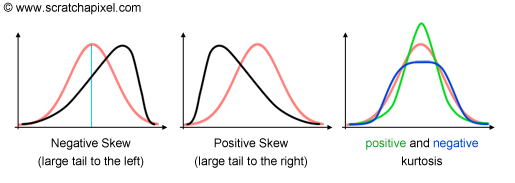

# A Quick Introduction to Monte Carlo Methods

> 文章出处：https://www.scratchapixel.com/lessons/mathematics-physics-for-computer-graphics/monte-carlo-methods-mathematical-foundations/quick-introduction-to-monte-carlo-methods 

### A Foreword about Monte Carlo

像许多其他术语，你可以经常在计算机文学中发现，蒙特卡洛出现在许多非启动作为一个魔术词。与计算机图形学中使用的一些数学工具相反，球面谐波在某种程度上是复杂的(至少与蒙特卡罗近似相比)，蒙特卡罗方法的原理本身是相对简单的(不是说容易)。这很好，因为这种方法非常方便地解决各种复杂问题。蒙特卡罗积分或近似(这两个术语可以被使用但是集成通常是更好的)可能是一个古老的方法(第一个记录引用方法中可以找到一些出版物数学家布丰伯爵在18世纪早期)但只有当前琅琅上口的名字在1940年代中期。蒙特卡洛是摩纳哥公国一个以赌场闻名的地区的名字。我们将解释在这节课中,蒙特卡罗方法与统计领域有很多自己很有用去欣赏你赢或输的机会在一个游戏的机会,如轮盘赌,任何涉及投掷骰子,画卡片,等,都可以视为随机过程。因此，这个名称非常恰当，因为它抓住了该方法的特点。方法本身的一些著名数学家帮助开发和形式化(费米,乌兰,冯·诺依曼,大都市和其他人)是至关重要的研究继续发展原子弹(这是用于研究中子输运的概率行为在裂变材料)和它的受欢迎程度在现代科学与电脑有很大关系(冯诺依曼本人出了一些电脑)。没有计算机的使用，蒙特卡罗积分是繁琐的，因为它需要大量的计算，这显然是计算机非常擅长的。现在我们已经回顾了一些历史，并给出了一些关于该方法名称起源的信息，让我们解释一下什么是蒙特卡洛。不幸的是，正如前面简要提到的，蒙特卡罗方法的数学意义是基于统计和概率论中的许多重要概念。在介绍蒙特卡罗方法之前，我们首先要回顾一下这些概念(并向您介绍它们)。

### A Quick Introduction to Monte Carlo Methods

什么是蒙特卡洛？蒙特卡洛方法背后的概念既简单又健壮。然而，正如我们很快将看到的，它需要潜在的大量计算，这就是它的流行与计算技术的出现相一致的原因。生活中的许多事情都很难准确地评估，尤其是当它涉及到非常大的数字时。例如，虽然这不是不可能的，但它可能会花费很长时间来数一公斤罐中可能包含的糖豆的数量。你可以用手一个接一个地数，但这可能会花费很长时间(也不是最令人满意的工作)。计算一个国家成年人口的平均身高，需要测量构成该人口的每个人的身高，将数字相加，然后除以被测量的总人数。同样，这个任务可能会花费很长时间。我们可以从总体中取一个样本然后计算它的平均高度。它不太可能给出整个人群的精确平均身高，但这种方法给出的结果通常是该数字的一个很好的**近似**。我们为了速度而牺牲了准确性。民意调查也被称为**统计数据**，它基于我们直觉上都熟悉的这一原则。有趣的是，近似值和整个人口的精确平均值有时可能是完全相同的。这只是巧合。在大多数情况下，数字会有所不同。我们可能想问的一个问题是，有什么不同？事实上，随着样本大小的增加，这个近似值收敛于确切的数字。也就是说，近似值和实际结果之间的误差，会随着样本容量的增加而减小。直觉上，这个想法很容易理解，但是我们将在下一章看到，它应该(从数学的观点)以不同的方式表述或解释。注意，为了公平起见，需要以相等的概率随机选择构成样本的元素。

注意，一个人的高度是一个随机数。它可以是任何东西这是随机事物的本质。因此，当您对一个总体进行抽样时，通过随机选取该总体的元素并测量其身高以近似于平均身高，每次测量都是一个随机数(因为您的样本中的每个人可能具有不同的身高)。有趣的是，一个随机数的和，是另一个随机数。如果你不能预测组成总和的数字是多少，你又怎么能预测它们的总和呢？所以，和的结果是一个随机数，组成和的数也是随机数。

对于数学家来说，群体的高度被称为**随机变量**，因为组成这个群体的人的身高是随机变化的。我们通常用大写字母表示随机变量。字母X是常用的。

在统计学中，构成总体的元素，如前所述是随机的，用小写字母表示，通常也用x表示。例如，如果我们写$x_2$，它表示总体中第二个人的高度(是随机的)所有这些x也可以看作是随机变量x的可能结果。如果我们称x为这个随机变量(种群高度)，我们可以用以下伪数学公式来表示从一个样本逼近成人平均种群高度的概念:
$$
Approximation(Average(X))=\frac{1}{N}\sum_{n = 1}^{N}x_n
$$
可以解读为,近似平均值的随机变量X,(一个特定国家的成年人口的高度),等于总和(Σ符号)N个成人的高度随机选择从这个人口(样品),除以N(样本)。这就是我们所说的蒙特卡洛近似。它包含了很多东西的某些性质的近似，通过对N个随机选取的东西取该性质的平均值。你也可以说蒙特卡洛近似，实际上是一种用样本来近似的方法。我们将在下一章学到的是，需要近似的东西在数学期望中被称为(稍后会有更多关于这个的内容)。如前所述一个给定的国家的成年人口的高度可以被看作是一个随机变量x然而注意其平均值(你得到平均每个人的身高例如人口组成,每一个数字也是一个随机数)是独一无二的(为了避免混乱与样本量通常用字母N表示,我们将使用M表示整个人口的大小):
$$
Average(X)=\frac{1}{M} (x_1+x_2+...x_M),
$$
如前所述$x_1+x_2+...x_M$对应于构成整个人口的每个人的身高(如果我们举一个例子的话)。在统计学中，随机变量X的平均值称为**期望**，写成E(X)。

> 总而言之，蒙特卡洛近似(MC方法之一)是一种利用样本来近似随机变量期望的技术。其数学定义为：
> $$
> E(X)≈\frac{1}{N}\sum_{n = 1}^{N}x_n
> $$
> 数学符号 ≈意味着右边这个符号里面的公式只给出了随机变量X期望E(X)的近似值。注意，在某种程度上，它只不过是随机值($x_ns$)的平均值。

如果你只是对理解隐藏在这个神秘的术语蒙特卡洛后面的东西感兴趣，那么这就是所有你想知道的。然而，为了使这个快速介绍更加完整，让我们解释一下为什么这个方法是有用的。正如前面所提到的，计算E(X)有时是很难处理的。这意味着你不能精确地计算E(X)至少不能有效地计算。在计算E(X)时，例如在计算一个国家的成人人口的平均身高时，尤其如此。在这种情况下，MC近似提供了一种非常简单和快速的方法，至少可以近似这个期望。它不会给你确切的值，但它可能足够接近计算E(X)所需花费的一小部分，如果可能的话。

[^MC]: MC是蒙特卡洛的缩写

### Monte Carlo, Biased and Unbiased Ray Tracing

总结一下这个简短的介绍，我们知道你们很多人都听说过**蒙特卡洛射线追踪**（**Monte Carlo ray tracing** ）这个词，也听说过**有偏**和**无偏射线追踪**（**biased and unbiased ray tracing**）这个词，并且可能看过这一页，希望找到对这些术语的解释。让我们快速地做一下，尽管我们建议你阅读这节课的其余部分以及下面的部分，以真正深入地得到这些问题的答案。

假设你想用数码相机拍照。如果你把你的图像分割成一个规则的网格(我们的像素)，请注意，*每**个像素实际上都可以被看作是小的，但仍然是连续的表面***，在这个表面上的光线被物体反射在场景中。这光最终会转化为单一颜色(我们稍后将讨论这个过程)但是如果你浏览这些像素,您可能注意到,实际上看到不止一个对象,或者物体的表面的颜色，它认为，在像素的不同区域。我们在图1中说明了这一思想。理想情况下，我们要做的是计算这个表面通过像素区域反射的光的数量。这是一个典型的棘手问题，在某种意义上，没有方法可以让你在一个像素的表面上积分，通过那个像素的光的数量。虽然我们可以用数学方法来表达这个想法，但这个方程实际上是没有解的：


$$
L_{pixel} = \int_{pixalarea}L(x_p)dA,
$$
这里的L代表辐度(在辐射测量学课上解释过)。你可以阅读这个方程的“实际数量到达一个像素(方程左边的L是最终被保存为一个像素上的颜色)可以作为输入的积分计算辐射(光照到像素上)像素区”。正如我们所说，这个问题没有解析解，因此我们需要用数值近似来代替。

这里的原则也非常简单。它由这个积分的近似结果组成，通过在像素区域的几个位置采样像素表面。换句话说，与蒙特卡洛近似的情况一样，我们将使用“随机抽样”来计算这个积分(并得到它的近似)。我们所需要的，就是在像素区域中选择一些随机的样本位置，并对它们的颜色进行平均。现在的问题是如何找到这些样本的颜色？当然是使用光线追踪！光线将像往常一样从眼睛的位置开始，但是会穿过像素区域中随机放置的每个样本(图2)。样本的颜色将是它们与场景中物体交点处光线的颜色。在数学上，我们可以写成：
$$
L_{pixel} ≈ \frac1N\sum_{n=1}^NL(x_n)
$$


[^图二]: 像素亮度可以用几个随机选取的样本在像素表面(黑点)的平均值来近似。这些样品的颜色可以用光线追踪法找到。

$L(x_n)$表示样本颜色，通常这是一个近似值（因此有 ≈ 符号）。这种方法称为蒙特卡罗积分(虽然类似于蒙特卡罗近似方法，但在这种情况下，它是用来寻找一个近似的积分)。对蒙特卡罗积分方法的正式定义感兴趣的读者请参阅下一课。这只是一个非正式的快速介绍概念。

如果你还不明白这个问题,让我们想象一下我们所看到的通过一个像素是16 x16网格的颜色(如图3所示)。这个问题可能似乎更简单,因为我们只有256独特的颜色所以事实上,找出像素的颜色是可行的在这种情况下,我们只需要总结所有这些颜色和结果除以256。但如果网格无限大，这个解决方案就行不通了。如果我们想找到这个问题的近似值，我们所需要做的就是在8个不同的位置对图像进行采样(8只是一个例子。它表示样本大小N，它的值可以是任何你喜欢的)，读取这些位置的网格的颜色，把这8种颜色加起来，然后除以8。您可以在图3中看到这种思想。


[^图三]: 使用蒙特卡罗来近似表面的颜色(在这个例子中使用8个样本)。

正如您从图3中可以看到的，得到的近似值与平均颜色很接近，但有明显的差异。这就是蒙特卡罗方法的缺点，它只给我们近似。这种方法的另一个缺点是，每次计算一个新的近似值都会得到不同的结果。这是由于该方法的随机性(每次计算近似值时，8个样本的位置都会改变)。例如，下面的图像显示了使用8个样本对同一颜色网格进行16种近似的结果。


好消息是，可以通过增加样本数量来减少这个错误。坏消息是，为了将误差最小化到2，你需要两倍的样本。这就是为什么蒙特卡罗方法被认为很慢的原因。更确切的说法是，它们的收敛速度(随着样本数量的增加，它们收敛到正确结果的速度)非常低。这将在本课和接下来的课程中详细研究。下面的一系列图像显示了16次近似的另一次运行，分别使用8、16、32、64、128和256个样本。


正如预期的那样，随着样本数量的增加，每个连续近似之间的差异会减少。这种渲染上的差异就是你在渲染时所知道的**噪音**(假设你使用的是射线追踪器)。它是由实际解和近似解之间的差异引起的。从技术上讲，正确的名称是**方差**(概率和统计与方差的研究有很大关系)。你通常会在较少的样本中得到更多的噪音，或者换句话说，通过增加样本的数量，你可以减少噪音(或方差)。但是请注意，您从一个近似值到另一个近似值的变化量(假设使用的样本数量相同)也取决于网格中颜色之间的变化量。在下面的示例中，我们可以看到网格颜色和亮度之间的差异比上一个示例中要大得多。在256个样本的情况下，连续近似之间的差异是可见的，而在这个网格和相同的样本数量下，差异更加明显。


什么时候会发生？当你透过一个像素看到许多物体，或只看到一个或几个具有复杂表面细节的物体。一般来说，您希望避免通过一个像素所看到的视觉复杂性非常大的情况，因为您需要更多的样本来减少噪声。这个想法也与混叠（[aliasing](img/Mathematical Foundations of Monte Carlo Methods/aliasing.mp4)）的概念和重要抽样的概念有关。下面是我们用来生成这些结果的代码:

```c
#include <fstream> 
#include <cstdlib> 
#include <cstdio> 
 
int main(int argc, char **argv) 
{ 
        std::ifstream ifs; 
        ifs.open("./tex.pbm"); 
        std::string header; 
        uint32_t w, h, l; 
        ifs >> header; 
        ifs >> w >> h >> l; 
        ifs.ignore(); 
        unsigned char *pixels = new unsigned char[w * h * 3]; 
        ifs.read((char*)pixels, w * h * 3); 
        // sample
        int nsamples = 8; 
        srand48(13); 
        float avgr = 0, avgg = 0, avgb = 0; 
        float sumr = 0, sumg = 0, sumb = 0; 
        for (int n = 0; n < nsamples; ++ n) { 
                float x = drand48() * w; 
                float y = drand48() * h; 
                int i = ((int)(y) * w + (int)(x)) * 3; 
                sumr += pixels[i]; 
                sumg += pixels[i + 1]; 
                sumb += pixels[i + 2]; 
        } 
        sumr /= nsamples; 
        sumg /= nsamples; 
        sumb /= nsamples; 
        for (int y = 0; y < h; ++y) { 
                for (int x = 0; x < w; ++x) { 
                        int i = (y * w + x) * 3; 
                        avgr += pixels[i]; 
                        avgg += pixels[i + 1]; 
                        avgb += pixels[i + 2]; 
                } 
        } 
        avgr /= w * h; 
        avgg /= w * h; 
        avgb /= w * h; 
        printf("Average %0.2f %0.2f %0.2f, Approximation %0.2f %0.2f %0.2f\n", avgr, avgg, avgb, sumr, sumg, sumb); 
        delete [] pixels; 
        return 0; 
} 
```

因为我们使用光线追踪来评估这个蒙特卡罗积分的样本，这种方法被称为**蒙特卡罗光线追踪(Monte Carlo ray tracing)**(它也被称为随机光线追踪-这里的术语 stochastic 是 random 的同义词)。

> 三篇重要论文介绍了这种方法:绘制方程(Kajiya 1986)、计算机图形学中的随机抽样(Cook 1986)和分布式射线追踪(Robert L. Cook, Thomas Porter, Loren Carpenter 1984)。

现在我们来谈谈“有偏”和“无偏”这两个术语。在统计学中，计算E(X)的近似值的规则称为**估计量（estimator）**。方程:
$$
Approximation(E(X))=\frac{1}{N}\sum_{n = 1}^{N}x_n
$$
是估计量的一个例子(事实上，它是蒙特卡洛估计量的简化版本我们称之为**基本估计量**。在下一课中，你可以找到蒙特卡洛估计量的完整方程和完整定义)。当样本容量N增加时，一个估计量的结果更接近期望，那么这个估计量就是**无偏的**。事实上，我们可以证明当N趋于无穷时，这个近似收敛于实际结果(请参阅抽样分布这一章)。另一种表达方式是当N趋于无穷时，近似值与期望值之差收敛于0，我们可以这样写:
$$
Approximation(E(X))−E(X)=0\ as\  N\  approaches\ ∞.
$$
这就是蒙特卡洛估计量的情况。总之，蒙特卡罗估计量是一个无偏估计量。但是当估计值的结果和期望之间的差不等于0时(当N趋于无穷时)，这个估计值就是**有偏的**。这并不意味着当N趋近于无穷时，估计值不收敛于某个值(当它们收敛时，我们说它们是一致的)，只是这个值与期望不同。乍一看，无偏估计量比有偏估计量要好。实际上，为什么我们需要或者会使用与预期结果不同的估计器呢?因为这些估计量有一些有趣的性质。如果偏差足够小并且估计量比无偏估计量收敛得更快，这可以看作是一个有趣的性质。这些偏差估计的结果也可能不如结果无偏估计量的方差相同数量的样本n .换句话说,如果你计算近似一定次数与一个有偏估计量,你可能会看到更少的变化从一个近似下,而你得到的一个无偏估计量(使用的相同数量的样品)。这可能也是一种有趣的品质。总而言之，您可以有一个有偏的或无偏的蒙特卡罗射线跟踪器。与无偏MC射线跟踪器相比，在使用相同数量的样本时，有偏MC射线跟踪器的噪声可能更小(或更快)，然而，通过使用有偏估计器，与“真实”结果相比，您将引入一些小的误差(偏差)。一般来说，尽管这个偏差很小(否则估计器就没有任何用处)，而且如果你不知道它的存在，它也不会被注意到。

我们可以进一步扩展蒙特卡罗射线追踪的概念。课程介绍着色(链接)，计算颜色的交点P主要或照相机光线与物体的表面，需要集成的光线到达P在半球的方向取向正常。如果你还没猜出来，这是另一个积分，我们可以粗略地写成：
$$
L_P = \int_{\Omega}L_\Omega
$$
回想我们的着色课，Ω表示半球。和往常一样，这涉及到在一个连续区域上对某个量积分，这个量没有解析解。因此，在这里我们可以再次使用蒙特卡罗积分方法。这个想法是“sample”半球表面通过创建场景中随机抽样和射击射线从P通过这些样本，得到一个近似的有多少光到达P(图4)。换句话说，我们将随机投出射线从可见点P然后平均他们的结果。


[^图4]:  we can also use Monte Carlo integration to approximate how much light arrives on a point.

$$
L_P≈\frac1N\sum_{n=1}^NL_n
$$

这也是蒙特卡洛射线追踪器的工作原理。注意，当我们从P投射一条光线到场景中以确定有多少光线来自那个方向时，如果我们沿着这条光线与另一个物体相交，我们使用相同的方法来近似这个物体返回的光量。这个过程是递归的。因为我们遵循光线的路径，这种算法有时也被称为**路径追踪**。如图5所示。


[^图5]: 我们使用递归程序来计算到达可见点P的光量

```c
Vec3f monteCarloIntegration(P, N) 
{ 
    Vec3f lightAtP = 0; 
    int nsamples = 8; 
    for (int n = 0; n < nsamples; ++n) { 
        Ray sampleRay = sampleRayAboveHemisphere(P, N); 
        Vec3f Phit; 
        Vec3f Nhit; 
        if (traceRay(sampleRay, Phit, Nhit)) { 
            lightAtP += monteCarloIntegration(Phit, Nhit); 
        } 
    } 
    lightAtP /= nsamples; 
 
     return lightAtP; 
} 
 
void render() 
{ 
    Ray r; 
    computeCameraRayDir(r, ...); 
    Vec3f Phit; 
    Vec3f Nhit; 
    if (traceRay(r, Phit, Nhit)) { 
        Vec3f lightAtP = monteCarloIntegration(Phit, Nhit); 
        ... 
    } 
} 
```

显然，所有这些都是对蒙特卡罗射线追踪的一个非常快速和近似的介绍。为了获得更准确和完整的信息，我们强烈建议你阅读本课的其余部分，以及下面的一个。

> 最后，让我们说蒙特卡罗方法是依靠随机抽样来近似结果的数值技术，特别是积分的结果。这些积分有时可以解决使用其他技术(如果你有兴趣,你可以搜索例如拉斯维加斯算法),然而在接下来的课程中,我们将展示他们与其他解决方案相比具有属性,使他们更有用的(特别是解决积分我们必须处理在计算机图形学中)。
>
> 蒙特卡洛绝对是渲染领域的中心。它与许多非常重要的其他主题相关联，如采样、重要性采样、光传输算法，也被用于许多其他重要的渲染技术(特别是在着色中)。


# Random Variables and Probability

> 统计和概率是两个相当复杂和大的主题。我们个人的观点是，他们是非常少的参考资料或书籍，我们相信有正确的方式解释这些领域，特别是对那些不知道这个主题的人。他们要么提供大量毫无意义的例子，而没有解释理论，要么只是以方程和定义的形式给出理论，而没有真正解释它们的含义。我们相信这节课是迄今为止在网上关于概率和统计的最好的介绍之一(至少在我们找到的所有文档中是这样)。
>
> 这节课不是对统计学的完整介绍。这更像是一个速成课程，希望能提供关于这个主题的足够信息，让任何人了解统计方法和概率在渲染中是如何、为什么以及在哪里使用的(特别是关于这些蒙特卡洛方法)。

### Random Variables and Probability

本课的第一章将专门介绍、解释和理解什么是随机变量。随机变量的概念是概率论的中心，也是更具体地呈现。什么是真正的随机变量经常被误解，特别是程序员，他们只是把它们看作是一些c++函数在给定的时间间隔内返回任意数字的结果。这不是什么随机变量！让我们以硬币为例。抛硬币是我们所说的**随机过程（random process）**的一个例子，因为在你抛硬币之前，你不能告诉或预测它会是正面还是反面。这也适用于骰子，轮盘赌，彩票游戏等。虽然许多自然现象可以被认为是随机过程(每天的降雨是一个随机过程)，但到目前为止，我们主要提到的是机会游戏的例子，因为它们可能是激励数学家首先去研究和发展统计和概率论的原因。为什么？

[^random process]: 这里感觉不应该是用**random process** 所说内容应该是 **stochastic process**

在这种背景下,不难理解为什么数学家的时间很感兴趣想了解是否有任何可能的方式,他们可以测量他们的机会赢或输的游戏机会,促成过程方程的形式(读者感兴趣这一历史部分可以搜索Comte de Buffon 和 de Moivre, 等.)。因为正面和反面不能很好地融入到等式中，他们做的第一件事就是映射或分配一个随机过程的每个可能结果的数字。换句话说，题目说如果硬币正面朝上落下，我们设为1，如果硬币反面朝上落下，我们设为0这可以用数学符号表示
$$
X(\omega) = \begin{cases}
1,if\ {\omega} = heads\\
0,if\ {\omega} = tails\\
\end{cases}
$$
这看起来是一个非常简单的想法，但之前没有人这样做过，这个公式实际上可能比它一开始看起来更复杂。左边的项X是一个**随机变量(random variable)**。注意我们如何写这个词,好像我们有将它定义为一个函数的参数ω。ω一词在这里是我们称之为随机过程的结果。硬币在我们的例子中,结果可以是“背面”或“头”,换句话说一个随机变量是一个实值函数映射可能结果(正面和反面)随机过程数字(1或0,但请注意,这些数字不需要1和0可以别的你喜欢的比如12和23日或567年和1027年。你将这个过程的结果映射到什么实际上取决于你)。这是非常相似的方式写类似 $f(x)=2x+3$ ，上述的$X(ω)$就是类似于这个$f (x)$的一种方式。如您所见，随机变量不是固定值。它更像一个函数，但变量这个词在名字中显然让事情变得很混乱因为变量这个词通常在方程中表示未知数。也许最好是叫一个随机函数,但在概率论随机函数还有另一个含义,然而,我们必须坚持随机变量总是记住,**一个随机变量不是一个固定值,而是一个函数(random variable is not a fixed value, but a function)**,或者将一个唯一的数值映射到每一个可能的结果的随机过程并不一定数量(“背面”,“头”)。

> 随机变量是一个函数$X(e)$，它将实验结果集合映射到数字集合。
>

这还不是随机变量的完整定义。与随机变量定义相关的另一个概念是概率的概念。掷硬币的例子很方便，因为你不需要是统计学方面的专家，就能知道或直觉上同意这样一个观点:当你掷硬币时，得到“正面”或“反面”的概率是50%(我们通常这么说)。这是因为无论我们怎样把它抛向空中，它都不太可能以一边或另一边降落。50%的意思是，它落在“正面”或“反面”上的概率是相等的(假设你把概率表示为百分比)。如果你用概率代替概率，那么我们可以更正式地说得到正面或反面的概率分别是1/2和1/2。概率的概念当然是非常重要的，因为随机过程根据定义产生的结果是不可预测的，然而，概率可以用来描述随机过程中某个特定事件发生的几率。这比我们想象的要大得多，因为对于一些不可预测的，因此可以用数学来使用的事情，我们现在有方法来“量化”这些事件(以概率的形式)，并用数学工具来操纵这些数字来做各种(有用的)事情。对于掷骰子的情况，得到1、2、3、4、5或6的概率是1/6。一般来说，找出一个结果的概率的公式是1除以可能结果的数目(假设所有事件都**等可能(equally likely)**发生，这被称为**等概率**)。在一个骰子的情况下，结果的数量是6(一个结果是任何可能的结果，一个随机过程可以产生)，因此得到1,2，…或者6,1和6之间的任何数，都是1/6。


图1和图2说明了表示与随机过程(比如抛硬币或掷骰子)的每个结果相关的概率的方法。x轴是随机过程的可能结果且y轴是与之相关联的每一个概率的结果。这已经给我们提供了一个更好的随机变量定义。你不仅可以把它看作是将结果映射到实值的函数还可以将概率值与每个结果关联起来。换句话说，X提供了与随机过程结果相关的值和该结果发生的概率值的信息。

概率本身可以用不同的方式表示，但通常是用$P$或$Pr$表示。例如，当你在课本上看到像这样的$Pr(1)$，这意味着“实验结果为1的概率是多少?”你也可以写$Pr(odd)$你可以读成“实验结果是奇数的概率是多少?”等等。概率本身可以用两种不同的方式来解释。你可以把它们看作是你“多么强烈地”相信某件事是真的。然而，如果你意识到，在某些给定条件下，某些结果在你进行100次实验时出现了10次，那么概率也可以被好奇地假设为“如果你在相同条件下进行100次实验，那么你可以期待这个结果出现10次”。有很多种解释概率的方法，但我们刚才描述的“证据”或贝叶斯和“物理”概率是最常见的两种解释。

### Terminology

统计学中的术语几乎就是一切。概率论中有很多概念，它们之间的区别有时是如此的微妙，给它们一个明确的定义是非常重要的。套用维基百科的统计术语，“当惯例没有严格遵守时，就会产生混乱”。在数学中，随机变量一般用大写字母表示，如 $X,Y，..Z$ 随机过程的结果称为**观察**，有时也称为**实现**或**观察值**。比如扔骰子的过程就是我们所说的随机过程，但是这个过程的结果就是我们所说的观察，观察通常用小写字母表示，比如$x,y，…z$等。如果掷一个骰子n次，观察结果记为$x_1,x_2，…，x_n$。此定义与**事件**的定义略有不同。一组来自实验的可能结果定义了我们所说的事件。例如，如果掷骰子的结果是一个奇数(即1、3或5)，我们可以说发生了某个事件。最后，与随机变量相关的另一个重要概念是**样本空间**的概念。样本空间定义了实验中所有可能结果的集合。例如,在死亡的情况下,样本空间被定义为$S =\{1, 2, 3, 4, 5, 6\}$(有时也使用希腊字母Ω,但我们会坚持在这节课中)。事件可以看作是样本空间的一个子集。例如，如果事件A是一个奇数，那么A可以定义为A={1,3,5}。最后，一个集合的每个结果通常被称为该集合的一个成员。

> 样本空间既可以用来定义基本事件( elementary events)，也可以用来定义非基本事件(non-elementary events)。让我们解释一下。假设您有10张标签卡片，并且每张卡片都标有数字0、1或2。现在让我们想象你有3张牌标为0,5张牌标为1,2张牌标为2。非初等事件的样本样本空间为 S={0,0,0,1,1,1,1,1,1,1,1,2,2}，基本事件的样本空间为 S={0,1,2}。

当你表示某个事件已经发生时，你实际上可能意味着两件事。首先，观察(或实验的结果)满足事件的定义(例如，如果掷骰子的结果是一个奇数，而事件a是得到一个奇数，那么事件a已经发生)。观察到的是样本空间中许多可能的元素之一，也是该事件的一个元素(如果观察到的是3，3是子集A的一个元素={1,3,5})。

|    术语    |                             描述                             |
| :--------: | :----------------------------------------------------------: |
|  随机变量  | 一个随机变量是一个从一个样本空间S（例如：“正面”、“反面”) 定义的函数X。到一个可测量的空间(1,0)。随机变量用大写字母表示 |
|    概率    |         概率提供了对某一特定事件可能发生的定量描述。         |
| 观察或实现 | 一个随机变量的实现值，或观察值，是实际观察到的值(实际发生的)。实现用小写字母表示(以区别于随机变量)。 |
|    事件    |    事件是实验结果的集合。样本空间的任何子集都是一个事件。    |
|  样本空间  | 一项实验所有可能结果的详尽列表。这种实验的每一个可能的结果都用样本空间中的一个且只有一个点来表示，通常用$S$表示。样本空间中的元素(或成员)可以被认为是所有可能发生的不同的可能性。 |


随机变量有两种形式。它们可以是**离散或是连续的（discrete or  continuous）**。当随机变量是离散的，随机过程的结果只能取一组精确值。投色子，扔硬币，或被网捕获的鱼类数量都是实验的例子，其结果只能由离散随机变量，因为它们产生一个**有限**或**可数无限**的数值(有限和可数无限之间的区别很重要，因为尽管计算有多少元素例如可能永远不会结束，在一个样本空间中的每个元素，样本空间可能不过是可数和关联到一个数字)。温度测量可以看作是连续随机变量的一个例子。为什么？因为测量温度的实验所能得到的可能值，落在一个连续体上。测量时间和距离的随机变量通常也是连续型的。

因为统计和概率的话题已经很大了，这节课我们将主要关注离散随机变量。连续随机变量将在重要性抽样课中学习。在下一章中，我们将介绍可能是与随机变量相关的最重要的概念(同样在这节课中只考虑离散随机变量的情况):**概率分布**的概念。然后我们将研究概率的性质以及与之相关的一些概念。

# Probability Distribution

##### 案例1：（这里省略掉一些废话）

当一个实验的结果有不同的概率时，概率分布看起来更有趣。让我们研究一个这样分布的例子。还记得我们在前一章中描述的实验吗，我们有10张卡片，其中3张是0号，5张是1号，2张是2号。如果你把这些牌放在一个盒子里，摇动盒子等等，你就会(希望)同意盒子里的每一张牌都有均等的可能被随机拿起。假设样本$S=\{0,0,0,1,1,1,1,1, 1,1,2,2\}$(集合中的顺序无关紧要，数字可以以完全不同的顺序表示)，那么集合中的每个结果的概率都是1/10。在概率论中，当我们考虑得到一个或另一个结果的概率时，得到这两个结果的概率是它们概率的和(我们将在下一章中研究概率的性质)。这就是所谓的**加法规则(addition rule)**。换句话说，如果你感兴趣的概率是多少得到2或5掷骰子,这个概率是得到的和2(也就是1/6)和5(也是1/6)的概率,这是2/6。应用到我们的卡片例子中，得到一张标签为0的卡片的概率是标签为0的集合中每张卡片的概率的和，得到一张1的概率是标签为1的集合中每张卡片的概率的和，等等。如果我们把样本空间缩小到基本事件的空间，那么我们得到S={0,1,2}，得到0 1或2的概率分别是3/10 5/10和2/10。如果我们现在把这些概率画成结果的函数，我们会得到下面更有趣的图表：


注意，与其他函数相反，与每对结果概率对应的点是没有关联的，因为我们在这些特殊情况下处理的是离散随机变量。对于连续随机变量，概率分布函数用曲线表示(下节课将进一步讨论这个话题)。希望通过这个例子，你能开始理解这个函数的含义。它定义或描述了实验样本空间中概率的分布。当应用于离散随机变量时，该函数称为**概率质量函数(probability mass function 缩写为 pmf)**。下面是概率分布的更详细的定义。

> 在概率与统计中，概率分布为随机实验可能结果的每个可测量子集分配一个概率。分布可以是离散的，也可以是连续的。一个离散分布可以由它的概率(分布)函数来描述，它指定随机变量取每一个不同可能值的概率。

在我们进入下一个例子之前，注意所有概率的和是如何等于1的。的确，我们将在下一章中说明，这是概率的一个属性。概率永远不可能大于1 ，同时实验的概率和为1。

##### 案例2：

在概率论中，当一个随机过程只有两个结果(比如“正面”或“反面”、“成功”或“失败”)时，我们就说**伯努利(或二项)试验 (Bernoulli (or binomial) trial)**。在硬币实验中,这两种结果出现相同的概率(p = 1/2)但在更一般的情况下,我们说他们对可能发生p和1 - p (probabilities的总和是1)。但是,例如4个正面的概率如果我扔6次硬币吗？注意，这个实验的可能结果(投掷6次并计算正面数)现在可以是0、1、2、3、4、5或6。首先，假设有一个从n个随机样本中抽取的实验，伯努利试验的概率分布，每个样本都取0或1，那么这n个样本的和可以写成:
$$
S=\sum_{i=1}^Nx_i
$$
我们要求$S=n$，其中$n≤N$的概率，也就是n个样本中的N个取1的概率，$N - n$个样本取0的概率。在数学中，这种离散(因为n具有离散值)的概率分布称为二项分布，可以通过以下方程解析计算：
$$
Pr(S=n)=C^N_np^k(1−p)^{(N−n)}
$$
当 n = 0, 1, 2, ..., N, 有：
$$
C^N_n=\frac{N!}{n!(N−n)!}
$$
表达式$x!$它等于所有小于或等于x的正整数的乘积。例如:5!=5∗4∗3∗2∗1=120。$C^N_n$计算的是N个样本中的n个可以取1的方式的个数。在均匀硬币的情况下p等于1/2。在我们的例子中，我们投掷硬币6次，因此n=6和k可以取0到6之间的任何值。例如，如果我们设k=3，二项分布会给我们得到3次正面的概率如果我们掷6次硬币。我们可以写一个小的c++程序来计算每个k在0到6之间每个值的所有概率:

```c
#include <random> 
#include <cstdlib> 
#include <cstdio> 
#include <iostream> 
 
inline uint64_t fact(uint64_t x) { 
  return (x <= 1 ? 1 : x * fact(x - 1)); 
} 
 
int main(int argc, char **argv) 
{ 
    uint64_t N = atoi(argv[1]); 
    uint64_t Nfac = fact(N); 
    for (uint64_t n = 0; n <= N; ++n) { 
        uint64_t CnN = Nfac / (fact(n) * fact(N-n)); 
        double prob = CnN * powf(0.5, n) * powf(1 - 0.5, N - n); 
        std::cout << n << " " << prob << std::endl; 
    } 
 
    return 0; 
} 
```

我们将结果显示在图1中。得到的数字可以看作是得到某一随机变量的频率。例如，第一列给出了投掷6次后没有正面的频率(这个概率是0.015625)第二列给出投掷6次后得到1次正面的概率(0.093750)等等。另一种理解方法是1.5%得到0个正面，9.3%得到1个正面，23%得到2个正面，31%得到3个正面，等等


我们研究这个例子的原因是在示例1表明,我们可以很容易地计算的概率分布随机分布用手(因为实验很简单),但是对于一些更复杂的或典型案例,这个概率分布可以用数学方程计算(在这些方程的参数等实验参数例如,多少次我们扔硬币,伯努利试验"成功"的概率是多少等等)而在任何其他数学方程中，改变这些参数确实会改变概率分布的“形状”。看看这个由3个图组成的系列，使用参数N具有不同值的二项分布方程制成：


概率的值并不重要。如果你看不懂这些数字也没关系，我们想让你明白的是分布的整体形状随着方程参数的变化而变化。显然有更多我们可以说只是看着这些分布本身(例如他们的对称中心值分别是3、6和10。同时N设置为6、12和20,等等),但是现在让我们忽略这些观察和保持关注,一些概率分布可以被定义的数学方程,这些方程的参数值变化我们可以改变自己的形状。我们给出了二项分布的例子，但我们还能用方程定义多少种分布呢？实际上有很多但是关于这个最有趣的评论是一些概率分布在自然界中是非常常见的概率中最常见和有用的一种被称为**正态分布或高斯分布**。正态分布和二项分布非常相似但二项分布适用于离散随机变量时，正态分布适用于连续随机变量。这一章我们不会给出正态分布的方程，因为它使用了两个参数，即均值和标准差，这两个参数我们还没有介绍(检查概率分布:第2部分)。但这些概念将在下一章解释。现在我们只看正态分布：


另一种基本的概率分布，我们已经在骰子和硬币的例子中接触过了，叫做**离散均匀分布（discrete uniform distribution）**（它的连续的对等物显然被称为连续均匀分布）。这个分布适用于每一个可能结果都等可能发生的实验，这n个结果的概率都是1/n。一个**简单的样本空间**给定一个样本空间，其中分配给每个结果$s_1,s_2，…$的概率。 $s_n$是1/n。计算机图形学中另一个常见的概率分布是泊松分布，但现在不要太担心它。当我们学习抽样的时候，我们还会遇到这个名字。你可以在这里找到一系列的概率分布。

# Probability Properties

### Mutually Exclusive and Collectively Exhaustive Events

一般来说，当你学习概率论时，你会花很多时间学习与集合(更一般的是集理论)相关的东西。样本空间的解释在第一章是和集合有关的，有一个整个列表相关的定理和属性集如什么是联盟或两个集合的交集,等等,但我们不会在这儿学习(因为他们对我们不是很重要,我们不得不承认很无聊)。不过，**互斥事件（mutually exclusive events）**的概念是一个例外，您需要了解它。如果集合A和B没有共同元素，那么就说两个集合A和B就是**互斥的或不相交的**(这两个术语“**mutually exclusive or disjoint** ”的意思是相同的)。例如A={1,2,3}和B={4,5,6}是两个互斥或不相交的集合。当应用到事件的概念时，如果两个事件不能同时发生，我们就说它们是互斥的(或不相交的)。请注意，不要将此概念与独立事件的概念混淆(见下文)。

另一个重要的概念是**完全穷尽事件（collectively exhaustive）**的概念，尽管解释起来稍微容易一些。如果必须至少发生一个事件，则一组事件(例如骰子的数目)被称为联合或集体穷举。

当您开始将互斥事件和集体穷举事件的概念结合在一起(一堆数学表达式)时，这就变得有点复杂了。例如，我们知道1, 2, 3, 4, 5,和6是掷骰子的可能结果。因此，在这种情况下，我们可以说这个集合中的事件是完整的，因为当我们掷一个骰子时，我们肯定会得到这些数字中的任何一个(除了这些数字之外，没有别的了)。然而如果你考虑一组结果1和6,互斥事件(因为他们不能同时发生)，但他们不是完全穷尽的(因为你会得到一个不同的数字,如2、3、4或5，因此你不能保证你会得到1或6)。掷硬币是一个实验的例子产生集体事件,都是相互排斥的，彻底的；两种可能的结果(至少需要两种结果来定义一个随机过程，如果你只有一个，那么它的确定性)你肯定会得到一个或其他(因此它们集体详尽)，如果你得到“正面”你不能得到“背面”(因此他们是互相排斥的)。

### Properties of Probabilities

如果你还记得我们给的定义在第一章概率,$Pr(A)$是事件A发生的概率,A是从一个实验的样本空间中的一个可能的结果,那么实际上是有效的,$Pr(A)$（A的发生概率）实际上需要满足三个公理：

- 对于每一个事件A，$Pr(A)≥0$

- 如果一个事件一定会发生，那么这个事件的概率是1。

- 第三个公理与我们已经在第一章中讨论过的概率的可加性有关。它指出，如果两个事件是互斥的(我们在上面解释了互斥事件是什么)，那么其中一个或另一个发生的概率是它们各自概率的总和。为了更正式一点，你可以说任何相互排斥的可数序列$E1 E2…$事件满足：
  $$
  Pr(E1∪E2∪...)=\sum_{i=1}^∞Pr(E_i).
  $$
  

在本章的剩余部分，我们将考虑我们处理的所有实验都是有限样本空间，换句话说，我们将只考虑那些可能产生有限数量结果的实验(它们的样本空间S包含有限数量的元素$s_1,s_2，…，s_n$)。如果你现在考虑概率$p_i$与来自样本空间S(其中$i=1,2，…，n$)的结果$s_i$相关，那么概率$p_1,p_2，…，p_n$必须满足以下条件:
$$
p_i≥0\ for\ i=1,...,n
$$

$$
\sum^n_{i=1}p_i=1 .
$$

从这些公理中，你可以推断出一些更有用的属性。如果你考虑每个每一项实验,结果也同样可能发生(每个结果的概率是1/n, n是可能的结果的数量)，如果事件A在这个实验的样本空间包含m个准确结果,然后$Pr(A) = m/n$(换句话说，在一个简单的样本空间S，事件A的概率是事件A的结果数与事件A在S中所有的结果数之比)如果你考虑掷骰子得到奇数的概率，这里m=3且n=6，那么$Pr(odd)=3/6$。还有两个结果:如果一组事件A是一组事件B的子集(在数学中我们表示为A⊆B)，那么$Pr(A)≤P(B)$。这被称为单调性。最后，事件E发生的概率只能大于或等于0，小于或等于1公式表达是这样$0≤Pr(E)≤1$。这被称为数值绑定属性。如果一个事件从未发生，它的概率是0如果它总是发生则概率是1。

最后还有一个定理对我们这些对3D渲染感兴趣的人来说很重要。这就是**乘法法则（multiplication rule）**。要了解蒙特卡罗方法没有必要知道它，但是由于这个课程我们讨论概率通常因为我们稍后将使用这个定理的过程中这些教程(当我们将学习一种技术称为俄罗斯轮盘赌)，在这里我们将介绍。要理解乘法法则，你需要考虑一个实验，例如，我们掷硬币两次。想象一下，你注意到在第一次和第二次，你得到的是“正面”还是“反面”。现在的问题是"得到HH的概率是多少?"(H表示正面，T表示反面)换句话说，连续得到两个正面的概率是多少?下面的图(称为概率树)可能会帮助你对这个问题的答案有一个直觉：


第一次投掷后得到正面的概率是1/2。因为事件是相互排斥的,你的机会“正面”第二扔仍然是50%,但是连续两次得到正面的联合概率的概率是“正面”的概率乘以第一次正面第二次是1/4。如果你看一下上面的概率树，这可能更容易理解。每次投掷得到“正面”或“反面”的概率是相同的，但是得到一个特定的“正面”和“反面”序列的概率是序列中每个结果的概率相乘的结果。换句话说，如果我们想知道得到序列HHT的概率我们需要用得到H的概率乘以再次得到H的概率再乘以得到T的概率，这是1/2∗1/2∗1/2=1/8。只有当序列中的事件相互独立时，才会出现这种情况(见下文)。对这个定理感兴趣的读者可以搜索**条件概率（conditional probabilities）**。

### Independent Events

当你投掷硬币得到正面或反面的概率是1/2，我们知道，但如果你第二次投掷硬币，得到正面或反面的概率仍然是1/2。换句话说，第一次投掷没有改变第二次投掷的结果换句话说，第二次掷得头像或背面的概率完全独立于第一次掷得头像或背面的概率。当然，这和你抛硬币的次数没有关系。如果你连续得到5个正面(尽管不太可能，但至少从概率的角度来看是可能的)，在第六次，你得到正面或反面的机会仍然是50% - 50%，这就是你所说的不相交或互斥事件。事件是相互独立的或者这可能是独立事件的更正式的定义，如果已知某个事件B的发生没有改变A的概率，那么A和B就是独立的。当事件是独立的，那么它遵循我们上面介绍的乘法规则$Pr(A∩B)=Pr(A)Pr(B)$。集合论中的符号∩表示交集。你可以把这个表达式理解为得到A和B的概率等于A和B的个体概率的乘积。

# Introduction to Statistics

请考虑这样一个实验:我们从一组10张卡片中随机挑选卡片，卡片上的数字可以是0、1或2。在统计学上，这10张卡片构成了我们所说的一个**总体(population)**。总体通常是指我们可以从中收集数据的全部事物(在我们的例子中是10张卡片)。假设每次取一张牌，我们把它放回集合中这样我们总是从完整的10张牌中抽出一张牌(在统计中，这叫做**替换抽牌(drawing with replacement)**)因为取牌的过程是“随机的”，我们不能提前预测那个数字是多少，但我们知道它可能是0，1或2。假设我们不知道这个实验对应的概率分布。换句话说，我们不知道10张牌中有多少张是0，1或2。总结我们不知道任何关于这个实验产生的随机变量在它返回0和2之间的数字,我们不知道任何关于这些数据的概率分布,因此我们不能使用概率计算估计机会捡起一个0或2。但是我们能猜到吗？答案是肯定的，而这正是**统计（statistics）**的目标。

统计学的目标是提供关于随机变量和概率分布的信息，而这些信息我们一开始并不了解。如何?通过收集关于人口属性的数据，例如某一特定国家的成人人口的高度。我们为什么要这么做呢?通常是因为总体太大(有时甚至是无限的)，无法使用总体中的每一个元素来测量这个属性。注意，在统计学中，我们感兴趣的总体的属性称为**参数（parameter）**。身高、体重、发色、收入、儿童人数都可以作为巴哈马人口的参数。


收集数据的过程是核心的原则统计：我们的想法是，通过随机选择元素从人口(与我们的鱼线),我们“希望”得到一个较小的“版本”的整个人口变得容易执行一些措施(因为选定元素的集合更小)。所谓“随机”，是指我们在总体中选择元素的过程，并不会让某些元素比其他元素更重要。如果是这样的话，我们就会在估计的计算中引入**偏差（bias）**，这个我们会在这节课的后面详细讨论。一般来说，偏见不是一件好事。我们所说的“希望”并不是说得到一个代表整个群体的样本或子集的过程只是一种运气。实际上，我们可以从数学上证明(或者更准确地说验证)，我们从该总体的一个子集估计一个总体参数所使用的方法，很可能会为我们提供一个与“精确”总体参数本身相当接近的结果。当然，总体的子集不是总体，因此，与从整个总体计算出的相同值相比，我们从该子集进行的任何测量都可能存在某种程度的变化。这种变化取决于样本大小等参数实例或参数本身的程度不同的人口(同样的样本大小,这种变化越高我们就越不太可能得到一个很好的估计)，但我们将展示在这节课中,在许多情况下,该方法提供了很好的估计即使有相当小样本大小(在10到20个样品的顺序)。选举民意调查是统计数据如何使用以及在何处使用的一个熟悉的例子。请注意，通过民意调查或使用统计数据来估计谁有可能赢得选举的想法，当然是要做出尽可能准确的估计，但也要在某种程度上衡量这种估计的准确性。我们稍后会详细讨论。

因此，统计的目标实际上是在不考虑总体中的每一个因素的情况下，获取关于总体的一个属性或参数的信息，我们通常在不可能或不实际地收集关于整个总体的信息时这样做。希望你现在能看到拼图的碎片拼在一起了。随机变量是某种“取样器”,它是一种工具或一个函数在人口,我们可以用它来收集数据，人口(像鱼线)，和收集的数据构成我们所说的观察和群观察本身就是我们所说的一个**采样或统计数据(sample or statistics)**。最后统计理论提供了一系列的技术，可用于从数据推断出信息，特别是关于三件事：我们要测量的属性的人口平均值(成年人口的平均身高是多少在巴哈马群岛)，这个属性的方式分布在总体(由此我们可以推断其概率分布)，和这个属性的程度有所不同。

这篇介绍并没有给你一个关于统计的完整的观点。现在我只想说，它给了你们主要的思想统计是用来得到总体参数信息的首先我们忽略了总体参数。在这一章里,我们将向您介绍期望值的**概念,方差和标准偏差（expected value, variance and standard deviation）**,但在以下章节中,我们将把你介绍给另一个非常重要的概念，统计理论中特别是**样本,估计量和抽样分布（ sample, estimator and sampling distribution）**非常有用的3d渲染(蒙特卡罗方法和重要的理解)。所以继续阅读！

# Expected Value


平均或算术平均的概念是一个简单的概念。例如，如果你有一群人，你想测量这群人的平均身高，你把这群人的身高加起来，然后用得到的数字除以这群人的身高。同样如果你想计算其他平均值，如例如一群n个真值的平均值，你只是总结所有的价值观和这个总和除以n。以下3个数字的集合{0，1，2}的平均值(0 + 1 + 2)/ 3 = 1。简单。

如果我们回到10张牌的例子，我们知道这个实验的样本空间(至少当我们只考虑基本事件时)是S={0,1,2}。如果你不知道盒子里牌的分布情况，你可能会说这个实验的平均值是可能结果值的和除以结果的数量。在我们的例子中，这是(0+1+2)/3=1。然而，这个答案是不正确的。为什么?由于方框中的一些数字比其他数字出现得更频繁，因此，由于它们在计算平均值中具有更大的“权重”，它们确实会使平均值趋向于自己的值。让我们举个例子。假设你有4张牌，分别标为0、1、2和2。因为数字2在这个分布中出现了两次，这4个数字的均值将被推到数字2：(0+1+2+2)/4=1.25。让我们看看如果我们有以下分布会发生什么0, 0, 1, 2。这4个数字的均值是:(0+0+1+2)/4=0.75。因为数字0比其他数字出现得更频繁，所以平均值被推到0。盒子里卡片号码的平均值实际上是每个数字乘以它们各自的重量的总和。我们如何得到这些权重呢?它们可以通过将具有特定数目的牌的数量除以盒子里的牌的总数来计算，如果你还没有猜到，这些就是结果的概率。这可以很容易地验证我们的4卡例子：
$$
\begin{eqnarray}
mean &=& \frac{(0+1+2+2)}{4} \\&=& 0∗\frac1{4}+1∗\frac14+2∗\frac14+2∗\frac14\\ &=& 0∗\frac14+1∗\frac14+2∗\frac24\\
S&=&\{0,1,2\},p=\{\frac14,\frac14,\frac24\}
\end{eqnarray}
$$

要总结出卡片总体均值的正确答案，可以通过将样本空间$S=\{0,0,1,1,1,1,1, 1,1,2,2,2\}$中的每个数字乘以它们各自的概率来计算：$0*2/10+1*5/10+2*3/10=1.1$。然而在统计区分第一个方法，这是一个标准的算术平均值(所有的数字加起来,再除以总数量的卡片)，从第二种方法通过使用相同的值的概率相反，第二种方法的结果称为**期望值(expected value)**。

> 同样，请注意，平均值和期望值是相等的，但是平均值是数的简单平均数，没有经过任何加权，而期望值是数的概率加权的总和。我们可以写:
> $$
> EV=\sum_{i=1}^Np_ix_i.
> $$
> 式中，EV为期望值，$p_i$为与结果$x_i$相关的概率。


现在让我们把这个概念形式化。总体参数的平均值用希腊字母μ(缩写为“mu”)表示。在我们的卡片示例中，您可以通过两种方式计算此值。你可以把所有的卡片上的数字卡片和由此产生的数量除以总数量的卡片,或者如果你知道牌概率分布(假设我们有这个信息)可以使用上面描述的方法:你自己每个结果乘以概率和数字加起来。让我们把这两个解写出来，检验一下它们给出了相同的结果:
$$
\begin{eqnarray}
μ&=&\frac{(0+0+1+1+1+1+1+2+2+2)}{10}=1.1\\
EV&=& 0∗0.2+1∗0.5+2∗0.3=1.1.
\end{eqnarray}
$$
作为一个实际的例子，让我们来计算一个掷骰的期望值。我们知道有6种可能的结果，1, 2, 3, 4, 5 ,6每个结果的概率都是1/6
$$
EV=\frac16(1+2+3+4+5+6)=3.5
$$
因为统计学中的所有东西都有一个名称(和一个确切的含义)，由随机变量X产生的一组观测值的均值称为**样本均值sample mean**(还记得吗，一组观测值被称为样本或统计值)。样本均值一般表示为$\overline{X}$，可以读作X bar，数学上可以表示为：
$$
\overline{X}=\frac1n(X_1+X_2+...+X_n).
$$
这里$X_1, X_2,…$是一组具有**独立同分布**(i.i.d)性质的随机变量序列。

为了解释i.i.d是什么意思，我们将举一个例子。让我们考虑一种非均匀抛硬币的情况(即得到反面或正面的概率是不一样的，我们也可以说一个不公正硬币(loaded coin))。想象一下这枚硬币落在正面的概率是2/3,和背面的概率为1/3。如果我们抛两次硬币，第一次的结果不会改变第二次的结果。因此，结果是独立的(我们已经在第3章解释了这个概念)。注意，当第一次抛硬币时，得到正面或反面的概率分别是2/3和1/3。还需要注意的是，当投掷第二次硬币时，实际得到正面或反面的概率仍然是2/3和1/3。换句话说，第一次抛硬币得到正面或反面的概率没有变化。恒等分布的结果,是与每个可能结果关联概率的一致性,一次又一次的重复实验。综上所述，在装载硬币的情况下，得到的随机变量序列为i.i.d。简而言之，i.i.d随机变量相互独立，具有相同的概率分布。

综上所述，我们的c++程序表明，随着样本容量的增加，样本均值收敛于期望值：
$$
\overline{X}_n≈EV
$$
其中，符号≈表示“近似”(但在我们的上下文中，最好习惯使用“估计”一词，我们将很快解释原因)。随着样本容量的增加，样本均值在值和概率上收敛于期望值，这一思想用概率论中的**大数定律**(**LLN**)来表达。它们是解释这个定理的几种可能的方法；一种方法是考虑随着试验次数的增加，实验中每个结果的相对频率趋于接近该结果的概率。如果我们掷一个骰子6000次，其中大约1000次应该是1(可能不是1000，但应该非常接近)，大约1000次应该是2，等等。

可以看到，每个数字对应的试验次数除以总试验次数接近每个结果的概率。在投色子例子中，我们知道概率是1/6但正如你们所见，当我们不知道概率是多少时，可以用抽样法来估计。它非常有效！另一种解释该定理的方法是，它保证了随机变量的平均值的长期稳定结果。换句话说，随着试验次数的不断增加，该定理告诉我们，一个离散随机变量的平均值趋向于接近一个极限，即随机变量的期望值(关于这个的模态细节见上面的灰色框)：
$$
\bar X_n \xrightarrow{p} E[X] = \mu \text{ as } n \rightarrow \infty.
$$
右箭头上的p表示"概率收敛"你也可以将这个属性定义为:
$$
\lim_{n→∞} Pr (|\bar X_n−μ|<ϵ)=1.
$$
一般说来,这意味着的概率样本均值和总体均值之间的差异小于一个非常非常小的值(这里用希腊符号$\epsilon$)是1当n趋于无穷。我们通常称为概率收敛。总之，你应该记住一个随机样本的样本均值$\bar X$在概率上总是收敛于抽取随机样本的总体均值的$\mu$。

> 一个随机变量的期望值的意思通常不是很清楚。当你写$E[X_1]$比如$X_1$是一个随机变量，那么它指的是什么，实际上是非常简单的。当然$X_1$本身，可能会取任何值，但是它的期望值$[X_1]$是固定的。这个固定值对于所有随机变量都是一样的$X_1 X_2…X_n: E (X_1) = E (X_2) =…= E (X_n)$。这是它们共有的性质这是因为所有这些随机变量都有相同的概率分布因此必然有相同的期望值。根据定义，随机变量的期望值也等于总体均值(参见本章开始部分)。然后请注意:
>
> $E (X_1) = E (X2_) = ...= E (X_n) =μ$。
>
> 他们是平等的,但记住,他们以不同的方式计算:意思是一个简单的平均数字,计算随机变量的期望值从个人加起来结果加权概率(因此期望值取决于结果的概率分布)。在维基百科关于大数定律的文章中，符号μ被用来代替E[X]，这令人困惑，因为在理想情况下，最好将随机变量的总体平均值和期望值的概念分开，即使它们的值相等。
>
> 重要提示:在概率和统计中有很多你需要了解的概念，但我们相信这个概念实际上是理解其他一切的关键。一定要记住，根据定义随机X的期望值等于总体均值。它将在接下来的章节中广泛使用

在这一点上，是时候回顾一下并总结一下我们所学到的东西了(并给出期望值的更正式的定义)。首先，我们希望清楚地知道X**的期望值只依赖于X的分布**，希望上面已经解释得很清楚了。因此，具有相同分布的两个随机变量具有相同的期望值。如果你对巴哈马群岛的人口进行抽样你的一个朋友在同一时间做了同样的事情，你们是两个不同的变量但是你们都得到了相同的人口身高期望值。期望值也有几个同义字:它也被称为**平均值或期望**。避免使用mean尽管，因为它很容易与总体平均值混淆。一般来说，你可以将随机变量E[X]的期望值解释为其分布的概要。如果概率分布被认为是某一权重的物体(结果)沿直线的分布(结果的概率)，那么期望值可以被看作是质心。当然最后，如果我们知道随机变量的分布，我们可以直接计算期望值(而不是使用样本和依赖大数定律):
$$
E[X]=\sum_{i=1}p_ix_i→=\sum_{ω∈S}X(ω)p(ω)
$$
$p(ω)$是一个函数返回结果ω的概率。多次提到过的，期望值是$x_i$由各自的概率$p_i$加权后的和。最后，总体均值与期望值相等：$μ=E[X].$

### Properties of Expectations

期望具有一些重要的性质，特别是对于证明我们接下来要介绍的一些技巧。

**性质1**:首先，假设Y=aX+b(随机变量Y等于随机变量X被某因子加权后再加上一个常数)，则:
$$
E[Y]=aE[X]+b
$$
它不是很难直观地理解。例如，如果考虑一个骰子上的数字都乘以10的实验，那么这个随机变量的期望值是35(10乘以3.5，一个基本六面骰子的期望值)。然而，如果你想要证明，你可以这样写:
$$
\begin{eqnarray}
E[aX]&=&∑_iax_iP(X=x_i)\\
&=&a∑_ix_iP(X=x_i)\\
&=&aE[X].
\end{eqnarray}
$$
如果X=c，其中X是常数(换句话说，取c值的概率是1)，那么E[X]=c。再说一遍，这并不难理解。如果一个骰子的所有面都有相同的数字，那么它的期望值就是那个数字。

**性质2**:随机变量之和的期望值等于组成该和的各个随机变量的期望值之和(一个和的期望值就是各个期望值之和)：
$$
E[X_1+...X_n]=E[X_1]+...+E[X_n]
$$
如果我们抛硬币，X的值是1如果是正面，X的值是0如果是反面。然后,如果我们掷骰子,让Y表示向上出现的面。X和Y (可以写成X + Y)同时发生的概率是多少？在第三章(关于概率的性质)中，我们已经解释了这个问题的答案是X和Y各自发生概率的乘积，也就是乘法法则。换句话说,联合概率得到X = 1(如果是正面X是定义为1，否则为0)是随机变量和Y = 2 (Y是掷骰子的结果)等于每个结果出现的产物,即:
$$
Pr(X=1,Y=2)=\frac12×\frac16=\frac1{12}
$$
在概率上，我们可以将两个随机变量的组合表示为第三个随机变量Z = (X,Y)，其中Z称为一个联合随机变量，其结果是有序的$(x,y)$对，在本例中，$0≤x≤1,1≤y≤6$。换句话说,我们可以说正面和2的概率或说它不同的概率结果3(由于得到正面和2)的概率是正面的概率乘以2,你可以写:Pr(X = 1, Y = 2)。有了这个工具,我们可以写(还记得比预期值的总和一个实验的结果乘以各自的概率):
$$
\begin{eqnarray}
E[X+Y]&=&\sum_i\sum_j(x_i+y_j)Pr(X=x_i,Y=y_i)\\
&=&\sum_i\sum_jx_iPr(X=x_i,Y=y_i)+\sum_i\sum_jy_jPr(X=x_i,Y=y_i)\\
&=&\sum_ix_iPr(X=x_i)+\sum_jy_jPr(Y=y_j)\\
&=&E[X]+E[Y].
\end{eqnarray}
$$

# Variance and Standard Deviation

想象一下，你测量了一定数量的树的高度它们生长了相同的时间。大多数树可能都以相同的方式生长，假设10年后，你期望它们的高度都差不多，但是有些树的高度可能比你期望的要小得多。然而说树是小于你所期望的要求您可以定义什么是你期望的平均身高10岁的树是首先,当然,因为树是不可能有完全相同的高度,这也要求你定义一个时间间隔内,你从这个平均接受某种程度的变化。树才会不属于这个区间的高度(围绕平均树高)被认为是异常高或异常小于其余的树(这可以非常有用例如是否在统计数据来定义一个特定的个体从一个给定的人口和一个给定的时代,是一个正常的增长率)。计算平均树高很简单:你只需把所有树的高度加起来，然后除以树的总数。但是我们如何计算一个树的高度是否可以被认为是正常的变化范围呢?这就是**方差和标准差**发挥作用的地方。标准差就是方差的平方根，所以我们现在只关注方差。技术上，方差被定义为实验结果(假设是每棵树的高度)与其期望值(在树的例子中是树的平均高度)之间的平方差的期望值。方差可以表示为:
$$
Var(X)=σ^2=E[(X−E[X])^2]=\sum_i(x_i−E[X])^2p_i.
$$
我们知道$E[X]=∑_{i=1}p_ix_i$，因此如果我们设$x =(a−b)^2$，我们得到$E[(a−b)^2]=∑_{i=1}(a−b)^2_ip_i$，在我们的例子中，$(a−b)^2=(x−E[X])^2$。这就是上述等式的全部内容。符号σ是希腊字母(你可以读方差作“西格玛的平方”)方差的定义很难理解，但它的概念实际上很简单。例如，取第一棵树的高度和期望值的差(在这个例子中期望值是树的平均高度)，取这个数的平方，对剩下的所有树重复这个过程，然后相加。这是树高度的方差。取这个数字的平方根给出标准差:
$$
\text{standard deviation} =\sqrt{σ^2}.
$$
由于我们在统计领域,大量和概率,这可以被理解为一个可接受的数量变化的高度高于或低于平均值可以认为任何树的高度是一个有效的表示树总人口的高度。


这也可以看作是一组数据点之间的平均距离，这里的数据集是我们的树的集合(见下面的例子)或者换句话说，是离所有样本均值的平均距离。期望值是相加的,$E[f + g] = E [f] + E [g]$和一个常数,常数的期望值($E [c] = c$)因此,如果我们写$μ= E [X]$(希腊字母μ,在统计数据,指定总体均值或人口期望值。例如，在我们的树示例中，这是通过将所有树的高度加起来，然后除以树的总数计算出的平均树高)。方差的表达式可以展开为:
$$
\begin{array}{l}
E[(X - E[X])^2] & = & E[(X - \mu)^2] \\
& = & E[X^2 + \mu^2 - 2 X\mu] \\ 
& = & E[X^2] -2E[X]\mu + E[\mu^2] \\
& = & E[X^2] - 2\mu^2 + \mu^2 \\
& = & E[X^2] - \mu^2 \\
& = & \sum_i x_i^2 p_i - (\sum_i x_i p_i)^2 \\
& = & \sum_i x_i^2 p_i - \mu^2.
\end{array}
$$
这个公式在计算中很有用，因为当您遍历元素来计算总体时，您还可以计算左边的项(总和)。最后，剩下的就是用观测值的平方和减去总体均值(样本分布的例子见抽样分布那一章)当然，无论你是考虑总体中的所有元素，还是只考虑一定规模的样本中的元素，这项技术都是有效的。考虑总体时，右边这一项是总体均值。如果从样本出发，将右侧的术语称为样本均值(如果样本容量足够大，它也是随机变量的期望值)会更准确。如果所有的随机变量都有相同的概率，那么请注意，我们也可以写出(我们假设我们从一个大小为n的样本中工作):
$$
Var(X) = \sum_{i=1}^n{(x_i - \bar X)^2\over n }.
$$
其中n为计算样本均值时所考虑的随机变量总数。

例如:考虑两个数据集，集合A中有数据点{- 10,0,10,20,30}，集合B中有数据点{8,9,10,12,12}。如果要计算这些数据集的均值，第一种情况是(-10+0+10+20+30)/50=10，第二种情况是(8+9+10+11+12)/5=10。换句话说，这两个集合有相同的平均值，因此人们可能认为这两个集合非常相似，但是看一下这些数字你就会知道它们不是。很明显，在第一个集合中，数据之间的距离比集合b中的数据要远得多。如果我们要计算每个数据集的方差，我们会得到:
$$
\begin{array}{l}Var(A) =\sigma_A^2 \\ {\dfrac{(-10-10)^2+(0-10)^2+(10-10)^2+(20-10)^2+(30-10)^2}{5}}= \\{\dfrac{1000}{5}} = 200\\Var(B) = \sigma_B^2 \\ {\dfrac{(8-10)^2+(9-10)^2+(10-10)^2+(11-10)^2+(12-10)^2}{5}}= \\\dfrac{10}{5}=2.\end{array}
$$
您希望得到每个样本与样本均值之间的平均差，因此可以用这些数字的总和除以数据集的大小(本例中为5)。集合A为集合B的标准差为:
$$
\sigma_A = \sqrt {200} = 10\sqrt{2} \text{, } \sigma_B = \sqrt{2}.
$$
我们可以说,集合A是一个10倍的标准差大于集合b的标准差。注意，如果数据点的单位是距离，例如，方差的单位将是平方米(如果我们使用米作为度量距离的单位)，而标准差将用米表示。

如果你还没有注意到,随机变量之间的差异的主要原因(一个项目的数据集)和数据集的平均值是上升到平方数来摆脱这种当结果是负数时的潜在符号差异(它消除了差异是正数还是负数的影响)。

### Properties of Variance

方差的性质对于理解或解释我们接下来将要介绍的一些技术非常重要。了解他们的身份很重要。毫不奇怪，它们与期望值属性非常相似:

- 如果$Pr(X = c) = 1$,则$Var(x) = 0$这需要一个简短的解释。如果我们的实验总是返回完全相同的结果(这个结果的概率是1),方差是0。更正式地说，如果存在一个常数c使得$Pr(X=c)=1$，则$E[c]=c$（参见期望的属性）同时$Pr[(X - c)^2 = 0] = 1$，因此$Var(X) = E[(X-c)^2] = 0$。

- 如果我们注意到$Y=aX+b$,则有$Var(Y)=a^2Var(X).$ 

  如果$E[X]=μE[X]=μ$, 则 $E[Y]=aμ+b$ ,因此我们可以这样写:
  $$
  \begin{array}{l}
  Var(Y) &=& E[(aX + b - a\mu -b)^2] = E[(aX - a\mu)^2]\\
  &=&a^2E[(X-\mu)^2]=a^2Var(X).
  \end{array}
  $$
  注意这里$Var(X+b)=Var(X)$同样，这也很容易理解。将所有树的高度移动相同的距离不会改变总体的方差。期望值会变化，但方差不会变化。

- 如果$X_1, ..., X_n$是独立随机变量,则:
  $$
  Var(X_1 + ... + X_n) = Var(X_1) + ... + Var(X_n).
  $$

  > 利用以下四个方程(记住一个随机值的期望值是一个常数，所以一个期望值(一个常数)的期望值就是期望值本身-第四个方程):
  > $$
  > \begin{array}{l}
  > E[X + c] = E[X] + c, \\ E[cX] = c E[X], \\ E[X +Y] = E[X]+E[Y],\\E[E[X] = E[X].
  > \end{array}
  > $$
  > 我们变换等式,有:
  > $$
  > \begin{array}{l} 
  > Var(X) &=& E[(X - E[X])^2] \\ & =& E[X^2 - 2X E[X] + E[X]^2],\\
  > & =& E[X^2] - 2 E[X] E[X] + E[X]^2, \\ 
  > & =& E[X^2] - E[X]^2.
  > \end{array}
  > $$
  > 

# Probability Distribution: Part 2

在第二章中，我们提到了正态(高斯)概率分布。我们现在有了介绍和理解它的方程所需要的知识。为什么要研究正态分布?这种分布在自然界中非常普遍。例如，在任何给定的成年人群体中，成年人的身高通常(或多或少)遵循正态分布。我们将在下一章看到它的再现。

高斯分布或正态分布具有典型的钟形曲线(见图1)，这种分布的方程比较复杂:
$$
p(x) = \mathcal{N}(\mu, \sigma) = {\dfrac{1}{\sigma \sqrt {2 \pi} } } e^{-{\dfrac{(x -\mu)^2}{2\sigma^2}}}.
$$


你应该已经熟悉了术语$\sigma$(希腊字母sigma)，它是分布的标准差(如果你需要复习什么是标准差，请参阅前一章)。术语$\mu$(希腊语字母mu)是分布的期望(我们在前一章也介绍过这个概念)。注意,曲线在μ是对称的。通过改变这些参数的值，我们可以得到如图2所示的各种钟形分布。正态分布函数通常是表示$\mathcal{N}(\mu, \sigma)$因为均值和方差模型的两个参数。$\mathcal{N}(0,1)$称为标准正态分布(图1)。

> 高级的:在课程的未来修订版中添加标准正态分布的期望值为0，曲线下的面积为1，标准偏差为1。请注意，在下图中，标准差越小，曲线越高。曲线下面积是1与标准差无关。


如果你读了更多关于统计的书，你可能会遇到歪斜和峰度这两个术语。在上图中，我们用红色画了一个正态分布(标准差为2，均值为5)，当曲线完全对称于均值(垂直青色线)时，我们说分布的歪斜为0。当分布的尾部向左较大时，歪斜为负(当尾部向右较大时，歪斜为正)。术语峰度指的是曲线与正态分布(右)相比有多尖或多光滑。比正态分布窄的曲线称为正峰度。这些不是很重要(特别是在计算机图形学中)，但这两个参数将帮助我们在下一章比较我们的数据分布与“完美的”正态分布有多接近。



在下一章，我们将学习由概率分布概念导出的概率密度函数(PDF)和累积分布函数(CDF)的概念。这两个概念在计算机图形学中非常重要。

# Sampling Distribution

仔细阅读这一章。它描述了理解蒙特卡罗方法的最重要的概念。因为这一章已经有很多东西要读了，所以这一章中给出的很多方程的数学证明将在下一章中提供。

### Sampling Distribution: Statistic from Statistics

显然，不可能计算出一个无限总体的总体均值(例如，可以把这个总体看作是抛无数次硬币的结果)。当然，这个概念只是理论上的，这样的人口只是一个假设的存在)。即使种群数量有限但非常大，计算平均值本身也可能是一项不切实际的任务。当面对的这些情况下,我们所能做的是图纸样本人口(每一个样本可以被看作是一个随机变量)和这些画随机变量之和除以样本的数量让我们称之为$\bar X$**样本均值**。这个数字给出的是总体平均值μ的估计(而不是近似值)。我们在前一章已经介绍了这两个概念。

> 在统计学中，当可以使用该总体中的所有元素或项目计算出给定总体的某些特征时，我们称结果值为该总体的一个参数。例如，总体平均值是一个总体参数，用于定义一个量的平均值。参数是固定值。另一方面，当我们使用样本得到总体参数的估计时，我们说，从样本得到的值是一个**统计量**。参数通常给出希腊字母(如$\sigma$)，而统计数据通常给出罗马字母(如:$S$)。请注意，因为有可能从给定总体中抽取多个样本，所以统计数据的值很可能因样本而异。

计算均值或方差的方式取决于是使用总体的所有元素还是只使用总体中的样本。下面的表格可以帮助来比较两种情况的区别:

|                          总体(参数)                          |                          采样(统计)                          |
| :----------------------------------------------------------: | :----------------------------------------------------------: |
| 一个参数是一个值,通常是未知的(因此必须估计),用来代表一个特定的人口特征。例如，总体均值是一个参数，通常用于表示一个量的平均值。 | 统计量是从一个样本数据中计算出来的量。它用于给出相应总体中未知值的信息。例如，一个样本中数据的平均值用于提供该样本所来自的总体平均值的信息。 |
|                        **$\bar x≈μ$**                        |                          $\bar x≈μ$                          |
|                       $N$是总体的尺寸                        |                       $n$是采样的尺寸                        |
|                           **均值**                           |                           **均值**                           |
|            $\mu = \dfrac{\sum_{i=1}^N {x_i}}{N}$             |           $\bar X = \dfrac{\sum_{i=1}^n x_i }{n}$            |
|                           **方差**                           |                           **方差**                           |
| $\sigma^2 = \dfrac{\sum_{i=1}^N {(x_i - \mu)^2}}{N} = \dfrac{\sum_{i=1}^N x_i}{N} - \mu^2$ | $S_n^2 = \dfrac{\sum_{i=1}^n (x_i - \bar X)^2 }{n} = \dfrac{\sum_{i=1}^n x_i}{n} - \bar X^2$ |

省略了一些C++描述的一个例子环境代码...

当从总体中提取元素时，我们更新用于计算样本均值和样本方差的变量。在这个过程的最后，我们得到了1000个样本值以及相关的样本均值和方差。绘制这些结果图将有助于我们对从总体中抽取样本的过程进行一些有趣的观察。注意，在图1中，小尺寸的样本用红色绘制，大尺寸的样本用蓝色绘制(当样本的大小在2到20之间时，样本的颜色在红色和蓝色之间进行插值)。图中的绿点表示图上总体参数(均值和方差)重合的点。任何接近于这一点的样本，都可以被认为是总体均值和方差的良好估计。样本离这一点越远(无论从哪个方向)，估计就越差。


[^Figure 1]: distribution of samples (red = 2 samples, blue = 20 samples).

> 如果您仍然难以理解为什么样本(或统计数据)遍布图1的各个地方，可以考虑右侧的简单情况，我们在图中绘制了9个人的权重。如果我们要测量总体权重的平均值，我们会在这条线的中间得到一些值(在相关图像中标记为总体平均值)。现在考虑从总体中抽取样本，我们得到右边用红色圈出的三个项目。可以看到，从这三个项目计算出的样本均值与总体均值非常不同。现在考虑这样一种情况:样本中的三个项目是用绿色圈起来的那个。另一方面，求这些样本均值可以很好地估计总体均值。样本的集合以及它们如何“随机”分布代表了总体中所有可能的项目组合的一个子集。样本均值的分布取决于(我们将很快看到)一些因素，如样本大小和总体分布本身。
>
> 


[^Figure 2]:  the sample averages converge in probability and "almost" surely to the expected value μ as n approaches increases (red = 16 samples, blue = 32 samples).

也就是说，样本容量越大，得到收敛于总体参数的估计值的可能性越大样本容量越大，得到收敛于总体参数的估计值的可能性越大。请注意，我们说的是“我们更有可能”。我们没有说样本容量越大，估计数越好。这确实抓住了统计学和近似概念之间的区别(无论多么微妙和哲学)。在统计学中，总有一种可能性(即使很小)，即样本给出的值与总体的参数完全相同。无论样本容量多大(或多小)，这种可能性都存在。然而，一个很小的样本比一个很大的样本更有可能提供一个偏离的估计值尽管样本估计值更有可能收敛于总体参数。

> 注1:的确，根据大数定律(我们在第2章中介绍过)，当n趋近于无穷时，样本平均值在概率上收敛，“几乎”肯定地收敛于期望值。

注意我们在前面的定义中是如何使用almost的。我们不能确定它会收敛，但我们可以说它会收敛的概率，会随着样本容量的增加而增大。这是关于概率。图2显示了当样本大小增加时，样本的“质量”发生了什么变化。样本仍然分布在总体平均值和方差周围，但样本集缩小了，表明估计的质量平均上比我们在图1中得到的要好。换句话说，随着n的增加，集群变得越来越小(表明估计质量的总体提高)，或者换句话说，随着n的增加，统计信息越来越集中在某个值周围。从那里我们可以问两个问题吗?这个值是多少? n趋于无穷时，统计量会如何变化?但当我们介绍大数定律时，我们已经给出了这些问题的答案。它的值是总体均值n趋于无穷时，样本均值接近总体均值。请记住期望值一章中的定义:
$$
\begin{array}{l}
\lim_{n \rightarrow \infty} \text{ Pr }(|\bar X - \mu| < \epsilon) = 1 \\
\bar X \rightarrow \mu.
\end{array}
$$


[^Figure 3]: population distribution. Number of cards holding a particular number between 0 to 20. This distribution is arbitrary.


[^Figure 4]: statistics or samples distribution. Number of samples whose sample mean is equal to any value between 0 and 20. This distribution is not arbitrary and follows a normal distribution.

正如您在图3中看到的，由我们的程序生成的填充具有一个任意的分布。这个总体的分布不符合任何特定的概率分布，尤其不符合正态分布。我们做出这一选择的原因很快就会清楚。由于分布是离散和有限的，这个总体的均值和方差我们已经计算过了。我们将从总体中取一个n大小的样本，计算样本均值，然后重复这个实验1000次。样本均值将四舍五入到最接近的整数值(以便它取0到20之间的任何整数值)。过程的最后,我们将计算样本的数量的意味着要么是0,1,或2,……20。图4显示了结果。很明显，样本值服从正态分布，很明显，样本值服从正态分布。这里不是纸牌的分布而是样本的分布。一定要非常清楚地理解这种区别。这是一种**统计分布**。还要注意的是，这并不是完美的正态分布(你知道为什么我们在前一章中对此非常明确)，因为很明显，结果与完美的正态分布(红色曲线)之间存在一些差异。综上所述，虽然总体的分布是任意的，但样本或统计量的分布不是任意的(但它在分布上收敛于正态分布)。我们稍后将回到这个想法)。

> 问题:你根据什么说抽样分布不是完美的正态分布?如何得到与数据匹配的曲线(图4中的红色曲线)?我们知道，正态分布是由一个数学方程和两个参数定义的，这两个参数是平均值和标准差(检查前一章)。从计算的角度来看，可以测量抽样分布的偏度和峰度(但在本课中我们不会展示如何测量)。如果这两个参数中有任何一个不为零，那么我们就可以确定我们的抽样分布不是完美的正态分布(查看前一章对这两个项的解释)。至于第二个问题，可以计算样本的期望值及其标准差(下面将展示如何计算)，并根据这些数字绘制如图4所示的曲线。请记住，这条曲线并不是真正有意义的。你真正关心的是样本及其抽样分布。你可以解释曲线显示抽样分布的整体趋势。

我们已经重复了很多次，样本均值和样本方差都是自己的随机变量(每个样本的值都可能不同)，因此我们可以像其他随机变量一样研究它们的概率分布。换句话说,不是学习例如所有成年人的身高(属性)如何从一个给定的国家(总体)是分布式的,我们把这个群体样本来估计人口的平均身高,看看这些样本是如何关于彼此分布。在统计学中，样本(或统计)的分布称为**抽样分布**。与总体分布的情况类似，可以使用模型定义抽样分布(即**概率分布)**。它定义了给定总体和给定大小样本的所有可能分布。

> 注2:统计量的抽样分布是指该统计量作为一个随机变量，从n个随机样本中得到的分布，即均值的抽样分布是样本均值的分布。

请记住，统计量本身是一些随机变量的函数，因此它本身也是一个随机变量。和其他随机变量一样，它也有一个分布。这个分布就是统计量$\bar X$的抽样分布。一个统计数据可以具有的值以及它具有这些值的可能性是由统计数据的概率分布来定义的。

从这些定义中需要指出的重要一点是，如果你知道某个统计量$\bar X$的抽样分布，那么你就可以在观察数据之前，找出$\bar X$对某个值的概率或概率。

下一个概念是我们到目前为止使用的技术的扩展。还记得我们学会了计算第1章的期望值。在离散随机变量的情况下(连续随机变量的概念与连续随机变量相同，但离散随机变量的概念更容易描述)，我们知道期望值或均值不过是每个结果加权其概率的总和

> 注3:正如总体可以用均值等参数来描述一样，抽样分布也可以。换句话说，我们可以用计算随机变量均值的方法来计算样本或统计量的均值。应用于样本时，得到的值称为**均值分布的期望值**，可定义为:
> $$
> \mu_{\bar X} = E(\bar X) = \sum_{i=1}^n p_i \bar X_i,
> $$
> $p_i$是与样本均值$\bar X_i$相关的概率这些概率本身是根据抽样分布分布的。当样本以相同的概率(即均匀分布)抽取时，概率仅为1/n，这里的n代表样本数量或统计量(而不是样本容量)。

由于超出本课程范围的原因，$\mu_{\bar X}$不能被认为是与平均值完全相同的东西(因为当样本容量趋于无穷大时，这个值是没有定义的)，但是它可以被解释为或被看作与平均值相似的东西。均值分布的期望值可以看作是有限数目样本均值的**加权平均值**。不是平均值，而是加权平均值，其中权重是每种可能结果的频率(或概率):
$$
E(\bar X) = \sum_{i=1}^n w_i \bar X_i.
$$
这个方程和之前一样，只是用$w_i$代替了$p_i$;在此上下文中，这两个术语的意思是同义的。

> 可以证明，均值的分布$\mu_{\bar X}$的期望值与总体均值$\mu$相等:$\mu_{\bar X} = \mu$这个等式的证明可以在本章的最后找到(见样本均值的性质)。然而，现在让我们说，在统计学中，当统计量的期望值(比如边数$\mu_{\bar X}$)等于一个总体参数时，统计量本身就被认为是该参数的**无偏估计量**。例如，我们可以说$\bar X$是$\mu$的无偏估计数。同样，这个重要的概念将在下一章详细回顾。我们还将在关于蒙特卡罗的一章中说明，蒙特卡罗是一个无偏估计量。

你糊涂了吗?一些读者告诉我们，在这一点上他们往往会很迷惑。他们不再真正理解我们试图计算的东西。这是统计中常见的问题因为名字本身很容易让人混淆。比如，均值抽样分布的均值需要一些时间才能理解均值抽样分布的均值需要一些时间才能理解均值抽样分布的均值需要一些时间才能理解均值抽样分布的均值需要一些时间才能理解。为了澄清问题，我们制作了下图:


首先，从总体开始。然后从总体中随机抽取元素。在这个特殊的图表中在每个实验中我们做了3个观察，换句话说我们从总体中画出了3个项目。因为这些是随机变量，但实验中可能的结果我们用小写x标记，如果取这3个项的加权平均值，我们就得到了n=3的统计量或样本。为了计算这个样本的值，我们使用期望值(或平均值)的方程。每个样本本身都是一个随机变量，但因为现在它们代表了总体中一定数量n个项目的均值，所以我们用大写字母X标记它们。我们可以重复这个实验N次，得到一系列样本:$X_1,X_2，…X_N$。样本的集合就是抽样分布。因为样本是随机的，我们可以用计算总体中所有项均值的方法来计算它们的均值。这就是均值抽样分布的期望值(或均值)表示为$\mu_{\bar X}$。有了这个值，我们就可以计算均值的分布的方差$\sigma_{\bar X}$。

> 试着把分布收敛的概念和概率收敛的概念联系起来，我们在期望值那一章已经讨论过了。
>

我们多次运行该程序，每次都将样本大小增加2。下表显示了结果(请注意，我们在程序中计算的总体均值为8.970280):

| **Sample Size ($n$)** | **Mean $\mu_\bar X$** | **Standard Deviation $\sigma_{\bar X}$** |
| --------------------- | --------------------- | ---------------------------------------- |
| 2                     | 8.9289                | 4.275                                    |
| 4                     | 8.9417                | 3.014                                    |
| 8                     | 8.9559                | 2.130                                    |
| 16                    | 8.9608                | 1.512                                    |
| 32                    | 8.9658                | 1.074                                    |
| ...                   | ...                   | ...                                      |
| 16384                 | 8.9703                | 0.050                                    |

首先，数据似乎证实了这个理论。也就是说，随着样本容量的增加，所有样本的均值$\mu_{\bar X}$接近总体均值(8.970280)。此外，同预期一样，平均值的$\sigma_{\bar X}$分布的标准差减小了(你可以把它想象成正态分布的曲线变得更窄)。因此，如前所述，当n趋于无穷大时，抽样分布就变成了均值(总体均值)和标准差0:$N(\mu, 0)$的完美正态分布。我们称随机变量的随机序列$X_1，…X_n$，收敛于正态分布。(**the random sequence of random variables $X_1,...X_n$, converges in distribution to a normal distribution**.)

这一点很重要，因为数学家喜欢证明最终样本的均值是$\mu_{\bar X}$和总体的均值$\mu$是相同的，从而证明该方法是有效的(从理论角度来看，因为在实践中，无限的样本大小显然是不可能的)。换句话说，我们可以写出(我们也通过实验验证了这个结果) :     $\mu_{\bar X} = E[\bar X] = \mu.$

如果你不太关心数学，只是想了解如何将其应用于你(和渲染领域)，你可以把这看作“你的估计变得更好，因为你不断采样(即n增加)”。最终你会得到很多样本值，你的估计值和你想要估计的值非常接近当样本值很小时，你的估计值和你想要估计的值在理论上是一样的。这就是它的全部意思。

现在让我们讨论一些在统计中非常重要，但在渲染中更重要的东西(最后是一些对我们有用的东西)。如果你再看看表您可能已经注意到,不同的分布的期望值意味着当N = 2和N = 16(8.9608 - 8.9289 = 0.0319)大于期望值的差异在当N = 32和N = 16384(8.9703 - 8.9658 = 0.0045)。换句话说，从32到16384个样本值的估计值(确切值是0.0319/0.0045)只比从2到16个样本值的估计值好一点点!

> 当样本量n不断增大时(我们将在本章最后证明这个关系)，均值分布的方差按下式递减:
> $$
> \sigma_{\bar X} = {\dfrac{\sigma}{\sqrt{n}}}.
> $$
> 其中，σ是总体的标准差，n是样本容量。换句话说,速率的平均分布的标准偏差(可以解释的误差估计总体均值,事实上在统计,意味着σ的分布的标准差$\sigma_{\bar X}$叫做**标准错误**)随样本的数目($\sqrt n$)和非线性(平方根运算符是一个非线性算子)。我们可以说，收敛速度是O($\sqrt n$)，如果你希望使用大O符号(你可以读这是“算法的性能是直接成比例的平方根n”)。请注意，方差之和$\sigma_{\bar X}^2$在统计学中也称为均方误差(MSE)，它与n呈线性变化，因为方差是标准差的平方根
>
> **这种关系的结果是，需要四倍多的样本，以减少估计误差的一半。（The consequence of this relationship, is that four times more samples are needed to decrease the error of the estimation by half.）**
>
> 当我们读到关于蒙特卡罗方法的那一章时，我们还会回过头来讨论这个观察。

下表中报告的结果，毫无疑问，从样本计算出的标准误差与方程给出的值非常接近。

| Sample Size ($n$) | Standard Error (theory) $\dfrac{\mu}{\sqrt{n}}$ | Standard Error (experimental) |
| ----------------- | ----------------------------------------------- | ----------------------------- |
| 2                 | 4.270620                                        | 4.275337                      |
| 4                 | 3.019784                                        | 3.014388                      |
| 8                 | 2.135310                                        | 2.130551                      |

所有这些工作导致了在数学中已知的**中心极限定理**(**Central Limit Theorem**或**CLT**)(它被认为是在统计甚至数学中最重要的概念之一，大多数抽样理论是基于这一理论)。

### Properties of the Sample Mean

现在我们来复习一下样本均值的性质

$\bar X = \dfrac{1}{n} (X_1 + ... + X_n),$

特别是给出样本均值的均值和方差的证明。首先，让我们回顾一下样本均值的期望值，它等于总体均值(Eq. 1)。

$E[\bar X_n] = \dfrac{1}{n} \sum_{i=1}^n E[X_i] = \dfrac{1}{n} \cdot { n \mu } = \mu.$

样本均值的期望值也就是构成样本均值的所有随机变量的期望值的平均值。要真正理解这个证明，你需要回到期望值的第一个和第二个属性(你可以在本章中找到)

$\begin{array}{l} E[aX+b] = aE[X] + b\\E[X_1 + ... + X_n] = E[X_1] + ... + E[X_n]. \end{array}$

当样本均值等于：$\bar X = \dfrac{1}{n} (X_1 + ... + X_n)$我们可以这样写

$\begin{array}{l} E[\bar X]&=&E[\dfrac{1}{n}(X_1 + ... + X_n)]\\ &=&\dfrac{1}{n}E[X_1 + ... + X_n]\\ &=&\dfrac{1}{n} \sum_{i=1}^N E[X_i]. \end{array}$

我们还知道，随机变量的期望值根据定义是总体均值，因此，我们可以将等式中的$E[X_i]$替换为等式中的$\mu$。演示的最后很简单。得到n个 $E[X]$的和，即n倍总体均值。这两个n约掉了，剩下的是$\mu$ (Eq. 1)，现在我们来看看样本均值的方差(Eq. 2):

$\begin{array}{l} Var(\bar X_n)&=&\dfrac{1}{n^2} Var \left( \sum_{i=1}^n X_i \right) \\ &=&\dfrac{1}{n^2 } \sum_{i=1}^n Var(X_i) = \dfrac{1}{n^2} \cdot n \sigma^2 = \dfrac{\sigma^2}{n}. \end{array}$

为了证明这一点，我们需要使用方差的第二和第三个性质(你可以在本章找到):

$\begin{array}{l} Var(aX + b) = a^2Var(X)\\Var(X_1+...+X_n) = Var(X_1) + ... + Var(X_n). \end{array}$

有了这两个属性，推导就很简单了:

$\begin{array}{l} Var(\bar X)&=&Var(\dfrac{1}{n}(X_1 + ... X_n))\\ &=&\dfrac{1}{n^2 } Var(X_1 + ... X_n)\\ &=&\dfrac{1}{n^2 } \sum_{i=1}^n Var(X_i). \end{array}$

最后，你只需要用$Var(X)$替换$\sigma^2$。我们有n个样本均值的均值，2个n约掉了，只剩下$\sigma^2 / n$。最后我们可以写出方差的平方根的标准差是$\sigma / \sqrt{n}$。注意，这个性质很有趣，因为它表示样本均值的方差小于总体分布本身的方差，也就是与单个观测值$X_i$相比，样本均值$\bar X$更有可能接近$\mu$。


# Probability Density Function (PDF) and Cumulative Distribution Function (CDF)

**概率密度函数(PDF)和累积分布函数(CDF)**是计算机图形学中非常重要的概念。因为它们是如此重要，它们不应该被埋在蒙特卡洛方法的一个很长的课程中，但我们将在接下来的章节中使用它们，因此，它们需要在本课的这一点上被介绍。如果你对渲染和阴影很认真(从编程的角度来看)，我们推荐你仔细阅读这一章。事实上，我们很可能会经常引用这一页，甚至在其他课程中重新介绍这些概念，以使它们更清晰可见。

### The Probability Distribution Function or PDF

在前几章中，我们已经介绍了**概率分布**的概念。简而言之，概率分布给随机实验的每一个可能结果分配一个概率。我们还提出，随机变量可以是**离散**的，也可以是**连续**的。从扔骰子数量是离散随机变量的一个例子和雨落在伦敦的一个例子是一个连续随机变量(水量下降在任何给定的时间可以测量,但这个数字可以在一定范围内任何地方的骰子,它只能在一个固定值,1,2,3,4,5或6)。

在第三章(在这一章我们介绍了概率分布)的概念,我们提到的函数被称为**二项分布**,可以用来计算的概率成功的数量在一个序列中n个的是非（yes/no）独立实验(例如“3个正面的概率,当一枚硬币扔6次”)。当一个函数定义了一个**离散的概率分布**(比如在我们刚刚提供的例子中)，我们称这个函数为一个**概率质量函数**(或**pmf**)。现在我们来看连续的情况。某一特定种族的成年人的身高，是一个连续的随机变量，大体上，或多或少地遵循正态分布。它是一个连续变量，因为高度不像骰子的数字那样是离散的。第八章介绍了正态分布或高斯分布的概念。它是一个由两个参数定义的函数，一个平均值和一个标准差。当一个函数(如正态分布)定义了一个连续的概率分布(如成人人口中高度的分布)，这个函数被称为**概率密度函数(或pdf)**。换句话说，连续随机变量使用pdfs，离散随机变量使用pmfs。在计算机图形学中，我们几乎总是处理pdf文件。简而言之:

- 概率质量函数(pmf)是离散随机变量的概率分布，

- 概率分布函数(pdf)是连续随机变量的概率分布。


[^图1]:  example of a probabilty mass function (top) and of a probability density function (bottom). One can be used to define a discrete probability distribution while the latter is used to defined a continuous probability distribution.


> PDF可以用来计算一个随机变量在某一区间内的概率:
>
> $Pr( a \le X \le b) = \int_a^b pdf(x)\:dx.$
>
> 从这个表达式可以清楚地看出，PDF在其域的整个范围内积分始终为1。

在数学符号中，X~D表示随机变量X的概率分布为D。

### The Cumulative Distribution Function or CDF

**累积分布函数(CDF)**的概念可能是概率论整个领域中最重要和有用的概念之一，当它涉及到应用于计算机图形学的蒙特卡罗方法。为什么?CG图像的绘制涉及到许多积分，这些积分很难用任何其他方法来有效地计算，而这种方法是基于CDF(我们将在本章后面研究这种逆采样方法)。PDF和CDF的概念都是计算机图形渲染领域的核心。我们真的建议你好好学习它们，这应该不难，因为事实上，它们是非常简单(但强大)的工具。

在下面的例子中(图2)，我们已经画出了标准正态分布函数的曲线。该函数只是正态分布函数(或高斯分布函数)的一种特殊情况，该函数的参数μ和θ(其平均值和标准偏差)分别为0和1。我们在本课的前一章介绍了这个函数)。这里函数的选择并不重要。任何其他的概率密度函数都可以使用。请记住，PDFs(以及PMFs)的主要和最重要的属性之一是，**概率的总和必须等于1**。如果g(x)是这样一个函数(即PDF)，则:
$$
\int_{-\infty}^{\infty} g(x) dx = 1.
$$
在这种情况下,g(x)代表了PDF连续随机变量的解释这一章的开头,但是请记住,这也是真正的离散随机变量时(如果你总结每个可能结果的概率,得到1)。顺便说一句,正态分布的性质之一,是其积分是1(这是好的,因为我们需要使用这个函数作为一个PDF)。

在阴影这一课中，我们学习了积分，也学习了如何用“黎曼和技术”数值计算积分。这个概念包含了在积分域内对函数在规则区间内求值，将每个数乘以两个区间之间的距离，然后求和。两个连续区间之间的距离越小，近似越精确。我们还在图2中说明了这一思想(在本例中dx=1)


[^图2]: the CDF (bottom) of a PDF. In this example the PDF is the standard normal distribution function (top).

即使积分的定义域是从负无穷到正无穷，因为函数在这个范围[-5,5]之外非常接近于零，所以只考虑这个范围内的值是可以接受的。为了使演示简单，我们还将在该范围内以10个定期间隔计算正态分布函数。实际上，你可能想要更多的样本来得到更准确的近似。以下是我们对这10个样本的PDF结果(第一行:样本索引，第二行:x值，第三行:标准正态分布函数g(x)的结果):

| 1     | 2     | 3     | 4     | 5     | 6     | 7     | 8     | 9     | 10    |
| ----- | ----- | ----- | ----- | ----- | ----- | ----- | ----- | ----- | ----- |
| -4.5  | -3.5  | -2.5  | -1.5  | -0.5  | 0.5   | 1.5   | 2.5   | 3.5   | 4.5   |
| 0.000 | 0.000 | 0.017 | 0.129 | 0.352 | 0.352 | 0.129 | 0.017 | 0.000 | 0.000 |

在这个表中，我们将第三行的数字四舍五入到小数点后3位，但是如果运行下面的程序，就可以得到确切的值。每个数字乘以每个样本值之间的距离(这里是dx=1)然后加起来，得到1，不是所有的PDFs都是1。标准正态分布函数的特殊性质是不管样本个数是多少它的和都是1。当只采集少量样本时，使用黎曼和方法对PDFs进行积分只给出接近1的值，但正如前面提到的，随着样本数量的增加，和应该不断接近1。也就是说，当样本数量趋于无穷时，所有PDFs的样本和将收敛于1)。你可以通过编译和执行下面的程序来检查这个结果:

```c
#include <cstdio> 
#include <cstdlib> 
#include <cmath> 
int main(int argc, char **argv) 
{ 
    int numIter = 10; 
    float minBound = -5, maxBound = 5; 
    float cdf = 0, dx = (maxBound - minBound) / (float) numIter; 
    for (int i = 0; i < numIter; ++i) { 
        float x = minBound + (maxBound - minBound) * (i + 0.5) / (float)numIter; 
        float g_x = 1 / sqrtf(2 * M_PI) * exp(-(x * x) / 2); 
        printf("%f %f\n", x, g_x); 
        cdf += g_x * dx; // add current sample to all previous samples 
        printf("CDF at %f: %f\n", x, cdf); 
    } 
    printf("Sum: %f\n", cdf); // the final sum should be 1 
    return 0; 
} 
```

计算它本身是一个简单的添加当前样本的贡献的总和之前的样品,已经计算程序(程序第13行)。请记住，我们使用这种技术来计算一个PDF函数的CDF，根据定义，PDF是一个连续函数。因此，尽管我们的方法得到了一系列离散样本，但CDF本身是一个连续函数。只有几件样品,我们得到一个很粗的代表什么,它应该(在图2中,您可以看到如何矩形给一个非常近似的形状提供的标准正态分布函数),不过当然,使用样本越多,你越接近其实际“真正”的形状。如下图所示，您可以看到，与实际的CDF(蓝色)相比，函数的CDF近似为10个样本(红色)和30个样本(绿色)。正如您所看到的，样本越多，我们就越接近实际的CDF。


[^图3]: approximating the CDF of the standard normal distribution function with 10 samples (in red) and 30 samples (in green). The CDF is drawn in blue. In black, a plot of the PDF. The more samples, the closer we get to the actual CDF

现在真正的问题是。CDFs有用?在概率论中，它对于计算诸如“随机变量X前N个可能结果中的任意一个的概率是多少”这样的问题很有用。让我们举个例子。我们知道一个骰子有6种可能的结果，它可以是1 2 3 4 5或6。我们也知道这些结果的概率是1/6。现在，如果我们想知道扔这个骰子得到小于或等于4的数的概率，我们需要做的是，把得到1 2 3 4的概率加起来。我们可以把它写成数学形式:

$\Pr(X <= 4) = \Pr(1) + \Pr(2) + \Pr(3) + \Pr(4) = \dfrac{1}{6} + \dfrac{1}{6} + \dfrac{1}{6} + \dfrac{1}{6} = \dfrac{4}{6}.$


[^图4]: the probability distribution "function" of a dice (in red) and its associated CDF (in green).

我们已经总结了前N个给定的可能结果的概率(在这个例子中N等于4)，如果我们画出Pr(X <=1)， Pr(X <= 2)，…直到Pr(X <= 6)，我们得到图4中的图表，正如你可以猜到的，它是我们的随机变量的概率函数(红色)的CDF(绿色)。使用离散随机变量(我们的骰子示例)来解释CDFs的使用更容易，但是请记住，这种思想同时适用于离散和连续概率函数。例如，如果我们说标准正态分布是任意给定连续随机变量X的PDF，那么我们现在知道如何使用它的CDF来回答这样一个问题:X取任何小于或等于0的值的概率是多少?

$Pr(X<=0)?$

答案是这个随机变量X取小于或等于0的所有概率之和。我们还知道，PDF是“描述”这些“连续”结果的概率的函数。因此，我们所需要做的就是将概率从-5累加到0(如前所述，我们选择-5是因为对于任何低于-5的值，PDF非常接近于0)。要做到这一点，我们可以使用"黎曼和方法"，比如我们之前描述过的。如果您查看图3中的蓝色曲线(这是标准正态分布函数的实际CDF)，那么您可以看到，在x = 0时，CDF等于0.5。因此，这个问题的答案是0.5。

$\Pr(X <= 0) = CDF(0) = 0.5.$

这是CDFs有用的一个例子，但它们对我们(对计算机生成图形感兴趣的人)最有用的是它在一种叫做**逆变换采样法(inverse transform sampling method)**的技术中的使用，我们接下来的章节将描述这种技术。

> 注意CDFs(总是)单调递增函数(这意味着PDF总是非负)。但这并不是严格意义上的单一制。可能会有恒常的间隔。从数学的角度来看，一个PDF可以看作是它的CDF的导数
>
> $pdf(x) = { d \over {dx} } cdf(x).$

# Expected Value of the Function of a Random Variable: Law of the Unconscious Statistician

在本章中，我们将解释一个对蒙特卡罗方法非常重要的概念。在期望值上的章,我们介绍了如何计算离散随机变量的期望值X X的期望值是每个结果乘以其概率的总和(,如前一章解释,由概率质量函数或及。可以看成是加权平均:
$$
E[X] = \sum_{i=0}^{N-1} X_i pmf(X_i),
$$
上面等式中，N表示随机变量X可以接受的可能结果的数量，PMF是一个概率质量函数。它给出了结果$X_i$发生的概率。如前几章所述，计算这个期望值在某种程度上类似于计算移动物体的质心。

我们扩展这个概念到连续随机变量上:
$$
E[X] = \int_{-\infty}^{\infty} X pdf(X).
$$
这是一个重要的结果。假设有关于x的函数 f(x)假设这个函数在一定的x区间内定义。我们记一下这个区间[a,b]现在假设变量X也定义在区间[a,b]内。换句话说，每次从X中取一个数，就会得到区间[a,b]内的某个值。这里的想法是用X作为函数f的参数，换句话说，f是一个随机变量X的函数我们可以把它写成**f(X)**

作为一个实际的例子，让我们假设我们有一个随机变量X在区间1到6内返回均匀分布的整数。均匀分布意味着每个结果的概率都是1/6。现在假设我们有这样一个函数：

$F(X) = (X - 3)^2.$

> 如果我们从X中抽一个随机数,它返回2,那么$F (X) = (X−3)^2$,当X = 2, 有$F(2) =(2−3)^2 = 1$。
>
> 需要注意的是，如果X是随机变量，那么F(X)也是随机变量。如果我们不能预测X的结果那么我们显然也不能预测F(X)的结果。都是随机变量,但是还要注意我们可以看到F (X)作为转换函数X。换句话说，F(X)是X的转换版本。你不应该假设F (X)会有相同的概率分布函数比X。换句话说,X的映射或转换,导致另一个概率分布函数。记住这两个重要的想法:
>
> - 如果X是随机变量，关于X的任意函数F(X)也是随机的。
>
> - X和F(X)具有唯一的概率分布(当然F(X) = X除外)。
>
> 还请注意，如果我们事先确实知道X的概率分布，如果您希望知道F(X)的概率，您将需要计算它(我们将展示如何进一步深入)。

让我们回到我们的例子。我们知道，对于均匀分布的随机变量，可能的结果是{1,2,3,4,5,6}每个结果的概率是1/6。如果函数F(X)定义为$(X−3)^2$，我们计算F(X)的概率分布。对于X中的每个结果，我们需要计算F(X)的结果。其中一些结果具有相同的价值，因此增加了它们的可能性。根据乘法法则，一个结果出现的概率等于这个结果出现在集合中的时间除以可能出现的总数(在我们的实验中是6)。让我们计算:
$$
\begin{array}{l}
X = 1, \; F(1) = (1-3)^2 = 4,\\X = 2, \; F(2) = (2-3)^2 = 1, \\ X = 3,\;F(3) = (3-3)^2 = 0, \\ X = 4,\;F(4) = (4-3)^2 = 1, \\X=5,\;F(5) = (5-3)^2 = 4,\\ X = 6,\;F(6) = (6-3)^2 = 9.
\end{array}
$$
正如您在上表中所看到的，计算X中的每个结果的F(X)，结果是1个0、2个1、2个4和1个9。F(X)得到一个结果Y的概率等于F(X) = Y的任意一个X的概率之和，因此我们得到:
$$
\begin{array}{l} Pr(F(0)) &=& \dfrac{1}{6}
\\ Pr(F(1)) &=& \dfrac{1}{6} + \dfrac{1}{6} &=& \dfrac{2}{6} 
\\ Pr(F(4)) &=& \dfrac{1}{6} + \dfrac{1}{6} &=& \dfrac{2}{6}
\\ Pr(F(9)) &=& \dfrac{1}{6}.
\end{array}
$$
现在，如果我们想计算F(X)的期望值我们可以用两种方法。如果我们知道F(X)的概率分布，我们可以写成(方法1):
$$
\begin{split}
E[F(X)]&=&0 \times Pr(F(X) = 0) + 1 \times Pr(F(X) = 1)  + \\
&&4 \times Pr(F(X) = 4) + 9 \times Pr(F(X) = 9),\\
&=&0 * \dfrac{1}{6} + 1 * \dfrac{2}{6} + 4 * \dfrac{2}{6} + 9 * \dfrac {1}{6},\\
&=&3.167.
\end{split}
$$
数学上，得到:
$$
E[F(X)] = E[Y] = \sum Y_i P_Y(Y_i).
$$
其中对所有可能的Y值求和(在我们的示例4中:{0,1,4,9})。

或者如果你不知道F(X)的概率分布，你仍然可以利用你知道的X的概率分布来计算E[Y] (方法2)
$$
\begin{split}
E[F(X)] & = &(1-3)^2\times Pr(X = 1) + (2-3)^2\times Pr(X = 2) +\\
&& (3-3)^2\times Pr(X = 3)+ (4-3)^2\times Pr(X = 4) +\\
&& (5-3)^2\times Pr(X = 5) + (6-3)^2\times Pr(X = 6)\\
&=&4 * \dfrac{1}{6} + 1 * \dfrac{1}{6} + 0 * \dfrac{1}{6} + 1 * \dfrac{1}{6} + 4 * \dfrac{1}{6} + 4 * \dfrac{1}{6} \\
&=&3.167.
\end{split}
$$
数学上我们可以把这个结果写成:
$$
E[F(X)] = F[Y] = \sum F(X_i) P_X(X_i).
$$
其中X的所有可能值的和(在我们的示例6中:{0,1,2,3,4,5,6})。

这是一个很重要的结果，因为**在实践中，你不一定知道F(X)的概率分布。当然你可以计算它，但这是一个额外的步骤，如果你使用第二种方法，你可以避免**。在数学上,这个结果可以写成:

> 对于离散型：$E[F(X)] = \sum F(X) P_X(X),$
>
> 对于连续型：$E[F(X)] = \int F(X) P_X(X) \:dX,$
>
> 对于连续随机变量。这些方程在蒙特卡罗方法中起着非常重要的作用。在数学中，它们有时被称为**无意识统计学家的法则**。我们不太清楚为什么,但常见的解释是,事实上,大多数人没有意识到,当他们计算函数的期望值等一个随机变量,而不是使用第一个解决方案来计算E (F (X))(我们使用F (X))的概率分布,我们使用第二种解决方案(我们使用X)的概率分布:
>
> 当统计学家认为他/她计算:$E[Y] = \sum Y_i P_Y(Y_i)$，他/她经常计算的实际上是$E[F(X)] = \sum X_i P_X(Y_i)$。很明显，结果是一样的，一个要求F(X)的概率分布，而另一个不要求。
>
> 请记住，该**方法的美妙之处在于，不必知道F(X)的概率分布来计算其期望值，只要知道X的概率分布即可**。

这一结果是**蒙特卡罗积分的基础**

# The Inverse Transform Sampling Method

本章是对反演抽样方法的一般介绍。下一节课将会介绍一些与计算机图形直接相关的例子(实践中的蒙特卡罗方法，抽样导论，尤其是重要性抽样导论)。

### The Inverse Transform Sampling Method

正如前一段所解释的，CDF可以用来回答“一个连续随机变量X取小于或等于某个数的任意值的概率是多少?”问题中的这个数字是在随机变量的取值范围内的，且回答这类问题在计算机图形学中真的有用吗?答案是肯定的，但只是间接的。


让我们使用一个例子，我们可以理解没有任何预先的知识渲染和着色。假设您希望开发一个火车交通模拟器。你实际上是模拟一个特定感兴趣的训练也就是从A点到B点。当你查看这列火车的真实交通数据时，你会发现从A点到B点的时间可能在25到35分钟之间，平均需要30分钟。如果你把25和35的时间平分，然后计算到达的列车数量(除以总数量的火车),你可能会发现你得到的曲线很像我们在本章早些时候用过的正态标准分布函数(当然,这并不需要我们再次使用这个函数,因为我们已经熟悉)。换句话说，曲线看起来类似于前一章的图2或图4(分别用红色和黑色表示)，或者类似于下面的图。在这个图中，我们将时间划分为1分钟，但是如果将其划分为更小的箱子，则会得到更接近黑色曲线(实际函数/PDF)的图形。


这意味着什么或者说，你如何解释这条曲线?简单地说，比如一辆火车更有可能在预定到达时间的1或2分钟内到达而不是在预定到达时间的3、4或5分钟内到达。你理解这一点是很重要的。用概率来表示:火车到达的概率在预定时间的1或2分钟,高于火车到达的概率在3、4或5分钟的时间。

顺便说一下,请注意时间的时差火车已经到达的平均时间,可以视为一个连续随机变量中包含下限和上限，-5(火车不可能比5 '更早)和5(火车不可能比5 '更晚),我们可以写成：

$-5' <= X <= +5'.$

记住，概率中这叫做随机变量的样本空间。现在我们有了这些数据，让我们尝试做一个真实的火车模拟。如果你不知道很多关于概率和CDF,只是想模拟火车一般不按时到达,您可以添加一些小型随机抵消火车速度,到达太早或太迟了(但是在一些场合会准时到达,这是一个随机过程的本质)。从编程的角度来看，您可以通过简单地在25和35之间画一个随机数，然后根据这个值计算火车的速度(假设您知道A和B之间的距离，并且火车以恒定的速度行驶)来实现这一点。你的虚拟列车到达时可能会与预定到达时间有一些时差。下面是这个程序的样子(这个程序是部分准确的，因为我们应该转换时间以分钟，秒等，但为了简单，我们忽略了这个细节):

```c
#include <cstdlib> 
#include <cstdio> 
int main(int argc, char ** argv) 
{ 
    srand48(13); // intialize uniform random variable 
    int numSims = 10; 
    const float dist = 10; // 10 km or miles 
    for (int i = 0; i < numSims; ++i) { 
        float time = 25 + drand48() * 10; // any time between 25 and 35' 
        float speed = 60 * dist / time; // km/miles per hour 
        printf("Train travel at speed: %f\n", speed); 
    } 
    return 0; 
} 
```

对于不熟悉c++的人来说，drand48()是一个函数，它返回一个范围在0到1之间的随机实数。假设现在我们不知道这个函数分配这些随机数,或换一种说法,我们不知道drand48()生成这些随机数的概率。虽然这个程序是对真实世界的拙劣模拟。它可能给你一种随机的假象，但不能准确地模拟真实的交通数据。为什么?仿真产生的每一列火车，都在预定到达时间的特定时间内到达。这是我们随机变量x让我们称之为时差Δt。现在让我们将时间间隔[-5,5]划分为规则的间隔或容器(下面代码中的间隔为100)。对于每个训练模拟产生,我们将重新映射Δt对应本和增加它的值(所有箱子都规范化的模拟,即除以总数量的列车)。在程序中这将告诉我们随机变量X(表示为Δt)分布方式。以下是新的代码:

```c
#include <cstdlib> 
#include <cstdio> 
#include <cstring> 
 
int main(int argc, char ** argv) 
{ 
   srand48(13); 
   int numSims = 1000000; 
   int numBins = 100; 
   int bins[numBins]; 
   memset(bins, 0x0, sizeof(int) * numBins); // set all the bins to 0 
   const float dist = 10; // 10 km 
   for (int i = 0; i < numSims; ++i) { 
       float diff = (2 * drand48() -1) * 5; // random var between -5 and 5 
       int whichBin = (int)(numBins * (diff / 5 + 1) * 0.5); 
       bins[whichBin]++; 
       float time = 30 + diff; 
       float speed = 60 * dist / time; 
   } 
   float sum = 0; 
   for (int i = 0; i < numBins; ++i) { 
       float r = bins[i] / (float)numSims; 
       printf("%f %f\n", 5 * (2 * (i /(float)(numBins)) -1), r); 
       sum += r; 
   } 
   fprintf(stderr, "sum %f\n", sum); 
   return 0; 
} 
```

我们现在有了**相对于平均时间在一定时差内到达的列车数量(除以总列车数量)**。在概率中，这是我们的**概率分布函数**(因为这些是概率，如果你把它们加起来，你应该得到1，你可以通过运行上面的程序来验证)。换句话说，这个结果给了我们一个概率，即火车太早到达5,4,3,2,1，或者准时到达，或者晚到1,2,3,4或5分钟。当我们之前用真实的交通数据做这个练习时(见上图)，我们发现这个曲线(或图形)具有标准正态分布函数的形状。如果我们的模拟做了正确的事情(也就是说，如果它产生的数据类似于真实世界的数据，这是任何模拟的最终目标)，它通常应该具有相同的概率分布。让我们把数据画出来，看看图表(第23行结果):


失望!曲线是平的，不是钟形曲线。概率分布是均匀的，这是我们料到的，因为在C++中，drand48()函数已知是一个均匀分布的随机生成器(得到0到1之间任何值的概率是相等的)，而不是我们需要的正态分布。

> **但是,实际上我们的程序实现应该是一个好的模拟器**?为了模拟真实世界的数据，**程序使用的随机生成器应该生成与我们试图模拟的随机过程的PDF具有相同概率分布函数(或PDF)的随机数**。这似乎很明显吗?换句话说,如果火车的概率在现实词到一些时差预定到达时间是正常标准的分布函数,如果你认为这个时间的不同是一个随机变量(连续)(这是我们试图模拟的随机过程),所以应该我们的程序中使用的随机变量。但是我们怎么做呢
>
> 这个想法是渲染的基础，我们将在下一课(抽样)中看到。


[^图1]:  the inverse sampling method consists of drawing a sample with uniform distribution between 0 and 1 which we can interpret as the result of the CDF for some value of X. That X value is a random number drawn from the desired PDF.

从编程的角度来看,假设我们只能使用这个drand48()函数,我们知道有一个统一的概率分布(然而在c++ 11中,最新的c++标准,您现在可以找到与各种概率分布函数随机数生成器,包括正态分布,但为了这个练习我们不会使用这些)。如果你还记得我们讲过的CDF，函数从0到1是单调递增的。因为我们只能以等概率生成0到1之间的数字，所以我们可以做的是，使用drand48()绘制一个数字，并将其看作是CDF的结果。如果您看一看图1(它阐明了这一思想)，那么一定很清楚，对组成列的任何立方体进行抽样的概率都是相等的。每个立方体都有相同的被选概率且每个立方体上的任何位置都有相同的被选概率。因此，使用均匀分布的随机变量来选择Y轴上0到1之间的任意一点是有意义的。如果我们说r是drand48()的结果(在文学,与均匀分布随机数通常用希腊字母ϵ),我们可以写:

$CDF(x) = r \text{ where } \{r: 0 \leq t \leq 1\}.$

> 我们的想法是看到我们的均匀分布随机生成器的结果作为某个x值(我们不知道)的CDF的结果。但是为什么用这种方式来看待这个问题会很有趣呢?因为，如果我们能设法求出CDF的逆，换句话说，找到这样一个函数
>
> $InvCDF(r) = x,$
>
> 通过简单地绘制均匀分布在0和1之间的随机数(使用drand48()等函数可以很容易地做到这一点)，我们实际上可以用任何我们想要的PDF(因为CDF直接派生自PDF)来绘制随机数(x)。这在本质上就是**逆变换采样法**的原理。


[^图2]: CDF and invert CDF of the standard normal distribution function.

让我们通过示例来看看它是如何工作的。在图2中，我们绘制了标准正态分布函数的CDF(这个PDF定义了我们的火车在预定到达时间的特定时间内到达的概率)。我们知道，CDF收敛于1。我们可以解释这个图的Y轴，作为我们具有均匀分布的随机数生成器的结果。现在,如果我们转化图(结果图中可以看到图2的底部),我们得到另一个图中,X轴变化从0到1(之前Y在前图),和Y轴的变化从5到5(以前的X前图)。我们把CDF翻转过来。如果我们随机选择了一个X的值在0和1之间(使用drand48(例如)),我们得到我们阅读时这个函数的结果(蓝色)X的值,是一些随机值(值沿着Y轴)代表的时差时间火车到达,和预计到达的时间。同样，Y值是随机的，因为X值是随机的:

$InvCDF(drand48()) = y,$

其中y是从带有感兴趣的PDF的“随机数生成器”中抽取的随机数。这就是我们在火车模拟中想要的。

实际上花一些时间看看图,试着看看会发生什么各种X的值。事实上，您可以看到，对于X的小值(0到0.05之间)和X接近1的值(0.95到1之间)，正态分布的CDF的逆变化非常小。然而由于X的值是随机选择和统一,这意味着这个函数更有可能和-2/-1.5和1.5 / 2之间的返回值[5,2]或[2,5]。这就是我们想要的,因为我们知道只有查看PDF,火车更容易到达,1或2分钟的差异比3或4或5(在图4中看到的,箭头与注释“时间更有可能选择在这个范围”)。

> 综上所述，要为我们的列车模拟使用一个给定的PDF随机变量来选择一个随机值，我们需要:
>
> - 我们想要模拟的随机变量X的PDF(火车示例中的正态标准分布函数，但也可以是任意的PDF)
> - 要从此PDF创建CDF(例如使用黎曼和)，
> - 要反转CDF(我们接下来会演示如何)，
> - 画一个“辅助”与均匀分布随机数ϵ,
> - $InvCDF(\epsilon) = y,$
> - 结果值y是从随机变量X和所需的PDF中提取的随机数

下一个问题是，如何求出CDF的逆函数?如果CDF是一个函数(如正态标准分布函数)，在某些情况下，该函数的逆也可能以解析形式存在。然而，我们不希望局限于这个逆函数存在的情况，因为在实际情况中我们也可以处理任意的PDF。因此，我们需要一个通用解。碰巧的是，通过离散PDF，我们可以很容易地计算其相关的CDF的“离散”版本，例如使用黎曼和方法，并将前一章解释的样本叠加起来。在代码中我们得到:

```c
float pdf(const float &x) 
{ return 1 / sqrtf(2 * M_PI) * exp(-x * x * 0.5); } 
 
int main(int argc, char ** argv) 
{ 
    int nbins = 32; 
    float minBound = -5, maxBound = 5; 
    float cdf[nsamples + 1], dx = (maxBound - minBound) / nbins, sum = 0; 
    cdf[0] = 0.f; 
    for (int n = 1; n < nbins; ++n) { 
        float x = minBound + (maxBound - minBound) * (n / (float)(nbins)); 
        float pdf_x = pdf(x) * dx; 
        cdf[n] = cdf[n - 1] + pdf_x; 
        sum += pdf_x; 
    } 
    cdf[nbins] = 1; 
    printf("sum %f\n", sum); 
    for (int n = 0; n < nsamples + 1; ++n) { 
        printf("%f %f\n", minBound + (maxBound - minBound) * (n / (float)(nbins)), cdf[n]); 
    } 
    ... 
    return 0; 
} 
```

当您以这种方式(在代码中)创建CDF时，您需要注意第一个和最后一个示例(应该是0和1)以及如何处理中间的其他示例。注意，即使我们离散了PDF来构造CDF, CDF本身仍然是连续函数。让我们画出程序输出的图形(CDF值从-5到5，这是我们为PDF选择的边界，标准正态分布函数):


下一步是生成一个均匀分布的随机数r，我们可以使用像drand48()这样的函数来实现。然后我们使用一个名为lower_bound的C++函数，该函数返回一个数字数组中的第一个元素(在本例中是组成CDF的浮点数)，该数组的值小于给定值(r)。这个函数的工作原理如下图所示(r = 0.491)。我们当然可以使用这个函数，因为CDF是一个单调递增的分段线性函数(换句话说，序列中的每个样本，其值大于或等于数组中它之前的样本)。

返回指针的地址可以减去数组中第一个元素的地址，得到数组中第一个元素和小于r的元素的偏移量。在代码中我们得到:

```c
#include <algorithm> 
int main(int argc, char ** argv) 
{ 
    ... 
    srand48(13); 
    float r = drand48(); 
    float *ptr = std::lower_bound(cdf, cdf + nbins + 1, r); 
    int off = (int)(ptr - cdf - 1); 
    printf("r %f offset %d\n", r, off); 
    printf("%f %f\n", cdf[off], cdf[off + 1]); // r is contained within this bound 
    ... 
    return 0; 
} 
```

我们现在知道了r的两个边界值(它们在数组中的索引以及它们的值，可以很容易地使用这些索引访问它们)。如下图所示，这两个样本之间的线以及下界样本(n=15)与r之间的线，可以看作是两个相似三角形的次函数。从几何课上我们知道，相似三角形对应边的长度比是相等的。换句话说，我们可以写:

${ DE \over AB } = { DF \over AC }.$

然后我们重新映射r在0和1之间(我们称这个值为t，但在下图中它等于DE)，这样:
$$
t = DE = {(r - \text{ lower bound }) \over (\text{ upper bound } - \text{lower bound})},
$$


所以AB = 1。DF就是我们所看的距离。这是我们问题的部分解决方案。我们也知道交流也就是上界(在我们的例子中5日)减去下界(在我们的例子中5日)提供的除以总数量的样本。

我们最后算出DF

$\begin{array}{l} dx = \dfrac{(max - min )}{nsamples }\\ \dfrac{DE}{AB } = \dfrac{DF}{AC} = \dfrac{t}{1} = \dfrac{DF}{dx}\\DF = t * dx \end{array}$

最后我们可以发现x：

$x = min + n_{lower} * dx + DF = min + (n_{lower} + t) * dx.$

这不是最优雅的方法，但最真实的方法。实际上，更好的做法是实际考虑CDF在[0,1]范围内的限制，并最终将得到的x重新映射到[min,max]。换句话说:

$\begin{array}{l} dx = \dfrac{1}{samples}\\ x = (n_{lower} + t)* dx\\ x = min + (max - min) * x. \end{array}$

对r(或y) = 0.491，得到x = -0.178。甚就像你看到的，即使没有明确地求CDF的倒数，我们也有办法求出x对于任意给定的y。让我们现在使用这种方法训练仿真。我们所需要做的就是从PDF中计算CDF(第28-35行)。然后,每次我们需要模拟一个新的火车,我们调用一个函数(11-19行)中,我们画一个随机数均匀分布的区间[0,1](13号线),和一个随机数计算所需的PDF使用我们刚刚描述的逆抽样法(14 - 18行)。像往常一样,来测试我们的模拟的准确性,我们将计算列车的数量到达一定时段内预定到达时间。如果模拟正确，我们应该得到一个钟形曲线，类似于正态分布函数。

```c
#include <cstdlib> 
#include <cstdio> 
#include <cstring> 
#include <cmath> 
#include <algorithm> 
 
// standard normal distribution function
float pdf(const float &x) 
{ return 1 / sqrtf(2 * M_PI) * exp(-x * x * 0.5); } 
 
float sample(float *cdf, const uint32_t &nbins, const float &minBound, const float &maxBound) 
{ 
    float r = drand48(); 
    float *ptr = std::lower_bound(cdf, cdf + nbins + 1, r); 
    int off = std::max(0, (int)(ptr - cdf - 1)); 
    float t = (r - cdf[off]) / (cdf[off + 1] - cdf[off]); 
    float x = (off + t) / (float)(nbins); 
    return minBound + (maxBound - minBound) * x; 
} 
 
int main(int argc, char ** argv) 
{ 
     srand48(13); // seed random generator 
     // create CDF
     int nbins = 32; 
     float minBound = -5, maxBound = 5; 
     float cdf[nbins + 1], dx = (maxBound - minBound) / nbins, sum = 0; 
     cdf[0] = 0.f; 
     for (int n = 1; n < nbins; ++n) { 
         float x = minBound + (maxBound - minBound) * (n / (float)(nbins)); 
         float pdf_x = pdf(x) * dx; 
         cdf[n] = cdf[n - 1] + pdf_x; 
         sum += pdf_x; 
     } 
     cdf[nbins] = 1; 
 
    // our simulation
    int numSims = 100000; 
    int numBins = 100; // to collect data on our sim 
    int bins[numBins]; // to collect data on our sim 
    memset(bins, 0x0, sizeof(int) * numBins); // set all the bins to 0 
    const float dist = 10; // 10 km 
    for (int i = 0; i < numSims; ++i) { 
	   float diff = sample(cdf, nbins, minBound, maxBound); // random var between -5 and 5 
	   int whichBin = (int)(numBins * (diff - minBound) / (maxBound - minBound)); 
	   bins[whichBin]++; 
	   float time = 30 + diff; 
        float speed = 60 * dist / time; 
    } 
    sum = 0; 
    for (int i = 0; i < numBins; ++i) { 
        float r = bins[i] / (float)numSims; 
        printf("%f %f\n", 5 * (2 * (i /(float)(numBins)) -1), r); 
        sum += r; 
    } 
    fprintf(stderr, "sum %f\n", sum); 
    return 0; 
} 
```

这正是我们所期待看到的。得到的曲线看起来像一个正态分布函数。


# Estimators

在最后看蒙特卡罗方法本身之前(下一课)，我们需要介绍重要的估计量的概念。但让我们先快速介绍一下我们目前所学到的知识。

### A Quick Review

在最后几章中，我们介绍了总体参数的概念。我们可以使用一个简单的平均值来计算任何总体参数的平均值。这个均值用μ表示。然而，当由于实际原因无法测量这个平均值时，我们可以使用抽样来估计它。其思想是进行一系列的观察，这些观察采取了一系列随机变量的形式，如$X_i$，并将它们的值平均。这称为样本均值:

$\bar X = \dfrac{\sum_{i=1}^n X_i}{n}.$

总体的方差和样本均值的方差都可以用公式计算:
$$
\sigma^2 = { {\sum_{i=1}^N {(x_i - \mu)^2}}\over N} = {{\sum_{i=1}^N x_i}\over N} - \mu^2,
$$

$$
S_n^2 = { {\sum_{i=1}^n (x_i - \bar X)^2 } \over n} = {{\sum_{i=1}^n x_i}\over n} - \bar X^2.
$$

这一章我们将再次讨论样本均值的方差。由于样本均值本身就是一个随机变量(它是随机变量的平均值，因此它本身就是随机的)，我们可以使用与样本均值相同的方法来测量它的均值和方差。样本均值的均值只是一个简单的所有样本均值的平均水平。对于样本均值的方差，上一章我们通过方程发现并证明了它与总体的方差有关:
$$
\bar \sigma_n^2 = { \sigma^2 \over n }.
$$
这里的$\sigma^2$是总体的方差且$n$是样本大小，我们把他展示在最后一个章节，通过大数法则，样本均值$\bar X$在概率上几乎就是总体均值$\mu$.

$\bar X \xrightarrow{p} \mu \quad \text{ for } n \rightarrow \infty.$

右箭头上的p表示概率收敛。

最后，我们还学了一些关于样本均值本身分布的知识。我们知道统计量的分布称为抽样分布，它的期望值(样本均值分布的期望值)是总体参数的均值$\mu$，$\bar X$在分布中收敛到正态分布(均值为$\mu$和方差为$\sigma^2/n$)。我们还知道它的收敛速度正比于$1/\sqrt n$。总结一下:


总体均值是$\mu$，方差为$\sigma^2$

样本均值为$\bar X$，方差为$S_n$

均值分布的期望值是$\mu_{\bar X}$，均值分布的方差为$\sigma^2_{\bar X}$

### Estimate and Estimator

估计器的概念很简单,只是一个泛化的样本均值的概念。显然，在统计学中，用于估计器的术语与我们目前使用的术语不同。人口的参数现在将用希腊字母“$\theta$ ”代替“$\mu$”。和往常一样，我们的目标是使用一些统计方法来估计未知量的$\theta$值(例如，$\theta$可以是居住在巴哈马群岛的成年人的身高)。在前一章中，我们用总体抽样和结果平均的方法来估计这个值。其结果称为样本均值，可表示为:
$$
\bar X = \color{red}{\dfrac{1}{n}} (\color{green}{X_1} \color{red}{+} ... \color{red}{+} \color{\green}{X_n}) \color{black}{= {\sum_{i=1}^n \dfrac{X_i}{n}}}.
$$
这里$n$是样本容量，$X_i$是随机变量或者说是一些观察数据。这里需要注意的是，样本均值只是一些**可观测数据集合的函数**(总和和平均值)。换句话说，如果你看一下上面的样本均值方程，绿色的项是可观察数据，红色的项和数学操作符操纵这个数据来产生一个结果，这个结果是对总体参数的估计。所有这些项和运算符构成一个函数，数据是其参数。我们可以通过以下方式将这个想法形式化:
$$
\delta(x_1, ... x_n),
$$
其中希腊字母($\delta$)表示一个(实值)函数，它以一个观测数据集合$x_1，…，x_n$作为参数。

> 我们称这个函数δ是参数θ的估计器，而对$\delta(x_1，…，x_n)$的结果称为θ的估计值。

样本均值只是这种估计器的一个例子，但是我们将在以后的课程中学习到还有其他的估计器。重要的是要认识到估计值是关于数据的函数，因此

> 因为估计量$\delta(X_1，…，X_n)$是随机变量$X_1，…X_n$的函数，这个估计器本身就是一个随机变量(顺便说一下，我们称之为统计量)

在本课中我们已经重复了很多次，但是现在我们已经将这个概念形式化了。试着看看估计器和估计值(即使是细微的)之间的区别:估计值是我们可以通过使用观察值$x_1，…，x_n$来确定的估计器$\delta(x_1, ... x_n)$产生的一个特殊值。估计器是一个函数$\delta(X)$，X是随机向量，再说一遍，估计值是δ(x)得到一个特定的值。

在期望值的一章中,我们提到,随机变量可以用代数的方式逐点操纵。这很重要,因为它证明了一个估计器可以被视为一个随机变量本身。将一些随机变量相加的结果就是随机变量。它还表明，对于可以用作估计器的函数类型没有限制，正如前面提到的，下一节课将研究不同的估计器。一个估计量的“吸引力”取决于它的性质，如均方误差(RSE，我们在前一章已经讨论过)，它的一致性和它的渐进分布。我们在前一章简要地提到了这些概念。我们将在以后关于估算器的课程中详细回顾它们(这个主题在渲染中非常重要，因此有自己的课程)。另一个我们还没有讨论的重要性质是**无偏性**;我们现在来看看这个概念。

### Unbiased and Biased Estimator

偏移性和无偏性的概念在渲染中很重要。如果你对计算机图形和渲染感兴趣，你可能会遇到一些文章或帖子，其中作者谈到了偏移和无偏性路径跟踪。的问题是什么意思也很经常在论坛上问。这个术语实际上与渲染领域无关，而是与统计领域相关。术语“无偏路径跟踪”是为了指定一种基于“无偏统计方法”的绘制算法。首先我们将解释这是什么意思,然后为了好玩,回去的呈现,我们将看看无偏呈现由维基百科给出的定义,现在告诉你,与你得到的所有信息在这节课中,你能理解每一个词的定义。

这个概念实际上很简单。在本章的前面，我们介绍了估计器$\delta(X)$的概念。样本均值是估计器的一种形式，但在一般意义上，估计器是一个操作于可观察数据并返回对总体参数值$\theta$的估计的函数(在本章中我们将使用$\theta$表示我们想要估计的未知参数)。在期望值一章中，我们说明了当样本容量趋于无穷时，样本均值在概率上收敛于总体均值:
$$
\bar X_n \xrightarrow{p} \theta \quad \text{ for } n \rightarrow \infty.
$$
我们还可以用样本均值的期望值来表示这个关系
$$
E[\bar X_n] - \theta = 0.
$$
但由于我们计算样本均值的方法本身就是一个估计器，我们可以用$\delta(X)$来代替$\bar X_n$
$$
E[\delta_{unbiased}(X)] - \theta = 0.
$$
这是一个重要的结果。它说估计器的期望值和总体参数之间的差是0。但这个情况是上下文在特殊情况下才为真的，这个情况是估计器是随机变量的简单的平均值，你可以完美设置一个有很多有趣属性的估计器，但是他们的期望值与参数$\theta$是不同的。在其他估计器中会产生以下结果:
$$
E[\delta_{biased}(X)] - \theta \neq 0.
$$
估计器的期望值和参数之间的差我们称之为偏差。换句话说，我们可以将上述关系改写为:
$$
E[\delta_{biases}(X)] - \theta = \text{ bias }.
$$
当然你已经猜到了，如果偏差是0，那么我们就说估计量是无偏的，逻辑上，当偏差不是0时，我们就说估计量是有偏的估计量。

> 事实上，为了使其完全完备，我们应该在这个定义上加上一个无偏估计器，这个估计器必须是无偏的，对于任何可能的值θ。**一个样本来自有未知均值$\theta$的正态分布，$\bar X$是一个$\theta$的无偏估计器，因为**$\boldsymbol{ E[\bar X_n] = \theta }$  for  $\boldsymbol{ -\infty < \theta < \infty }$

你可能会问，如果估计器的期望值与我们试图估计的参数不同(换句话说，你可能会认为结果是错误的)，这难道不是一个重要的问题吗?在一般情况下，这确实可以被认为是一种不希望出现的行为，但是考虑一个估计器，它的收敛速度比其他估计器要好得多。即使它只是稍微偏离真正的期望值θ但足够接近，也被认为是一个有效的估计器,你得到一个可接受的评估值比与其他“更快”即使有偏差,但是会非常有利(想象一个系统中,速度比视觉精度或富达更重要)。无论你认为使用“有偏”估计量得到的结果与使用“无偏”估计量得到的结果相比是可接受的，这完全取决于你自己的判断。请记住，计算机图形学的主要目标之一，就是能够以尽可能少的样本数量，生成高质量的反化图像(我们很快就会看到这意味着什么)。因此，具有快速收敛速度的估计器往往比其他估计器更好，即使它们产生有偏的结果。

### Properties of Estimators

估计器的有偏无偏性是我们已经讨论过的一个性质。

方差是另一个性质:它与估计值的收敛速度有关(当你增加样本容量时，你能多快地得到真实的均值)。对于无偏估计器，此方差被测量为$E[(\bar X_n - \theta)^2]$(你也可以写成$E[(\delta(X) - \theta)^2]$)，在前一章中简要提到过，它也被称为估计器的**均方误差**(或M.S.E.)。一般来说，估计器的方差越小越好(它收敛得越快)。

一致性是我们将在本章中回顾的最后一个性质。你会看到这个术语经常被使用。如果随着样本容量n的增加，该估计器的概率增加更接近总体参数$\theta$，则该估计器是一致的。由大数定律可知，当n→∞时，样本均值$\bar X$在概率上收敛到$\theta$，验证了这种情况下的一致性。

般来说，一个好的估计器是无偏且方差最小或M.S.E.，尽管有偏估计器的方差通常比无偏估计器的方差小(我们将在各种估计量的研究中看到)。

作为最后的练习，请花点时间阅读以下维基百科对无偏见呈现器的定义。在你非常满意的时候，你会惊讶于这个定义所指的每一个概念现在对你来说都完全有意义了。我们在下面插入评论

> 在计算机图形学中，无偏置绘制是指在辐射近似中不引入任何系统误差或偏差的绘制技术。

渲染器的目标是计算一个称为radiance的量。我们在阴影介绍课中谈到了辐射强度。这条线指的方法实际上是我们将使用的估计器来评估这个辐射(通过采样)，如果这个估计器是无偏的，那么我们可以说我们的渲染器也是无偏的。

> 正因为如此，它经常被用来生成参考图像，以便与其他渲染技术进行比较。

因为估计量是无偏我们知道如果样本量足够高它最终会收敛到真实的辐照亮度。因此，由无偏置渲染器生成的图像可以用作参考图像(例如，与由偏置渲染器生成的图像进行比较)。

> 从数学上讲，无偏估计器的期望值对于任何观测的数量值来说总体平均值

我们在上一章证明了，当n→∞时，样本均值$\bar X$更接近于参数$\theta$。

> 数据点的方差减少了，标准差减少了，这意味着需要四倍多的数据点才能使误差的标准差减半。

我们在最后一章解释平均分布$\sigma^2_\bar X$的方差或M.S.E规划等于总体方差除以样本大小n。自从标准差是方差的平方根,我们还表明,我们需要四倍样本减少一半的标准差(你可以看到误差的最小值)。

> 这使得无偏渲染技术对实时或交互式速率应用程序的吸引力降低。

我们还解释了无偏估计量通常更倾向于有偏估计量，但是有偏估计量比无偏估计量能更快地收敛使其更具吸引力，特别是速度对精度的影响(或者当精度不是必须的时候)。

> 相反，由一个无偏渲染器产生的图像看起来平滑和无噪声的概率是正确的。偏置渲染器的方法不一定是错误的，如果估计器是一致的，它仍然可以收敛到正确的答案。然而，它确实引入了某种偏差误差

在估计器的评估中，有偏性的性质不如一致性的性质重要。收敛是非常重要的,不管是否有偏估计(假设样本的数量足以产生一个图像方差很小,我们至少知道无偏和偏见形象之间唯一的区别是由于偏见而不是任何其他错误,提出的有偏估计量)。换句话说，偏见是可以接受的，而错误则不能。要了解这些概念是如何在实践中使用的，请查看名为“Introduction to Light Transport”的课程。

# Monte Carlo Methods

### Monte Carlo Methods: I Am Feeling (Un-)Lucky!

在渲染中，经常使用、阅读或听到术语Monte Carlo(通常缩写为MC)。但这意味着什么呢?事实上，现在你花了相当多的时间来回顾统计和概率的概念，你会意识到(它可能是一个骗局)，它指的是什么，实际上是一个难以置信的简单的想法。无论多么简单，它的功能是强大的，并且具有一些有趣的特性，这使得它对于解决各种问题非常有吸引力。简而言之,蒙特卡罗方法是指一系列的统计方法本质上是用来解决诸如计算函数的期望值,或积分函数不能分析积分,因为他们没有一个封闭形式的解决方案，例如：(我们在介绍shading章节中提到的术语)。我们所说的统计方法是指它们使用抽样技术来计算这些解，这种抽样技术与我们在前几章中详细研究的方法类似。为什么我们说蒙特卡罗方法?这是因为相同的原理可以用来解决不同的问题，而且每个问题都与不同的技术或算法相关联。所有这些算法的共同之处在于它们都使用了随机抽样。正如俄罗斯数学家Sobol所描述的:

> 蒙特卡罗方法是一种通过随机抽样(或通过随机变量的模拟)来解决数学问题的数值方法。

MC方法都使用随机样品抽样的概念来计算给定问题的解决方案。这些问题通常分为两大类:

- **模拟**:使用蒙特卡洛或随机抽样来运行模拟。如果你想计算时间从A点到B点,给出了一些条件,如会下雨的可能性在你的旅程或会下雪,会有交通堵塞的机会,你将不得不停止办法气体,等您可以设置这些条件的模拟和仿真运行1000次,得到一个估计的时间。通常，运行或试验的次数越多(这里是1,000)，您的估计就越好。
- **积分**:这是数学家的一个非常有用的技术。在着色介绍这一课中，我们学习了着色数学的介绍，如何用黎曼和技术计算简单的积分。尽管这样做很简单，但随着积分维数的增加，这种方法的计算开销可能会相当大。尽管MC积分并没有最大的收敛速度到积分的实际解，但它可以给我们一种以“更便宜”的计算代价得到相当接近的结果的方法。

> 但让我们重新表述一下，以强调这种方法中非常重要的一点(实际上是它真正、根本上令人兴奋和美丽的地方)。如果你使用的样本越多，MC方法就越接近实际的解，因为我们使用的是随机样本，MC方法也可以“只是”完全偶然地落在确切的值上。换句话说，在某些情况下，运行单个MC模拟或集成将提供正确的解决方案。然而，在大多数情况下它不会，但是无论如何平均这些结果将收敛到精确解(我们已经在前面的章节学习过这个和大数定律)。

例如，给定一些天气条件以及您将从A旅行到B的一周和一天的时间，我们的第一个模拟给出了1小时32分钟的时间。现在让我们说，我们使用完全相同的条件运行的其他100,000,000,000,000次模拟没有给你那个数字，但是当他们的结果平均我们得到1小时32分钟。换句话说，您的第一次模拟为您提供了问题的实际解决方案(您可能期望的一万亿次模拟的平均结果非常接近)。当然，你不知道仅仅一次试验就能得到正确答案，但这种方法的一大特点是，样本很少，有时，你可以得到精确解或非常接近精确解。

> 然而，在MC方法的强大之处也存在着它们的主要弱点。如果你偶尔在少数样本值情况下得到正确答案或接近正确答案，你可能在其他情况下不走运，需要大量样本值才能接近正确答案。一般来说，MC方法的收敛速度(随着样本数量的增加，MC方法收敛到正确结果的速度)相当低(不是说很差)。我们将在本章进一步讨论这个问题。这是另一个你需要记住的MC方法的重要特征。

### Hit-or-Miss Monte Carlo Method


[^图1]:  estimating the area of a shape using the hit/miss method.

我们将在下一章详细介绍每一种技术(蒙特卡洛模拟和集成)，并提供一个实例来说明MC方法是如何在计算机图形特别是在渲染领域中实际使用的。但是，在我们讲到这一点之前，通过一个简单的示例来介绍这个概念是很有用的，也很容易。假设我们想估计一个任意形状的面积，比如我们在图1中绘制的形状。我们都知道是矩形的面积包含这个形状和边界定义的ac和ab型。因为这些边界定义一个简单的矩形,我们知道这个矩形的面积= ab×ac。为了估计形状本身的面积，我们可以使用一种称为“命中或错过”的技术(有时也称为拒绝方法)。其想法是将一定数量的随机点均匀地“扔”到矩形中，并计算这些点落在形状(命中)内的数量，同时拒绝其他点。因为点随机分布在矩形ab×ab的面积,它是合理的假设形状的面积成正比的数量支安打抛出点的总数(换句话说,打样品的总数的比率是一个近似形状的面积比的矩形的面积形状上)。假设我们保持样本总数(投掷点)不变:形状越大，被击中的次数越多，反之，形状越小，被击中的次数越少。换句话说，我们可以写:
$$
A_{shape} \approx {N_{hits} \over N_{total} } \times A \text{ where } A = ab \times ac.
$$


[^图2]: samples need to be uniformly distributed over the area of the rectangle otherwise results are biased (as in the example). The concentric circles in this example indicates the density of samples.


