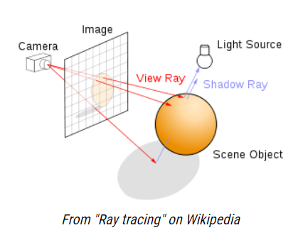
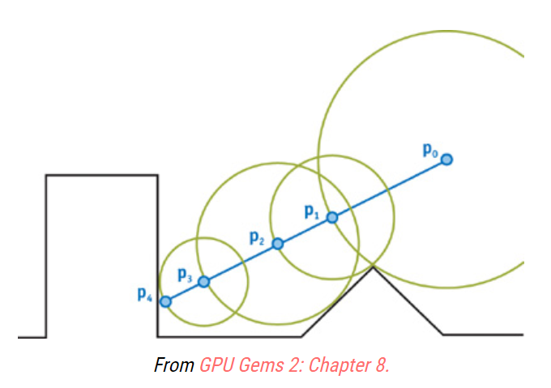
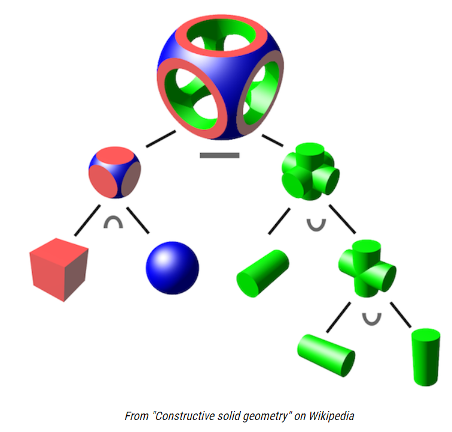
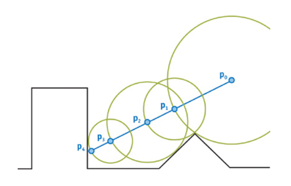

<head>
    <script src="https://cdn.mathjax.org/mathjax/latest/MathJax.js?config=TeX-AMS-MML_HTMLorMML" type="text/javascript"></script>
    <script type="text/x-mathjax-config">
        MathJax.Hub.Config({
            tex2jax: {
            skipTags: ['script', 'noscript', 'style', 'textarea', 'pre'],
            inlineMath: [['$','$'],["\\(","\\)"]]
            }
        });
    </script>
</head>

# Ray Marching and Signed Distance Functions

#### Signed Distance Functions

简称SDF，即传入空间内一个点的坐标，返回点到表面的最短距离。返回值的符号表明了这个点是否在表面的内部还是外部。例如：

有一个在原点的球体，球面内的点与原点的距离小于半径，球面上的点与原点的距离等于半径，球面外的点与原点的距离大于半径。

于是，我们第一个SDF，就拿这个在原点半径为1的球体来说，是这样的：
$$
f(x,y,z) = \sqrt{x^2+y^2+z^2}-1
$$
我们测试一些点：
$$
f(1,0,0) = 0\\
f(0,0,0.5) = -0.5\\
f(0,3,0) = 2
$$
其中(1,0,0)在表面上，(0,0,0.5)在内部，最近距离为0.5单位距离，(0,3,0)在表面的外部，与表面最近点有2个单位距离。

我们在GLSL中，方程式是向量化的，用到欧式范数，上面的SDF就成为这样：
$$
f(\vec p) = ||\vec p|| - 1
$$
翻译成GLSL语言就是

```glsl
float sphereSDF(vec3 p) {
    return length(p) - 1.0;
}
```


#### The Raymarching Algorithm

当我们有一个为SDF建模的东西，我们该如何渲染它？这就是Ray Marching算法的作用。

就像在光线追踪中一样，我们为摄像机选择一个位置，在它前面放置一个网格，从摄像机发射光线通过网格中的每个点，每个网格点对应于输出图像中的一个像素



不同之处在于场景是如何定义的，这反过来改变了我们寻找视图射线和场景之间的交集的选项。

在光线追踪中，场景通常是根据明确的几何图形定义的:三角形、球体等。为了找到视点射线和场景之间的交点，我们做了一系列的几何交点测试：如果有的话，这条射线和这个三角形相交在哪里？这个怎么样？这个球面呢？

*注: 对于光线跟踪的教程，查看 [scratchapixel.com](http://www.scratchapixel.com/lessons/3d-basic-rendering/introduction-to-ray-tracing/how-does-it-work). 如果你之前从未了解过光追, 文章剩下的部分会有点棘手.*

在ray marching中，整个场景都是用带符号的距离函数定义的。为了找到视点射线和场景之间的交集，我们从摄像机开始，沿着视点射线一点一点地移动一个点。在每一步，我们都要问“这个点在场景表面内吗?”，或者换句话说，“此时SDF的值是负数吗?”如果是的话，我们就完成了！我们触及到一些东西。如果不是，我们继续沿着射线走直到最大步数。

```glsl
vec3 rayDirection(float fieldOfView, vec2 size, vec2 fragCoord) {
    vec2 xy = fragCoord - size / 2.0;
    float z = size.y / tan(radians(fieldOfView) / 2.0);
    return normalize(vec3(xy, -z));
}
```

我们可以每次沿着视图射线（view ray）只增加一个非常小的一步，但我们可以做得更好（在速度和精度方面）使用“球体跟踪”。我们没有采取一小步，而是采取我们知道是安全的最大一步，而不穿过表面：我们用最短距离一步走到表面，这是SDF提供给我们的！



在这个示意图中，$p_0$是相机，蓝色的线沿着从摄像机投射到视图平面的光线方向。迈出的第一步相当大，它以最短的距离到达表面。因为表面上最接近p_0的点不在视图射线（view ray）上，我们一直走最后到达表面的p_4处。

在GLSL中实现，这个Ray Marching 算法看上去是这样的：

```glsl
float depth = start;
for (int i = 0; i < MAX_MARCHING_STEPS; i++) {
    float dist = sceneSDF(eye + depth * viewRayDirection);
    if (dist < EPSILON) {
        // We're inside the scene surface!
        return depth;
    }
    // Move along the view ray
    depth += dist;

    if (depth >= end) {
        // Gone too far; give up
        return end;
    }
}
return end;
```

结合一些代码来选择适当的视图射线方向，球体的SDF，并使表面的任何部分被击中为红色，我们得到了这个 [shader](https://www.shadertoy.com/view/llt3R4)

#### Surface Normals and Lighting

计算机图形学中的大多数光照模型使用一些表面法线的概念来计算一个材质在表面上的一个给定点应该是什么颜色。当表面由显式几何定义时，比如多边形，通常为每个顶点指定法线，并且可以通过插值周围的顶点法线来找到面上任何给定点的法线。

那么我们如何找到一个由带符号的距离函数定义的场景的表面法线呢？我们采取**梯度**！函数$f$在点$(x,y,z)$的梯度会告诉你，从$(x,y,z)$向哪个方向移动会使$f$的值增长最快，这就是曲面法向量。

直观上看，对于曲面上的一点，$f$(我们的SDF)值为0。在这个表面的内部，$f$是负的，在外面，它是正的。所以在曲面上，最快速地从负到正的方向与曲面正交。

这个$f(x,y,z)$的梯度会被写作$\nabla f$，它是这样计算的：
$$
\nabla f = (\frac{\partial f}{\partial x},\frac{\partial f}{\partial y},\frac{\partial f}{\partial z})
$$
但没必要在这里进行微积分运算。我们不用求函数的实导数，而是通过对曲面上的点进行采样来进行逼近，就像我们在学习求导之前学习过的计算函数斜率的方法一样。
$$
\vec n = \begin{bmatrix}
f(x+\epsilon ,y,z)-f(x-\epsilon ,y,z)\\
f(x,y+\epsilon ,z)-f(x,y-\epsilon ,z)\\
f(x,y,z+\epsilon)-f(x,y,z-\epsilon)\\
\end{bmatrix}
$$

```glsl
/**
 * Using the gradient of the SDF, estimate the normal on the surface at point p.
 */
vec3 estimateNormal(vec3 p) {
    return normalize(vec3(
        sceneSDF(vec3(p.x + EPSILON, p.y, p.z)) - sceneSDF(vec3(p.x - EPSILON, p.y, p.z)),
        sceneSDF(vec3(p.x, p.y + EPSILON, p.z)) - sceneSDF(vec3(p.x, p.y - EPSILON, p.z)),
        sceneSDF(vec3(p.x, p.y, p.z  + EPSILON)) - sceneSDF(vec3(p.x, p.y, p.z - EPSILON))
    ));
}
```

有了这些知识，我们可以计算出表面上任何一点的法线，并使用它来应用来自两盏灯的Phong reflection模型的光线，我们得到如下 [shader](https://www.shadertoy.com/view/lt33z7)。

#### Moving the Camera

我不会在此停留太久，因为这种解决方案并不是ray marching独有的。就像在光线追踪（ray tracing）中一样，对于摄像机上的转换，你通过transformation矩阵来转换视图射线从而定位和旋转摄像机。如果你不知道这是什么意思，您可以在scratchapixel.com上学习光线追踪教程，或者在codinglabs.net上查看这篇博客文章。

通过一系列的平移和旋转来确定相机的方向并不总是那么直观。一种更好的思考方式是“我想让相机在这一点，看着另一点。”这正是gluLookAt在OpenGL中的作用。

在着色器内部，我们不能使用这个函数，但是我们可以运行man gluLookAt函数来查看man的页面，看看它是如何计算自己的转换矩阵的，然后在GLSL中创建我们自己的转换矩阵。

```glsl
/**
 * Return a transformation matrix that will transform a ray from view space
 * to world coordinates, given the eye point, the camera target, and an up vector.
 *
 * This assumes that the center of the camera is aligned with the negative z axis in
 * view space when calculating the ray marching direction.
 */
mat4 viewMatrix(vec3 eye, vec3 center, vec3 up) {
	vec3 f = normalize(center - eye);
	vec3 s = normalize(cross(f, up));
	vec3 u = cross(s, f);
	return mat4(
		vec4(s, 0.0),
		vec4(u, 0.0),
		vec4(-f, 0.0),
		vec4(0.0, 0.0, 0.0, 1)
	);
}
```

因为球体从各个角度看都是一样的，所以我在这里换成一个立方体。将摄像机放置在(8,5,7)并使用我们新的viewMatrix函数将其指向原点，现在我们有了这样的结果 [shader](https://www.shadertoy.com/view/Xtd3z7)

#### Constructive Solid Geometry

构造立体几何，或简称CSG，是一种通过布尔运算从简单的几何形状创建复杂几何形状的方法。这张来自维基百科的图表显示了这项技术的可能性：



[^上图]: CSG is built on 3 primitive operations: intersection ( ∩ ), union ( ∪ ), and difference ( − ).

当将两个表示为SDFs的表面组合起来时，这些操作都可以简明地表达出来。

```glsl
float intersectSDF(float distA, float distB) {
    return max(distA, distB);
}

float unionSDF(float distA, float distB) {
    return min(distA, distB);
}

float differenceSDF(float distA, float distB) {
    return max(distA, -distB);
}
```

如果你设置一个这样的场景：

```glsl
float sceneSDF(vec3 samplePoint) {
    float sphereDist = sphereSDF(samplePoint / 1.2) * 1.2;
    float cubeDist = cubeSDF(samplePoint) * 1.2;
    return intersectSDF(cubeDist, sphereDist);
}
```

你可以得到像这样的一个 [shader](https://www.shadertoy.com/view/MttGz7) 。

考虑这些二元操作产生的SDF是很有趣的，试图建立一种直觉来解释为什么它们是有效的。
$$
\begin{eqnarray}
sceneSDF(\vec p) &=& intersectSDF(cube(\vec p),sphere(\vec p))\\
&=& max(cube(\vec p),sphere(\vec p))     
\end{eqnarray}
$$
记住，SDF为负的区域表示表面的内部，对于上面的交集$sceneSDF$ ,只有当$cube(\vec p)$ 和 $sphere(\vec p)$都为负时，$sceneSDF$为负。这意味着我们只考虑场景表面内的一个点，是否它同时在立方体和球体内。**这就是CSG交集的定义**！

同样的逻辑也适用于并集。如果其中任何一个函数是负的，产生的场景SDF将是负的，因此认为在表面内部。
$$
\begin{eqnarray}
sceneSDF(\vec p) &=& unionSDF(cube(\vec p),sphere(\vec p))\\
&=& min(cube(\vec p),sphere(\vec p))     
\end{eqnarray}
$$
差分操作是最棘手的：
$$
\begin{eqnarray}
sceneSDF(\vec p) &=& differenceSDF(cube(\vec p),sphere(\vec p))\\
&=& max(cube(\vec p),-sphere(\vec p))     
\end{eqnarray}
$$
如果你再想想正的和负的SDF是什么意思，你会发现负的SDF是一个表面内外的反转。所有被考虑在内的表面现在被考虑在外面，反之亦然。

这意味着可以将差值考虑为第一个SDF和第二个SDF的反的交点。因此，只有当第一个SDF是负的，而第二个SDF是正的，所产生的场景SDF才是负的。

换成几何术语来说，这意味着当且仅当我们在第一个表面内而在第二个表面外时，我们就在场景表面内——**这正是CSG差分的定义**！

#### Model Transformations

能够移动摄像机给了我们一些灵活性，但是能够独立地移动场景的各个部分当然给了我们更多。让我们来探索一下如何做到这一点。

##### Rotation and Translation

要平移或旋转建模为SDF的表面，可以在计算SDF之前对该点应用逆变换。

就像你可以对不同的网格应用不同的转换一样，你也可以对SDF的不同部分应用不同的转换——只需要将转换后的光线发送到你感兴趣的SDF部分。例如，让立方体上下波动，保持球体的位置，但仍然取交集，你可以这样做：完整 [shader](https://www.shadertoy.com/view/XtcGWn) 在这里

```glsl
float sceneSDF(vec3 samplePoint) {
    float sphereDist = sphereSDF(samplePoint / 1.2) * 1.2;
    float cubeDist = cubeSDF(samplePoint + vec3(0.0, sin(iGlobalTime), 0.0));
    return intersectSDF(cubeDist, sphereDist);
}
```

如果你做这样的变换，得到的函数仍然是带符号的距离场吗？对于旋转和平移，它是，因为它们是“刚体变换”，意味着它们保持点之间的距离。

通俗的来说，你可以通过将采样点乘以变换矩阵的逆来应用任意刚体变换。

例如，你想应用一个旋转矩阵，你可以这样做：

```glsl
mat4 rotateY(float theta) {
    float c = cos(theta);
    float s = sin(theta);

    return mat4(
        vec4(c, 0, s, 0),
        vec4(0, 1, 0, 0),
        vec4(-s, 0, c, 0),
        vec4(0, 0, 0, 1)
    );
}

float sceneSDF(vec3 samplePoint) {
    float sphereDist = sphereSDF(samplePoint / 1.2) * 1.2;
    vec3 cubePoint = (invert(rotateY(iGlobalTime)) * vec4(samplePoint, 1.0)).xyz;
    float cubeDist = cubeSDF(cubePoint);
    return intersectSDF(cubeDist, sphereDist);
}

```

但是，在GLSL中是没有 invert 函数的，写的时候要注意一下。

这里可以了解更多[矩阵变换](http://web.cs.wpi.edu/~emmanuel/courses/cs543/slides/lecture04_p1.pdf)的内容。

##### Uniform Scaling

好了，让我们回到这个我们之前忽略的奇怪的缩放技巧：

```glsl
float sphereDist = sphereSDF(samplePoint / 1.2) * 1.2;
```

除以1.2就是要把球体放大1.2倍(记住，在把它发送到SDF之前，我们对这个点进行了逆变换)，但是为什么之后要再乘以比例因子呢？为了简单起见，让我们检查一下将大小加倍的情况。

```glsl
float sphereDist = sphereSDF(samplePoint / 2) * 2;
```

缩放不是一个刚体变换——它不能保持点之间的距离。如果我们将(0,0,1)和(0,0,2)除以2进行变换（这将导致模型的统一缩放），那么点之间的距离将从1切换到0.5。

所以当我们在*sphereSDF*中对缩放后的点进行采样时，我们最终得到的距离是这个点到“变换后球面”距离的一半。最后的乘法是为了补偿这种失真。

有趣的是，如果我们在着色器中尝试这一点，并且不使用比例校正，或者使用更小的比例校正值，完全相同的东西会被渲染出来。为什么？

```glsl
// All of the following result in an equivalent image
float sphereDist = sphereSDF(samplePoint / 2) * 2;
float sphereDist = sphereSDF(samplePoint / 2);
float sphereDist = sphereSDF(samplePoint / 2) * 0.5;
```

注意，不管我们如何缩放SDF，返回距离的符号保持不变。“signed distance field”中的符号部分还在工作，但是距离部分已经失效了。

要知道为什么这是一个问题，我们需要重新检查射线行进算法是如何工作的。



回想一下，在射线行进算法的每一步，我们都希望沿着视图射线移动一个距离等于到表面的最短距离。我们预测使用SDF的最短距离。为了让算法更快，我们希望这些步骤尽可能大，但如果我们没有达到预期，算法仍然有效，只是需要更多的迭代。

但如果我们高估了距离，我们就会遇到真正的问题。如果我们试着缩小模型没有修正，像这样：

```glsl
float sphereDist = sphereSDF(samplePoint / 0.5);
```

然后球体就完全消失了。如果我们高估了距离，我们的射线行进算法可能会穿过表面，永远找不到它。

对于任何SDF，我们都可以安全地将其均匀缩放如下：

```glsl
float dist = someSDF(samplePoint / scalingFactor) * scalingFactor;
```

#### Non-uniform scaling and beyond

如果我们想要非均匀地缩放一个模型，我们如何才能安全地避免上文缩放部分中描述的距离过高估计问题？与均匀缩放法不同，我们不能准确地补偿变换引起的距离失真。这在均匀缩放中是可能的，因为所有的维度都是一样缩放的，所以不管表面上离采样点最近的点在哪里，缩放补偿都是一样的。

但对于非均匀缩放，我们需要知道表面上最近的点在哪里，然后知道修正距离的大小。

要了解为什么会这样，考虑单位球的SDF，沿x轴缩放为它的一半大小，保留它的其他尺寸。
$$
f(x,y,z) = \sqrt{(2x)^2+y^2+z^2}-1
$$
如果我们计算SDF在(0,2,0)处的值，我们得到一个单位的距离。这是正确的：球面上最近的点是(0,1,0)。但是如果在(2,0,0)处计算，我们得到3个单位的距离，这是不对的。表面上最近的点是(0.5,0,0)，产生的世界坐标距离为1.5个单位。

因为通常低估距离是可以的，我们可以乘以最小的比例因子，像这样：

```glsl
float dist = someSDF(samplePoint / vec3(s_x, s_y, s_z)) * min(s_x, min(s_y, s_z));
```

其他非刚性变换的原理是一样的：只要变换的符号保持不变，你只需要找出一些补偿因子来确保你不会高估到曲面的距离。

#### Putting it all together

使用本文中的原语，你现在可以创建一些非常有趣、复杂的场景。将这些元素与使用法向量作为环境/漫反射材质的简单技巧结合起来，你就可以在文章的开头创建一些类似于着色器的东西。再来一个 [shader](https://www.shadertoy.com/view/4tcGDr) 案例。

#### References


