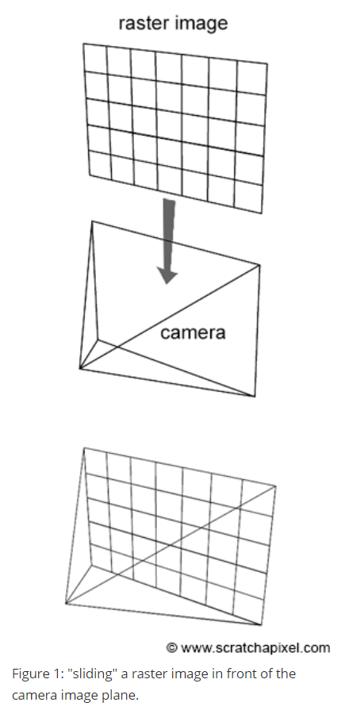
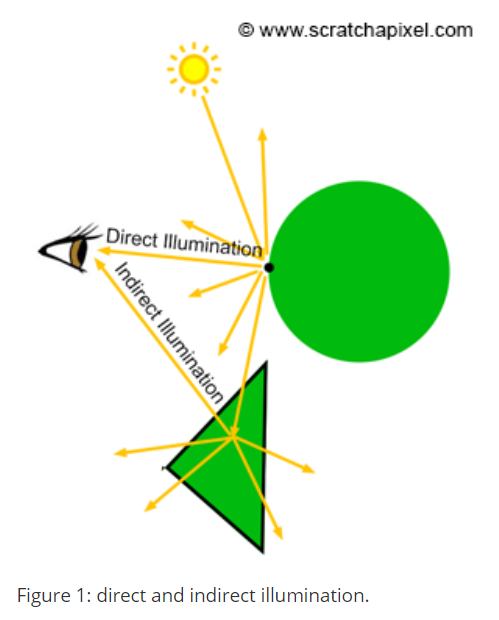

<head>
    <script src="https://cdn.mathjax.org/mathjax/latest/MathJax.js?config=TeX-AMS-MML_HTMLorMML" type="text/javascript"></script>
    <script type="text/x-mathjax-config">
        MathJax.Hub.Config({
            tex2jax: {
            skipTags: ['script', 'noscript', 'style', 'textarea', 'pre'],
            inlineMath: [['$','$'],["\\(","\\)"]]
            }
        });
    </script>
</head>
# Ray Tracing

#### An Overview of the Ray-Tracing Rendering Technique

光线追踪是一种计算点间可见性的技术。光传输算法被设计用来模拟光通过空间传播的方式(当与物体相互作用时)。它们被用来(简而言之)计算场景中一个点的颜色。不要把光线跟踪和光传输算法混在一起。这是两码事。光线追踪不是光传输算法。它只是一种计算点之间可见性的技术。

[^visibility]: 给定欧几里得空间中的一组障碍物，如果连接它们的线段不与任何障碍物相交，则空间中的两点对彼此来说是可见的。

##### An Overview on the Ray-Tracing Rendering Technique

在本节的第一课中，我们已经快速地向您介绍了渲染的一般概念，特别是如何使用光线追踪生成3D场景的图像。我们已经提到了射线追踪技术等技术课程“呈现一个3D场景的图像”和“光栅化：一个实际的实现”，但这些课程的目的是更多的强调光栅化和射线追踪技术之间的差异，这是主要的两个常见的框架（或渲染技术）渲染3D对象的图像。

我们要不要再一次介绍光线追踪渲染技术？您应该已经熟悉了概念，但这一课是第一个在系列中，我们将研究技术，针对文中似乎“复习一遍提到的方法是什么”确实是一个好主意，它是如何工作的，该技术的基本原理，光线追踪和光栅化之间的最大的差异是什么。

光线追踪是关于光线的，光线是本课的主要主题之一。我们将学习它们是什么以及如何在编程中定义它们。正如我们现在所知道的，**光栅图像**是由像素组成的。生成3D场景图像的一种方法是，实际上以某种方式沿着虚拟摄像机的图像平面“滑动”该栅格图像(图1)，并通过图像中的每个像素发射射线，以查找每个像素覆盖的场景的哪个部分。我们的方法是简单地从眼睛(摄像机位置)投射光线，并通过每个像素的中心。然后我们从场景中找到什么物体(或物体)，这些光线相交。如果一个像素“看到”了某样东西，那么它肯定看到了它正前方光线所指向的那个物体。正如我们刚才提到的，光线方向可以简单地通过追踪一条从摄像机原点到像素中心的线，然后将这条线延伸到场景中来构建(图2)。




现在我们知道了一个像素看到了什么，我们所需要做的就是对图像中的每个像素重复这个过程。通过设置像素颜色与物体的颜色，每条光线通过每个像素的中心相交，然后我们可以形成从一个特定的视点看到的场景的图像。注意，该方法需要循环图像中的所有像素，并为每个像素向场景中投射一束光线。第二步，交叉步骤，需要对场景中的所有对象进行循环，以测试一条射线是否与这些对象相交。下面是这个技术在伪代码中的一个实现：

```c
// loop over all pixels
Vec3f *framebuffer = new Vec3f[imageWidth * imageHeight]; 
for (int j = 0; j < imageHeight; ++j) { 
    for (int i = 0; i < imageWidth; ++i) { 
        for (int k = 0; k < numObjectsInScene; ++k) { 
            Ray ray = buildCameraRay(i, j); 
            if (intersect(ray, objects[k]) { 
                // do complex shading here but for now basic (just constant color)
                framebuffer[j * imageWidth + i] = objects[k].color; 
            } 
            else { 
                // or don't do anything and leave it black
                framebuffer[j * imageWidth + i] = backgroundColor; 
            } 
        } 
    } 
} 
```

注意，有些射线可能根本不与任何几何图形相交。例如，如果你看图2，其中一条光线不相交于球面。在这个特殊的例子中，我们通常将像素的颜色保持为黑色，或者将其设置为我们希望背景为的任何其他颜色(第10行)。

还请注意，在上面的代码中，我们在交点用对象颜色设置像素颜色。尽管现实世界中的物体看起来不是平的。它们有复杂的外观（例如，在绘画中很难令人信服地再现——这是因为物体的外观通常在视觉上非常复杂）。它们的亮度根据接收到的光量而变化，有些是闪亮的，有些是哑光的，等等。真实感渲染的目的不仅是准确地描绘给定视点上的几何图形（并解决可视性问题），而且要逼真地模拟物体的外观。因此，这个过程很可能涉及比仅仅返回一个常量颜色（这是我们在上面的代码中所做的）更复杂的事情。在计算机图形学中，定义的任务对象的实际颜色在**任何给定在其表面的点**（知道这个颜色变化根据我们刚才说等外部参数有多少光物体接收我们所有内部参数例如是物体有怎样的的光泽感或物质）被称为**着色**（shading）。在我们开始学习着色之前，这将需要更多的课程，但是在这个阶段，你了解它是很重要的。


射线追踪据说是以**图像为中心的**。外部循环遍历图像中的所有像素，而内部循环遍历场景中的对象。相比之下，光栅化算法是以对象为中心的。它需要循环遍历场景中的所有几何图元(外部循环)，将这些图元投影到屏幕上，然后循环遍历图像中的所有像素，以找到这些像素中哪一个与屏幕投影几何图形重叠(内部循环)。两种算法的内循环和外循环是交换的。下面是伪代码中对光栅化循环的快速实现(您可以在“光栅化课程：一个实际实现”中找到对该算法的完整描述)。

```c
Vec3f *framebuffer = new Vec3f[imageWidth * imageHeight]; 
for (int k = 0; k < numObjectsInScene; ++k) { 
    // project object onto the scene using perspective projection
    ... 
    for (int j = 0; j < imageHeight; ++j) { 
        for (int i = 0; i < imageWidth; ++i) { 
            if (pixelCoversGeometry(i, j, objects[k]) { 
                framebuffer[j * imageWidth + i] = objects[k].color; 
            } 
        } 
    } 
} 
```

正如在前面的课程中多次提到的，栅格化和光线跟踪都可以用来解决可见性问题。但是请记住，渲染过程是一个两个步骤的过程:它包括可视性和着色。栅格化对可见性很好(而且比光线追踪快得多)，但在着色方面不如光线追踪好。另一方面，光线跟踪可以用于这两种情况。

要解释的内容是渲染的核心，所以花点时间仔细阅读它。通常你会读到光线追踪比光栅化有更好的阴影，但大多数教科书没有解释为什么。(几乎)渲染的一切都是关于计算空间中一点和给定方向上第一个可见表面之间的可见性，或者两点之间的可见性。前者用于解决可见性问题，后者用于解决诸如阴影等问题。栅格化(结合深度缓冲算法)在寻找第一个可见表面方面效果很好，但在解决两点之间的可见性方面效率低下。而另一端的光线跟踪，可以有效地处理这两种情况。找到第一个可见表面有助于解决可见性问题。因此光线追踪和光栅化在这方面都做得很好。另一方面，着色要求解决表面之间的可见性。它用于计算阴影，使用区域光时的软阴影，以及更普遍的全局照明效果，如反射、折射、间接反射和间接漫反射。对于渲染过程的这个特殊部分，光线跟踪因此比光栅化更有效。但是请记住，任何计算点之间可见性的技术都可以用于着色和解决可见性问题。它不需要光线跟踪或者光栅化，但是光线跟踪是一种偷懒的方法，尽管它会付出代价，我们将在本章的最后看到。我们将在下一章讨论光传输算法时再回来讨论这个重要的概念。


从这个角度看，光线追踪听起来比栅格化要好得多，不过光线追踪的主要问题是它需要计算光线与几何图形的交点，这是一个代价昂贵的操作(即速度慢)。在实时图形应用中，速度比照片真实感更重要，这就是gpu使用光栅化的原因。当照片真实性比速度更重要时，光线追踪是一个更好的选择，尽管在交互式帧率下光线追踪更难产生图像，在实时帧率下甚至更不容易。

>  "Ray tracing isn't too slow; computers are too slow." (Kajiya 1986)
>

综上所述，使用光线追踪计算三维物体的真实感图像基本上可以分解为三个步骤：

- 投射光线：为图像中的每个像素投射一条光线射线
- 几何交叉：测试光线是否与场景中的任何一个物体相交(这需要对每个投射光线的所有物体进行循环)。
- 着色：找出物体在光线和物体交点处的“样子”(如果发生了交点)。

现在让我们逐一回顾这些步骤。

#### Casting Rays into the scene

为了在光线追踪中创建图像，我们需要做的第一件事是为图像中的每个像素投射光线。这些光线被称为**相机**或**主光线**(因为它们是我们将投射到场景中的第一道光线)。正如我们将在本课后面看到的，更多的射线可以从初级射线产生。这些其他的射线被称为**次级射线**。它们被用来发现场景中的一个给定点是否在阴影中，或者用来计算着色效果，比如反射或折射。当一个主射线投射到场景中时，下一步是找出它是否与场景中的任何物体相交。

当使用主射线来解决可见性问题时，我们可以使用术语**射线投射（ray-casting）**。

生成主射线或照相机射线是下一课的主题。

#### Testing for Ray-Geometry Intersections

测试光线是否与场景中的任何对象相交，需要对场景中的所有对象进行循环，并针对光线测试当前对象。

```c
Ray ray = buildCameraRay(i, j); 
for (int k = 0; k < numObjects; ++k) { 
    if (intersect(ray, objects[k]) { 
        // this ray intersects objects[k]
    } 
} 
```

三维几何可以用许多不同的方式定义。简单的形状，如球体、圆盘、平面，可以用数学或参数法定义。更复杂的物体的形状只能用多边形网格、细分曲面或NURBS曲面(或类似的东西)来描述。

第一类对象(用数学表示的对象)通常可以用几何或分析方法测试射线交点。例如，射线-球面交叉测试可以用这两种方法来解决。这是“光线跟踪:呈现简单形状”这一课的主题。

第二类对象的主要问题是需要为每种受支持的曲面类型实现射线几何交叉方法。例如NURBS表面可以直接通过射线追踪，尽管这样做的解决方案与用于测试射线和多边形网格之间的交点的解决方案是非常不同的。因此，如果你想支持所有的几何类型(细分曲面，NURBS，多边形网格)，你需要为每个支持的几何类型编写一个射线几何相交例程。这可能会给程序代码增加相当复杂程度。另一种解决方案(几乎所有专业程序都选择这种方法)是将每种几何类型转换为相同的内部表示，在几乎99%的情况下，将是一个三角多边形网格。光线跟踪喜爱三角形!

为什么三角形？首先，将不同的几何类型转换为相同的内部几何表示（这个过程也称为镶嵌（tessellation））是一种更好的方法，而且将几乎任何类型的表面转换为多边形网格通常都很容易。从那里，将一个多边形网格转换为三角网格也非常简单(唯一的困难是凹多边形)。虽然三角形也是有利的，因为它们可以作为一个基本的几何原语在光线跟踪和光栅化。为什么两种算法都喜欢三角形是因为它们有其他算法没有的有趣的几何属性。它们是共面的，这并不一定是有三个以上顶点的面。使用我们在栅格化课程中描述的边缘函数方法计算它们的质心坐标也很简单。重心坐标在着色处理中起着重要的作用。

由于这个原因，很多研究都在寻找最好的方法来测试一条射线是否与一个三角形相交。这个问题可以用几何方法解决，但这未必是最快的方法。随着时间的推移，其他使用代数解的方法也得到了发展。一个好的射线三角交例程是既快速又数值稳定的。这个主题将在射线追踪:绘制三角形这一课中进行研究。

多边形网格或其他类型的表面因此被转换成三角形。这可以在你将几何图形加载到程序的内存之前完成（在你的建模工具中，在你将网格导出到渲染器之前），或者在渲染时加载几何图形时完成。我们将在本系列课程中使用第二种选择。注意，现在不仅每个摄像机光线需要针对场景中的每个物体进行测试，还需要针对场景中每个组成多边形物体的三角形进行测试。换句话说，循环现在看起来如下：

```c
for (int j = 0; j < imageHeight; ++j) { 
    for (int i = 0; i < imageWidth; ++i) { 
        for (int k = 0; k < numObjects; ++k) { 
            for (int n = 0; n < objects[k].numTriangles; ++n) { 
                Ray ray = buildCameraRay(i, j); 
                if (intersect(ray, objects[k].triangles[n])) { 
                    framebuffer[j * imageWidth + i] = shade(ray, objects[k], n); 
                } 
            } 
        } 
    } 
} 
```

这实际上意味着，在光线追踪中渲染场景所花费的时间与场景中包含的三角形数成正比。而光栅化则不一定如此。当然，光栅化器中三角形越多，渲染帧所花费的时间就越长，尽管很多三角形在渲染开始之前就会被丢弃（比如背对着相机的三角形，如果启用了后面剔除）。这在光线追踪中是不可能的，原因我们将在本章的着色部分解释。所有三角形都需要存储在内存中，当光线投射到场景中时，每个三角形都需要被测试。光线追踪的高计算成本（以及渲染时间随着场景中包含的三角形数量线性增长）是该算法的主要缺点之一。

##### The Trace Function

在光线追踪中，内部循环（遍历每个对象包含的所有对象和所有三角形）通常被移动到一个通常称为trace()的函数中。如果一个对象/三角形被检测到，函数返回true，否则返回false。

```c
bool trace( 
    const Vec3f& rayOrigin, const Vec3f &rayDirection, 
    const Object* objects, const uint32_t &numObjects, 
    uint32_t &objectIndex, 
    uint32_t &triangleIndex 
) 
{ 
    bool intersect = false; 
    for (uint32_t k = 0; k < numObjects; ++k) { 
        for (uint32_t n = 0; n < objects[k].numTriangles; ++n)) { 
            if (rayTriangleIntersect(rayOrigin, rayDirection, objects[k].triangles[n]) { 
                intersect |= true; 
                objectIndex = k; 
                triangleIndex = n; 
            } 
        } 
    } 
 
    return intersect; 
} 
 
int main(...) 
{ 
    ... 
    uint32_t objectIndeix, triangleIndex; 
    for (int j = 0; j < imageHeight; ++j) { 
        for (int i = 0; i < imageWidth; ++i) { 
            if (trace(rayOrigin, rayDirection,   objects, numObjects, objectIndex, triangleIndex)) { 
                framebuffer[j * imageWidth + i] = shade(rayOrigin, rayDirection, objects[objectIndex], triangleIndex); 
            } 
        } 
    } 
    ... 
   return 0; 
} 
```

正如您在图6中看到的，一条射线可能与几个三角形相交。在光栅化中，我们使用深度缓冲区来解决这个问题。在射线跟踪中，我们通过在trace()函数中创建一个变量来解决这个问题，该变量在迭代遍历对象的三角形时跟踪射线原点和交点之间的最近距离。当找到一个交点时，就用这个变量(我们叫它$t_{nearest}$)来测试到三角形的距离$t$，这个变量最初被设置为无穷大(一个非常大的数字)。如果$t$小于$t_{nearest}$然后$t_{nearest}$被设置为$t$。最后,当所有的三角形的所有对象都被测试了，$t_{nearest}$包含了射线距离最近的三角形测试的如果任何（我们需要再次访问这个三角形在着色阶段，所以我们还存储一些关于三角形的信息，例如它属于哪个对象以及其在对象中的三角形列表的索引）。


[^]: 我们将在下一课中更详细地讨论射线，尽管我们假设射线是由它的原点和它的(标准化)方向定义的。距离t定义了从射线上一点到射线原点的距离。此点在光线上的3D位置可以使用以下代码找到：Vec3f P = rayOrigin + t * rayDirection​;

```c
 bool trace( 
    const Vec3f& rayOrigin, const Vec3f &rayDirection, 
    const Object* objects, const uint32_t &numObjects, 
    uint32_t &objectIndex, 
    uint32_t &triangleIndex, 
    float &tNearest 
) 
{ 
    tNearest = INFINITY; // initialize to infinity 
    bool intersect = false; 
    for (uint32_t k = 0; k < numObjects; ++k) { 
        for (uint32_t n = 0; n < objects[k].numTriangles; ++n) { 
            float t; 
            if (rayTriangleIntersect(rayOrigin, rayDirection, objects[k].triangles[n], t) && t < tNearest) { 
                objectIndex = k; 
                triangleIndex = n; 
                tNearest = t; // update tNearest with the distance to the closest intersect point found so far 
                intersect |= true; 
            } 
        } 
    } 
 
    return intersect; 
} 
```

在阴影阶段，我们将需要访问一些信息拓扑曲面的交点，如交点的位置本身（通常表示**P**）,而且交点所处的表面的法线（表面取向通常表示**N**）以及它的纹理坐标（**st**或**uv**坐标）。可能还需要其他的量，如在交点处的曲面导数，但这是一个高级的话题。在交点处找到曲面的法线通常很简单。对于三角形，我们只需要计算相交三角形的两条边的叉积。对于球面，如果我们知道球心的位置我们称它为C，我们只需要计算向量$||p-c||$。关于这个主题的更多信息可以在下一课中找到。


#### Shading

尽管与光栅化等其他方法相比，光线跟踪具有较高的计算成本，但它也具有比其他渲染技术更吸引人的优势。当涉及到着色时尤其如此。

一旦我们找到了一条射线与之相交的物体，我们就需要找出这个物体在交点处的颜色。物体的颜色或强度通常在任何物体的表面上都有很大的不同。这是由于光线的变化以及物体的纹理在其表面上的变化。物体在其表面上任何一点的颜色“仅仅”是物体返回或反射其表面撞击到观察者的光的方式的结果。交点的颜色取决于：

- 有多少光（在现实世界中，光的颜色和强度的概念实际上是相同的）撞击到物体表面上（如果表面是透明的或半透明的，那么在交点上也在远离点的地方，但这是一个高级的话题）。
- 光的方向
- 表面本身的性质，特别是它的颜色。
- 观察者的位置。大多数表面在各个方向上反射光线并不均匀。因此，反射光的数量可能随相机或观察者的位置而改变。


我们将详细回顾这个过程细节当在着色的课程时。现在，我们想让你注意的是，除了物体的属性（比如它的颜色）之外，着色与“收集”物体表面上的光线信息有很大关系。在自然界中,这个过程可以被描述为“光线”从光源发出（或间接通过其他表面的场景反映了光源的光线向其他表面,这一过程称为间接照明）,物体表面的下降和被反射回现场。有些反射的光线会照射到更多的表面，然后再依次反射。其他光线，可能到达观察者的眼睛或相机。在现实世界的话,光从光源到眼(图8)。尽管在文中我们通常选择的路径跟踪光线从眼睛到表面,然后从表面到光源,一个过程我们称之为逆向追踪（**backward tracing**），因为它遵循自然的向后传播的光(图9)。

[^]: 在一种明显的光线追踪方法中，光源发出的光线通过它们的路径被追踪，直到它们击中观察者。因为只有少数会到达观众，这种方法是浪费。在由Appel建议的第二种方法中，光线在相反的方向被追踪——从观察者到场景中的物体。一个改进的照明模型的阴影显示。Turner Whitted, 1980

我们不会在本章或本课中解释着色是如何工作的，尽管我们会在下一章中提供一些关于光传输算法的信息。光传输算法的功能是模拟光（以能量的形式）在场景中的分布方式。给定的材料如何将光线反射回环境中，是由数学模型定义的，或者是计算机图形学中的**照明模型**（如果你之前听说过术语BRDF，这或多或少就是BRDF的作用）Phong模型(众所周知)就是照明模型的一个例子。照明模型通常用着色器来实现。着色器通常实现为某种函数，作为输入参数入射光方向$ω_i$(希腊字母omega)和强度，看着材料是的方向$ω_0$,并返回基于所使用的材料特性和光照模型，入射光在该方向上的反射量$ω_0$。


同样，现在不要太担心着色，光传输算法，着色器，BRDFs和照明模型。所有这些概念将在着色课程中详细解释。在本课的上下文中，需要注意的是，着色涉及到模拟光能在场景中分布的方式。看待这个问题最自然的一种方式，就是从光线的角度。例如，我们可能想要沿着光源发出的光线的路径，然后通过漫反射物体反射到镜子，最后通过镜子反射到眼睛。因为在CG中，我们更喜欢使用反向追踪，我们实际上会沿着光线的路径反向移动。我们将追踪一束光线从眼睛到镜子，然后投射一束反射光（反射光的方向可以很容易地计算使用众所周知的反射定律，我们将在着色课程中学习）。这条射线会与漫射物体相交。我们将最终从漫射物体投射光线到光。我们投射在主光线之后的所有光线(从镜子表面到漫反射物体的光线和从漫反射物体到光线的光线)都被称为**次级光线**。次级光线通常有自己的名称:例如，从镜子投射的光线称为**反射光线**，投射到光线上的光线称为**阴影光线**。这条射线的主要目的，是发现漫反射物体上的点是否在光的阴影中（如果阴影射线在它到光的路上与一个物体相交，那么点在阴影中）。


请注意，每一条次级射线都涉及到计算两点之间的能见度。例如，当我们从镜子投射一条反射光线到场景中时，我们想要计算反射光线最终将相交的第一个可见表面(在我们的例子中是漫反射物体)。当我们投射一个阴影射线时，我们想要知道这个阴影射线在到达光之前是否与另一个物体相交。**你可以猜到，计算两点之间可见性的最简单的方法当然是使用光线追踪。**

> 光线追踪向来被认为是最好的解决方案来生成照片真实感3d对象的图像,但不过记住,直到最近(1990年代末2000年代初),技术本身被认为是太昂贵的比一些研究被用于其他项目。请记住，计算机资源增加了，但正在渲染的场景的复杂性也增加了。因此，渲染这些场景所需的实际时间多年来并没有太大变化。这种效应被称为“布林定律”。 

总之，我们可以说，任何需要大量计算可见性的光传输算法（比如当反射光线或阴影光线投射到场景中时）都可能在光线追踪中更有效。Q.E.D. (*quod erat demonstrandum*，意为“必须被证明的”)。

#### Ray-Tracing: the Challenges

光线跟踪在原理上非常简单，而且“容易”实现。该过程中最复杂的部分是编写代码或例程来计算光线与物体的交点。这个问题通常用几何解或解析方案来解决，两者都需要大量的数学知识。除了数学之外，最主要的问题是计算这些交集测试通常也是一个昂贵的过程。尽管存在这个主要的缺点，但该技术在其简单性方面是优雅的，并且可以在一个统一的框架内解决可见性和着色问题。

当我们说ray-tracing很容易实现时，我们应该确切地说开发一个光线追踪产品是一项非常复杂的任务。实现一个基本的原型很简单，但要使该技术健壮，以便能在大规模生产中使用，则是一个非常具有挑战性的问题。一个成品光线跟踪需要支持许多特性，如位移，运动模糊，可编程着色，等等。许多这些特性很难在光线跟踪中有效地发挥作用。光线跟踪带来了光栅化算法所没有的一整套问题。这些问题很难有效地解决。光线追踪的一个主要问题是，在渲染图像时，它要求所有的场景几何图形都存储在内存中。这与栅格化的情况不同:一旦我们知道一个对象不会在屏幕的任何地方出现，我们就可以把它扔掉（并从内存中删除）。背对相机的三角形也可以被丢弃，如果使用背面剔除。在光线追踪中，即使一个物体在场景中是不可见的，它也可能在摄像机可见的物体上投下阴影，因此需要保存在内存中，直到图像中的最后一个像素被处理。对于包含数百万个三角形的生产场景，存储数据所需的内存数量可能会成为一个问题。

本课中提到的光线交点检测步骤是光线跟踪渲染过程中最昂贵的部分。使光线几何程序加速通常是不够的。射线追踪器使用我们所说的加速结构来加速过程。加速结构是用来在空间中“排序”几何体的空间结构，以避免每次投射光线都要测试场景中的所有对象。在渲染的介绍中不会研究加速结构，但是你会在光线追踪的高级章节中找到关于这个主题的课程。它们工作得很好，有助于加速光线追踪，但它们也使用了大量的内存，增加了存储几何图形的内存。

最后，还需要存储与对象运动相关的信息。这将进一步增加存储场景数据所需的内存量。总而言之，光线跟踪器通常比光栅化器在相同场景中使用更多的内存。光线追踪对于生成更真实的图像是有用的，但代价是比基于光栅化算法的程序更慢和使用更多的内存。该算法在概念上是简单的，但很难在具有复杂阴影的大型复杂场景上可靠和高效地工作。

#### Ray-Tracing on the GPU?

光线追踪算法在90年代中期首次成功移植到GPU上。虽然光线追踪算法还没有被大多数消费显卡本地支持（加速光线追踪的硬件已经存在了很长一段时间），但是在这个领域已经进行了大量的研究。很有可能在未来几年内GPU将会支持光线追踪。尽管如上所述，它需要克服诸如内存管理等问题，如您所知，光线跟踪是一个比光栅化更困难的问题。

------

> 射线追踪是计算机图形学中最优雅的技术之一。许多现象用其他技术困难的或是不可能的，而对于光线追踪非常简单，包括阴影，反射，折射光”。。Robert L. Cook Thomas Porter Loren Carpenter “”Distributed Ray-Tracing (1984)。
>

#### Light Transport

如第一章所述，光线追踪只是一种用于计算点间可见性的技术。它是一种简单的基于射线概念的技术，可以在数学上(以及在计算机程序中)定义为一个点(射线在空间中的原点)和一个方向。然后光线追踪背后的想法是寻找数学解决方案来计算这条光线与各种几何类型的交点：三角形、四边形(我们将在下面的课程中学习)、NURBS 等等。这就是光线跟踪的全部内容。

找出物体表面上任意一点的颜色是一个复杂的问题。物体的外观本质上是光从物体表面反弹或通过这些物体，如果它们是透明的。反射或折射等效果，是光线在通过透明表面时发生折射，或在发亮物体表面发生反射的结果。当我们看到一个物体时，我们实际上“看到”的是物体向我们眼睛的方向反射的光线。的许多射线从物体的表面反射出可能行进远离眼睛，虽然有些可能由场景中的另一个对象间接反映回到眼睛(图1)。光线被物体反射的方式实际上是一个众所周知的现象，但这不是一个着色课程，所以我们不会进入细节。在这节课中，我们想让你们知道的是，要计算物体表面上任意一点的颜色，我们实际上需要模拟光从物体表面反射的方式。在计算机图形学中，这就是我们所说的**光传输算法**的任务。我们将在下面的一些课程中详细研究光传输的概念，所以如果此时你只是了解一些皮毛也不必太担心。



我们可以通过应用光学和物理定律来模拟光在场景中的传输，这些定律描述了光与物质相互作用的方式;我们可能会得到一个非常精确的图像，但这种方法的问题是(保持非常短的时间)可能需要非常非常长的时间才能得到完美的结果，即使使用我们今天有一些最强大的计算机。这种方法根本不实用。

光线算法所做的，本质上就是在“可接受”的时间内，找到模拟各种光线场景的方法，同时提供可能的最佳视觉精度。你可以看到一个光传输算法作为解决光传输问题的**策略**（我们都知道,一些策略来解决给定问题比别人更好的策略是在一个给定的场景可能不适合在其他场景——光传输算法是完全相同的，这就是为什么他们存在的非常多）。

计算光线到达物体表面的新路径是我们已经定义好的数学模型。主要的问题是光线可能会被反射回场景中，并击中场景中另一个物体的表面。因此，如果你想模拟光线从一个表面反弹到另一个表面时的轨迹或路径，我们需要的是一个解来计算光线与表面的交点。您可以猜到，这就是光线跟踪发挥作用的地方。光线追踪当然是理想的适合计算从场景中任意给定点在任意给定方向上的第一个可见表面。相比之下，光栅化根本不适合这个任务。它可以很好地从摄像机的角度计算第一个可见表面，但不能从场景中的任意一点计算。注意，这可以通过光栅化来实现。这个过程非常低效（对这种方法感兴趣的读者可以搜索一种被称为半球或半立方体的技术，用于辐射算法），相比于计算成本很高的射线追踪。

总之，如果这些光传输算法涉及到计算表面之间的可见性，那么任何技术如光线跟踪或光栅化都可以用于此，但是，正如前面所解释的，光线跟踪在这种特殊环境中更容易使用。因此，一些最流行的光传输算法，如路径跟踪或双向路径跟踪，不可避免地与光线跟踪联系在一起。最后，这造成了一种令人困惑的情况，光线追踪实际上被理解为一种创建逼真图像的技术。它不是这样的！一个逼真的计算机生成的图像混合了光传输算法和计算表面之间的能见度的技术。因此当你考虑任何给渲染程序时,你可能会想要问自己两个问题来理解这个程序的特点是：它使用哪一个光传输算法，通常它使用什么技术来计算能见度：光栅化，射线跟踪或两种技术的混合？

正如前面提到的，现在不要太担心轻传输算法。我们想要说明的一点是，你不应该把光线追踪和实际找出场景中物体颜色的过程混在一起。我们坚持这一点，因为光线追踪通常是作为一种技术，以生产照片真实感的三维对象的图像。它不是。光传输算法的工作是模拟全局光照效果。

要深入介绍光传输算法，请阅读课程“阴影介绍:渲染方程和光传输算法”

#### Whitted Ray-Tracing


在明确了光线追踪和光传输算法的区别之后，最后介绍了一个基于光线追踪的光传输算法的经典实例。1980年，特纳在一份名为“改进的阴影显示照明模型”的Siggraph文件中首次详细介绍了这种技术。由于这个原因，该算法通常被称为Whitted(样式)射线跟踪。

在Whitted的论文发表之前，大多数程序已经能够模拟漫反射和高光表面的外观。著名的Phong照明模型（我们将在有关着色器的课程中讨论）已经为人所知。然而，模拟复杂的反射和折射还有待完成。Whitted提出利用光线追踪来解决这个问题。如果物体A是一个像镜子一样的表面，而物体B位于其上，那么我们希望看到物体B向A的反射。如果A不是一个平坦的表面，那么计算这个反射就不容易。如果B也是反射性的，事情就变得更难了。镜子的表面不断地反射自己的图像，造成电影中经常看到的“无限空间”的效果。


球面被两面镜子反射了几次后，它的影像才最终到达眼睛。那么透明对象呢?我们应该看到透明的表面，虽然材料如水或玻璃由于折射现象弯曲光线。支配反射和折射现象的光学(和物理)定律是众所周知的。反射方向只取决于表面方向和入射光的方向。折射方向可以用斯涅尔定律计算，它取决于表面的方向(表面的法线)、入射光的方向和材料的折射率(水大约为1.3，玻璃大约为1.5)。如果你知道这些参数，计算这些方向就是对反射和折射定律的直接应用，它的方程很简单。


Whitted提出利用这些定律计算光线在反射或透明表面上的反射和折射方向，并沿着这些光线的路径找出它们将相交的物体的颜色。在这些反射光线和折射光线(在CG中，我们称之为次级光线，以区别于初级光线或照相机光线)的交点上可能会发生三种情况:

- <head>
      <script src="https://cdn.mathjax.org/mathjax/latest/MathJax.js?config=TeX-AMS-MML_HTMLorMML" type="text/javascript"></script>
      <script type="text/x-mathjax-config">
          MathJax.Hub.Config({
              tex2jax: {
              skipTags: ['script', 'noscript', 'style', 'textarea', 'pre'],
              inlineMath: [['$','$'],["\\(","\\)"]]
              }
          });
      </script>
  </head>

- 情况2:如果表面是一个像镜子一样的表面，我们只需在交点追踪另一条反射光
- 情况3:如果表面是透明的，我们在交点投射另一条反射光线和一条折射光线。


如果P1生成一个二次射线相交P2和另一个二次射线在P2生成，与另一个对象相交生成P3，然后在P3的颜色变成的颜色P2反过来变成的颜色P1（假设P1和P2属于镜子表面），如图6所示。透明物体的折射率越高，镜面反射就越强。此外，入射角度越高，反射的光就越多(这是由于菲涅耳效应)。折射光线也采用同样的方法。如果光线在P1处折射，然后在P2处折射，最后在P3处照射到漫反射物体，P2的颜色会变为P3的颜色，P1的颜色就会变成P2的颜色，如图7所示。折射率越高，失真越强(图3)。


请注意，Whitted的算法使用了**反向跟踪**来模拟反射和折射，这是在前一章提到的，比前向跟踪更有效。我们从眼睛开始,主射线,找到第一个可见表面和计算的颜色,表面的交点,如果对象是不透明和扩散或只是反射或反射和折射光线如果表面反射(如一面镜子)或透明。

还要注意，Whitted的算法是一种光传输算法。它可以用来模拟漫反射对象的外观(如果你使用Phong照明，你会得到漫反射和镜面反射的混合，但现在这个话题)，像镜子和透明的对象(玻璃，水等)。我们将学习如何**基于他们可以模拟的光线效果的种类来分类光传输算法在阴影的介绍课程**(这是非常重要的，清楚地看到每个算法之间的差异)。例如，Whitted算法模拟漫反射和光滑表面以及镜面反射和折射。

最后，这可能是最重要的部分，注意Whitted的算法依赖于计算点之间的可见性来模拟反射、折射或阴影等效果。一旦找到交点P1，我们就可以用反射或折射定律来计算反射或折射方向。然后我们得到一个新的光线方向(或者两个新的方向是表面是透明的)。下一步需要将这条光线投射到场景中，并找到下一个交点(在我们的例子中是P2)。很自然地，Whitted在他的特定实现中使用了光线追踪来计算点之间的可见性(眼睛和P1之间，P1和P2之间，P2和P3之间，最后是例子中的P3和光线之间)。总的来说，Whitted是第一个使用光线追踪来模拟这些效果的。毫不奇怪，他的技术获得了很大的成功，因为它第一次允许模拟逼真的反射和折射(图2)。

最后，这可能是最重要的部分，注意Whitted的算法依赖于计算点之间的可见性来模拟反射、折射或阴影等效果。一旦找到交点P1，我们就可以用反射或折射定律来计算反射或折射方向。然后我们得到一个新的光线方向(或者两个新的方向是表面是透明的)。下一步需要将这条光线投射到场景中，并找到下一个交点(在我们的例子中是P2)。很自然地，Whitted在他的特定实现中使用了光线追踪来计算点之间的可见性(眼睛和P1之间，P1和P2之间，P2和P3之间，最后是例子中的P3和光线之间)。总的来说，Whitted是第一个使用光线追踪来模拟这些效果的。毫不奇怪，他的技术获得了很大的成功，因为它第一次允许模拟逼真的反射和折射(图2)。

> 这篇论文发表于1980年，但由于其计算成本高昂，大约过了20多年光线追踪才开始被用于研究项目之外的任何领域。直到20世纪90年代末、21世纪初，光线追踪技术才开始用于电影制作。 
>
> 有些程序使用混合方法**hybrid approach** 。他们使用光栅化和z-buffering来计算眼睛中第一个可见表面的可见性，并使用光线追踪来模拟反射和折射等效果。

Whitted算法是利用光线追踪产生逼真的计算机生成图像算法的**经典例子**。自这篇论文首次发表以来，已经开发出了许多更先进的光传输算法。现在让我们回顾一下这个算法的一些属性。

###### Recursivity递归

每当一束光线穿过透明表面时，就会产生两束新的光线(一束反射光线和一束折射光线)。如果这些射线与另一个透明物体相交，每条射线将产生另外两条射线。这一过程可以永远进行下去，只要次级光线继续穿过反射或透明的物体。在这个特定的场景中，随着递归深度的增加，射线的数量呈指数增长。主射线产生2次射线。这是递归的第一级(深度1)，经过两级递归(深度2)，生成4条射线。在深度3处，每条射线又产生2条，因此总共产生8条射线。深度4处有16条射线深度5处有32条射线。这实际上意味着渲染时间也会随着深度的增加而呈指数增长。对于这种算法的**递归性质**以及次级射线的数量随着深度的增加呈指数增长这一事实，最简单的解决方案是为允许递归的最大数量(或最大深度)设置一个上限。一旦达到最大深度，我们就不再产生新的射线。

> 与之前的光线追踪算法不同，能见度的计算不会在找到光线与场景中物体最近的交叉点时结束。相反，光线与表面的每一个可见的交点都会在反射方向、折射方向和每个光源的方向上产生更多的光线。交叉过程对每条射线重复，直到没有一条新的射线与任何物体相交。特纳Whitted, 1980年改进的照明模式的阴影显示器
>

###### Trees of Rays

在一些关于光线追踪的论文中(特别是一些关于这个主题的第一篇论文)，你会经常看到术语“光线树”被使用。所有的二次射线产生主光线本身或其他二次射线可以表示为一个树如图9所示(它代表了树的射线产生的主光线在图8),树中的每个水平下降时,对应于一个递归的水平。


“为了准确地渲染三维场景的二维图像，在计算强度时必须知道影响图像每个像素强度的全局光照信息。在一个简化的形式中，这个信息被存储在一个“光线”树中，从观察者延伸到遇到的第一个表面，从那里延伸到其他表面和光源”。An Improved Illumination Model for Shaded Display Turner Whitted, 1980

###### Implementing Whitted Ray-Tracing in C++

这节课提供的程序将与平常不同，因为我们并不真正打算解释它。它使用了我们还没有研究过的技术，比如主射线的产生，或者射线与各种几何类型(如球体或三角形)的交点。反射和折射定律和菲涅尔方程被用来计算反射和折射，而Phong光照模型被用来计算漫反射和光滑物体的颜色，尽管在本课中我们将再次解释这些技术是如何工作的。在下一节课中，你会发现它们被一一解释。

这个程序的主要目标是让你在更高的层次上理解它所基于的概念。例如，请注意，这个程序本质上是围绕以下四个主要组成部分构建的:

- 创建场景的main()函数。这涉及到添加对象和灯光到场景(我们只是添加对象和灯光动态创建到c++ vector)。这也是调用render()函数的地方。

  ```c
  int main() 
  { 
      std::vector<Object *> objects; 
      std::vector<Light *> lights; 
      // add objects and lights
      objects.push_back(new Object); 
      ... 
      Options options; 
      options.width = 640; 
      options.height = 480; 
      options.maxDepth = 5; 
      ... 
      render(objects, lights, options); 
      ... 
      return 0; 
  } 
  ```

- render()函数循环遍历图像中的所有像素，为每个像素生成主光线，并将产生的主光线转换到场景中。光线转换本身，即计算主光线颜色的过程，是由castRay()函数完成的。当图像中的所有像素都被处理后，我们将帧缓冲区的结果存储到一个文件中。注意，因为castRay()是一个递归函数，所以我们需要跟踪递归深度(castRay()参数列表中的变量depth)。

  ```c
    void render(...) 
    { 
        for (j = 0; j < options.height; ++j) { 
            for (i = 0; i < options.width; ++i) { 
                // generate primary ray using
                ... 
                framebuffer[j * options.width + i] = rayCast(orig, dir, objects, lights, options, 0); 
            } 
        } 
     
    } 
  ```

- castRay()函数是实际实现Whitted的光传输算法的函数。传递给函数的光线被投射到场景中，并且使用trace()函数计算最近的可见表面。如果射线与一个物体相交，我们根据物体材质的类型在三种情况下进行切换：

  - 如果物体是透明的，我们投射一条反射光线和一条折射光线。不要忘记在递归调用castRay()函数时增加深度值。使用菲涅尔方程(根据入射光线的方向、表面法线和材料的折射率返回多少光被反射)得到的结果是混合的颜色。
  - 如果对象只是反射的(像镜子)，我们只需要投射一个反射光线。
  - 如果物体是漫射和/或有光泽的，我们评估Phong照明模型。阴影光线投射到场景中的每个光源，以确定点是否在阴影中。

  请注意，如果递归深度大于允许的最大深度，则函数只返回背景颜色，并且不投其他次级射线。

- 最后是trace()函数本身。它循环遍历场景中的所有对象，并找到光线相交的最近表面。如果射线与一个对象相交，它返回true，否则返回false

------

###  Introduction to Ray Tracing: a Simple Method for Creating 3D Images

#### How Does It Work?

开始这节课，我们将解释如何将一个三维场景制作成一个可见的二维图像。一旦我们了解了这个过程及其所涉及的内容，我们就能够利用计算机用类似的方法模拟“人造”图像。我们喜欢把这部分看作是更先进的CG所建立的理论。

在本课的第二部分，我们将介绍光线追踪算法，并简要地解释它是如何工作的。我们收到了来自不同人的电子邮件，询问为什么我们关注光线追踪而不是其他算法。事实是，我们不是。为什么我们选择在这节导论课中关注光线追踪？因为这个算法是最直接的模拟物理现象的方法，使物体可见。因此，我们认为，在编写创建简单图像的程序时，光线跟踪是其他技术中最好的选择。

首先，我们将以光线追踪算法为基础。然而，一旦我们已经介绍了实现扫描线渲染器所需的所有信息，例如，我们也将展示如何做到这一点。

##### How Does an Image Get Created?

虽然从下面的陈述开始似乎不太寻常，但我们需要生成图像的第一件事，是一个二维表面（这个表面需要是某个区域，而不是一个点）。记住这一点,我们可以想象一幅画作为削减通过金字塔的顶端位于我们眼睛的中心,其高度平行于我们的视线（记住,为了看到一些，我们必须查看沿着一条线，连接到该对象）。我们将此称为切面，或前面提到的slice，即图像平面（您可以将此图像平面视为画家使用的画布）。图像平面是计算机图形学的概念，我们将使用它作为一个二维表面来投影我们的三维场景。虽然看起来很明显，但我们刚才描述的是用于在多种不同设备上创建图像的最基本概念之一。例如，在摄影中，类似的东西是胶片的表面（或者正如前面提到的，画家使用的画布）。


##### Perspective Projection


##### Light and Color

一旦我们知道了在二维表面上哪里画出三维物体的轮廓，我们就可以添加颜色来完成画面。

快速总结一下我们刚刚学到的:我们可以通过两个步骤从三维场景中创建一个图像。第一步包括将三维物体的形状投影到图像表面(或图像平面)上。这个步骤只需要从物体特征到眼睛的连接线。然后通过返回并在画布上这些投影线与图像平面相交的地方绘制轮廓。你可能已经注意到，这是一个几何过程。第二步是给图片的骨架添加颜色。

一个物体的颜色和亮度，在一个场景中，主要是光与物体的材质相互作用的结果。光是由光子(电磁粒子)组成的，换句话说，光子有一个电分量和一个磁分量。它们携带能量，在直线传播时像声波一样振动。光子是由各种光源发射的，最著名的例子就是太阳。如果一组光子撞击一个物体，会发生三种情况:它们要么被吸收，要么被反射，要么被透射。光子的反射、吸收和传输的百分比在不同的物质之间是不同的，这通常决定了物体在场景中的表现。然而，所有材料都有一个共同的规则，那就是入射光子的总数总是等于反射、吸收和透射光子的总数。换句话说，如果有100个光子照亮了物体表面的一点，其中60个可能被吸收，40个可能被反射。总数还是100。在这个特殊情况下，我们不可能计算出70个吸收和60个反射，或者20个吸收和50个反射，因为透射，吸收和反射光子的总数必须是100。

在科学上，我们只区分两种类型的材料，金属，被称为**导体**和**介质**。介质包括玻璃、塑料、木材、水等。这些材料具有电绝缘体的特性(纯水是电绝缘体)。注意电介质材料可以是透明的，也可以是不透明的。下图中的玻璃球和塑料球都是介电材料。事实上，每一种材料对某种电磁辐射都是透明的。例如，x射线可以穿过身体。

物体也可以由复合材料或多层材料制成。例如，我们可以有一个不透明的物体(比如木头)，上面有一层透明的清漆(这使得它看起来既漫反射又有光泽，就像下图中的彩色塑料球一样)。

现在让我们考虑不透明和漫反射物体的情况。为了简单起见，我们假定吸收过程是对物体颜色负责的。白光是由“红”、“蓝”和“绿”光子组成的。如果白光照亮红色物体，吸收过程会滤掉(或吸收)“绿色”和“蓝色”光子。因为该物体不吸收“红色”光子，所以它们会被反射。这就是为什么这个物体呈现红色的原因。我们之所以能看到这个物体，是因为这个物体反射的一些“红色”光子向我们移动并击中了我们的眼睛。一个被照亮区域或物体上的每一点都向各个方向辐射(反射)光线。每个点只有一束光线垂直地射入眼睛，因此可以看到。我们的眼睛是由光感受器组成的，它们把光转换成神经信号。然后，我们的大脑就能够使用这些信号来解释不同的色调和色调(如何解释，我们并不完全确定)。这是描述所涉及现象的一种非常简单的方法。在关于颜色的课程中(你可以在这一节中找到)会有更详细的解释。

就像透视投影的概念一样，人类也花了一段时间来理解光。希腊人发展了一种视觉理论，即物体是通过眼睛发出的光线看到的。阿拉伯科学家Ibn al-Haytham(约965-1039年)第一个解释了我们之所以能看到物体是因为太阳光线;直线运动的微粒流从物体反射到我们的眼睛里，形成图像(图3)。现在让我们看看如何用计算机模拟自然！


#### Raytracing Algorithm in a Nutshell

Ibn al-Haytham描述的现象解释了我们为什么会看到物体。根据他的观察，我们可以得出两个有趣的结论:第一，没有光，我们就看不见任何东西;第二，如果我们的环境中没有物体，我们就看不见光。如果我们要在星系间旅行，这是通常会发生的事情。如果我们周围没有物质，我们除了黑暗什么也看不见，即使光子可能正在穿过那个空间。

##### Forward Tracing

如果我们试图在计算机生成的图像中模拟光-物相互作用的过程，那么还有另一个我们需要注意的物理现象。与物体反射的光线总数相比，只有少数几束光线会到达我们的眼睛表面。这里有一个例子。假设我们创造了一个光源，每次只发射一个光子。现在我们来看看光子发生了什么。它从光源发射出来，以直线的路径传播，直到它到达我们物体的表面。忽略光子的吸收，我们可以假设光子在一个随机的方向上反射。如果光子到达我们的眼睛表面，我们“看到”光子从哪里反射(图1)。


现在我们可以从计算机图形学的角度来看看这种情况。首先，我们用像素组成的图像平面替换我们的眼睛。在这种情况下，发射的光子会击中图像平面上众多像素中的一个，从而将该点的亮度增加到一个大于零的值。这个过程重复多次，直到所有的像素都被调整，创建一个计算机生成的图像。这种技术被称为**前向光线追踪**，因为我们遵循光子从光源到观察者的路径。

然而，您认为这种方法有潜在的问题吗?

问题如下:在我们的例子中，我们假设反射的光子总是穿过眼睛的表面。实际上，光线反射到所有可能的方向，每个方向都有非常非常小的几率击中眼睛。我们可能需要从光源发射出无数光子，才能找到一个能击中眼睛的光子。在自然界中，这就是它的工作原理，无数光子以光速向各个方向传播。在计算机世界中，模拟场景中那么多光子与物体的相互作用是不实际的解决方案，原因我们现在将解释。

所以你可能会想:“我们真的需要向任意方向发射光子吗?”既然我们知道眼睛的位置，为什么不直接向那个方向发送光子，然后看看它通过了图像中的哪个像素呢?”这当然是一种可能的优化，但我们只能对某些类型的材料使用这种方法。由于我们将在稍后的关于光-物质相互作用的课程中解释的原因，方向性对漫射表面并不重要。这是因为光子击中漫反射表面后，在以接触点法线为中心的半球内，可以向任何方向反射。然而，如果表面是一面镜子，没有漫射特性，光线只能在一个非常精确的方向上反射;镜像方向(稍后我们将学习如何计算)。对于这种类型的表面，我们不能决定人为地改变光子的方向，如果它实际上应该遵循镜像的方向。这意味着这个解决方案不是完全令人满意的。

即使我们决定使用这种方法，在一个只有漫射物体的场景中，我们仍然会面临一个主要的问题。我们可以想象从一束光发射光子到一个场景的过程，就好像你在一个物体的表面上喷洒光线(或油漆的小颗粒)。如果喷雾的密度不够大，一些区域就不能均匀地被照亮。

想象一下，我们正试着用白色记号笔在一张黑色的纸上画点来画一个茶壶(把每个点都当成一个光子)。正如我们在下图中看到的，开始时只有几个光子与茶壶物体相交，留下许多未覆盖的区域。随着我们继续添加点，光子的密度增加，直到茶壶“几乎”完全被光子覆盖，使物体更容易识别。

但是发射1000个光子，甚至X倍以上，并不能真正保证物体的表面完全被光子覆盖。这是该技术的一个主要缺点。换句话说，我们可能必须让程序运行，直到我们确定它在物体表面喷洒了足够多的光子，从而得到了它的准确表征。这意味着我们需要在渲染图像时观察它，以便决定何时停止应用程序。在生产环境中，这是不可能的。另外，正如我们将看到的，光线追踪器中最昂贵的任务是寻找光线几何交叉点。从光源中制造出许多光子并不是问题，但是，要在场景中找到它们所有的交叉点将是非常昂贵的。

结论:前向光线追踪(或者光追踪，因为我们从光中射出光线)使得在计算机上模拟光在自然界中传播的方式在技术上成为可能。然而，正如所讨论的，这种方法既不有效也不实用。在1980年发表的一篇题为《改进的阴影显示照明模型》的开创性论文中，Turner Whitted(最早的计算机图形学研究者之一)写道:

##### Backward Tracing

我们不是追踪从光源到感受器(比如我们的眼睛)的光线，而是追踪从感受器到物体的光线。因为这个方向是自然界中发生的事情的反面，它被恰当地称为反向光线追踪或眼睛追踪，因为我们从眼睛的位置发射光线?(图2)。该方法方便地解决了正向射线跟踪的缺陷。由于我们的模拟不能像自然那样快速和完美，我们必须妥协和跟踪光线从眼睛进入场景。如果光线击中了一个物体，那么我们通过从命中点向场景的光线投射另一束光线(称为光或阴影射线)来查明它接收到多少光。偶尔这个“光线”被场景中的另一个物体遮挡，这意味着我们的原始命中点在阴影中;它不接受任何来自光的照明。因此，我们不把这些射线命名为光线?而是**阴影射线**。在CG文献中，我们从眼睛射入场景的第一条射线称为**主射线**、**可见度射线**或**照相机射线**。


##### Conclusion

在计算机图形学中，从光或眼睛发射光线的概念称为**路径追踪（path tracing）**。术语射线追踪也可以使用，但路径追踪的概念表明，这种制作计算机生成图像的方法依赖于从光线到相机的路径(反之亦然)。通过这样做在一个物理现实的方式，我们可以很容易地模拟光学效果，如焦散或光的反射在其他表面在场景(间接照明)。这些主题将在其他课程中讨论。

#### Implementing the Raytracing Algorithm

能说的我们都讲完了!现在我们准备编写第一个ray-tracer。现在您应该能够猜测光线跟踪算法是如何工作的了。

首先，花点时间来注意一下，光在自然界中的传播是由光源发出的无数条光线在我们的眼睛表面来回反射。因此，光线追踪是优雅的，因为它直接基于我们周围实际发生的事情。除了它以相反的顺序跟随光的路径之外，它简直就是一个完美的自然模拟器。


[^图1]: 我们通过像素中心发射一束主射线来检查可能的物体交叉。当我们找到一个点，我们然后投射一个阴影射线，以确定点是被照亮还是在阴影中。

光线追踪算法获取由像素组成的图像。对于图像中的每个像素，它向场景中发射一束主射线。主射线的方向是通过追踪从眼睛到像素中心的一条线得到的。一旦我们设置了主射线的方向，我们检查场景中的每一个物体，看它是否与任何一个相交。在某些情况下，主射线会与多个物体相交。当这种情况发生时，我们选择交点最接近眼睛的物体。然后我们从交点向光源发射一束阴影射线(图6，顶部)。如果这束光线在到达光源的路上没有与物体相交，那么命中点就会被照亮。如果它确实与另一个对象相交，该对象在其上投射阴影(图2)。


[^图2]: 小球体在大球体上投下了阴影。阴影光线在到达光线前与小球体相交。

如果我们对每个像素重复此操作，我们将获得三维场景的二维表示(图3)。


[^图3]: 为了渲染一个帧，我们为帧缓冲区的每个像素拍摄一个主射线

算法伪代码如下：

```c
for (int j = 0; j < imageHeight; ++j) { 
    for (int i = 0; i < imageWidth; ++i) { 
        // compute primary ray direction
        Ray primRay; 
        computePrimRay(i, j, &primRay); 
        // shoot prim ray in the scene and search for intersection
        Point pHit; 
        Normal nHit; 
        float minDist = INFINITY; 
        Object object = NULL; 
        for (int k = 0; k < objects.size(); ++k) { 
            if (Intersect(objects[k], primRay, &pHit, &nHit)) { 
                float distance = Distance(eyePosition, pHit); 
                if (distance < minDistance) { 
                    object = objects[k]; 
                    minDistance = distance; // update min distance 
                } 
            } 
        } 
        if (object != NULL) { 
            // compute illumination
            Ray shadowRay; 
            shadowRay.direction = lightPosition - pHit; 
            bool isShadow = false; 
            for (int k = 0; k < objects.size(); ++k) { 
                if (Intersect(objects[k], shadowRay)) { 
                    isInShadow = true; 
                    break; 
                } 
            } 
        } 
        if (!isInShadow) 
            pixels[i][j] = object->color * light.brightness; 
        else 
            pixels[i][j] = 0; 
    } 
} 
```

正如我们所见，光线追踪的美妙之处在于它只需要几行代码;我们当然可以用200行来编写一个基本的ray-tracer。与其他算法(如扫描线渲染器)不同，光线跟踪只需很少的努力就可以实现。

这种技术最初是由Arthur Appel在1969年的一篇题为“一些技术的阴影机渲染固体”的论文中描述的。那么，如果这个算法这么棒为什么它不取代所有其他的渲染算法呢?在当时(甚至在今天某种程度上)，主要原因是速度。正如Appel在他的论文中提到的：“这种方法非常耗时，通常需要的计算时间是画线框的数千倍。大约有一半的时间用来确定投影和场景之间的点对点对应关系。”

换句话说，它是慢的(但正如Kajiya——计算机图形史上最有影响力的研究者之一，曾经说过:“光线追踪并不慢——计算机才慢”)。找到射线和几何图形的交点是非常耗时的。几十年来，该算法的速度一直是光线追踪的主要缺点。然而，随着计算机变得越来越快，这已经不是什么问题了。不过有一点必须指出：相对于其他技术，比如z-buffer算法，光线跟踪仍然要慢得多。然而，今天，有了高速计算机，我们可以用几分钟或更少的时间计算出一个过去需要一个小时的帧。事实上，实时和交互式的光线跟踪是一个热门话题。

总而言之，(再次)记住，呈现例程可以看作两个独立的进程，这一点很重要。第一步确定一个点在一个特定像素上是否可见(可见部分)，第二步确定该点(阴影部分)。不幸的是，这两个步骤都需要昂贵且耗时的射线几何交集测试。算法是优雅和强大的，但迫使我们牺牲渲染时间为精度，反之亦然。自从Appel发表了他的论文以来，人们已经做了大量的研究来加速射线与物体的交点例程。通过将这些加速方案与计算机中的新技术相结合，光线追踪技术在几乎所有生产渲染软件中都得到了应用，从而变得更加容易。

##### Adding Reflection and Refraction

光线追踪的另一个优点是，通过扩展光线传播的概念，我们可以很容易地模拟**反射**和**折射**等效果，这两种效果在模拟玻璃材料或镜子表面时都很方便。在1979年一篇名为“一个改进的光照模型用于阴影显示”的论文中，**Turner Whitted**第一个描述了如何扩展Appel的光线追踪算法来实现更高级的渲染。Whitted的想法扩展了Appel的射线发射模型，使之包含了对反射和折射的计算。


在光学中，反射和折射是众所周知的现象。虽然后面的一节课专门讲反射和折射，但我们将快速地看一下需要什么来模拟它们。我们将以玻璃球为例，这是一个既具有折射性又具有反射性的物体。只要我们知道射线与球相交的方向，就很容易计算出它的变化。反射和折射方向都是基于交点的法线和入射光线(主射线)的方向。为了计算折射方向，我们还需要指定材料的折射率。虽然我们之前说过光线沿直线传播，但我们可以把折射看作是光线弯曲。当光子撞击不同介质(因此折射率也不同)的物体时，它的方向就会改变。后面将更深入地讨论这其中的科学原理。只要我们记住，这两种效应取决于法向量和入射光线的方向，而折射取决于材料的折射率，我们准备继续。

同样，我们也必须意识到这样一个事实，像玻璃球这样的物体同时具有反射性和折射率。对于给定的点，我们需要计算两者，但是如何将它们混合在一起呢?我们是否将50%的反射结果和50%的折射结果混合?不幸的是，实际情况要复杂得多。值的混合取决于主射线(或观察方向)与物体的法线和折射率之间的角度。然而，对我们来说幸运的是，有一个公式可以精确地计算出两者应该如何混合。这个方程叫做菲涅耳方程。为了保持简洁，我们现在所需要知道的是，它的存在，并且在将来在确定混合值时将是有用的。


让我们回顾一下。Whitted算法是如何工作的?我们从眼睛和场景中物体最近的交叉点(如果有的话)发射主射线。如果光线击中的对象不是漫射或不透明的对象，我们必须做额外的计算工作。例如，要计算在玻璃球上产生的颜色，你需要计算反射颜色和折射颜色，并将它们混合在一起。记住，我们分三步来做。计算反射色，计算折射色，然后应用菲涅耳方程。

- 首先我们计算反射方向。为此我们需要两项:交点的法线和主射线的方向。一旦我们得到了反射方向，我们就向那个方向发射一条新的射线。回到之前的例子，假设反射光线击中了红色的球体。使用Appel的算法，我们通过对光线发射阴影光线来找出有多少光到达了红色球体上的那个点。它会获得一种颜色(如果被阴影的话是黑色)，然后乘以光强度，返回到玻璃球的表面。
- 现在我们对折射做同样的处理。请注意，因为光线穿过玻璃球，所以被称为**透射光线**(光线从球的一边传到另一边;这是传播)。为了计算透射方向，我们需要命中点的法线、主光线方向和材料的折射率(在这个例子中，玻璃材料的折射率可能是1.5左右)。计算出新的方向后，折光继续沿着它的路线到达玻璃球的另一边。因为介质的改变，光线又被折射了一次。正如你在相邻的图像中看到的，当光线进入和离开玻璃物体时，光线的方向会发生变化。每当介质发生变化时，折射就会发生，而这两种介质，一种是射线离开的，另一种是射线进入的，折射率不同。你可能知道，空气的折射率非常接近1，而玻璃的折射率大约是1.5)。折射有使光线略有弯曲的效果。这个过程使物体在透过或观察具有不同折射率的物体时出现位移。现在让我们想象当折射的光线离开玻璃球，它击中了一个绿色的球。在这里，我们再次计算在绿色球和折射光线(通过拍摄阴影射线)的交点处的局部光照。然后将颜色(被阴影时为黑色)乘以光强度，返回到玻璃球的表面
- 最后，计算菲涅耳方程。我们需要玻璃球的折射率，主光线与入射点法线的夹角。使用点积(我们将稍后解释)，菲涅耳方程返回两个混合值。

```c
// compute reflection color
color reflectionCol = computeReflectionColor(); 
// compute refraction color
color refractionCol = computeRefractionColor(); 
float Kr; // reflection mix value 
float Kt; // refraction mix value 
fresnel(refractiveIndex, normalHit, primaryRayDirection, &Kr, &Kt); 
// mix the two
color glassBallColorAtHit = Kr * reflectionColor + (1-Kr) * refractionColor; 
```

这个算法的最后一个优点是它是递归的(这在某种程度上也是一个诅咒！)在我们目前研究的情况下，反射光线击中一个红色，不透明的球，折射光线击中一个绿色，不透明，和漫射球。然而，我们要想象红色和绿色的球也是玻璃球。为了找到反射和折射光线返回的颜色，我们必须对红球和绿球进行同样的处理，就像我们使用原始玻璃球一样。这是光线追踪算法的一个严重缺陷，在某些情况下实际上可能是可怕的。假设我们的相机在一个只有反光面的盒子里。理论上，光线会被困住，并且会不断地从盒子的墙壁上反弹(或者直到你停止模拟)。出于这个原因，我们必须设置一个任意的限制，以防止射线相互作用，从而无休止地递归。每一次光线被反射或折射，它的深度就增加一次。当射线深度大于最大递归深度时，我们只需停止递归过程。

