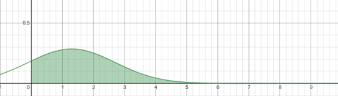
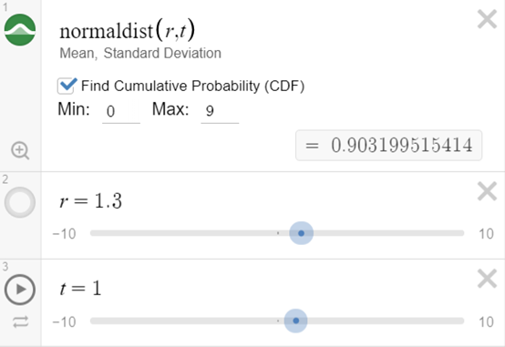

# 基于正态分布的攻击力的数值设置

***`written by wenweihang`***

※	游戏中的开发要求：Hero的攻击力是整数，分布在0~9之间，随着等级的上升，等级与攻击力随机概率正相关

- 分析：我们可以使用正态分布作为数学模型。Normaldist(r,t) 其中 r为期望，t为标准差。

  

- 其中，我们观察，x轴0~9为我们的攻击力的离散分布数值（Hero的攻击力就是从0到9），y轴为我们每个攻击力的分布概率

  

- 我们调节r，即为攻击力的平均值，在初级的时候，攻击力平均在1.3，然后t是标准差，意味着攻击力的抖动程度。

- 我们先不去管具体的t的数值，我们先设置正态分布的CDF，Min是0，Max是9，这样，我们可以看到正态分布的曲线的面积
  $$
  \int_9^0nomaldist()
  $$
  如果这个CDF的面积为1，就意味着0~9连续攻击力下的概率之和为1，符合条件预期。

- 然后我们调节t，使之CDF趋近于1，然后在离散点0~9上的y值为我们的概率值

- 我们发现，这些离散点之和不是1，我们需要在游戏中利用轮盘赌选择法，通过随机数，来映射出我们所需要的攻击力即可。

  ```
  int RouletteWheelSelection()
  {
  	float fSlice = Random(); // 0~1
  
  	float cfTotal = 0.0; //概率统计
  
  	int SelectedPos = 0; //被选中的个体下标
  
  	//atk_probability中，索引值是攻击力，元素是概率
      for (int i = 0; i < atk_probability.count(); ++i)
      {
  
         cfTotal += atk_probability[i];
  
         if (cfTotal > fSlice)
         {
             SelectedPos = i;
             break;
         }
      }
  
      return SelectedPos;
  }
  ```

  ------

  *`不是数学出身，如有不妥请发邮件给我 410146465@qq.com`*