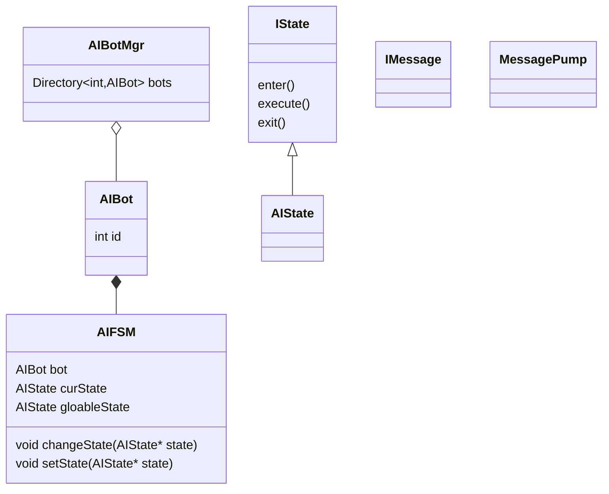

# AI_Regular_Frame

*Created & Written by WenWeihang*

```mermaid
classDiagram
class AIBotMgr{
	Directory~int,AIBot~ bots
}

class AIBot{
    int id
    
}

class AIFSM{
	AIBot bot
	AIState curState
	AIState gloableState
	
	void changeState(AIState* state)
	void setState(AIState* state)
}

class IState{
	enter()
	execute()
	exit()
}

class AIState{
	
}

class IMessage{
	
}

class MessagePump{
	
}

IState  <|-- AIState
AIBotMgr o-- AIBot
AIBot *-- AIFSM
```

