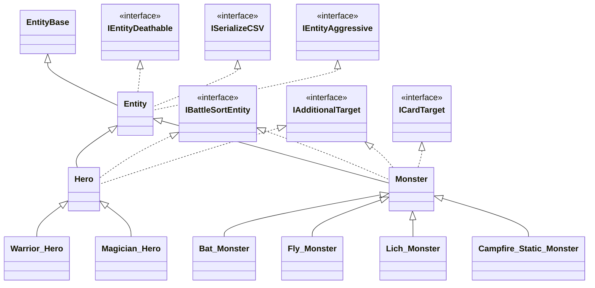
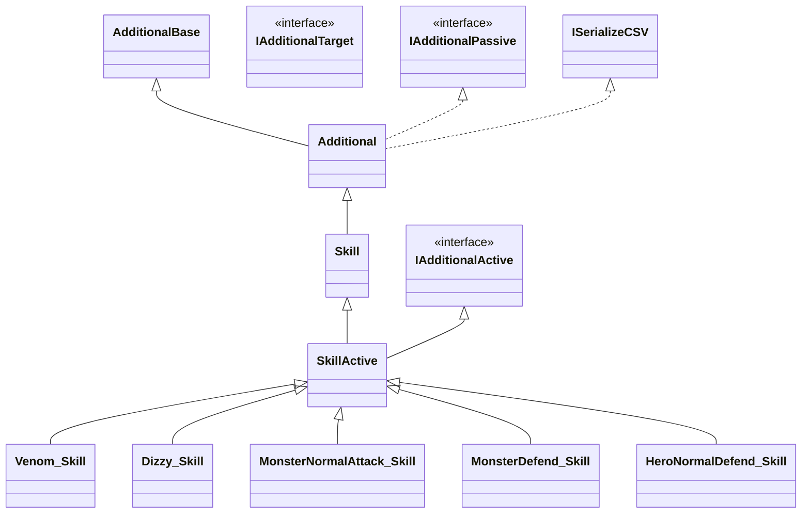

# NumberHero的酷点子

## 卡牌

#### 图示

#### 颜色

不同的颜色对应不同的功能性：

| 颜色 | 功能性   | 细节                                             | 备注     |
| ---- | -------- | ------------------------------------------------ | -------- |
| 白色 | 无       | 仅有数值                                         | 目前拥有 |
| 红色 | 普通攻击 |                                                  | 目前拥有 |
| 绿色 | 生命回复 |                                                  | 目前拥有 |
| 蓝色 | 魔法充能 |                                                  | 目前拥有 |
| 黄色 | 获得护甲 | 本次战斗中会增加额外临时护甲，战斗结束护甲消失   | 目前拥有 |
| 橙色 | 攻击吸血 | 吸血值为当前卡牌数值的50%，向下取整，保底为1吸血 |          |
| 紫色 | 攻击吸蓝 | 同上                                             |          |
| 青色 | 魔法攻击 | 每个青色触发后，可以直接对敌人进行魔法伤害       |          |

#### 数值

仅为所对应功能性的数值。

#### 伤害逻辑

- 生成伤害对象（卡牌初始值）
- 做出攻击行为PerformAttack（基础伤害）
- 设置Damage::OnTakeDamage，以便在伤害作用到目标实体时调用
- 调用AttactEvent来修正伤害（调整数值）
- 伤害对象作用于承受者PerformDefend（护甲调整伤害数值）
- DefendEvent来修正伤害（调整数值）
- 承受者**受到伤害后** 执行OnDamaged
- 执行额外的 Damage::OnTakeDamage（伤害作用后的逻辑）

#### 伤害计算

$$
普通伤害 = 基础伤害值 + 卡牌数值 + 调整数值 - 敌人护甲值 - 敌人调整防御值
$$

$$
魔法伤害 = 技能(魔法)固有伤害值 + 调整数值 - 敌人调整魔法防御值
$$

## 出牌队列

多张牌的顺序选择后，组成一个出牌队列，出牌队列会受到**数值**和**槽位**的限制。

#### 结算方式

队列蓄满后，进行结算。按照队列先进先出的顺序，依次结算卡牌。

#### 隐藏效果

出牌队列会根据牌的颜色触发额外隐藏效果。槽位组合按照匹配牌数，由多至少进行搜索触发。

| 槽位配置          | 效果                                         |
| ----------------- | -------------------------------------------- |
| 红 + 红           | 额外进行攻击1次，队列中的最小值              |
| 红 + 红 + 红      | 额外进行攻击1次，队列中的最大值              |
| 红 + 红 + 红 + 红 | 额外进行攻击1次，队列中的最大值              |
| 绿 + 绿           | 清空debuff                                   |
| 绿 + 绿 + 绿      | 清空debuff，进行一次额外攻击，队列中的最小值 |
| 绿 + 绿 + 绿 + 绿 | 清空debuff，进行一次额外攻击，队列中的最大值 |
| 黄 + 黄           | 额外增加护甲1次，队列中的最小值              |
| 黄 + 黄 + 黄      | 增加一个反伤buff，持续一回合                 |
| 黄 + 黄 + 黄 + 黄 | 增加一个免伤buff，持续一回合                 |
| 蓝 + 蓝           | 额外充能魔法1次，队列中的最小值              |
| 蓝 + 蓝 + 蓝      | 额外充能魔法1次，队列中的最大值              |
| 蓝 + 蓝 + 蓝 + 蓝 | 额外进行一次普通法术攻击，队列中的最大值     |
| 白 + 白           | 获得X金币，X=1                               |
| 白 + 白 + 白      | 获得X金币，X为队列中的最小值                 |
| 白 + 白 + 白 + 白 | 获得X金币，X为队列中的最大值                 |

## 手牌卡池

#### 卡池属性

卡池会有**容量**限制，卡池容量会决定单次刷出备选卡牌的张数。卡池也会受到属性影响，而改变不同**卡牌的出现几率**。

#### 卡池重置

当卡池的卡用完后，会默认自动进行卡池重置(reset)，刷新出满容量的卡牌。

当新的战斗开始时，会默认自动进行卡池重置(reset)

当卡池的卡未被用完，则需要手动重置，手动刷新会扣除玩家X生命值（X=1）

## 英雄

每位英雄只是初始时的属性不同，人物贴图不同，英雄默认被动特性不同，其他均相同。

英雄是玩家在游戏中的实体化身

#### 属性

| 属性值                 | 描述                               | 备注                   |
| ---------------------- | ---------------------------------- | ---------------------- |
| ***表现属性***         |                                    |                        |
| 名称                   | 英雄名字（玩家）                   |                        |
| 描述                   | 英雄介绍                           |                        |
| 等级                   |                                    | 暂无用处               |
| 生命值                 |                                    | 生命值为0，英雄死亡    |
| 魔法值                 | 释放技能需要扣除相应的魔法值       |                        |
| 基础攻击               |                                    |                        |
| 基础防御               |                                    |                        |
| 金币                   | 用于消费                           | 自身属性，道具，技能等 |
| 战斗速度               | 用于战斗中回合的先后排序           |                        |
| 技能列表               |                                    |                        |
| ***隐藏属性***         |                                    |                        |
| 暴击率                 | 触发普通攻击和普通法术攻击的暴击率 |                        |
| 暴击效果               | X1.5                               |                        |
| 幸运值                 | 获得双倍金币的几率                 |                        |
| 每回合回血             |                                    |                        |
| 每回合回蓝             |                                    |                        |
| ***卡牌能力生成概率*** |                                    |                        |
| 白色卡牌               |                                    |                        |
| 红色卡牌               |                                    |                        |
| 黄色卡牌               |                                    |                        |
| 蓝色卡牌               |                                    |                        |
| 绿色卡牌               |                                    |                        |
| ***卡牌数值生成概率*** |                                    |                        |
| 最小值                 | 下限是0，上限是最大值              | ±                      |
| 最大值                 | 上限是9，下限是最小值              |                        |
| ***卡牌池属性***       |                                    |                        |
| 卡牌池长度             | 卡牌池重置时，卡牌的生成张数       | ±                      |
| ***卡牌队列属性***     |                                    |                        |
| 卡牌队列战力值上限     | 每张入列的卡牌值求和的上限         | +                      |
| 卡牌队列长度           | 槽位个数                           | +                      |
| ***职业***             |                                    |                        |
| 战士                   | 初始暴击率为5%                     |                        |
| 法师                   | 初始每回合回血+1                   |                        |
| ？？？                 |                                    |                        |

## 技能

#### 技能属性

|          | 描述       | 备注                   |
| -------- | ---------- | ---------------------- |
| ID       | 技能表内ID |                        |
| 名称     | 技能的名称 |                        |
| 技能介绍 |            |                        |
| 技能等级 |            | 可用于映射为随机的概率 |
| 图标     |            |                        |
| 魔法消耗 |            |                        |
| 购买金币 |            |                        |
| 主动性   |            | bool                   |
| 群体性   |            | bool                   |
| 物理性   |            | bool                   |
| 值       |            |                        |
|          |            |                        |

#### 主动技能

主动技能需要消耗魔法值后即可释放。

###### 单体技能

需要主动选择承受对象

###### 群体技能

无需选择承受对象

#### 被动技能

当达到某种触发条件时，被动触发释放。

## 道具

属性同**技能**

#### 消耗道具

主动释放后，触发道具效果，对道具进行移除。

###### 单体释放

需要主动选择承受对象

###### 群体释放

无需选择承受对象

#### 装备道具

为玩家**增减属性值**，或，**像被动技能**。

## Buff

为大多数额外增加属性，或特殊逻辑的对象。

#### 阶段

3个阶段：**加入承受者；每个回合开始时；离开承受者；**

#### 属性

|            | 描述 | 备注 |
| ---------- | ---- | ---- |
| ID         |      |      |
| 名称       |      |      |
| 介绍       |      |      |
| 持续回合数 |      |      |

## 怪物

#### 属性

继承英雄的**表现属性**和**隐藏属性**，但不需要卡牌

#### 技能

怪物技能是特殊配置的**技能**，怪物通过AI对局势的判定，有选择的释放技能。

怪物的技能最多有4个

#### AI

## 战斗

#### 轮

玩家和所有怪物的回合全部结束后称作一轮

#### 怪物加入

？？？怪物是否可以中途被召唤加入战斗呢？ 哈哈

#### 战斗开始

*开始前可以有出场动画和提示*

根据英雄与怪物的战斗速度进行排序，然后按照排序值依次进行各自的回合。

#### 回合制战斗

进行一轮一轮的战斗，直到决出胜负。每轮中，各个单位执行自己的回合。

在英雄的回合中，可以释放技能，使用道具，打出卡牌至出牌队列。队列中卡牌满足后进行结算，结算后进行下一个单位的回合。

在怪物的回合中，怪物只可从自己拥有的技能中选择释放，释放结算后当前怪物的回合结束，进入下一个单位的回合。

#### 战斗结束

*战斗结束可以有斩杀特性动画*

**战斗结束的条件：**

- 玩家使用物品或技能跳过战斗，结束后**不获得奖励**，推进场景。
- 所有的怪物均被击败，结束后**获得奖励**，推进场景。
- 玩家英雄死亡，结束后**游戏结束**，返回主菜单。

## 休息站

#### 整顿

玩家来到休息站，可以回复以损失生命的50%，回复以损失魔法的50%

#### 购买

休息站会**随机**产生3个物品或技能，以便玩家使用金钱购买，随机几率应该可以配置

#### 调整属性

可以调整玩家的属性，玩家花费金钱进行调整

## 游戏流程

#### 地图选择

#### 冒险

# 整体架构

### 代码框架整体架构

其他游戏组件

