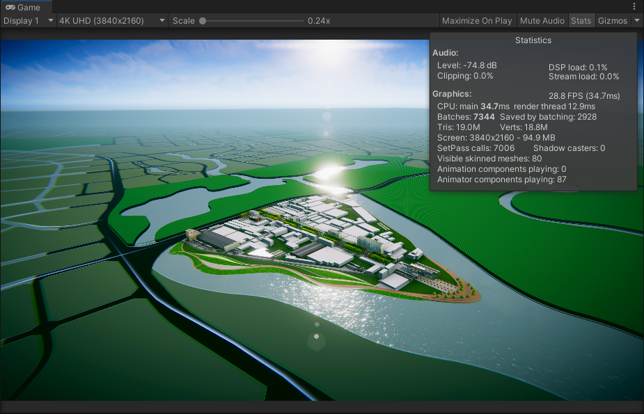

## 上海项目--优化流程和思路

> written by wwh 
>
> 设备配置：AMD Ryzen 5 3600，内存 16G，显卡 RTX2060

#### 场景1

首先拿到项目，我们运行第一个场景，设置显示为4K UHD，看到整个场景的状态数据。

其中FPS较低也可以接受。draw calls非常高，无法接受。三角形面数 12.9M是可以接受的。一个没有任何交互和代码的场景CPU 23.1ms 勉强接受。我们可以进行一个相关优化，来尝试解决上述问题。

1. 我们首先检查Setting→Player，查看颜色范围，设置为Linear，咱们这里项目是没问题的。

2. 然后在场景中找到摄像机，将渲染路径设置为Deferred，此时，我们的场景状态有略微提升，但是draw call还是非常高，需要继续优化

   

3. 我们发现有一个对象名为”对象001 地面的个别有变化的区域“带给渲染很大的压力，激活前是这样的，draw call 6465 ，FPS 47.9

   

   禁用后是这样的 draw call 3606，FPS 75.5：

   

   我们观察场景编辑窗口中的近景面板，激活时是这样的（右侧）：

   

   提供了一个斜条纹的纹理，我们随后调研其中的这个插件”PIDI Planar Reflections“，发现这个插件是做镜面反射的插件（镜面的一般做法会将场景首先在特定视角下绘制一遍，来作为镜面中呈现的内容，压力非常大但相对准确），但是在场景中，应用此插件的地方，并无需要镜面反射的地方。我们关闭掉反射脚本，仅仅使用其PBR属性。同上对比激活前，毫无区别。

   

4. 我们发现此插件的另外一个使用的地方，消耗非常严重，名为”Plane 海水“的地方，我们发现，此材质中的ReflectionTex中，将整个世界场景再次绘制到1024*1024的图上，此图又贴在整片海洋上面，虽然反射图中有一些细节，但是微乎其微，不妨，我们进行修改一下材质，取消掉插件的反射贴图：

   

   直接赋予一个蓝色，代替掉原有的反射图，关闭掉反射插件，效果也是一样的。此时，draw call 降到613，FPS 提升至 60+

   

5. 最终经过些许调整，我们的帧数上来了FPS 87，提升101%。

   

#### 场景2

根据场景1的优化思路，先进行一个通用的优化手段：

优化前：

优化后：

