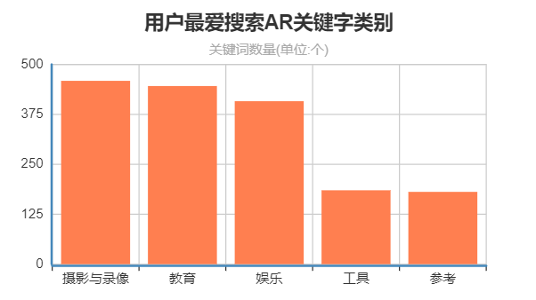
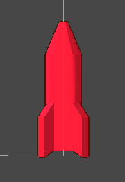
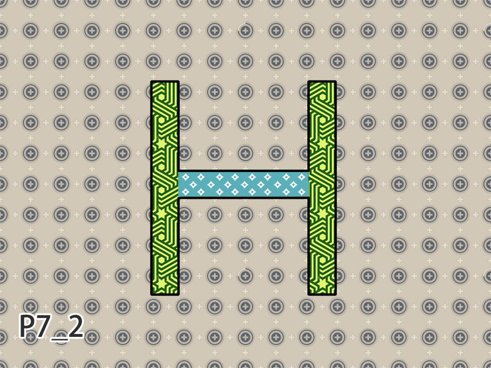
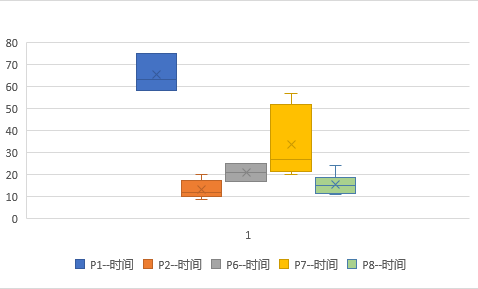

# 交互式AR应用在提升儿童空间认知能力上的作用

###### 关键字：

AR	儿童	严肃游戏	交互解谜	空间认知能力

###### 摘要：

​	**背景：**儿童空间能力认知对于儿童成长至关重要，然而，由于实体教育存在新颖程度差，覆盖面积小，成本高昂等问题，导致一些适龄儿童无法有效建立这种能力。AR依托移动设备具有高人群覆盖程度，高趣味性和交互性，且实体部分造价低廉等特性，在应用于实体教育，尤其是平面图形与三维图形相关映射的时候，能够提升儿童空间认知能力。

​	**方法：**本文提出一种任务驱动式旋转三维模型匹配投影平面图形的方法，将儿童空间认知和严肃游戏的教育理念和AR应用结合，并开发一个用于提升其空间认知能力的应用程序，称之为AR-PUZZLE-APP。让儿童在交互中可以了解空间中形体在不同角度投影下的成像，以此提升儿童空间认知能力。

​	**结果：** 通过前期调研方法，让一些儿童进行在APP中体验，同时也有与完成传统纸质题目方法相对比，可以得知本文方法相关的APP可以使儿童更感兴趣且沉浸体验，对儿童提升空间认知能力起着积极作用。

​	**结论：**通过AR方式的严肃游戏，可以有效提升儿童对三维物体角度投影匹配解谜的兴趣，并以此增加其对空间认知效果。特别是在AR中加入交互解谜的要素，使得提高趣味性和沉浸感成为可能，可以训练儿童的空间认知能力。

###### **前言**

​		空间观念认知能力是人们对客体或空间图形在头脑中进行识别、编码、贮存、表征、分解与组合和抽象与概括的能力[1](#refer-anchor-1)。在自然科学当中，数学在基础学科当中扮演着举足轻重的角色，而空间观念又是数学核心素养的关注重点[2](#refer-anchor-2)，儿童在空间图形认知能力在4~7岁发展的速度比较快，同时这个时期对于儿童来说也是发展的关键阶段[3](#refer-anchor-3)。而且儿童在这个年龄段可以流畅的使用移动电子设备，这也为面向此年龄段儿童的app提供了非常好的客观条件。

​		儿童传统的学习方法，基本是基于卡片、书籍或者实体积木等，但是对于这些而言，或缺乏交互手段，或成本昂贵。而作为智能手机，根据美国机构Zenith发布的最新研究报告显示截止2018年中国已经拥有13亿部，几乎已然是人均拥有1部，具有良好的AR承载设备的拥有率。

 

[^图1-1]: [数据来源：七麦数据-2019年AR产品数据报告] AR相关的app游戏类保有量低，而搜索率中教育和娱乐都很高，说明AR相关的严肃游戏很有潜力。

​		基于AR技术的app在当下有不少上线产品，但是面向儿童群体的app的占有率比较低，其中大多数以AR童书为主，局限于对2D图片识别生成3D模型或动画展示为主。作为教育方法而言，虽比传统的书籍绘本更能为用户带来视觉，听觉，触觉上的强烈体验，但是其内容和行为相关联的设计上却显的非常生硬，很少能从内容上带来驱动和对玩家交互的及时反馈，因此儿童缺少目标和成就感。所以app在设计之初，从外来看需要有趣化的游戏体验来获得快乐，从内来看也需要严肃化设计其内容[4](#refer-anchor-3)。通过谜题的破解来得到目标和成就感，在思考谜题时，获得技能的学习和提升。这个流程会以非常有趣沉浸且低成本的方式来进行。

###### 相关工作：

​		在AR教育领域中，有学者Lee[5](#refer-anchor-5)采用游戏化的AR学习调动了小学生学习数学的积极性。蔡苏[6](#refer-anchor-6)设计并实现了以AR为技术基础的演示书，用以3D展示物理学中牛顿定律，太阳系天体模拟等，形象直观的让学生感受物理性质。Freitas[8]开发了AR交通教育系统以面向低年龄儿童，通过虚拟生成的3D模型如汽车和飞机均以动画的形式，用来展示交通相关的概念。还有Min Fan[7](#refer-anchor-7)设计并开发的基于AR多Target识别技术，对英文单词拼写的可视化演示朗读等，给中国偏僻地区孩子们的英语学习带来便利。因为用技术在应用于教育层面的正式化，上述学者的研究中有些 [5] [6] [8] 当中缺乏交互内容，同时其他设计中[9]趣味性又略有不足。严肃游戏的概念既可以针对教育目的进行内容设计，又可以设计对应很好的交互性和可玩性来解决此类问题。

​		在儿童空间认知邻域，只有少数相关的文献和设计。有燕山大学刘月林的扦插式的实体玩教具。许世红以拆拼孔明锁来研究对儿童空间认知能力的有效性。傅孟霞设计的PC端迷宫寻宝3D数字化游戏，以文字方位提示线索。综上所述，实体玩具这种传统的教具，缺少可玩性且造价与迭代成本较高，任务和奖励系统不足。而在数字游戏中，虽增加了可玩性和任务奖励系统，但是的交互能力和内容的设计也导致并未针对相关空间认知进行设计。如果可以使用AR的交互技术，从空间认知的理论层面设计关卡及其内容，则可以弥补此类应用的不足。

###### 系统设计

​		**目标人群**

​		在APP初期的设计方面，根据发展心理学家皮亚杰[9](#refer-anchor-9)（JeanPiaget）提出的儿童认知发展的四个阶段中第2个阶段，即具体运算阶段（7-11 岁），在这个阶段中，儿童逐步可以凭借具体事物或从具体事物中获得的表象进行逻辑思维和群集运算。由于此年龄段儿童已经具备了较好的移动设备使用技能，能够在移动设备上与APP进行交互。因此我们要面向此阶段儿童作为主要前期调研对象。同时在空间认知的几个方面中，选择加强在第一学段的能力，从不同角度观察后可以辨认到简单几何体和常见且复杂的几何体，并且可以为下一阶段的抽象化做铺垫。

​		**系统简介**

​		本文中开发的**AR-PUZZLE-APP**是一款意在促进儿童对空间观念认知能力的严肃游戏，通过用app扫描特定的题卡，题卡中的内容即是3维物体在某角度下投影后的图形，此时，在app中会动态生成使之对应的3维模型，然后用户可以在app中用手滑动屏幕，使模型进行旋转操作，当模型旋转到特定角度后，也就是在app中观察到的模型与题卡中投影后的图形相吻合，则解谜成功，给予成功提示奖励。接下来用户可以通过扫描新的题卡来切换谜题。在题卡的设计中，会包含简单几何体，日常生活中可见的物体，且会从一些特征性的角度投影，或一些非特征性角度投影。例如图[2-1]:

[图2-1]: 	"如图，火箭从不同角度投影产生的2维图像，有些具有很强的特征性，而有些特征性比较弱"

​		**交互方式**

​		在手指滑动旋转模型的功能中，手指在屏幕空间X轴上运动，会采用围绕Vector.up轴以模型的本地坐标系进行旋转操作，而在屏幕空间Y轴运动，则采用围绕摄像机的Vector.right轴以世界坐标内进行旋转。这样会更符合真实世界中手握物体观察时的操作方式。

//此处有一张实景拍照的图 [img]

​		**关卡设计**

​		根据空间认知的三个不同的层次部分：空间能力，空间想象力，空间观念。他们三个部分是层层递进的。空间能力是人们对客观物体的形状，大小，相互位置的认识，还有隐性的心理对物体旋转，平移，其他方向的视觉效果等能力。而对于更高年龄或层次的为空间想象力，概括来说就是对几何物体进行加工改造创新的能力；空间观念是空间和观念的两者的结合统一，不仅是对客观物体的认知，还有心理上对客观物体的复杂的抽象操作或2D化。故此APP从面向的儿童用户群体为主，从空间能力出发，主要关注心理对3D物体操作的可视化。目前app种包含5个谜题，其中谜题的设计分别从三视图投影、旋转图、特征位置的投影的空间观念入手，基础模型包含简单有特征的几何模型，也有精简后的生活中的常见模型。

​		

[图2-2]: 	"例如上述的三视图的投影，隐藏掉许多模型的信息，需要儿童对空间模型的推理。"

###### 实验设计

​		为了验证本文中开发的**AR-PUZZLE-APP**是否可以让儿童使用者简单流畅的通过使用此APP进行空间认知能力的训练。我们需要通过前期准备和探索性实验手段验证下面三个论断：

1. 对于适龄儿童，该APP没有明显的使用障碍？
2. AR的恰当使用提升了儿童对空间认知学习的学习兴趣？
3. 可以较明显地提升了儿童空间认知的训练效果？

我们提出的问题如果上述三个论断都能获得实验支持，则表明此APP可以达到开发的预期。

方案和流程：

1. 首先，我们从社区内在不同时间内找到6个儿童来作为体验用户参与我们的实验，并记录好他们对移动设备的使用情况，使用AR的 熟练度方面进行初期的调研，以问卷的形式进行[[问卷内容参见附录1]()]。此问卷还包括若干道题目，试题内容为APP中同一模型，但有别于APP中谜题不同角度的映射选择题，让孩子们进行作答，孩子们答题速度非常快速，但是可惜几乎没有正确答案。

2. 然后在完成基础信息调研后，开始app的体验。体验前给体验者首先演示一边游戏操作方式，已及其中一个谜题的解密方法。

3. 给予体验者装有设备，设备已经启动好app，然后当app识别出第一个图案后开始计时。此时用户开始旋转扫描后的图形开始解谜的流程。

4. 解谜成功后，根据所用时常长短，给予用户提示不同的鼓励提示画面和文字。此时计时器停止。

5. 如果解谜时间过长，导致用户需要过掉此题目时，仅需要更换下一张谜题纸即可。或者可以依体验者的邀请更换题目。

6. 完成X个谜题的解答后，测试结束，然后对此数据进行记录。

7. 谜题是按照顺序依次进行的。

   

###### 结果和评估

APP实验前的问卷调查中的结果如下列表格：

| 用户  | 年龄 | 手机使用频率 | 移动设备熟练度     | 曾经是否接触过AR功能（非二维码） |
| ----- | ---- | :----------- | ------------------ | -------------------------------- |
| 女生1 | 8    | 偶尔使用     | 一些简单的益智游戏 | 不知道AR是什么                   |
| 女生2 | 12   | 每天使用     | 会玩电子竞技游戏   | 曾经体验过AR游戏                 |
| 男生1 | 8    | 偶尔使用     | 会玩电子竞技游戏   | 听说过AR但未体验过               |
| 男生2 | 9    | 基本不使用   | 会玩电子竞技游戏   | 听说过AR但未体验过               |
| 男生3 | 10   | 偶尔使用     | 会玩电子竞技游戏   | 听说过AR但未体验过               |
| 女生3 | 9    | 每天使用     | 一些简单的益智游戏 | 曾经体验过AR游戏                 |

分析上述实验数据，我们可以发现在适龄儿童中，儿童熟练掌握移动设备已经是普遍现象，而且已经成为了趋势。而且儿童们都几乎没有接触过AR功能（除扫描二维码）的相关app和游戏。在儿童体验此AR-PUZZLE-APP过程中，儿童可以很容易的上手此软件，并且可以快速的与此APP进行交互从而尝试解开谜题。 但是，儿童在回答问题笔试空间认知的问题时，几乎没有正确答案。

接下来的APP实验中，我们得出如下数据（空白格为儿童主动放弃，未完成题目）：

| 用户  | P1--时间 | P2--时间 | P6--时间 | P7--时间 | P8--时间 |
| ----- | -------- | -------- | -------- | -------- | -------- |
| 女生1 | --       | --       | --       | 20’‘     | 11’‘     |
| 女生2 | 1’15‘’   | 11’‘     | 25’‘     | 25''     | 24’‘     |
| 男生1 | --       | 9‘‘      | --       | 57‘’     | 17‘’     |
| 男生2 | 58‘’     | 15’’     | 17’‘     | 50’‘     | 17’‘     |
| 男生3 | 1‘03’‘   | 12’‘     | --       | 29’‘     | 12’‘     |
| 女生3 | --       | 20’‘     | --       | 22’‘     | 13’‘     |

然后我们看到统计图

[图3-1]: 	"纵轴为时间(单位：秒)，可以看到每个题在儿童完成时所消耗的时间"

- 验证三个断论
  
1. 对于适龄儿童，该APP没有明显的使用障碍
  
   ​	通过前期调研和儿童在APP上的交互，可以认为儿童是可以流畅与该APP进行交互，从测试儿童在依次进行的题目测试成功和时间上不难可以看出，儿童在体验开始进行第一题的解题时，会在屏幕进行滑动尝试，很快便看到模型对应的相关反馈，接下来就可以流畅旋转模型，向已知投影图案相靠近，从而完成相应解谜。随后的谜题在解谜时，则没有了在第一题时的学习成本。所以，对于适龄儿童使用此APP是没有障碍的。
  
2. AR的恰当使用提升了儿童对空间认知学习的学习兴趣
  
   ​	我们看到AR在儿童教学app中的应用或普及程度比较低，故对儿童而言非常新鲜，有很大的吸引力。且在儿童初次尝试此app时，都有浓厚兴致。且儿童在每次解答题目时，与移动设备交互频繁，在思考和交互中消耗了时间，且最终可以成功完成谜题的解答，通过实时反馈和实时交互的作用，比起可以得知儿童更享受于在电子设备上所带来的沉浸感和乐趣，而非传统的纸质试题和学习。这样可以适当用此APP提升儿童的学习兴趣。
  
3. 可以较明显地提升了儿童空间认知的训练效果

   ​		通过表格可以看到，实验对象随着年龄的增长，5道题的答题成功率逐渐变高，答题时间趋于稳定，且第一题的时间对于某些参与者的时长较长或者无法解答，也会夹杂着一些学习的时间成本，熟悉操作和熟悉规则。但在P6第三题，圆形图案较多特征码较少，实验进行时识别不稳定。除此之外，观察儿童在APP短时间内的成功完成一个解谜花费的时间，会趋于熟练和稳定。同时对比前期问卷中的笔试题目，也可以得知，儿童在此期间从识别图样，观察模型，交互旋转，解答谜题这一系列过程中得到了训练的目的。

###### 总结和未来工作

​	通过上述3个论断的结果得知，总体上可以认为该APP作为一款严肃游戏，可以达到预期的应用效果。其中包含解谜成分的可玩性让儿童用户沉浸，实时反馈，实时交互和相应的成就感对儿童用户的更为简易和友好，成就感的获得会让他们在空间认知学习上兴趣有提升，从而达到训练的效果。作为“严肃”的内核，目的是促进用户空间观念认知能力，所以同比传统的纸质平面透视图的方法和实物的观察学习，在体验趣味以及经济和可行性方面均有优势的体现。但是仍有一些工作可以在之后的研究和开发中进行，例如：

1. 对于面向的儿童的群体用户，需要在制作题卡时，进行风格化的美术处理，这样在题板的部分会让用户产生用APP扫一扫和解谜的欲望，同时又可以提升AR抽象图案的识别准确度，风格化不能喧宾夺主从而失去以提升儿童空间认知感的动机部分。
2. 使用热更新技术使其商业化。利用Unity3D引擎的热更新技术，可以根据需要动态的更新app的逻辑和资源，减少因为下载完整app所带来的流量浪费和用户的流失，同时近最大限度的保护app的品牌效应，减少推广成本。
3. 本文的实验属于前期的可行性实验，供初步了解儿童对本app的喜好程度。对于通过实验来验证可以明确提升儿童空间能力水平方面还存在有今后完善之处，即样本的采样数目，严谨的对照实验。可以在之后有进一步的实验来验证。

###### 引用
>
- [1]李洪玉,林崇德.中学生空间认知能力结构的研究[J].心理科学，2005，28 （2）：269- 271.
>
- [2].张冬梅. 八年级学生空间观念水平的调查研究[D].云南师范大学,2018.

>
- [3].刘焕青. 4～7岁儿童执行功能与空间图形认知能力的关系研究[D].辽宁师范大学,2013.

>
- [4].陈京炜.AR童书的游戏化设计[J].现代出版,2019(06):69-72.

>
- [5]Lee H S,Lee J W.Mathematical Education Game Based on Augmented Reality [G]//LNCS 5093: Proc of the 3rd International Conference on Technologies for E-learning and Digital Entertainment.Berlin: Springer,2008:442-450

>
-[6]蔡苏，宋倩，唐瑶． 增强现实学习环境的架构与实践[J].中国电化教育，2011(8) :114-119

>
-[7]Min Fan,Alissa N Antle.An English Language Learning Study with Rural Chinese Children Using an Augmented Reality App[C]ACM IDC,2020

>
-[8]Freitas R,Campos P.SMART: A System of Augmented Reality for Teaching 2nd Grade Students[C]//Proc of British Computer Society Conference on Human-Computer Interaction，New York: ACM Press,2008:27-30

>
-[9]R.W.Copeland 著，李其维等译.儿童怎样学习数学——皮亚杰研究的教育含义[M].上海:上海教育出版社,1985.2

