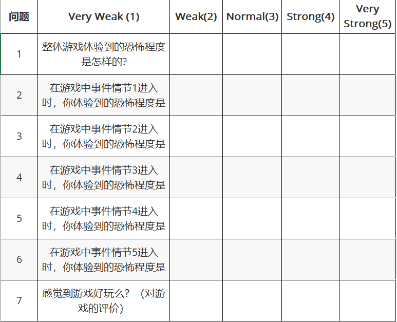
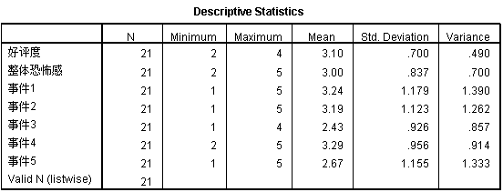
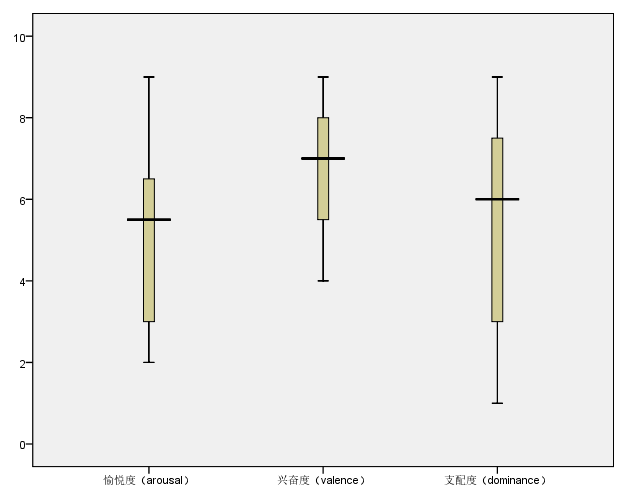

##  恐怖游戏中玩家恐惧程度和游戏体验的分析

#### 摘要

随着游戏产业的发展，国产单机游戏市场增长势头迅猛。其中恐怖游戏从小众游戏类型中脱颖而出，逐渐获得玩家的青睐。故对游戏开发者而言，玩家在体验恐怖游戏后的恐怖感和好评度就显得至关重要。本文基于一款自定义的恐怖游戏，让玩家在进行游戏体验后，对特殊情节所营造的恐怖效果以及游戏好评度进行问卷调研，通过数据分析后得出：玩家对恐怖游戏的好评度以及恐怖感均不会受到性别的差异，且基于不同的恐怖手段营造的特殊情节会显著提升玩家在体验时的恐怖感，但是与其可玩性的主观平均相关度不高。

#### 绪论

###### 研究原因及意义

正当国内手游市场和页游市场的增速放缓，国产单机游戏市场发展却非常迅速。在2020年全球疫情紧张之际，游戏作为娱乐行业的一员，其发展又再度回暖。国产单机游戏市场2020年度营收同比增长42%[1]。对Wegame和Steam平台的单机销量统计中，国产上榜非移动端16款单机游戏中，恐怖游戏占据4款[2]。可见，恐怖游戏作为小众的游戏类型，正逐渐受到玩家的喜爱。从而玩家在恐怖游戏中的体验和对游戏的好评度就显得尤为重要。于此同时，恐怖类型游戏的历史渊源久远，但是可以搜到对恐怖游戏相关的研究并不多，玩家在此类型游戏中体验的相关研究会更少。相反，在当下恐怖类型游戏趋势的回升，我们相信其独特的游戏类型是得到了玩家的关注和认可的，所以探讨和分析玩家在恐怖游戏中的体验就具有一定的研究价值。

###### 相关工作

对比与其他类型的游戏，恐怖游戏会更容易的调动玩家的情绪，情感变化更加强烈。在游戏产品方面，我们通过调研了一些成熟的商业恐怖游戏。以西方文化为背景的，例如《寂静岭》《生化危机》《逃生》；又有以东方文化为背景的《返校》《还愿》《零·红蝶》，他们除了引人入胜的剧情外，还有独特的解谜冒险玩法，以及营造恐怖气氛的技巧。Tom[10]在其文章中指出，如果没有对玩家角色的重大威胁，恐怖和恐惧就不会出现。我们在调研上述游戏中总结一些营造恐怖气氛的方法：面对敌人逼近时无法反抗的压力；在与场景交互后，场景和镜头特效的转场；音效和灯光的运用等。我们会想知道上述恐怖气氛的营造技巧是否真的会提升游戏的恐怖感，游戏内恐怖效果的表现好坏是否会决定游戏体验感好坏。然而，Tom[01]也补充说，恐怖感不仅仅是引起玩家可感知且无意识的恐惧反应，而且还有一种随着时间的推移而形成的恐怖，通常会变得越来越强烈。我们可理解到后者所说的应该是剧情带来的心理恐惧，然而此方法并非是在短时间内或者借助某些独立元素完成，故本文基于一款自定义的恐怖游戏，制作时利用上述总结的恐怖气氛营造技巧，对玩家在恐怖游戏中情感体验和对游戏的评价进行调研。

在相关的学术工作调研中，国内查阅到相关的工作中有：郭嘉琦通过对恐怖电影中封闭空间类型的分析，来提升其叙事层，同时扩展恐怖电影类型；史修永讨论在恐怖文化的审美体验以及对其客观的认识和反思。这些工作都是基于电影中的恐怖元素或是对恐怖文化审美角度，而未尝对恐怖游戏这一方面进行研究。相比而言，国外学者在恐怖游戏方面会有一些相关工作，例如：Ewan Kirkland 指出在生存恐怖类型分支中，很大程度上依赖于戏剧性的电影动画和逼真的美学来实现其效果。Brandi J. David 讨论了通过恐怖预期和文化恐怖，从而理解恐怖题材在电影和电子游戏中的应用。Andrew Dekker通过可变化的恐怖感与生物反馈相结合，来提升玩家对游戏的好评度。Rogers通过恐怖冒险游戏《Ethan Carter的消失》研究了VR游戏音频感知对玩家体验的影响。虽然上述学者对恐怖游戏进行了创作理论和技巧上分析，但对于在游戏中恐怖营造和玩家体验方面的分析也鲜有定量研究。

因此，本文借助前期的调研工作，通过体验自定义恐怖游戏后，利用体验后问卷调研的方法。通过数据分析恐怖感营造对游戏体验、玩家情感的影响。从而为恐怖游戏在设计方向上的指引起到一定的积极作用。

#### 实验方法

###### 参与者情况

我们对21个参与者进行了实验，其中男生8人，女生13人，年龄分布在18至30岁之间。通过前期的游戏经验调查问卷得知，他们都对电子游戏感兴趣而且经常接触，其中52.4%的参与者几乎没有恐怖游戏的经验，42.9%的参与者偶尔会尝试恐怖游戏，剩下的4.7%参与者会经常体验恐怖游戏。同时我们自定义的恐怖游戏也属于FPS游戏，我们在问卷中也调研了参与者对于传统FPS游戏的经验情况，其中19%的人从不接触FPS游戏，57.1%的参与者偶尔玩FPS游戏，剩余23.8%的参与者经常玩FPS游戏。由于游戏类型的特殊性，我们提前告知参与者所体验的是恐怖游戏类型，如果在实验当中对体验内容或者身体有不适的情况，要及时通知研究人员。同时，我们也提前掌握了参与者自述的身体情况，保证没有高血压或心脏问题，这些是非常有必要的。由于这些是参与者的隐私，因此研究人员和参与者会达成保护隐私的协议。

###### 实验材料

本次实验用到的硬件环境为PC台式机，配置为NVIDIA RTX 2060，16G内存，AMD Ryzen3600，一副降噪耳机作为声音的输出设备。实验用到的游戏是我们用Unity 开发的一款单人恐怖类型的游戏。相比于其他类型的游戏元素（如：愉悦感，幸福感），恐怖感对于玩家的情感调动更为强烈。恐怖氛围不同的呈现效果是由精心设计的视觉和听觉元素组成。玩家通过关键道具的获得，事件情节的触发，从而层层体验我们以上述方式营造的恐怖效果。同时作为非恐怖感的对照，我们也在事件3中安排了一个由明亮光线和轻柔音乐构成的安全屋。但是，对于细思极恐的那种隐式的恐怖，我们在短时间内是很难涉及的。

体验后的问卷我们采用九量表的SAM自我评估模型（ self-assessment manikin）[10]和基于李斯特五量表的体验问卷（表1）。我们设计的体验问卷反馈量表如下（1~5度量）：

在上述表格中，每个事件情节在游戏中是有具体安排的。事件情节1是通过让手无寸铁的玩家面对逐渐逼近的敌人，从而来营造的恐怖感；事件情节2是通过视觉空间转场而营造的恐怖感；事件情节3是通过温和的音乐以及明亮的房间营造的安全感；事件情节4是通过关闭掉场景环境光源，从而转换到手电光源来营造的恐怖感；事件情节5是通过怪物突然面朝镜头的嘶吼来营造的恐怖感。

###### 实验设计与程序

实验采用让参与者体验游戏，完成整个解谜流程，体验持续时长预计在5分钟内（实际平均时长 t=3.59），玩家可以容易的回忆和评价体验到的游戏。游戏体验环境选择常态下无人打扰的房间，在玩家体验游戏前进行了基本信息的收集，最终在体验完毕后，进行关于游戏实验相关的匿名问卷调查（见表1）。

在实验前期我们自定义的游戏尝试导出在不同的设备上，其中一个是基于普通显示器的，而另一个是显示输出在VR设备的。由于玩家在VR交互中移动能力方面略微薄弱，短距离瞬移的方案会掠过本想呈现给玩家的体验内容，如使用固定移动路线的方案又会让玩家产生眩晕感，而且在近期Peng[9]的探索性实验中认为，恐怖或惊悚类游戏在普通显示器的交互下要比VR设备下体验感提升很多，故我们最终选用基于普通显示器的操作方案。

#### 实验结果分析

###### 实验数据结果

实验前期采集的数据以及在上文中列出。实验结束后的调查问卷中（表1），21位参与者给予了对游戏体验后的评价，量表的统计情况如下:

其中好评度是玩家最终对游戏体验的主观评价。整体恐怖感是玩家体验游戏后感觉到恐怖感的程度。事件1、2、4、5是安排触发的恐怖情节，事件3则是安排触发的安全情节。

基于SAM的自我报告的统计如图：

###### 实验数据分析

1. 玩家性别对于好评度以及整体恐怖感是否产生了显著影响？

   我们通过利用方差分析（ANOVA）将性别设置为影响因子，好评度和整体恐怖感设置为因变量，分别进行分析。分析结果显示：好评度和整体恐怖感满足方差齐性检验。性别与好评度交互作用不显著，$F = 0.230\quad Sig. = 0.637 > 0.05$ 。同时，性别与整体恐怖感交互作用也不显著，$F = 0.278\quad Sig. = 0.604 > 0.05$ 。由此可见，无论男生还是女生对于恐怖营造带来的感觉是没有显著差别的。且对于游戏最终的评价而言，也不会受到性别差别的影响。

2. 玩家在恐怖游戏上的经验对于好评度以及整体恐怖感是否产生了显著影响？

   我们通过利用方差分析（ANOVA）将恐怖游戏的经验度（1~3）作为影响因子，整好评度和整体恐怖感设置为因变量，分别进行分析。分析结果显示：好评度和整体恐怖感满足方差齐性检验。恐怖游戏上的经验与好评度交互作用不显著，$F = 0.162\quad Sig. = 0.852 > 0.05$，然而，恐怖游戏上的经验与游戏整体恐怖感交互作用非常显著，$F = 5.079\quad Sig. = 0.018 < 0.05$。同时，相关性上分析表示，恐怖游戏的经验程度与游戏整体恐怖感呈现负相关$Pearson\ Correlation = -0.596$。即玩家恐怖游戏的经验越少，对恐怖感的敏感程度约强烈。

3. 策划设计的事件情节是否会提升游戏的整体恐怖感？

   从相关性分析上来看：

   |                   | 事件1 | 事件2 | 事件3 | 事件4 | 事件5 |
   | ----------------- | ----- | ----- | ----- | ----- | ----- |
   | 整体恐怖感 (Sig.) | .019  | .007  | .391  | .024  | .053  |

   我们可以看到，事件1、事件2、事件4的值均小于0.05，且事件5的值接近0.05，我们可以认为，我们精心设计营造的恐怖氛围达到了预期，他们都与整体恐怖感的评分产生了显著影响。而我们布置的事件3所呈现的一个安全氛围，相关性值大于0.05，作为对照事件，我们发现其与整体恐怖感评分无显著影响。

   更进一步来看，事件2的 $ p = 0.007 < 0.01$ 更能体现出，在与场景交互后，利用视效进行空间转场来营造恐怖气氛的手段，对整体恐怖感的提升更加有效。与此同时，对于老套的jump scare方法来营造恐怖氛围的手法，对于整体恐怖感的提升有效但并不明显。

   同时，我们将事件1~5作为预测因子与作为因变量的整体恐怖感做线性回归分析，则在模型摘要中显示$R^2 = 0.499\quad \text{Durbin-Watson} = 1.47$ ，接下来在方差分析中，线性模型作为自变量的分析显示 $ F = 2.991\quad Sig.=0.045 < 0.05$，可以得知线性模型对整体恐怖感有显著的影响。我们可以认为，我们前期对经典恐怖游戏分析，利用营造恐怖气氛的技巧来策划设计的事件情节确实能提升游戏的整体恐怖感。

4. 玩家对整体恐怖感的评价是否对游戏好评度有显著影响？

   我们将游戏的整体恐怖感评价作为自变量，与游戏好评度进行方差分析，结果显示$F = 0.698\quad Sig. = 0.511 > 0.05$，故我们可以认为：玩家在游戏体验中主观获得的恐怖感对游戏的主观好评度没有显著影响。从而我们思考，对于一款恐怖游戏，显式的恐怖对于玩家主观的好评程度仅仅起到微弱的影响，真正有显著影响的应该是那种隐式的恐怖，直击玩家的心理，或者让玩家细思极恐，这些并不是游戏中某个事件触发可以带来的，而是在不断的交互中，叙事的手法上，让玩家沉浸其中，达到心流。

5. SAM的数据分析

   |        | 均值 | 标准差 | 方差  |
   | ------ | ---- | ------ | ----- |
   | 愉悦度 | 5.00 | 2.214  | 4.900 |
   | 唤醒度 | 6.52 | 1.914  | 3.662 |
   | 支配度 | 5.57 | 2.441  | 5.957 |

   由上述体验后参与者的SAM问卷数据中分析，我们发现，在体验游戏后，玩家的愉悦度、唤醒度、支配度这三者的均值，分别比基础均值（4.5）有所提升，在唤醒度方面，均值是最大的，且大家的评分差距也是三者中最小的，我们发现玩家体验恐怖游戏时，带来的刺激紧张的感觉是非常显著的。也印证了恐怖游戏给玩家带来紧张且兴奋的感觉。在支配度方面，由于参与者玩家都积极尝试这个恐怖游戏，并且顺利的完成整个游戏流程，他们自身确实会反应出内心强大的情绪。我们在事后随即也进行了一些访谈。其中有些参与者认为日常生活中，他们的性格是比较胆小的，所以会在问卷中他们把自身的性格惯性的带入其中。这在某种程度上可以解释支配度的方差会比较大的原因。在愉悦度方面，参与者会将其与之关联到游戏的好评程度上，所以均值较低。
   
   与此同时，我们实验人员也进行了SAM量度与游戏恐怖感的线性回归分析，以拟合的回归模型作为自变量，整体恐怖感作为因变量，结果显示 $F = 3.193\quad Sig. = 0.50$ 可以得玩家的心理状况与体验到的恐怖感具有明显的相关性。且在线性回归的系数中，愉悦度 $Sig. = 0.079$，兴奋度 $Sig. = 0.11$，支配度 $Sig. = 0.043 < 0.05$。可见，支配度在回归模型中是影响力最大的，其次为愉悦度和兴奋度。

#### 总结

通过实验后获取的数据分析情况来看，我们认为。从游戏黏度上讲，恐怖游戏有着得天独厚的优势，玩家在已知虚拟环境的背景下支配自己对未知的探索。持续的紧张感即使会给玩家带来压力，也会在事件情节之后得到释放。从游戏的沉浸感方面来看，玩家在紧张恐惧中的生存欲得到充分的体现，玩家在游戏的角色就是玩家的化身，玩家受到威胁来自游戏角色受到的威胁，玩家的安全平稳来自游戏角色身处的安全平稳。恐怖游戏以第一人称视角，RPG的扮演这种游戏控制形式，使得可以让玩家的情绪跟着角色的情感变化。由此我们认为，恐怖游戏中的恐怖只是一个外衣，或是一种综合视觉表达，美术风格，声音效果以及交互手段的一种游戏表现形式。而真正的游戏内核其实是——“故事+玩法” 。

在恐怖游戏的研发初期，我们要认识到游戏面向的性别群体应该是无差别的。而非像某些恋爱游戏或者策略类型的游戏，他们着重针对面向男性或者女性群体。在游戏前期的策划阶段，要为在游戏核心的玩法方面加以创新，通过游戏富有创意或趣味性的玩法来提升玩家对游戏的评价。同时，我们需要清楚认识到恐怖游戏中的恐怖元素只是提升沉浸感和黏度的一个方面，运用一些提升恐怖感的技巧，例如：合理场景中的不合理元素，敌人带来的威胁和压力，光影和声音的特效表现等，确实可以有效的提升游戏中更多恐怖感。但是这些仅仅是表现上的一些手段，而非游戏的灵魂核心。无论是对于初次尝试恐怖游戏的新玩家，还是对恐怖游戏有苛刻要求的老玩家。起伏或悬念的剧情，游戏角色的人物弧光才能让玩家与游戏产生共鸣，才可以潜移默化的操控玩家的情绪，将玩家带入到心流之中。像这样在游戏设计方向的初期进行周密科学设计，才会减少游戏制作后期失败的概率，从而使游戏受众面更广，更易得到玩家的好评。

实验后我们还对一些参与者进行了简短的对话，其中有参与者A提出：“以破败的医院为背景，虽然有些老套，但是画面和声音的表现力尚可，首次尝试的时候还是蛮紧张的。在拿到游戏中的门禁卡片后，突然间由空无一人的房间转换至挂满尸袋场景，画面由彩色到黑白再到彩色的转换效果让我即害怕又兴奋。”参与者提到的内容也是我们在设计之初可以预料到的，而且也通过事后的问卷分析反应出了相应的结果；另外有参与者B指出：“在进入安全屋的事件情节中，我感到的是恐惧。声音突然转变的柔和，灯光也变得明亮，与长时间压抑的气氛有较大的反差，我反而感到了一种内心的恐惧，担心什么事情突然会发生。”这个参与者提出的是我们之前未曾预料到的。我们思考后认为，确实特意安排的安全感和恐怖感的节奏要恰如其分的掌握好，类似于浪潮一样，有抑有扬，层层递进。最后，还有参与者C指出：“在一些可以预见即将出现的恐怖场景中，我闭住了眼睛，没敢看。”我们也意识到参与者这样的情况是无法控制的，这也是本能的反应，但是这样的反应确实会影响最终对恐怖感的评价和对游戏的好评度。

本研究的一个主要局限，仅是探讨了玩家在恐怖游戏中与恐怖感显著相关的因子，以及营造恐怖感方法的可行性。并且，分析了玩家对游戏好评度和恐怖感并无显著相关性。在未来的研究中，我们有必要研究考察游戏好评度和恐怖游戏的哪些因素有关，并进一步了解其影响机制，进行相关的数学建模。

#### 引用

1. https://baijiahao.baidu.com/s?id=1688676108980802612 访问日期2021/01/14
2. https://new.qq.com/omn/20210114/20210114A04KFG00.html 访问日期2021/01/14
3. Kirkland E. Gothic videogames, survival horror, and the Silent Hill series[J]. Gothic Studies, 2012, 14(2): 106-122.
4. David B. When Running Isn't Enough: The Development of the Survival Horror Video Game Genre Through Transmedial Adaptation and Representations of Sexuality[D]. , 2015.
5. Dekker A, Champion E. Please biofeed the zombies: enhancing the gameplay and display of a horror game using biofeedback[C]//DiGRA'07-Proceedings of the 2007 DiGRA International Conference: Situated Play. 2007: 550-558.
6. 郭嘉琦. 恐怖电影封闭空间的叙事研究[D].西南大学,2018.
7. 史修永.视觉文化与恐惧、焦虑体验的审美再生产——以恐怖电影为例[J].文化研究,2016(04):292-306.
8. Margaret M Bradley and Peter J Lang. 1994. Measuring emotion: the self-assessment manikin and the semantic differential. Journal of behavior therapy and experimental psychiatry 25, 1 (1994), 49–59
9. Beyond Horror and Fear: Exploring Player Experience Invoked by Emotional Challenge in VR Games
10. Garner, Tom & Grimshaw-Aagaard, Mark & Nabi, Debbie. (2010). A preliminary experiment to assess the fear value of preselected sound parameters in a survival horror game. Games Computing and Creative Technologies: Conference Papers (Peer-Reviewed). 10.1145/1859799.1859809. 

