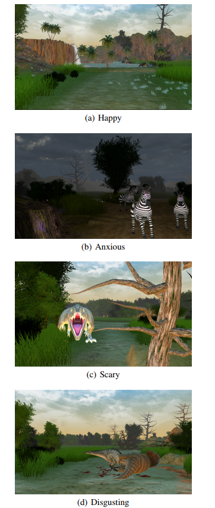

### Effects of Manipulating Physiological Feedback in Immersive Virtual Environments

> CHI PLAY 2018 

#### ABSTRACT

虚拟环境已被证明是激发情感的有效方法。早期的研究发现，生理数据可以有效地衡量使用者的情绪状态。事实证明，能够在虚拟环境中看到自己的生理反馈，让这款应用程序更有趣。在这篇论文中，==我们研究了在单一用户沉浸式虚拟环境中操纵提供给参与者的心率反馈的效果。我们的结果显示，提供稍快或稍慢的实时心率反馈比提供未经修改的反馈更能改变参与者的情绪。然而，改变反馈并不改变真实的生理信号==。

#### INTRODUCTION

==本文探讨了沉浸式虚拟环境中的生理反馈如何影响用户在虚拟环境中的情绪==。虚拟现实(VR)可以创造能够唤起情感反应的沉浸式场景。VR现在广泛应用于游戏、电影、教育和治疗等不同的应用领域。VR能够让用户沉浸在当前物理世界的限制之内或之外的环境中。Thomas[30]认为，在VR中创造同理心是最有前途的应用之一，即一个人可以理解另一个人的感受。早期的研究发现，==VEs能够在用户中创造出有针对性的情绪，如快乐[10]和恐惧[22,24]。研究还发现，虚拟现实能够让人们对虚拟角色[17]产生共鸣==。

情感被Cabanac[8]定义为“任何具有高强度和高快感内容(快乐/不快乐)的精神体验”。然而，对于情感的定义还没有达成共识。虽然早期的研究集中在虚拟现实中创造和测量情绪，但很少有人研究向用户提供生理反馈的效果，以及测量它对情绪和互动的影响。Dey等人在一个协作VR环境中报告称，向合作者显示实时心率可以创建更高的主观连接。在单用户设置中，Chen等人[9]研究了向用户提供心率反馈的最有效的多感官方式。在神经科学研究中，据报道，操纵心率变异性可以产生对愤怒诱发刺激[16]的不同反应。另一项研究报告指出，当人们受到负面刺激[25]时，提供准确的心率生物反馈是控制自主生理反应的有效方法。==在VR中，Ueoka等人[31]创建了一个提供伪心率反馈的系统来增加恐怖VR体验中的恐怖感。然而，他们并没有彻底衡量这种反馈的效果==。

在这篇论文中，我们提出了一个初步的工作，系统地调查情感和生理的影响，提供操纵心率反馈给用户在VEs。我们的研究重点是通过听觉触觉渠道为用户实时提供他们自己的心率反馈——减少、增加和非操纵的方式。我们测量哪些情绪可以被改变，以及真实的生理信号是如何被这种调节所影响的。主观测量一直是虚拟现实中情绪调查的主要方式。在我们的工作中，我们使用主观和生理测量。这项工作的主要动机是研究在VR中，除了传统的视听效果之外，额外的生理反馈是如何影响整体体验的，以及一些特定的情绪是否可以通过操纵反馈来增强或减少。这一点很重要，因为如今VR应用通常用于治疗各种恐惧症[34,23]和[28]障碍。如果[25]和[16]发现的心率操纵效应也能在VR应用中得到证实，那么使用VR治疗与负面情绪相关的情况就会比现在更有效。类似地，在娱乐和游戏VR应用中，==我们可以通过控制心率反馈来诱导更高水平的情绪==。

为了调查这些效果，我们设计了五个具有相似质量和体验的VEs。我们收集用户的心率数据，并通过音频和触觉感知实时向用户提供他们自己的心率反馈。然而，我们以五种方式操纵反馈。我们降低了30%和15%的心跳频率，增加了30%和15%，控制条件我们不操纵，并按原样提供反馈。在一个内受试者用户研究中，参与者通过两种基于情绪的主观测量工具来传递他们的经历。我们还收集了体验期间的心率和皮肤电反应数据。

**Novelty and Contribution:**这项工作的主要新奇之处在于，<u>在VR研究中，第一次使用生理和主观测量相结合的方法来测量受控的生理反馈对情绪的影响。这项工作的主要贡献是</u>，==我们第一次发现，操纵心率反馈可以显著影响虚拟体验中的五种情绪。研究结果可用于未来的虚拟现实应用，如认知训练应用、虚拟现实电影或游戏，在这些应用中，放大特定的情感是很重要的==

本文的其余部分组织如下。在相关的工作部分中，我们将讨论在此领域中已经完成的一些关键的早期工作。在下面的部分(用户评价)中，我们将详细介绍在研究中使用的VEs、整个系统和研究设计，包括实验过程。接下来我们报告结果，然后详细讨论。最后，我们对未来的研究进行了展望。

#### RELATED WORK

在我们的工作中，我们正在研究VR中心率反馈操作对情绪的影响。在过去的几年里，人们对VR中的情绪进行了研究，许多研究者提出在虚拟现实中也可以激发类似于现实世界的情绪[3,14,15,26]。研究人员研究了通过在单用户任务[9,32,31]和协作任务[11,12,29]中添加一些生理信号线索来增强情感感受和/或共情的可能性。

Felnhofer等人报告说，VEs在五种不同的虚拟公园场景中准确地触发了情绪，通过使用GSR[15]对情绪唤起和存在进行测量。Riva等人认为，VE体验到的存在程度对体验到的情绪状态[26]有强烈的影响。情绪唤醒已经被测量并用于不同的军事应用。例如，Rizzo等人在战后场景[27]中为军事训练创建了情绪状态，Roy等人在VR中使用情绪诱导治疗创伤后应激障碍(PTSD)[28]。在其他工作中，Wiederhold等[34]报道使用VR治疗飞行恐惧症患者，并测量心率、皮肤电导等生理指标。

在其他一些医疗应用中，VR已经被用于治疗情绪作为关键测量指标的情况。Gomez和[18]等人报告称，VR可以促进辩证行为治疗，并发现随着时间的推移，积极情绪会增加，消极情绪会减少。巴诺斯等人在[4]的研究中也注意到了类似的效果，他们发现，在接触了特别设计的VEs后，老年人的积极情绪有所增加，消极情绪有所减少。研究人员对纤维肌痛[19]和自闭症谱系障碍(ASD)采用基于VR的干预方法[21,20]，使用主观工具测量情绪。总体而言，这组工作表明，在VR中测量情绪，作为唤起适当情绪的研究方法，具有良好的前景。

除了测量情绪和/或生理数据之外，研究人员还研究了将这些数据可视化和交流的方法。这是我们目前的研究适合的主题。Tan等人[29]曾投资将协同视频会议中的生理数据可视化，但在VR领域报道的此类工作并不多见。

==在最近的一项研究中==，Dey等人[12]研究了在两种不同(恐怖和平静)的协作VR游戏环境中，将一名玩家的实时视听心率线索分享给另一名玩家的效果。他们报告说，有一种趋势是，能够实时看到合作者的心率比看不到它能产生更高的积极影响，这使得合作者之间的联系更加紧密。Bernal和Meas[5]最近报道了他们在VEs中使用化身可视化情感的工作。在测量了GSR和心率数据之后，他们用两种不同的方式在视觉上表达情感:(1)当兴奋程度高时，让化身的皮肤长出皮毛;(2)当兴奋程度高时，增强亮度或颜色变化来突出化身。在其他的工作中，Chen等[9]研究了如何使用多感觉通道为VE中的用户提供生理反馈，以及在VEs中显示实时的生理提示是否能让用户更加了解自己的情绪状态。他们报告说，参与者更喜欢感官反馈，在听觉、视觉和触觉反馈的组合中，==参与者最喜欢听觉反馈，而视觉反馈被发现会分散注意力==。我们目前的工作受到Chen等人的研究结果的影响，但是，我们并不只是提供反馈，我们正在调查操纵心率反馈的效果。

我们还不知道有任何其他研究研究了沉浸式VR中可操纵的生理反馈的影响。然而，有一些工作是操纵生理反馈的。例如，Ueoka et al.[32]试图通过提供伪心率来放大观看3D电影的恐怖体验，并进行了另一项研究，[31]<u>使用恐怖VR体验做了类似的工作，试图进一步放大体验的恐怖。他们通过振动地板提供心率反馈。然而，在他们的工作中，他们只使用了一种恐怖的VR体验，而我们使用了不同的情感片段——快乐、焦虑、恶心、恐惧和悲伤。</u>

**总结**:早期的研究已经表明VR可以创造类似于现实世界的情感。提供生理反馈可以增强协作设置中的体验和积极影响。在VR中，生理和情感数据的可视化有不同的方式。多感觉听觉触觉反馈已被证明是一种实时交流生理状态的有效方法。一些研究人员已经研究了操纵心率反馈的方法，但这种操作的效果尚未得到详细研究，特别是在具有多重情感场景的沉浸式VR中。我们解决这些问题，并调查这些影响使用主观仪器和生理测量。

#### USER EVALUATION

用户评估的主要目标是调查在沉浸式VE中为用户提供可操纵(增加、减少和准确)实时心率反馈的情感和生理影响。

##### Experimental Virtual Environment

虚拟现实经验是基于一个丛林狩猎与各种动物(包括恐龙)通过在环境中,并配以适当的声音效果(图1)。==每个参与者是一个旅游在一个虚拟的狩猎远征,放置在一个站起来的虚拟汽车沿着从球员没有任何互动==。我们使用这个场景中,有两个原因:(a)为参与者提供最大的机会去探索环境而不用担心控制其运动,类似于最真实的丛林狩猎、和(b)我们想要控制汽车的路径一致性在我们的实验中,我们把不同的情感触发点已经在特定的位置。情绪触发被小心地放置在一种参与者无法避免的方式中。大多数感兴趣的视觉效果在200度的水平视场范围内呈现在参与者的眼前。然而，在VE中有来自参与者背后的声音效果。==我们没有为参与者提供任何自我意识的化身==。

使用Unity 3D游戏引擎[2]，我们为这个实验创建了5个类似的游戏场景，每个持续4分钟。在每种环境中，都有五种不同的体验——快乐、焦虑、恐惧、恶心和悲伤。我们进行了专家评审和试点研究，以确保情感体验触发器符合其预期目的。例如，为了激发快乐，我们展示了瀑布和许多蝴蝶在周围飞舞，为了激发恐惧，我们展示了咆哮的美洲豹、恐龙和蛇攻击汽车，为了激发悲伤，我们设计了一只鹿意外撞上皮卡而死亡。然而，在我们的测量中，我们采取了一种整体的方法，并没有区分体验，因为很难确保参与者在任何时间点只会感受到一种情绪。

在现实世界中，如果需要，受试者站在前面，手放在前面以保持平衡。==受试者可以随意环顾四周并旋转头部来体验VE。然而，我们不允许她/他走路，因为我们想要避免任何由于运动而升高的生理信号==。

##### Experimental System and Setup

参与者通过HTC Vive头戴式显示器(HMD)体验场景，音频效果通过罗技降噪耳机提供。在虚拟体验中，我们还为参与者提供了心率反馈。Chen等人发现[9]用户最喜欢的是心率声控多感觉反馈，所以我们也以同样的方式提供心率反馈。心跳的声音通过耳机提供，触觉反馈则通过参与者手中的两个Vive控制器提供。

为了捕获包括心率(HR)和皮肤电导(GSR)在内的生理信号，我们使用了思维技术[1]的ProComp Infiniti 8通道编码器。我们使用的心率传感器是Polar H7。通过EKG接收器，信号从Polar H7可以处理通过Procomp Infiniti编码器。GSR传感器被绑在参与者的两个手指上，Polar H7被绑在胸部。为了实时传输HR数据，我们使用Generic Attribute (GATT)配置文件通过BLE从Polar H7获取HR数据。图2显示了我们为用户研究设计的系统。在图中，编号为1的笔记本电脑运行Ubuntu，通过蓝牙直接从Polar H7接收HR数据。然后，笔记本电脑将数据实时传输到2号计算机，在2号计算机中，人力资源数据通过音频和触觉线索以统一的方式可视化。同时，利用Thought Technology的BioGraph Infiniti软件在2号计算机上记录GSR和HR数据。用户被要求站起来，双手握住HTC Vive控制器。

##### Independent Variable

我们进行了一项非常集中的受试者内部研究。这个实验中唯一的自变量是*心率操纵*。我们尝试了5个不同的操作级别 -30%，-15%，真实(0%)，+15%和+30%。在-30%和-15%的情况下，我们分别将心率降低30%和15%后提供实时心率反馈。同样，对于+30%和+15%，心率反馈比真实心率高30%和15%。在真实情况下，心率反馈是没有任何操作的。这些水平的操作是在一个简短的试点研究后选择的，有5名参与者，其范围在±50%之间，间隔为10%。我们注意到超过了±30%参与者就会觉得操作太明显了。在本研究中，为了避免学习效果的影响，每个被试都使用了五个不同的VE场景来体验以上五个层次。==操纵反馈的呈现顺序使用一个平衡的拉丁方格来平衡（balanced Latin square.）==。

##### Dependent Variables

我们的主要目的是确定心率操纵对情绪的影响。因此，我们使用了==两种经过验证的主观情感测量问卷，即积极和消极情感表(PANAS)[33]和自我评估人体模型(SAM)[7]==。此外，在实验结束时，我们对参与者进行了半正式的访谈。PANAS量表被使用，因为它提供了一个整体的基于状态的积极和消极的影响分数，通过20个个体的感觉和情绪的分数来衡量。SAM提供总体觉醒、效价和支配性的分数。除了主观测量，我们还收集了虚拟体验环节的HR和GSR数据。

##### Experimental Procedure

在欢迎参与者之后，我们解释了任务，并要求他们填写同意表和人口调查问卷。我们清楚地告诉参与者，他们将得到的心率反馈将是他们自己的实时心率。==然而，我们并没有透露他们的心率反馈会在两个疗程之间被操纵。将传感器安装到身体上后，我们让他们等三分钟，让他们的心率恢复到正常水平==，然后我们收集了两分钟的基线HR和GSR数据。在这段时间里，我们让参与者站着，因为实验任务也要求他们站着。

在收集了基线数据之后，参与者在开始他们的第一个实验环节之前等待了至少两分钟，之后他们回答了PANAS和SAM的问卷，在开始下一个环节之前又等待了一分钟。这个过程重复了五次。在所有的实验阶段结束后，我们采访了参与者。在那之后，我们询问了他们关于这项研究的情况，并提到他们的心率反馈在5个疗程中有4个疗程被控制在正负30%的范围内。我们还解释说，在一开始没有向他们披露这种操作，以避免这种认识影响他们的性能，从而影响结果。在送别他们之前，我们为他们提供了一份巧克力礼物。实验平均每个参与者花费一个小时。

##### Participants

在这个实验中，我们从大学生、工作人员或个人联系人中招募了20名参与者。一名参与者在两个疗程后因个人紧急情况而退出，最终导致19名参与者(2名女性)的研究结束，年龄在21岁到45岁之间(m=30.6, sd=7.1)。

几乎所有的参与者都有玩电子游戏的经验，除了两名参与者之外，他们都有中度到高度的VR体验。只有两名参与者报告说他们在日常生活中注意自己的心率。18名参与者认为，当他们感到压力、害怕或焦虑时，他们的心率会增加;而16名参与者认为，当他们感到放松、无聊或瞌睡时，他们的心率会下降。

我们使用G * Power[13]来计算样本量大效果的重复测量 *方差分析ANOVA* (f = 0.4)和α= 0.05,为我们的研究,发现我们需要13个参与者,这意味着我们有超过所需的数量足够的力量为我们的统计测试。

##### Hypotheses

一开始，我们有以下假设

- H1: -30%和-15%的反馈会导致虚拟体验比真实体验更少的兴趣，+15%和+30%的反馈
- H2: +30%和+15%的反馈会使虚拟体验比真实体验更刺激，-15%和-30%的反馈。
- H3: +30%和+15%的心率反馈会比真实的-15%和-30%的反馈引起更多的焦虑、恐惧和紧张。
- H4:不同条件下的HR和GSR有显著差异。

#### RESULTS

在分析非参数主观数据时，我们使用Friedman’s ANOVA。对于客观数据(HR和GSR)，我们使用重复测量ANOVAs。表1给出了PANAS和SAM问卷的回答概述。总的来说，我们发现，与真实情况相比，稍微高一些的人力资源反馈(+15%)会引起更多的兴奋、恐惧、紧张和恐惧，而稍微低一些的心率(-15%)会使参与者对VE更感兴趣。但其影响主要体现在主观反应上，生理反应基本不受不同HR反馈的影响。

##### Analysis of PANAS and Individual Emotions

我们注意到，在所有条件下，积极的影响都比消极的影响更强。然而，在积极影响(p=0.17)和消极影响(p=0.18)两种情况之间没有显著差异。我们注意到，在使用PANAS测量的20种不同的情绪和感受中，有5种个体的情绪受到心率操纵的显著影响——兴趣、兴奋、恐惧、紧张和恐惧。有趣的是，这五种情绪显然与我们设计的虚拟场景最相关。

**Interest:**

**Excitement: **

**Scariness:**

**Nervousness:**

**Fear:**

##### Self Assessment Manikin (SAM)

SAM问卷以图片的形式测量了效价、兴奋和统治力。如表1所示，我们在SAM问卷的任何测量中没有发现任何显著差异。

##### Subjective Questions

我们要求参与者在每一阶段结束后回答五个额外的问题(1)在VE阶段你对自己的心率有多注意?(2)在VE时，你觉得你的心率是多少?(3)你在多大程度上同意你的心率被准确地表示在VE中?(4)在VE组中，心率可视化对体验增加了多少?(5)你在多大程度上同意心率形象化在VE时分散了你的体验?

总的来说，我们没有注意到心率操纵对任何问题的任何显著影响(表2)。一般来说，参与者多少同意他们对自己的心率有适度的关注。他们感觉自己的心率适中，并认为自己的心率被准确地表示出来。他们一致认为，心率反馈略微增强了体验，并没有过多分散注意力。

##### Interviews

会议结束后，我们问了参与者几个问题。他们报告说，VEs确实很有趣，让他们在不同的部分有不同的感觉。P5提到“……恐龙袭击汽车的夜景非常可怕。”P12报告说，如果图形保真度较高，他/她在VEs中会有更多的感觉。该参与者表示，他在HTC Vive上玩了很多VR游戏。

只有一名参与者(P15)报告说感到有点头晕，但他/她正从流感中恢复。最有趣的发现是当我们询问参与者他们是否觉得自己的心率在会议中被准确地描述了。P15也发表了一个有趣的评论:“……如果我能控制车，我可能会感受到更高的情绪。除了两个人之外，所有参与者都认为自己的心率比一种情况下的预期要快一些(+30%)，否则心率是准确的。另外两名参与者认为他们的心率在所有情况下都被准确显示。两名参与者明确地报告说，在+30%的情况下，他们认为自己的真实心率上升了。换句话说，从访谈中可以清楚地看出，将心率反馈提高到+30%是显而易见的，但其他情况(包括-30%)没有被注意到。

参与者报告说，当体验开始时，以及在VE区(例如在快乐区)没有发生什么事情时，他们更关注心率反馈。随着经验的进展和更多的事情开始发生，反馈成为经验的一部分，而他们不再注意到它。

##### Analysis of Physiological Data

==除了定性反应外，我们还想调查心率操纵是否会影响参与者的真实身体HR和GSR。==

**Heart Rate:** 在心率方面，我们分析了原始心率、基线心率变化和心率变异性。对于心率变异性，我们测量了连续差异的均方根(RMSSD)。然而，我们在心率测量中没有发现任何显著的差异。这表明增加或减少心率反馈不会改变实际心率(表3)

**Galvanic Skin Response:**我们测量了原始的GSR以及基线和其他心率操纵条件下的GSR差异。在GSR的情况下，我们注意到基线和所有其他VR暴露条件的显著差异- f (2.12, 37.9) = 8.82, p=. 001, n^2p=。33岁的观察能力=。97(表3)由于数据不符合球形假设，我们使用了温室-盖瑟调整。基线的GSR明显低于其他所有条件。很明显，暴露在VR环境下增加了参与者[6]的兴奋度。然而，我们没有注意到心率操纵条件之间的任何差异。但Wilcoxon符号秩次检验表明，**真实**心率反馈有极显著低于+30%状态的激励趋势- z =-1.69, p=。09年(图4)。

#### DISCUSSION

==在这个实验中，我们发现控制心率反馈对情绪有显著影响，但对生理信号没有影响==。正如预期的那样，我们注意到在我们的虚拟环境中，积极的情感明显比消极的情感更强烈。然而，两种情况之间没有差别，尽管真实的(非操纵的)心率反馈的积极影响最小，消极影响最小。

除了整体的积极和消极影响，我们还对五种与我们的情感相关的关键情绪感兴趣——兴趣、兴奋、恐惧、紧张和恐惧。有趣的是，在所有五种情绪中，心率操纵都有显著的效果。

在我们的第一个假设(H1)中，我们期望提供比实际心率更慢的反馈(-30%和-15%的反馈)，与其他反馈相比，VE的兴趣会降低。与我们的预期相反，我们发现-15%的心率反馈让参与者对VE更感兴趣，而真正的心率反馈让参与者对VE最不感兴趣。产生这种效果的一个可能原因是，发现自己的速度比实际的速度要慢，这让他/她感到更有控制能力，并有勇气去探索更多，从而增加了兴趣。虽然我们的假设没有被接受，但这是一个有趣的发现，因为未来的VR应用程序可以向参与者提供实时心率反馈，表明他们的心率较低，从而让他们在体验过程中更感兴趣。

我们的第二个假设(H2)预测，心率反馈(+30%和+15%)加快VE时的兴奋程度比其他所有情况都要高。这个假设被部分接受了，因为我们发现+15%的反馈让参与者在所有反馈中最兴奋。然而，只有与真实的反馈相比，这种差异才显著。有趣的是，真实的心率反馈让参与者在所有情况下明显最不兴奋，除了+30%。当反馈增加到+30%时，参与者变得不那么兴奋了。这意味着，比真实心率更快的反馈会增加兴奋感，然而，当它超过一个阈值(在我们的例子中是+15%)，效果就会逆转。我们相信，当心率过快时，参与者会明显感觉到自己被操纵了，而兴奋感也会随之消失。在我们对参与者的访谈中，我们发现几乎所有的参与者都注意到当他们的心率反馈在+30%水平时，而当心率反馈在-30%水平时，他们没有注意到任何异常。我们认为，人们期望自己的心率更低，但当他们发现心率低时却没有注意到。对这种效应的另一种解释可能是，随着心率加快，心跳的声音频率和控制器的振动也会增加，这可能会使参与者脱离体验。

#### CONCLUSIONS AND FUTURE WORK

在这篇论文中，我们提出了第一个在VR中研究操纵多感觉心率反馈对用户情绪的影响的研究。我们发现，兴趣、兴奋、恐惧、紧张和恐惧可以通过操纵心率反馈来增强，尽管生理信号不会受到影响。对于虚拟现实研究人员和虚拟体验设计师来说，这是一个有趣的发现，因为利用这些结果，他们可以以一种比现在简单地提供和操纵心率反馈更可控的方式调节用户的情绪。我们相信，我们的工作将在未来创造出更具同理心和情感感知的VR应用。

##### VR Experience Design Guidelines

我们从这项研究中得到了一些有价值的见解，这些见解可能对未来的VR应用设计有所帮助。我们希望在未来的研究中遵循这些准则。

##### Limitations

虽然我们正在报道关于这些效应的第一个研究，并发现了有趣的结果，但我们的实验有一些局限性。首先，我们的实验环境大多是探索性的，几乎没有交互。==我们这样设计是为了减少过度的身体运动对心率增加的混淆作用==。既然我们已经在这个受控的设置中建立了操纵心率反馈的效果，==未来我们将会探索其他需要更多交互的环境==，比如VR射击游戏。第二，我们没有测量在VE中存在的操纵心率反馈的影响，因为我们想让参与者的总体任务负荷保持合理。然而，我们理解更高存在的必要性，并希望在未来的研究中调查这一效应。==第三，我们使用了五个离散的操作因子，分别为±30%、±15%和0%。虽然我们可以根据这些操纵因素来确定影响==，但他们不能确定这些是否是情绪操纵最高的阈值;可能还有其他的操纵因素我们可以得到更好的效果。确切地确定对每种关键情绪进行何种程度的操纵最有效将是一件有趣的事。第四，我们的一些结果依赖于参与者对自己心率的感知，例如主观问题3。然而，心率作为一种生理测量，参与者可能对自己的心率有不准确的感知。虽然，这个限制是不容易克服的。

##### Future Work

在未来，我们将探索心率操纵如何影响情绪在其他环境和任务，需要在VR中两个或更多用户之间的协作。这将会很有趣，因为除了让一个人意识到他/她自己的生理状态之外，我们还将为合作者的状态提供线索，希望在合作中创造更多的同理心。还有其他的生理测量方法可以用来测量情绪，比如呼吸率。除了心率和GSR之外，我们还想探讨VR刺激对呼吸速率的生理影响。在本文中，我们提供并操纵了心率反馈。研究如何在VR中以一种直观而又不分散注意力的方式向用户提供额外的生理信号反馈，将是一件很有趣的事情;类似于Tan等人对视频会议所做的。

