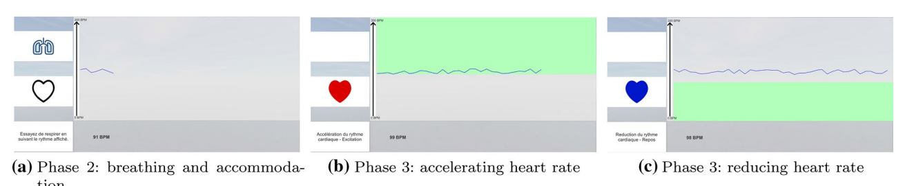
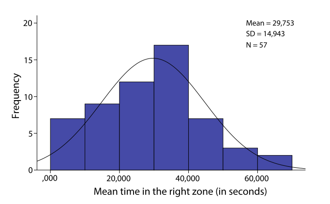
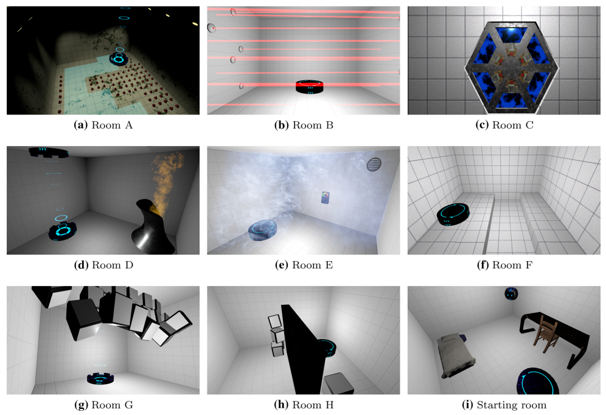

### Effects of voluntary heart rate control on user engagement  and agency in a virtual reality game

> Virtual Reality, 2020(2).

#### Abstract

已有研究表明，虚拟现实(VR)暴露会影响人们对不同情境、认知能力或行为的主观体验。众所周知，一个人的生理状态与他们的心理自我报告和用户体验之间存在着联系。由于身临其境的体验可以对用户的生理数据产生影响，因此基于生理数据反馈(生物反馈)对虚拟环境的内容进行实时调整和增强成为可能。随着生理监测技术的快速发展，现在有可能以一种廉价而又不麻烦的方式开发不同的生物反馈模式，并研究它们如何影响用户体验。虽然大多数涉及生理数据的研究都将其作为一种测量工具，但我们希望研究当直接和自愿的生理控制成为一种交互手段时，它的影响。为此，我们创建了一个由两部分组成的协议。==第一部分旨在对参与者的心率控制能力进行分类==。==在研究的第二部分，我们让参与者沉浸在VR体验中，他们必须控制自己的心率以与游戏中的元素互动==。基于胜任力分布对结果进行分析。我们观察到我们的能力量表和参与者对生物反馈游戏机制的控制之间的一致结果。==我们还发现我们的直接生物反馈机制非常吸引人==。我们观察到，它会产生一种强烈的冲动感，这种冲动感与使用者的心率控制水平有关。我们强调生物反馈作为一种直接游戏机制的丰饶性，为个性化沉浸体验提供了有趣的视角。

#### 1 Introduction

利用生理数据来影响互动体验被称为生物反馈，Riedl等人对此进行了简单的反驳。(2014)被称为“能够识别用户的生理状态并根据该信息实时适应的系统”。研究虚拟现实(VR)中生理学的使用是为了从体验中带来更多(Munoz等人)。2016;戴伊et al。2017)。如果普遍的共识似乎指向这样一个事实，即使用生理生物反馈可以提高用户在VR体验中的参与度，那么它在没有得到充分考虑的情况下就存在一定的局限性(Dekker和Champion 2007;Houzangbe et al。2018年)。在生物反馈方面的研究中，大部分将其作为一种被动的工具来了解用户的状态或适应环境。生物反馈很少是一种主动的游戏机制，是用户有意识地参与的。这就是为什么我们想要研究生物反馈游戏机制，即必须完成游戏的生物反馈机制，是如何影响沉浸式虚拟环境(IVE)中的用户体验的。

为此，我们建立了一个两部分的研究，==第一部分是确定参与者控制自己心率的能力，并将他们分为不同的技能组。我们体验的第二部分将让参与者置身于一个IVE环境中，在那里他们必须主动控制自己的心率来完成游戏==。我们分析了参与者报告的参与感和代理感与他们的能力。

下一节将介绍一项关于自主心率控制的最新技术，将生理自我控制的概念与能动感联系起来，并最终强调生物反馈对用户参与的影响。第3节介绍了我们实验的第一部分(方案和结果)。第4节介绍了我们研究的第二部分(虚拟现实应用，实验设计，结果和讨论)。最后，第5节和第6节对我们的经验和我们工作的结论提出了一个批判性的看法。第7节提出未来工作的可能方向

#### 2 Related work

##### 2.1 Heart rate control

心率是心理-生理状态的一个强有力的指示器(Sarkar等。2014年)，因为它会对情绪刺激(压力、恐惧、快乐)做出调整。为了了解其背后的控制机制，进行了多项研究(例如，Davies和Neilson 1967年;抱有et al。2017)。Sroufe(1971)试图通过一系列实验观察呼吸深度和节奏对心率变异性的影响。在这些实验中，参与者必须按照预先确定的模式(慢、有规律或快)和确定的深度(浅或有规律)呼吸。根据Clynes(1960)、Westcott和Huttenlocher(1961)的研究成果，他的实验结果表明呼吸节奏不会影响心率，但呼吸深度会。此外，Sroufe指出，一种训练策略，通过指导参与者一系列的呼吸方案，并显示出这些方案对心率的影响，似乎可以让参与者更快地获得直接的心率控制

福尔摩斯et al。(1979)研究呼吸和反馈对心率控制的分离和联合作用。他们证明了通过呼吸来加速一个人的心率是可能的。Malcuit和Beaudry(1980)强调了参与者在经历了引起心率加速的应激事件后，能够立即自愿降低心率的能力。以及Manuck等人的研究。(1975)和Stephens等人。(1975)，证明了一个人控制心率的能力。然而，他们的结果在反馈的好处方面有所不同。如果这些研究坚持心率控制经验的重要性，Manuck等人。(1975)指出，他们的结果不支持反馈能立即促进自主心率控制的假设。他们解释说，只有在参与者接受了多次测试之后，反馈才会产生显著的效果。

拉金等。(1990)试图研究自主心率控制对精神运动任务表现的影响。他们使用一个电子游戏来评估参与者在面对游戏提出的挑战时，能够在多大程度上减少自己的心脏反应。通过这种方法，他们试图确定参与者是否有能力在不影响他们在游戏中的表现的情况下学习如何降低心率。他们的结果表明，在训练后，他们的心脏反应更低(自我调节心率的能力更强)。此外，他们还注意到，获得反馈的参与者在从多次训练中获益后，心率普遍较低，这与之前的多次研究结果一致(如Larkin等人)。1989;McCanne 1983)。然而，他们注意到那些从反馈中受益的小组在游戏中的表现更差。他们假设参与者很难同时使用这两种机制。最近，我们可以强调Peira等人的工作。(2014)， who研究生物反馈如何通过控制心率来帮助缓解情绪反应。他们得出的结论是，自主控制自己的心率是可能的，生物反馈在这方面有帮助，并能更好地控制一个人的情绪反应。

Nenonen et al。(2007)研究如何使用心率控制交互式游戏。在冬季两项的运动中，滑雪速度直接用选手的心率来代替。心率高的时候，也会阻碍玩家的投篮。他们得出结论，心率是可以使用的，而且是一种有趣的游戏机制。在最近的一项研究中，Wollmann等人。(2016)评估游戏化的心率变异性训练经验(带有生物反馈)如何影响参与者的动机和参与，并产生更好的结果。在他们的游戏中，参与者必须使用呼吸技术来驾驶飞机以保持飞机稳定。它们证实了电子游戏在激励玩家参与生物反馈训练并提高表现方面的潜力。

本部分的研究表明，主要由于呼吸，它可能会影响一个人的心率。他们还开始将自主心率控制与交互式应用程序联系起来，展示如何使用它来影响用户体验。

##### 2.2 From physiological self‑efficacy to agency

代理感被定义为“整体运动控制的感觉，包括行动、控制、意图、运动选择的主观体验和意志的意识体验”(Blanke and Metzinger 2009)。如果这一定义主要围绕着物理控制，Bandura(1982)解释说，生理上的自我调节能力需要个人代理的工具，因为“人们怀疑他们有能力对自己的行为行使充分的控制，往往会破坏他们在tax能力的情况下的努力。”“代理和代理意识通过控制能力对自我效能感产生影响。”Jeunet et al。(2018)在对代理意识的构建中加入了一个模型，将其分为两个部分:代理的感觉和代理的判断。他们解释说，代理感依赖于三个原则，优先原则(行动的意图立即先于行动)，排他性(一个人的思想必须是结果的唯一明显原因)和一致性(感觉的结果与预测的结果相匹配)。

==自我效能感是一个人对自己有能力完成一项任务的信念==(Bandura 1982, 1993)。Bandura(1997)认为，自我效能感一直延伸到生理和情绪状态。要评价自己的能力，一个人的生理和情绪状态所传递的信息部分是他/她自己的基础。==这些允许调节情绪反应的技术加强了人们对一个人有能力管理压力和提高表现的信念。==

在最近的一项研究中，Weerdmeester等人。(2017)研究生理自我效能在生物反馈增强视频游戏中的作用。他们对游戏《深度》(DEEP)进行了研究，这是一款虚拟现实(VR)游戏，使用呼吸生物反馈帮助玩家管理压力和焦虑。他们报告说，自我效能感越高，唤醒水平就越低。唤醒使用生理唤醒问卷(Dieleman等人)测量。以及使用青少年自我效能量表(Muris 2001)的自我效能感。他们的结论是，深度帮助玩家更好地调节他们的情绪反应。然而，他们的研究需要谨慎对待。事实上，在他们的研究方案中没有一个对照组限制了他们所能得出的结论。其他人研究了在VR体验中加入生物反馈的效果。花(2018)的例子是研究生物反馈对体现和存在的影响。我们还可以注意到Salminen等人的工作。(2018)，提出了生物反馈增强的虚拟现实社会冥想如何影响社会存在和情感依赖。所有这些研究都强调了在VR中整合生物反馈以以各种方式调节用户体验的兴趣。

Weerdmeester等人的工作证明。(2017)， Prpa等。(2018)，生理自我效能感影响虚拟环境中的代理感。此外，有趣的是，生物反馈的使用可以帮助使用者更好地控制他们的生理机能，使他们的控制更加个人化。Jeunet et al。(2018)表明，一个人的控制点影响代理感。==因此，通过控制位点的改变，通过生物反馈，有可能影响代理感的出现，自然地将生理自我效能感与代理联系起来。==

##### 2.3 User engagement

O 'Brien和Toms(2008)开发了一个概念框架来定义用户对技术的参与。他们将参与描述为“一种用户体验的质量，其特征包括挑战、积极影响、耐受性、审美和感官吸引力、注意力、反馈、多样性/新颖性、交互性和感知用户控制。”Hassenzahl等人的研究。(2010)指出了类似但更简单的结论，因为他们将参与划分为两个主要类别:实用品质(系统的有用性和可用性)和享乐品质(对用户的动机、刺激和挑战)。这些模型主要受到FLOW理论(Csikszentmihalyi 1975)的启发，该理论也被许多研究者用作他们的模型和用户参与研究的核心(如O 'Brien和Toms 2010;Wiebe et al。2014;显象等。2016)。==它描述的是“一个人在从事一项活动的过程中，完全沉浸在一种精力充沛的专注感、全身心投入和享受之中的精神状态。==

能够根据生理控制的水平来适应挑战的水平，以创造一种心流状态并产生参与是很重要的。一些研究是为了了解生物反馈对游戏用户参与的影响(Dekker和Champion 2007;Ambinder 2011)和虚拟现实(Dey等。2017;Houzangbe et al。2018年)。这些研究的共识是，生物反馈的使用是一种更高投入的载体(Ohmoto等。2017;Argasiń滑雪等。2018)。然而，生物反馈通常扮演一个附加机制的角色，而用户在体验过程中可能会忽略这个机制。

==通过将生物反馈纳入VR体验，可以增强生理自我效能感，从而改变用户的控制点，有利于更高的代理感==(Jeunet et al.等)。2018)。如果互动体验中生理学的整合能够加强用户的参与(Sra等人)。然而，由于缺乏对生理学的控制，这种效果可能会受到限制。因此，基于能力提供个性化体验并研究心率控制生物反馈机制如何影响用户体验是非常重要的。在我们的研究中，我们==首先希望开发一个心率控制能力量表。然后提出一种虚拟现实体验，在此过程中，自主心率控制是唯一的交互模式==。<u>本研究旨在评估这种机制对用户体验的影响，特别是对用户参与和代理的影响</u>。

#### 3 Study 1: Quantifying heart rate control

==为了量化一个人的心率控制能力，我们开发了一个简单的桌面应用程序，它提出了一系列心率控制练习。它们包括在1分30分钟内加速或降低心率。==

##### 3.1 Apparatus

在这个实验中，我们使用了台式电脑和Mio LINK心率腕带。Mio LINK腕带可以通过照片体积描记术来估计心率值，以每分钟的心跳数为单位。2然而，它不能提供原始的心率数据，限制了计算心率变异性的能力。首先，腕带会估计使用者的心率;一旦完成，它将记录穿戴者每秒的BPM。在我们的不同研究的核心，我们希望探索的潜力，货架设备提供新的互动方案在VR。因此，我们决定使用可穿戴式心率监视器，因为它已经被证明在娱乐和体育应用中足够精确;它也可以很容易地融入到VR体验中(Wang等。2017;束帆索等。2017;Houzangbe et al。2018 b)。

这个应用程序由一个简单的屏幕组成，它显示了参与者需要的所有信息(见图1):

- 在左下角，是他们必须遵循的说明(例如，“增加你的心率”，“降低你的心率，”等等)。

- 在中心，是他们的实时心率图(BPM)，以及他们必须达到的不同心率水平。

- 底部是当前心率值。

##### 3.2 Experimental procedure

首先，参与者被要求阅读并签署一份参与同意书和另一份证明他们没有心脏问题的同意书，并接受将在一系列实验中监测和使用的生理数据。然后他们继续填写实验前的问卷，记录人口统计数据。然后我们向参与者解释实验的不同阶段以及他们各自的目标。我们还指导参与者，他们可以使用任何他们想要影响心率的技术。我们不向参与者建议任何策略，他们自己发展(呼吸，走在原地，坐着等等)。最后，我们会回答他们可能提出的任何问题。然后，我们为参与者配备Mio链接和音频耳机，并启动应用程序。

应用程序被分为三个部分。第一个是一个空白屏幕，告知参与者他们的心率基线正在进行==校准==。为了确定用户的基线心率，我们的协议基于Nogueira等人的工作。以及Dekker and Champion(2007)。应用程序记录150个BPM值，而参与者听音乐“Union 's Weightless”。每秒钟记录一次数值，估计校正持续时间为2分30秒。参与者在此期间保持站立。然后计算这150次记录的平均值，以确定参与者的基线心率。

校准结束后，应用程序切换到第二屏幕，在左上角显示不同的呼吸模式，参与者必须遵循(快速和浅的呼吸模式和缓慢和深的呼吸模式，见图1a)。这些图案由一个动态的肺部图标代表，它在节奏中增长和缩小。这部分的目的是让参与者观察这些呼吸模式对心率的影响。这个阶段的灵感来自Sroufe(1971)的作品，持续2分钟。

学习阶段结束后，实验开始。根据Manuck等人的研究，它包括一系列的8项运动，参与者必须要么提高心率，要么降低心率。(见图1b, c)。每个练习持续1分30秒。每次运动之间有45秒的休息时间。参与者被告知，这个阶段可以让他们的心率恢复到接近基线的水平。我们认为HR达到基线和基线+10BPM之间的参与者成功地重置了他们的HR。这一阶段被证明是有效的，75%(43/58)的参与者在7个休息阶段中的4个或4个以上成功地达到接近基线的HR。

连续的练习是随机的。但在实验过程中，同一类型的运动(增加心率或降低心率)只能连续发生一次。在锻炼过程中，参与者必须尽可能长时间地将心率保持在指定的区域内。屏幕上的区域用绿色区域表示，心率必须在其中。

为了确定不同的心率控制值，我们与团队的不同成员进行了一系列的预测。这些预测包括让多人做两次实验来评估他们能达到和不能达到的价值，以确定什么程度的挑战是可以接受的。每做一次练习，难度都增加了。这样做是为了评估每个参与者的心率控制能力。

- 对于心率的加速，需要达到的目标如下(或更高):

1. baseline value + 20 BPM;
2. baseline value + 25 BPM;
3. baseline value + 30 BPM;
4. baseline value + 35 BPM.

- 为了降低心率，需要达到的目标如下(或更低):

1. baseline value + 5 BPM;
2. baseline value;
3. baseline value − 5 BP;
4. baseline value − 10 BPM.

<u>在我们的预测试结果之后，我们决定将第一个减少值稍微高于基线值，这样做是为了补偿实验环境固有的潜在压力诱导过程。</u>

##### 3.3 Measures

在实验之前，参与者要回答一份简短的问卷调查，询问他们的年龄、性别、身体状况以及锻炼的频率。实验结束后，我们问他们在多大程度上能够控制自己的心率、心率的加速和减速。

为了评估参与者控制心率的能力，在实验过程中记录心率以及每次运动中他们在指定区域停留的时间。

本实验共招募了58名参与者(14名女性，44名男性)，年龄在21 - 44岁之间(M = 25.58, SD = 5.628)。由于实验过程中的技术问题，我们不得不将一名参与者从我们的小组中删除。

##### 3.4 Results

为了衡量参与者在不同条件下的成功程度，我们计算了他们在每一轮试验中在指定的心率区域停留的平均时间。==同一时间在指定区域的Shapiro-Wilk检验不能验证分布的非正态性(Shapiro-Wilk’s p = .207，见图2)==。从定性的观点来看，我们观察到分布似乎遵循一种正态分布，向左不对称。使用Spearman相关检验，我们发现记录的心率基线和心率自我调节能力之间没有统计学相关性(p = .474, r = .097)。使用斯皮尔曼相关检验(p = .051, r = .260)，我们也没有观察到参与者报告的身体状况水平与他们成功地将心率保持在正确区域之间的统计相关性。虽然几乎不显著，但相关系数很弱，因此我们不能得出两者之间有任何相关性的结论。

然后，我们计算了在指定区域内“增加心率”和“降低心率”练习1和练习2的平均时间的不同四分位数，以估计一个可接受的时间框架，并开始对参与者进行分类。由四分位数定义的不同时间间隔表示“心率增加”:[0;19[年代,[19;37[年代,[37;62[s和[62 - 90]s。对于“降低心率”:[0;19[年代,[19;32[年代,[32;48[s及]48;90]。

基于这些时间值，我们减少了我们的小组，考虑了36名参与者，他们能够达到第一个四分位数(10秒的心率控制)的至少一半时间来计算新的四分位数。因此，我们重新计算了时间间隔，结果是[12.5;29[年代,[29;48(年代,[48;65.5[s和]65.5;为“增加心率”试验准备90秒。而“降低心率”试验的界限是:[12.5;28[年代,[28;36[年代,[36;50[s和]50;90]。这些区间允许我们对每个试验类型的参与者进行分类，从0(无法)到4(强)，并计算这些分数的平均值，从而对57个初始参与者的能力有一个明确的结果:

- 21人没有成功地控制心率(9人没有成功地加速心率，11人没有成功地降低心率，1人两者都没有成功)。
- 2人被认为在控制心率方面很弱。
- 13人被认为在控制心率方面有规律。
- 13人被认为擅长控制心率。
- 8人被认为在控制心率方面很出色。

#### 4 Study 2: Voluntary heart rate control  in a virtual reality experience

##### 4.1 System

==遵循与本文中第一个研究相似的模式，我们开发了一款沉浸式虚拟现实游戏，该游戏将使用参与者的心率作为游戏机制。这个游戏包含了一系列的8个心率控制练习，每一关一个。==

###### 4.1.1 Apparatus

本次实验使用的是HTC Vive VR系统、台式机(由Intel Core I7-6700HQ @ 2.60 GHz处理器和Nvidia Geforce GTX 1080显卡组成)和耳机。根据我们之前的研究，我们使用Mio LINK心率腕带来记录心率值。导航空间设置为3×3平方米。

###### 4.1.2 Influence of the physiological data

参与者通过在一段时间内达到特定的心率值来解锁每一关的结束。根据本文第一次研究的结果，我们选择的心率阈值为:(1)在降低自身心率时，达到基线值且更低;(2)在提高自身心率时，达到基线值+ 20bpm且更高。

为了给参与者反馈他们的心率，==每个房间都有一个与之相连的特殊机制。下一节将描述不同的交互==。为了诱导一种“代理感”，我们希望将心率的影响与虚拟环境中的“逻辑”结果联系起来(例如，心率越高，火越大，心率越低，气体的体积越小，等等)。事实上，Groenegress等人已经证明了这一点。(2010)在VR中锚定生理数据可以增强用户与VR环境的关系。这与Jeunet等人提出的一致性原则有关。(2018)。

###### 4.1.3 VR game

我们在一定程度上受到portal3的启发而开发了一款游戏。游戏放置在一个未来主义的实验实验室中，由一系列房间组成，每个房间都拥有自己独特的机制和互动。游戏开始于一间家具齐全的房间，角落里有一架漂浮的无人机。为了使我们的生物反馈游戏机制适应于每个参与者，我们在每个实验开始时都有一个校准阶段，与本文第一项研究中呈现的相同。在VR环境中，在开始室进行校准(见图3i)，在此期间，参与者可以探索房间，但请不要过于活跃，以免不必要地提高心率。参与者可以在虚拟环境中自然导航。校准结束后，无人机会向参与者解释背景并给出指令。

参与者通过走到传送器来换房间，一旦房间的任务完成，传送器就会启动。在每个房间之间，他们在一个有音乐声的像电梯一样的空房间里等待。游戏中出现的不同房间是:

- Acc房间A(见图3a):房间陷入黑暗，钉鞋乱扔在地板上。墙上的聚光灯逐渐照亮，显示通往传送者的安全通道。聚光灯将逐步开始照明时，心率超过阈值。
- Dec房间b(见图3b):房间里充满了激光，阻挡了通向传送器的通道。当心率低于阈值时，激光变成部分透明。
- Dec房间c(见图3c):房间被一扇门一分为二，玩家手持一把枪。一旦传送器激活，枪就会激活，参与者可以向门射击，直到门打开。在心率低于阈值足够的时间之前，枪是不活动的。
- Acc的房间D(见图3d):房间里有一个火盆，它会变得越来越大，直到传送器激活。只要心跳超过阈值，火焰就会燃烧。
- Dec房间E(见图3e):房间充满气体，一旦气体被清除，传送器就会启动。当心率低于阈值时，气量会减少。
- Acc的房间F(见图3f):房间里有一个通电的地板，将玩家和传送器分开，一个桥会逐渐移动，让参与者到达房间的另一边。当心率超过阈值时，桥移向起点平台，直到桥与起点平台连接。
- Dec房间G(见图3g):房间被一堆不能移动的立方体一分为二。一旦传送器被激活，重力就会改变，立方体开始漂浮，释放出通往另一边的通道。当心率低于阈值足够一段时间后，重力设置为。
- Acc的房间H(见图3h):房间被墙分成两半。一旦传送器被激活，墙就会碎裂，允许进入另一边。一旦心率超过阈值足够长的时间，墙就会碎裂。

在每个房间开始时，会向参与者发出特定的指示:“完成这间房间:提高心率”或“完成这间房间:降低心率”。在每次试验中，屏幕会向参与者展示他/她当前的心率和他/她必须达到的目标。一旦他们进入指定的心率区域，不同房间的机制就会逐渐活跃起来。参与者必须在指定区域待一段确定的时间(见第4.3节)，以便充分激活机制和传送器完成试验。他们最多有1分钟30秒的时间来完成每个房间。如果他们没有及时完成，他们会被自动传送到过渡室(电梯);这样做是为了让玩家充分体验游戏。

==房间的顺序在发射时是随机的。当他们完成8个不同的房间==，参与者被传送回开始的房间和游戏结束。

##### 4.2 Participants

从之前实验的57名参与者中，我们选择了30人参加第二部分(见第3.4节)，其中女性8人，男性22人，年龄在21 - 43岁之间(M = 25.87, SD = 5.237)。我们根据参与者的可用性和他们的能力水平来选择这个小组。从以前的分类研究:8参与者没有成功心率控制(5未能降低心率和3未能加速心率),8定期控制心率,8擅长控制心率,6在控制心率异常。执行我们的分析,我们分开参与者在两个主要团体:“低控制”集团(LCG),由8个参与者没有成功和8个参与者定期控制心率,和“高控制”组(HCG),由8个参与者,善于控制他们的心率和被认为是特殊的6控制心率(见“附录”的详细分布)。

在“你对虚拟现实有多熟悉?”(1 =“没有经验”，5 =“这是我的工作工具”)”，平均得分为4.63 (SD = .669)。我们特意选择了具有VR经验的玩家，以避免他们更专注于发现技术而不是充分体验游戏。

##### 4.3 Variables and measures

能力是我们学习的核心;因此，我们以不同的难度开发了两个版本的游戏，每个参与者测试两个版本的游戏。难度和胜任力作为自变量:

困难:

1. 低难度(LD):参赛者必须在每个房间内将自己的心率保持在指定区域10秒(累计)。

2. 高难度(HD):在每个房间内，参与者必须将心率保持在指定区域20秒(累计)。

能力组:

1. 低控制组(LCG):指心率低到无法控制的参与者。
2. 高控制组(HCG):对心率有良好控制的参与者。

基于第一个研究的结果，我们决定影响控制时间框架是一个合适的难度机制。此外，由于第一项研究的结果，我们已经有了可用的时间框架。LCG由未能成功维持10秒框架的参与者和被认为在心率控制方面能力不强的参与者组成。因此，我们选择了时间框架来允许参与者在第一个困难中取得一定的成功(以减少挫折感和无法完成任务的能力)，但在第二个困难中(对于LCG来说)却很困难。

为了获得参与者对体验的反馈，我们根据文献中存在的多份相关问卷制作了一份问卷。用户参与￾表示“状态”,我们研究问卷调查(1998年威默和歌手),用户参与规模(问题)(Wiebe et al。以及游戏用户体验满意度量表(GUESS) (Phan等。2016)和选择sub-metrics与我们的研究相关:感知可用性,觉得参与,个人的满足和集中衰减器￾。关于我们问卷中的代理部分，我们研究了Argelaguet等人的工作。(2016)和Gorisse等人。(2017)，并重新制定了问题，以便关注心率机制。我们所有的问题都基于5分语义尺度的差异(见表1)。

我们记录了客观变量(试验完成的总时间，失败的房间数量)和基于参与者体验后反馈(问卷和半结构化访谈)的定性数据。

参与者在游戏中经历了这两种困难，顺序相同。首先是低难度(LD)，然后是高难度(HD)。难度水平是建立来提供特定的挑战水平。两组参加者均可使用乐活中心，而房署自然对乐活中心构成强烈挑战。互动体验中的参与和代理是通过达到和保持一个相对的流动状态(困难和能力之间的平衡)来制约的。缺乏平衡会产生挫折感并恶化用户体验。心率控制是一个需要掌握的复杂游戏机制。缺乏对游戏机制的控制会导致玩家对游戏体验的高度沮丧和不感兴趣。通过不平衡我们的条件，参与者有可能体验到困难的逐步增加。这创建了一个学习曲线，让我们的经验提出一个挑战，平衡难度和能力(流)。通过这种方式，我们可以限制挫折感的影响，并在一定程度上确保我们的参与者能够充分体验游戏及其机制。

##### 4.4 Experimental procedure   实验步骤

参与者首先回答一份简短的问卷调查，询问他们的虚拟现实体验、对网络疾病的敏感性和游戏习惯。然后我们向他们解释，他们将根据与他们第一次参与的实验相似的原则进行体验，除了这次是在VR中。我们向他们解释了游戏体验的不同部分(但没有详细说明不同的房间)以及他们应该如何完成游戏。参与者不被告知他们属于哪个组(LCG或HCG)，不能影响他们的比赛结果。如果有什么地方出了差错，我们会回答参与者提出的有关实验的问题。然后我们继续为参与者装备腕带和VR耳机。

一旦他们完成了LD条件，参与者回答实验后的问卷，并再次准备做HD条件。然后他们回答问卷第二次,我们有助短半结构化访谈收集信息关于他们的个人动机在虚拟现实体验相比,他们的动机在第一次non-VR经验,他们喜欢条件(LD、HD)以及他们如何看待困难的比赛。

##### 4.5 Hypotheses

- H1:直接心率生物反馈的使用是一种引人入胜的游戏机制。

- H2:用户参与度(通过感知可用性、感觉参与、个人满足感和集中注意力来衡量)与自主心率控制能力水平成正比。

- H3:直接心率生物反馈的使用诱发了高度的代理感，与能力水平相关联。

##### 4.6 Results

我们从两个不同的角度分析我们的结果，一个是被试之间的设计，比较能力组的结果(LCG vs. HCG，独立的措施)，另一个是被试内部的设计，比较游戏的两个难度级别(LD vs. HD，重复措施)的结果。为了评估在问卷回答的能力和困难之间的相互作用，我们使用混杂的内方差分析(能力 * 困难)，即使我们的措施不遵循正态分布。然而，我们的这个决定是基于Winer(1962)关于ANOVA对type 1错误的鲁棒性的工作。然后，当方差分析显示两个因素(能力 * 难度)之间存在交互作用时，我们使用后特设的Mann-Whitney检验来进行受试者之间的比较，或后特设的Wilcoxon签名等级检验来进行受试者内部的比较。

###### 4.6.1 Perceived usability  感知易用性

本研究之混合内间方差分析结果显示，在两个题目中，参赛者的难度与能力均无显着的交互作用。对于PU1、PU2和PU5，难度和能力对这些问题没有显著的影响。对于问题PU3 (Wilk’s Lambda = .644, F(1,28) = 15.458, p = .001，部分eta平方= .356)，难度有实质影响。尽管低p值,错误发现率测试表明没有显著影响的困难问题PU4 (Wilkλ= .853,F (28) = 4.816, p = .037,部分埃塔的平方= .147)和PU6 (Wilkλ= .841,F (28) = 5.293, p = .029,部分埃塔的平方= .159)。结果如表2所示，表明低难度比高难度有更好的感知可用性。即使p值很低，一个错误发现率检验表明，参与者的能力对问题PU6的分数没有显著影响(p = .01，部分eta平方= .215)。

###### 4.6.2 Felt involvement  感觉涉入

我们的混合内间方差分析的结果表明，只有在问题FI1 (Wilk’s Lambda = .759, F(1,28) = 8.894, p = .006，部分eta平方= .241)参与者的难度和能力(能力*难度)之间存在显著的交互作用。问题FI2, FI3, FI4没有显著的交互作用，难度和能力对这三个项目也没有显著的影响。

我们首先根据FI1的能力组分析结果，并应用Bonferroni校正(p < .0125)。当我们仔细观察时，我们发现LCG的难度水平没有明显的差别。HCG没有报告明显不同的分数取决于难度，但只有一个轻微的趋势(p = .014, Z =−2.449)。我们可以看到，高难度(M(HCG-HD) = 3.86, SD = .864)比低难度(M(HCG-LD) = 3.43, SD = .756)得分更高。表3报告了全部结果。

虽然我们不能得出感觉受累程度如何直接受到影响的结论，但我们观察到，对于高难度(HD)， HCG的感觉受累程度总体上有更好的报告趋势。LCG报告了不同的反应，一些倾向于低难度(FI1)和第二个(FI4)。我们无法得出控制对所有参与者参与的影响有多大的结论;然而，我们可以观察到，与第一次相比，在高难度时HCG有轻微的高累及倾向。

参与者经历了两次相同的经历，但只有一次困难的改变，这一事实或许可以解释这些结果。事实上，一些参与者在实验后的访谈中表示，他们更喜欢高难度的游戏，一位LCG的参与者表示，“[他/她]可以更好地享受这个环境和游戏，它更具有挑战性，[他/她]感到更有参与感。”相反，另一名参与者报告说，“他/她更喜欢难度低的那一项，因为它更多地涉及到环境的发现，而第二项较少涉及。”

###### 4.6.3 Personal gratification   个人满足感

我们的混合内间方差分析的结果显示，对于我们的两个关于个人满足的问题，在难度和参与者的能力(能力*难度)之间没有显著的交互作用。问题PG1、PG3、PG4、PG5对难度和胜任力没有显著影响。问题PG2和PG6对胜任力没有显著影响。

尽管p值较低，但错误发现率检验表明，难度对PG2得分没有显著影响(Wilk’s Lambda =)。F(1,28) = 4.491, p =。043偏eta²=。138 PG6 (Wilk ' =。830, F(1,28) = 5.723, p =。024，偏eta²= 0。170)看一下表4的结果，我们注意到参与者似乎在高难度中获得了更多的奖励，因为它“感觉更有挑战性，难度更令人满意。”“然而，由于缺乏重大差异，我们无法得出有力的结论。

令人惊讶的是，在LD条件下，我们并没有观察到LCG的更高的个人满足感，一些参与者甚至报告说，在这个条件下，困难太简单了，没有第二个条件那么有成就感。

我们还进行了一系列T测试来衡量,如果个人满足得分明显高于中性(3)值。结果表明,满足明显高于中性报道问题PG1 (p =措施),PG2 (p = .007), PG3 (p <措施),PG4 (p <措施)和PG5 LD (p = .017)的条件,明显高于中性PG1 (p =措施),PG2 (p <措施),PG3 (p <措施),PG4 (p <措施),HD条件下PG5 (p < .01)和PG6 (p = .007)。这表明我们的参与者非常满意这次经历。

###### 4.6.4 Focused attention   注意力

尽管有一个低的p值，一个错误发现率测试表明，我们的混合内间方差分析的结果显示，对于问题FA3 (Wilk’s Lambda =)，没有显著的交互作用(能力*难度)。F(1,28) = 5.996, p =。021，偏eta²=。176)问题FA1和FA2在这两个因素之间没有显著的交互作用。

方差分析表明问题FA1 (Wilk’s Lambda =)的难度有显著的较大影响。761, F(1,28) = 8.794, p =。006，偏eta²=。239)我们可以观察到，低难度(n = 30, M(all-LD) = 2.60, SD = 1.329)比高难度(n = 30, M(all-HD) = 3.30, SD = 1.317)时，被试注意力不那么集中。

这指向了一个事实，即参与者需要更加集中在游戏的高清条件下，因为它是更严格的控制他们的心率，加入前面的部分的结果，困难是更有回报和游戏更难掌握。

###### 4.6.5 Agency   代入

我们的混合内间方差分析的结果显示，没有显着的交互作用(能力*困难)，我们的问题都没有关于代理。此外，问题AG3对难度和能力都没有显著的影响。我们观察到能力对AG1的影响的趋势(p =。079，偏eta平方= .106)，HCG报告更好的机构感。

我们还注意到问题AG2难度的一个重要影响(Wilk’s Lambda =)。754, F(1,28) = 9.128, p = .005，部分eta平方= .246)，与高难度(n = 30, M(all-HD) = 3.83, SD = .950)相比，低难度(n = 30, M(all-HD) = 3.13, SD = 1.042)的参与者报告更高的分数。LCG的参与者没有报告在HD期间对AG2问题的较低的代理意识，但只有轻微的趋势，在Bonferroni校正(p =。027年,Z = -2.216 M (LCG-LD) = 3.75 M (LCG-HD) = 2.94)。完整的结果显示在表5中。

总的来说，我们观察到HCG参与者报告的代理感似乎比LCG参与者更高;这在高清环境下尤为明显。尽管在高难度条件下，HCG报告的难度比LD条件下更高，但在高难度条件下，HCG感觉有更强的代理意识，因为这更符合他们的能力。另一方面，LCG的参与者在低难度时表现出更好的代理意识。

我们还进行了一系列T测试测量如果分数报道机构(3)明显高于中性值。结果表明,该报道的机构是明显高于中性问题AG3 (p <措施)(LD和HD)在这两个困难。这倾向于证明，在我们的实验中，参与者只使用他们的心率作为控制范例，他们感觉到一种强烈的能动性。

###### 4.6.6 Objective results   客观后果

我们的混合内间方差分析的结果显示，对于失败的试验数量和合并任务时间，没有显著的交互作用(能力*难度)。关于客观数据，我们预期LCG参与者的表现会明显低于HCG参与者，因为失败的试验更多。然而，我们发现两个能力组(LCG和HCG)和两个难度级别(LD和HD)之间没有显著差异。有趣的是，大多数参与者在没有被预测的情况下成功地克服了这两个困难。事实上，在低难度(M(LCG-LD) =时，失败房间的平均数量为0.73。75, M(HCG-LD) = .714)和0.97在第二个(M(LCG-HD) =。8125, M(HCG-HD) = 1.14。在每一个困难中，我们的30名参与者中有16人在游戏中每次尝试都成功了(每个困难组中有8人)。关于完成所有房间所需要的平均时间，HCG的参与者在低难度中得分较低(HCG的356秒vs LCG的383秒)。然而，这一结果对于高难度的参与者登记几乎相同的平均时间(LCG的447秒vs HCG的448秒)是不同的。

##### 4.7 Discussion 

#### 5 Limitations

在实验后的访谈中，大多数参与者都表示VR游戏体验对他们的动机和成功有很大的影响。这是我们工作的一个局限。这可能会导致参与水平的改变，并模糊了我们根据预实验的结果所做的分类之间的界限。在游戏化的VR环境中进行预实验并比较心率控制的结果可能会很有趣。这可能导致对我们之前考虑的间隔时间进行重新定义，并更好地区分参与者之间的控制水平。然而，这对参与者来说可能是很紧张的，因为预实验持续了很长时间，在30分钟的时间里让参与者完全装备好并沉浸其中可能会不舒服。

我们的实验的第二部分发生在第一个实验的几周后，我们的一些参与者无法进行VR体验。受其可用性的限制，我们建立了小组，以便有一个最大的参与者，同时仍然保持一种形式的同质分布的能力。在后续的实验中，使用一组直接遵循我们能力正态分布的参与者会很有趣。

我们还可以强调该协议可能产生的学习效果。事实上，参与者经历了两次相同的游戏，这可以帮助他们更好地学习和掌握心率机制。在我们的结果和讨论中，参与者对游戏的重复有不同的感受。一些人喜欢他们的第一个游戏，而另一些人喜欢第二个。这是对HD情况的结果的一种可能解释，因为参与者能够成功，无论他们是哪一组的一部分。然而，如果这可能对结果的影响超过预期，这是我们实验设计中不可分割的一部分，提出了挑战的逐步上升，并结合学习效果，让参与者在体验过程中保持相对的心流状态。

#### 6 Conclusions

在本文中，我们设计了一系列实验来研究自愿心率控制机制对虚拟现实体验中用户参与和代理感的影响。我们假设这种游戏机制可以是高度吸引人的，并能激发高水平的代理。我们还假设用户参与和代理感是与一个人控制心率的能力相关联的。

我们能够将第一项研究的结果直接转化为虚拟现实体验，该研究包括量化可接受的心率控制水平，并将参与者按技能类别进行分类。我们证明了直接自愿心率生物反馈的使用能够给我们的参与者带来高水平的参与。我们也能够观察到仅将心率作为游戏机制的参与者对代理感的显著影响。

在与参与者的讨论中，他们中的大多数人都对自己所经历的一系列经历持积极态度，其中一些人甚至觉得这些经历帮助他们更好地理解了如何影响自己的心率。

虽然心率控制可能不会直接被认为是VR中交互的一种手段，但这些结果的有趣之处在于心率对用户体验不同部分的影响。已有研究表明，VR暴露会影响主观体验、认知能力(Banakou等)。或行为(Gorisse等人)。2019)。因此，通过我们自己的生理数据来修改它也会有显著的效果。此外，VR已被广泛应用于暴露治疗(Bouchard等。和临床心理学(Bouchard and Rizzo 2019)，证明了多种益处。布沙尔et al。(2012)得出沉浸式电子游戏中生物反馈的使用对士兵压力管理技能的强化有积极的影响。因此，利用生理数据作为直接的感觉渠道可以更好地帮助那些与心理社会适应问题或情绪调节不稳定作斗争的人。

#### 7 Future works

尽管VR实验产生了很高的参与度，但有趣的是，一些参与者对缺乏直接互动感到有点沮丧。然而，由于我们想将自主心率控制作为一种直接机制来研究，所以我们决定不引入额外的游戏机制。在进一步的研究中包括更直接的物理交互作用可能会很有趣。运动和心率控制的结合可能很难保持平衡，因为运动会影响心率，同时认知负荷对使用者来说可能有点大。此外，我们决定不反对在传统交互设备(游戏控制器)上使用心率。在未来的研究中，有一个正确的情境化交互，可以通过心率或控制器来完成，并比较它是如何影响用户体验的，这将是很有趣的。我们希望扩大用户的面板，以更好地区分参与者的能力组。最后，我们计划提出一种平衡的VR体验，它将帮助我们衡量学习效果，以便更好地区分它对用户体验的影响。

#### 8 Ethics statement

在我们进行研究时，我们咨询了我们的机构，认为我们不需要通过伦理委员会验证该研究。此外，我们遵循Madary和Metzinger(2016)提出的建议，特别是非致病原则和知情同意原则。参与这项实验的小组成员包括来自虚拟现实培训课程的成年学生和自愿参加实验的虚拟现实专业人员。在我们的设置中集成的非侵入性设备是被我们征求的对象经常使用的，并且对公众开放。此外，我们的协议保持了受试者的匿名性。

