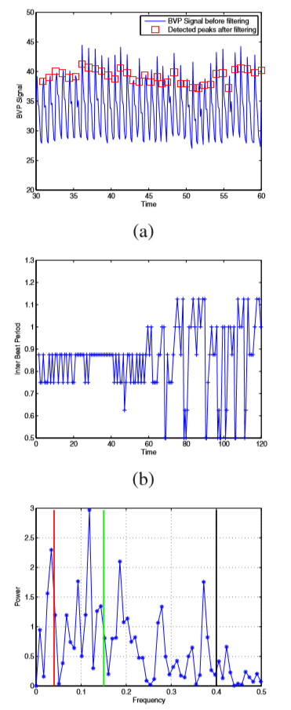

### Emotional State and Cognitive Load Analysis using Features from BVP

…………

我们使用从BVP传感器获得的信号，根据每分钟的节拍数(bpm)来确定心率(HR)特征。研究表明，HR值的增加意味着觉醒和[31]值的增加。在[25]、[32]中也表明，HR与价电子正相关。此外，计算机版本的Stroop测试已经被报道引起一个稳定的，可重复的心率[33]的增加。我们获得心率变异性(HRV)信号[34]，其中HRV信号的光谱特征在处理心理生理信号中变得有用，通过计算BVP信号的拍间间隔。例如，较高水平的认知负荷与HRV频谱[35]、[36]、[37]的低频(LF)波段的功率下降有关。

…………

BVP传感器用于检测测试过程中受试者的心脏活动情况。心脏的特征之一是由BVP传感器获得的心率(HR)，其单位是每分钟的心跳数(BPM)。一个BVP脉冲由两个峰组成，如图3-(A)所示。在这里，我们首先使用一个截止频率为1 Hz的低通滤波器来去除BVP脉冲相对较小的峰值，然后使用峰值检测器来找到滤波信号的峰值(也由图3-(a)中的红色标记表示)。然后，3-(b)所示的心率变异性(HRV)信号通过计算后续脉冲峰值之间的搏动间隔得到。然后对HRV信号[34]进行傅里叶变换，得到HRV频谱。如图3-(c)所示，将某受试者的HRV频谱划分为3个区间。0-0.04 Hz间隔对应甚低频(VLF)波段，0.04-0.15 Hz间隔对应低频(LF)波段，0.15-0.4 Hz间隔对应高频(HF)波段[1]。非常低的频率(甚低频)域不是分析在这项研究因为甚低频评估从短期录音(< 5分钟)已被证明是不可靠的措施,根据项目组的欧洲心脏病协会和北美社会的节奏和电生理学[38]。LF波段与交感神经和副交感神经活动有关

…………

我们也可以从SC和BVP传感器获得进一步的特征，以及我们可以包括从不同的生物反馈传感器获得的其他心理生理信号，如呼吸、皮肤温度等。在本研究中，我们仅使用SCR、HR和LF传感器进行情绪状态和认知负荷分析。作为未来的工作，我们计划添加更多的功能，并旨在区分情绪状态，落入所有象限的a - v平面。例如，SCR可能由于兴奋和过度紧张而增加，因为这两种情绪都暗示着高水平的觉醒。为了更好地区分正价和负价，需要提取更多的特征。为此，我们可能需要选择其他能够明确针对感兴趣的情绪的情绪激发方法。