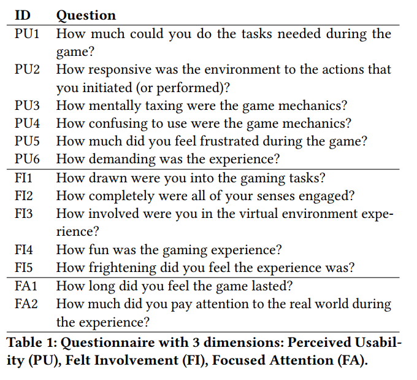

### Fear as a Biofeedback Game Mechanic in Virtual Reality: Effects on Engagement and Perceived Usability

> Foundations of Digital Games 2018 (FDG'18)

#### ABSTRACT

虚拟现实(VR)现在是一种负担得起的技术，并开始渗透到大众市场。提供可访问的解决方案来增强VR体验是至关重要的。在本文中，我们将穿戴式解决方案作为虚拟现实交互的一种手段，加入生物反馈机制。我们假设在虚拟现实体验中使用生物反馈循环可以增强用户的参与度。我们创造了一个生理增强的恐怖游戏加上一个心率监视器智能手环。我们评估了有或没有生物反馈的玩家的参与度。我们观察到参与者对生物反馈非常感兴趣，并强调当生物反馈机制完全融入体验时，参与者的参与度会更高。

#### 1 INTRODUCTION AND RELATED WORK

在虚拟现实中，用户体验包括多种因素:沉浸感[4,23]、现实感[5,15]、参与性[19]、情感、技能和更多[24]。考虑到这些方面以及关于这一主题的大量文献，我们将重点放在了参与性的概念上，这是VR体验的核心组成部分。O 'Brien等人开发了一个概念框架来定义用户对技术的参与。他们将参与描述为“*一种用户体验的质量，其特征包括挑战、积极影响、耐受性、审美和感官吸引力、注意力、反馈、多样性/新颖性、交互性和感知用户控制* ”。Hassenzahl等人[11]的工作指向了类似的更简单的结论，因为他们将参与划分为两个主要类别:实用品质(系统的有用性和可用性)和享乐品质(对用户的动机、刺激和挑战)。从这些研究中衍生出多种尺度来衡量用户在游戏和人机交互系统中的参与度[20,25]。Lessiter等人[12]将存在定义为多模式的，由许多因素组成，每个因素都是一个杠杆。他们特别强调了存在和参与之间的相互影响，通过报告存在的四个因素的解决方案:物理空间、参与、自然和第四个衰减因素，负面影响。

就像最近的Geslin[10]一样，Bouvier[5]捍卫了存在和情感之间的联系，并解释了存在的感觉只有在经历持续地承载情感时才能持续。这一观点得到了多项研究的支持，比如Price和Anderson[21]的研究表明，简单的情绪诱导环境(如喜悦、悲伤)会积极地影响在场感。Banos et al.[3]和Riva et al.[22]得出了类似的结论。

<u>这些研究的贡献驻留在诱发情绪的能力通过一个虚拟环境,知道多少这些允许用户将更多投资于他正在经历什么,控制了“flow”(定义为Csikszentmiahalyi[7],”一个人的精神状态的操作执行一个活动是完全沉浸在一个充满活力的焦点的感觉,充分参与,在活动的过程和享受。”)</u>。

创建这种“flow-perfect”环境的一个可能的解决方案是根据用户的多种生理数据记录实时诱导情绪。这将允许根据每个用户的个性和目标来调整存在和情感诱导模式。在虚拟现实中，研究者正在研究用户的情绪个性、自主神经系统(ANS)活动水平与虚拟环境[6]适应性之间的关系。其他的研究是在游戏中进行的，旨在测量玩家的生理数据，以增强游戏体验[2,13]，特别是VALVe studio的[1]实验室。一些研究也尝试使用生物反馈来在视频游戏中创造新的游戏机制[8,16,17]，例如通过改变化身的速度来依赖于呼吸速率，或者通过改变游戏中的天气。这些研究的结果表明，参与者欣赏游戏的生理增强版本，认识到生物反馈可以增强电脑视频游戏的参与性和用户体验。

Dey等人[9]最近使用了生理学和VR来分享玩家之间的情感状态，并观察同理心如何影响用户体验。通过分享虚拟现实中玩家的生理状态和情感，他们试图研究虚拟现实如何影响玩家在协作界面中的行为。他们的研究结果强调，当参与者看到其他玩家的心率时，他们对其他玩家更感同身受，也更投入，在游戏过程中交流得更多。

根据我们的文献研究，==我们注意到在VR中整合生物反馈回路以增强用户体验的巨大潜力。研究新型的可承受虚拟现实的交互机制是非常重要的。在这项研究中，我们调查了生物反馈循环对虚拟现实中玩家参与的兴趣。我们的目标是更好地理解这些新的游戏机制设计==

#### 2 SYSTEM

为了研究生物反馈循环的效果，我们创建了一款基于Unity 5游戏引擎的增强VR恐怖游戏。本节详细介绍了设置和开发的应用程序。本次实验使用的设备为HTC Vive VR系统，台式PC (Intel Xeon E5-1603, 8GB内存，Nvidia Geforce GTX 1060显卡)，Mio LINK心率腕带和耳机。导航空间设置为3×3平方米。在生理方面，==我们使用了Mio LINK，一种能够测量心率的智能腕带==。心率可以让我们估计用户的心理生理状态，从而解释一些基本的情绪。

##### 2.1 VR Game

体验的目的是让用户产生恐惧，这是产生[9]的最简单的情感之一。Lobel等人的[14]也证明了恐怖生物反馈增强游戏对心理-生理研究的兴趣。为此，我们开发了一种受维多利亚时代启发的沉浸式环境(比如dishonor 21游戏)。这种体验发生在庄园的一个房间里，这个房间与Vive的追踪区域相匹配。我们选择将玩家锁在一个狭小的空间，以增强恐怖感。主房间俯瞰两个相邻的房间和一个楼梯。它配备了一个烟囱、一个烛台和一盏枝形吊灯来照亮这个地方。游戏的声音设计也是焦虑诱发过程的一部分。放置在烟囱上方的音乐盒将在整个游戏中播放音乐。此外，空间化的步音、余烬的噼啪声和门窗的嘎吱声也增加了这种体验，增加了令人焦虑的气氛。

为了创造一种吸引人的体验，我们增加了一个目标，参与者必须延迟一个被噪音吸引的生物的到来(典型的恐怖类型“小女孩”)。该生物可以随机出现在主房间的每个入口(两个相邻的房间和一个楼梯)。为了远离噪音，参与者必须通过关闭门和音乐盒来限制噪音，在体验过程中，这些门和音乐盒会不断地随机打开。当该生物出现时，她慢慢地向玩家走去。她得到的越近，她走得越快，在冲向玩家之前，用四脚走。玩家配备了手电筒，可以照亮生物使其消失。如果他/她不能，那么游戏将随着该生物的攻击而结束。如果他/她成功了，那么这个生物会暂时消失，然后在噪音太大时再回来。快速教程阶段结束后，夜幕降临，如果参与者在夜晚存活了5分钟，那么太阳升起，游戏结束。

##### 2.2 Influence of the physiological data

###### 2.2.1 Calibration 校准

为了估计一个参与者的心理生理状态，我们分析了生理数据的演变与他/她的休息估计。为了确定用户的静息心率值，我们基于Nogueira等人[18]、Dekker和Champion[8]的研究成果提出了解决方案。<u>我们记录用户在2分钟30秒内的心率值(150个记录的BPM值)。每个参与者在这段时间里听音乐“Union’s Weightless”(坐着1分钟，然后站起来1分钟，因为两种姿势的心率可以变化)。然后计算150次记录的平均值，以确定参与者的静息心率。</u>

###### 2.2.2 Biofeedback

为了研究生物反馈对用户体验的影响，由Mio智能穿戴设备监测的心率数据影响了游戏的不同元素。当心率显著增加时(比校准值每分钟15次)，烟囱发出的光会减弱，门和音乐盒的打开频率会增加。当用户的心率比校准值(该值是在初步用户测试后确定的)高于20 BPM时，用户会听到微弱的心跳。如果他/她比标定值多30次/分，则心跳声更快更响。如果用户的心率比校准值每分钟超过40，则用户的视野开始缩小。它可能完全被阻塞，使用户处于黑暗中。如果参与者的心率低于这些阈值，并且更接近校准值，那么修改后的元素就会恢复正常功能，从而鼓励用户保持冷静以降低游戏难度。

#### 3 USER STUDY

##### 3.1 Variables and measures

生物反馈的存在被用作一个自变量。本实验将按照受试者间设计进行:

- 没有生物反馈:游戏没有被生理循环增强。
- 主动生物反馈:游戏通过用户心率来增强，从而改变游戏机制和环境。

因变量是经验的持续时间和它的完成，参与者的经验反馈知觉可用性，参与和集中注意力和心率记录。

为了获得参与者对体验的反馈，我们制作了一份问卷。基于Witmer和Singer[26]的Presence Questionnaire和Wiebe等人[25]的User Engagement Scale(见表1)，大部分答案采用李克特五点量表，部分为open questions和multiple choice questions。参与者体验了游戏的每个版本，并回答了比较两种体验的问题(他们更喜欢哪一种以及它们有何不同)。但是为了避免由于恐惧效应的重要性而产生的偏见，我们决定只在第一轮之后才登记参与、可感知的可用性和注意力集中。在体验了生物反馈版本的游戏后(第一轮或第二轮)，参与者还需要回答关于它的使用以及它给体验带来了什么的问题。

##### 3.2 Experimental procedure

首先，参与者被要求阅读同意书，另一个询问他们是否没有心脏问题并知道VR的风险。如果他们接受并签署了表格，我们会让他们进行实验前问卷调查，收集他们的个人资料(年龄、性别、VR和视频游戏体验、对晕动病的敏感性)。

参赛者都配有腕带。如果它们开始在主动生物反馈条件(BF)，我们继续开始校准阶段。然后他们戴上头盔显示器(HMD)，我们向他们解释，他们的心率将被用于体验，他们越担心游戏会变得越难。他们还被告知，如果感到不舒服，可以在任何时候摘除HMD。然后他们会听到一个声音给他们游戏指令，一旦他们听完指令，他们就会开始游戏体验。对于那些开始处于非主动生物反馈状态(NBF)的患者，程序是相同的，只是我们不执行校准阶段，也不告知他们心率的使用情况。

为了评估玩家面对游戏机制时的自发能力(因为它可以直接用于娱乐体验)，我们有意不让参与者了解如何降低他们的生理反应。

一旦他们完成第一轮，参与者将有时间让他们的心率恢复到静息状态，同时回答问卷。如果他们是BF小组的一部分，他们还回答有关生物反馈使用的问题。

问卷调查后，他们再次准备在相反的条件下重做体验。最后，他们回答了比较的问题，我们构建了一个半结构化的访谈来收集对他们经历的主观评价。总的来说，每个参与者的整个实验持续了大约40 - 50分钟。

##### 3.3 Participants

我们招募了32名参与者(9名女性，23名男性)，年龄在21 - 44岁之间(M=25.3, SD=5.5)，他们都有VR方面的经验。在“你对虚拟现实有多少经验”这个问题上，李克特量表从1(“没有经验”)到5(“这是我的工作工具”)的平均分是4.06 (SD=0.84)。我们有意选择熟悉VR的人，以免他们更关注于发现设备而不是体验设备本身。其中17个在NBF条件下开始，15个在BF条件下开始。在参与者中，只有2人从未玩过电子游戏，5人偶尔玩，6人经常玩，19人是铁杆玩家。

##### 3.4 Hypotheses

- H1:用户能够在游戏中影响自己的心率。

- H2:生物反馈循环的加入调整了游戏难度，使其更具有挑战性。

- H3:引入生物反馈循环，配合心率，提高用户参与度。

#### 4 RESULTS

我们首先研究了心率控制。然后我们看了问卷的答案，完成时间，最后是主观判断和偏好。对于问卷的回答，==Shapiro-Wilk检验显示了其分布的非正态性，然后我们进行Mann-Whitney检验==。

为了了解为了遵守游戏机制而“影响”自己的生理状态的可能性有多大，我们定性地观察了用户的心率控制，并将其与他们自己对控制的感受进行了比较。本节的其余部分将更详细地描述这些结果。

19日报道,32的参与者试图影响他们自己的心率在会话与生物反馈多次(11一次或两次,7和1的全部经验),13人,8太参与游戏的任务意识对他们的心率和5只是不触发修饰符,因此不需要采取相应的行动。我们将这些答案与实际的心率数据记录进行了比较，发现19名参与者中有12人成功地控制了心率。图1显示了生物反馈过程中的三段心率记录，第一个图代表了一个从未尝试控制心率的受试者，他/她的心率在整个过程中持续上升。第二张图显示，当受试者报告多次尝试控制心率时，心率没有明显下降。相比之下，26名受试者报告控制了1 - 2次心率，并在一段时间内成功地降低了心率(1次)。

Mann-Whitney检验结果显示，PU1 (Z = -2.070, p = 0.038)和PU2 (Z = -2.280, p = 0.023)问题有显著差异。结果往往表现出更好的感知易用性non-biofeedback条件(参见图2)。我们注意到有一个显著区别这两组的生存时间,NBF组生存时间比BF组(BF存活时间意味着= 131.27年代,NBF存活时间意味着= 180.59年代,Z = -2.798, p = 0.005)。这是可以理解的，因为添加更多的游戏机制会让游戏更难掌握，尤其是玩家无法立即控制的生理数据。尽管有这种明显的恶化，结果仍然是积极的，显示了强大的感知可用性。对于问题PU3、PU4、PU5和PU6，我们可以强调NBF组具有更好的感知可用性的趋势，从而得出生物反馈的使用增加了游戏的复杂性的结论。然而，在这两种情况下，结果仍然很高。对访谈的分析证实了这些发现。

我们的分析并没有显示出任何显著差异的参与部分，我们的问卷。在这两种情况下，我们注意到相似的高分。对于问题FA2，结果显示两种情况下的使用者都没有注意到外界(M=4.28, SD=.888)，组间差异不显著。参与者也报告他们在游戏中花费的时间比实际时间多，这与通过条件无关(FA1，平均差异=249s, SD=221s, Max=840s, Min=-71s)。这显示了参与者在体验过程中是多么的高度集中和投入，而不考虑过往的情况。

细分析结果的BF组的参与者试图影响他们的心率(N = 8)和那些没有(N = 7):参与者报告试图影响心率报道更高程度的恐惧比那些没有试图影响他们的心率(FI5, Z = -2.508, p = 0.012)。虽然不显著，但我们观察到，当参与者积极尝试影响他们的心率时，会有更高的参与度(见图3)。

16名参与者说他们更喜欢使用心率的体验，5名没有使用心率的，11名没有偏好。有趣的是，我们注意到，在开始接受NBF的参与者中，10人更喜欢生物反馈版本的体验，1人更喜欢没有生物反馈的体验。在BF条件下开始的参与者有更多的分裂答案，而6人更喜欢生物反馈版本的游戏4，更喜欢没有生物反馈的游戏。再加上访谈，这证实了学习效应，一些参与者表示，他们“第二次知道了更多该做什么，体验更好”。

当被问及他们是否注意到两种经历之间的差异时(在李克特五项量表中，1- 0,5- strong差异)，参与者报告了不同的答案(M=3.25, SD=1.16)。此外，考虑到对心率记录的分析，我们可以得出结论，有27名参与者的生物反馈回路正在积极地影响体验。

#### 5 DISCUSSION

据我们所知，这是首批直接探索沉浸式VR游戏中恐惧生物反馈循环机制效果的研究之一。我们实验的目标之一是让参与者面对一个负面的生物反馈循环，鼓励他们尝试并控制自己的心理生理状态。通过事先告知他们心率会影响体验，我们希望他们能够尝试并专注于降低自己的心率，以完成体验。从我们的结果中，我们可以部分验证假设H1，因为只有部分用户能够控制他们的心率(19个用户中有12个积极尝试)。==虽然这个数字看起来很低，但很多参与者并没有尝试调节自己的心率，而是过于关注体验，类似于Dekker等人的[8]==

令人惊讶的是，我们没有观察到两组参与者的显著差异。我们不能清楚地得出这样的结论:心率生物反馈环的引入提高了参与者的参与度(假设H3)。尽管与之前的大多数研究一样，参与者大多更喜欢生物反馈增强的体验([8,9,17])，但第一个结果与[16]产生了冲突，在[16]中，生物反馈是一款经典电脑游戏更高参与度的重要载体。HMD体验给参与者带来了极大的参与感，因为我们能够报告，在两种情况下，参与者都能高度集中注意力。这指向了我们体验的设计效果。事实上，生物反馈机制并不是游戏中避免玩家沮丧的强制性部分。因此，游戏中的效果可能不够明显，不足以影响参与者的参与。事实上，一项更细致的分析表明，当参与者积极地尝试将生物反馈机制整合到他们的游戏体验中时，他们会表现出更高的参与度。通过给参与者更大的激励去控制他们的心率和更清晰的效果标记，游戏将鼓励他们充分考虑生物反馈机制，从而更投入到游戏体验中。

新游戏机制的加入会增加玩家掌握游戏的难度，尤其是生物反馈，因为控制自己的心率非常困难。这就是为什么我们假设加入这种生理循环会增加掌握游戏的难度和普遍感知的可用性。在两组之间发现了一些显著的差异，支持非生物反馈版本的游戏证实了更陡峭的学习曲线和更困难的掌握生物反馈循环的游戏。即使这些结果满足我们的假设H3，我们也没有期望在生物反馈条件下有如此积极的结果。事实上，虽然这使得游戏更难掌握，但大多数问题并没有返回显著的差异，分数仍然很高。这暗示了一个事实，即生物反馈回路可能不会对用户造成太大的困扰，也不会因为处理起来太困难而阻碍用户的体验。因为这不是游戏任务的强制性部分，所以参与者可以忽略生物反馈，这也可以解释为什么它对整体可用性并不是太有害

#### 6 LIMITATIONS

我们的工作有一些局限。==首先是Mio链接带来的技术限制。腕带提供的数据BPM数无法深入分析用户的情绪。就目前而言，它只是单一维度的==，我们可以察觉到一种情绪，我们知道这种体验是设计来诱导的，可能是喜悦、恐惧或无聊。此外，一名参与者报告说，他对恐怖游戏完全脱敏，这与他/她的生理数据记录一致。这名参与者甚至提出了与我们所选择的设计相反的建议:“<u>如果你发现我没有反应，那么就启动一个跳吓来迫使人们做出反应，让我参与到体验中来。”类似于Gilleade等人[16]提出的一些生物反馈游戏设计。这突出了我们在游戏机制开发过程中所选择的设置所带来的情绪检测系统的局限性</u>。

在设计我们的实验时，我们选择不记录第二轮的参与数据，以避免任何偏见。为了测量习惯化效果，在事前进行密集的预实验和测试是很有趣的。的确，我们注意到参与者在第二轮仍然感到恐惧，尽管他们知道会发生什么。如果习惯化程度不是太高，在组内的情况下，可以让参与者回答两次问卷并对结果进行比较。

#### 7 CONCLUSION

在本文中，我们展示了一款VR游戏，其中玩家越害怕，游戏就越难，这一概念已经在其他游戏中得到了发展(《Nevermind 2》)，但并不是针对VR的。我们假设它会给用户带来更多的参与，因为他们更完全地沉浸在虚拟环境中。这一经验的结果支持了我们的一些假设。

我们的经验表明，尽管这项技术很新奇，但参与者能够在一定程度上控制自己的生理反应，充分体验游戏。但是需要注意的是，==生物反馈的加入会使学习曲线变得更加陡峭==，因此在将这种机制引入游戏时需要编写更完整的教程。此外，我们的问卷调查结果显示，即使是那些没有主动尝试控制心率的玩家也更喜欢生物反馈体验，其中一个理由是，这种选择“感觉更像是我自己编写的故事，而不是预先编写的体验”。

我们不能明显地强调那些体验了生物反馈的参与者和那些没有体验过生物反馈的参与者在用户参与方面的差异。然而，我们观察到，积极尝试影响心率的参与者与没有积极尝试影响心率的参与者相比，有更高的参与度的倾向和一些显著差异。根据我们的经验，生物反馈不是强制性的，其效果对参与者来说可能还不够明显。有意识地将生物反馈机制整合到自己的体验中是使游戏更吸引玩家的关键因素，在设计游戏时应该充分考虑到这一点。在体验效应、控制难度和奖励之间的平衡是复杂的，需要在不同的条件下进行更多的测试。

在实验结束后与参与者的讨论中，一些人对“娱乐、医学、情感识别、训练”等未来的交互机制充满热情，证实了生物反馈在VR中的引入是普遍的兴趣。

#### 8 FUTURE WORK

对于本文提出的经验，生物反馈循环是参与者可以在一定程度上忽略的额外机制。意思是，为了完成游戏，并不是必须控制自己的生理状态。与这种体验相反，==我们希望通过生理控制来强制完成游戏。我们的目标是看看它是否可行，或者它是否对用户来说太难了，从而妨碍了用户的体验==。我们计划根据能力调查参与和代理的感觉。首先，我们计划建立一个影响个人心率的能力量表。然后我们可以让参与者面对VR体验，根据他们的能力，必须控制心率才能完成游戏。我们获得的结果令人鼓舞，因为我们成功且可靠地将智能穿戴设备集成到涉及移动的VR体验中。

#### ACKNOWLEDGMENTS

我们要感谢所有参与我们实验的人员和我们实验室的工作人员，他们帮助我们，花时间和资源来推动这项工作的完成。我们感谢EON Reality SAS为我们的博士论文工作提供资金，感谢他们的团队为我们提供时间和建议。