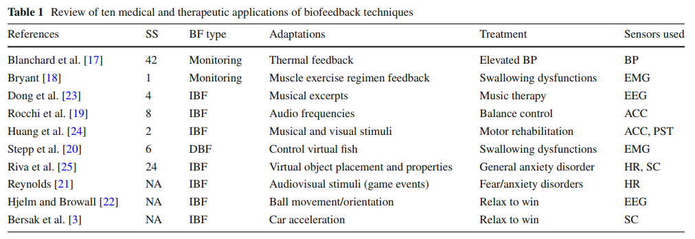

### Vanishing scares biofeedback modulation of affective player experiences in a procedural horror game

>  Journal on Multimodal User Interfaces, 2015, 73(1):1-32.

#### Abbreviations

- ACC Accelerometer 加速度计
- AID AI director
- ANOVA Analysis of variance
- AV Arousal/valence
- BF Biofeedback 生物反馈
- BP Blood pressure 血压
- BVP Blood volume pulse
- DBF Direct biofeedback 直接生物反馈
- DDA Dynamic difficulty adjustment
- DG Design grammar
- ECG Electrocardiogram 心电图
- EDA Electrodermal activity 皮肤电活动
- E-IBF Equilibria indirect biofeedback
- EMG Electromyography 肌电图
- FPS First-person shooter
- GEQ Game Experience Questionnaire
- HR Heart rate 心率
- HRV Heart rate variability
- IBF Indirect biofeedback 间接生物反馈
- IBI Inter-beat interval
- ICG Impedance cardiogram
- NN Neural network
- PCG Procedural content generation 
- PIERS Physiological inductive emotional recognition system 
- PPG Photoplethysmogram 血管容积图
- PST (Body) posture 身体姿态
- RSP Respiration
- SC Skin conductance 皮肤电传导
- S-IBF Symbiotic indirect biofeedback
- SS Study size 学习强度尺寸
- ST Skin temperature
- TPS Third-person shooter

#### Abstract

为了理解受情感驱动的游戏对玩家体验的影响，我们开发了一款程序恐怖游戏(游戏邦注:即《消失》)，它能够运行时关卡，资产和事件生成。《消失》能够将玩家的生理数据解释为一种简化的情感状态，并将其映射到一套调整玩家体验的适应规则中。为了探索适应机制对玩家体验的影响，我们对三种不同版本的游戏进行了混合方法研究，其中两种整合了不同的生物反馈机制。通过对生理数据的分析，客观地测量了运动员的情感体验。此外，通过使用游戏体验问卷记录主观体验。我们的研究证实了生物反馈功能对于玩家体验维度(沉浸感、紧张感、积极情感和消极情感)的评级具有显著的统计影响。此外，参与者报告了玩家体验的显著差异，他们更喜欢在基于生物反馈的游戏迭代中呈现的额外深度。未来，这些结论将有助于开发更具沉浸感和粘性的玩家体验。

#### 2 Related work

在电子游戏中重新引入实时生理数据输入的概念，以提高玩家的认知、动机、情感和整体参与度，已成为人机交互(HCI)领域最近活跃的研究课题。因为电子游戏具有高度的沉浸性(以及情感粘性)，它们提供了一个特殊的应用领域，用于测试基于生物反馈的互动机制的优势和劣势。

生物反馈本身最初是在20世纪70年代被开发用于医学目的，作为一种治疗疾病的训练程序，例如注意缺陷多动障碍(ADHD)[8]。然而，在过去的十年中，它已经重新成为一种可行的技术用于ludic应用。这不仅是由于大量的交互可能可以在视频游戏,但也由于低风险域如果生物反馈机制提出的故障或设计不当,其潜在的负面影响是在游戏中研究应用数量级低于在医学背景。

事实上，一些著名的游戏行业巨头正在探索生物反馈游戏，如Valve[11]，育碧通过其“O。禅宗“1传感器(原名Innergy)和索尼(Sony)、拥有专利的情感recogni￾起跳技术与游戏应用程序[12],其新的PlayStation 4 DualShockTM控制器谣传与渗透皮肤电导传感器设计思想[13]。其他更著名的现代应用程序是任天堂的Wii活力传感器和微软的新的Xbox Kinect 2.0,已宣布拥有中性￾密度光学心率检测[14]。此外，一些硬件制造商正试图提供廉价的生理输入解决方案，使用大脑信号(例如，Emotiv Epoc,2 Neurosky Mindset,3 OCZ神经脉冲驱动器4)和其他生理测量，如皮肤电导，血氧仪，肌电图，呼吸率和心电图(例如，BITalino5)。

在本节中，我们将回顾与数字电子游戏生物反馈和生物反馈交互机制相关的最新技术和研究。我们首先在2.1节中介绍了生物反馈的概念，并在2.2节中对生物反馈技术的医学应用进行了对比分析。最后，我们在2.3节中重点介绍了生物反馈在情感游戏中的具体应用。

##### 2.1 Biofeedback

学术界通常将生物反馈技术称为情感游戏(affective gaming)，对此提出了不同的定义:最普遍接受的变体是Gilleade等人的ACE模型[15]。这一模式包含三种独立模式:“协助我”、“挑战我”和“为我动情”，这是玩家情感状态如何适应游戏体验的基础

然而，尽管情感游戏所涉及的概念非常广泛，但并非所有生物反馈游戏都是情感游戏。例如,游戏使用球员的胸部体积调节目标漂移在使用狙击步枪是一个生物反馈的游戏,但是不是一种情感(一定)游戏,因为球员的情绪不是一个因素在他们与游戏的交互(尽管情感影响生物反馈的机修工对播放器)。同样地，并非所有生物反馈游戏都(或应该)在质量上是平等的。以之前的游戏为例，在狙击敌人时，玩家的胸部体积用来调节目标漂移。现在想象两种游戏版本，一种是玩家知道屏住呼吸会影响瞄准漂移，另一种是玩家不知道(假设这种调节并不明显)。玩家与游戏的互动和体验方式是完全不同的。事实上，Nacke等人和Negini等人之前的研究发现，仅使用简单的生物反馈游戏机制的适应性，玩家体验(报告的乐趣)、传感器偏好和玩家觉醒就存在显著差异[6,16]。

生物反馈游戏机制可分为两类:直接生物反馈和间接生理输入[6]。在这里，直接和间接的生理输入指的是游戏机制激活过程的属性。例如，在直接生理输入中，机制是通过生理上可操作的信号(如增加腿部肌肉张力以跳得更高)激活的，而间接生理输入则使用间接控制的生理信号(如提高心率以改变游戏环境效应，如天气)。然而，这种分类是不完整的，因为它忽略了玩家感知和机制使用的变化(例如，生物反馈循环所提供的学习和适应效果)。一个简单的例子就是放松获胜游戏条件[11]，在这里玩家必须放松才能获得竞争优势。这是一种间接生物反馈(IBF)设计。然而，它假设玩家对这种适应机制有一定程度的了解(既不是无意识也不是完全意识到)，并通过保持冷静或正常地玩游戏做出相应的反应。如果玩家不能“正确”注意到游戏对他们的生理状态的反应，游戏机制就会崩溃，它就无法传达理想的体验。在治疗游戏的情况下，影响可能会更加剧烈，整个过程变得无效。因此，我们认为生物反馈游戏的分类依赖于具有以下正交维度的二维空间:

1. 游戏机制是否能够被可控的生理信号(直接/间接的生理输入)所激活。
2. 用户是否应该知道由此产生的适应性。对于第二个维度，我们借用了内隐生理活动和外显生理活动[5]的概念。

==在我们看来，这种可变的生物反馈游戏分类意味着需要本质上不同的游戏开发指南——每个象限都有一个。直接/明确的生物反馈(DBF)游戏展览容易控制力学和应针对简单游戏力学,6在游戏中直接/隐式力学还应该简单而更微妙的/二级自然适应性集成与球员的行为在正常(non-biofeedback)游戏会话。另一方面，间接生物反馈游戏可以使用更复杂的数据转换/解释。间接/显性变量应努力适应游戏体验的显著方面，而间接/隐性变量应适应更基本的“幕后”方面，如关卡生成和敌人人工智能(AI)。尽管如此，这两种间接变体都需要一种不透明的游戏适应逻辑，即不允许玩家轻易地操纵它，以免玩家通过干扰机制而破坏游戏逻辑==。

###### 2.2 Biofeedback for medical applications

最初，生物反馈的目的是通过帮助患者克服医疗条件或对患者进行监测/评估来辅助医疗治疗[17,18]。例如Dong等人[20]提出了一种音乐疗法，通过音乐来平衡使用者的消极情绪状态。在类似的方法中，在[19]中，作者提出了一个系统，通过使用简单的音频频率指示正确的姿势来帮助身体平衡康复。Huang等人在相关工作中开发了用于虚拟三维世界[26]的神经运动康复生物反馈系统。

由于生物反馈很容易与电子游戏相结合，各种严肃游戏被设计用于帮助治疗疾病。例如，有一款针对吞咽功能障碍[20]的治疗的游戏。Riva等人提出了一种基于患者心率和皮肤电导[23]的全局性焦虑障碍治疗方法，该方法可以触发游戏世界的变化。基于玩家的心率读数进行恐惧管理的生物反馈游戏(“Nevermind”)也被设计成[21]。

还采取了一些更有趣的方法。例如，“Brainball”[22]和Bersak所提议的赛车游戏[3]是一种轻松获胜的间接生物反馈游戏，它引入了一种竞争玩家对玩家的环境，在这里最放松的玩家拥有竞争优势。除了娱乐性，这些游戏最有趣的方面是它们自相矛盾的设计，因为它们结合了两种对立的概念——放松和竞争。当然，在竞争环境中，玩家会感到获胜的压力。反过来，这又阻碍了他们放松的能力，进一步使他们处于不利地位，从而承受更大的压力。这将导致一个正反馈循环，即第一个获得竞争优势的玩家将拥有越来越高的获胜几率。临床生物反馈应用的对比分析见表1。

##### 2.3 Affective gaming

正如之前所讨论的，情感游戏有许多定义，它通常是一个综合术语，包括生物反馈游戏等概念。Gilleade的模型提出的三个启发式(这是最普遍接受的定义)是:“协助我”、“挑战我”和“emote me”[16]。第一个启发原则——“帮助我”——是为了确保当游戏察觉到用户的挫败感水平上升时，能够提供问题的线索。“挑战我”启发是为了避免让玩家感到无聊，即通过提高挑战/威胁级别去回应较低的玩家粘性。最后，“emote me”启发法是最具包容性的，它只说明玩家必须根据游戏设计师的意图受到情感刺激。尽管这篇文章非常高级，但它提供了一个初步的框架，可以用于解决尚未解决的成功情感游戏设计问题。

鉴于这些定义都很宽泛，Hudlicka提出了创建情感游戏引擎[26]的一系列要求:

1. 实时识别广泛的情绪范围。
2. 提供对情感状态作出反应的机制。
3. 动态构建情感用户模型。

最近，这些被正式化为一个名为情感引擎(E2)的具体架构，它描述了如何使用生理数据来了解玩家对游戏事件[27]的情感反应。这一信息将根据参数化定义的目标情感体验推动游戏玩法体验的时间演变适应。

###### 2.3.1 Physiological emotional state detection

大多数情感生物反馈游戏并不会将玩家的生理数据明确地解释为情感或情感状态，相反地，它们通常会将一个或一组特定的传感器与一般的情感联系在一起(如皮肤电导与唤醒或呼吸率与焦虑)。在我们的工作中，我们希望将生物反馈游戏机制与玩家的情感状态相结合。因此，我们将简要概述当前基于生理学的情绪状态检测技术

通过生理计算在情绪检测领域已经做了许多成功的尝试。例如，觉醒已经使用朴素贝叶斯分类器分类，基于脑电图，皮肤电导(SC)，血量压(BVP)，心率(HR)，皮肤温度和呼吸率[28]。==另外，Leon等人的工作通过类似的测量-SC，它的时间梯度和导数，HR和BVP--结合自关联神经网络[44]，将价在三个强度水平上分类==。Haag等人也提出了一种类似的基于神经网络的方法，通过肌电图(EMG)、SC、皮肤温度、BVP、心电图(ECG)和呼吸(RSP)指标[29]，对唤醒和效价的准确度分别达到89%和63%(误差为10%)。事实上，Drachen、Nacke和Yannakakis的研究证实，从SC和HR测量中提取的相对简单的特征确实与报告的游戏场景[31]中的情感评级高度相关。

最后，由[31]、Mandryk和Atkins[32]提出的工作都提出了能够使用SC、HR和面肌电信号实时连续测量觉醒和效价的系统。前者侧重于消除生理读数中的个体间差异(生理学研究中的一个常见问题)，并通过使用非线性回归模型来收集数据来缩放问题。后者提出了一种基于生理情感识别文献的模糊方法与一套规则相结合的方法，将各种生理通道组合成唤醒或效价阅读。在这项工作中，我们使用了这两种方法的混合版本——[31]提出的基于回归的方法来正确地规范化和缩放生理读数，以及[32]的一套经过调整的规则来将这些读数组合成唤醒和效价。要了解更多的细节，请参阅可用的参考资料和4.3节，在那里我们讨论了系统的总体架构。

###### 2.3.2 Physiology-based affective gaming

在Konami的约会模拟游戏《Oshiete Your Heart》中，使用生物反馈技术的最受欢迎的商业游戏之一便是，玩家的BVP和SC水平会影响约会结果。这模仿了早前的商业游戏，如Charles Wehrenberg在1973年左右为Apple II开发的“Will Ball Game”。后来在任天堂64平台上发行的一款游戏《俄罗斯方块64》便使用了耳朵传感器去监测玩家的心率，并使用它去调整游戏的速度。雅达利还测试了一个叫做Mindlink EMG传感器在1980年代用于直接biofeedback-player生物反馈控制机制,但从未离开实验室原型。这些系统被视为突兀的和不可靠的噱头,很容易操纵,是由于它的简单性和成本,以及未能大大增加游戏的深度。然而，最近情感计算的流行已经推动了新的和改进的情感生理游戏的复苏[4–6]。

也许(情感)生物反馈游戏中最著名的例子便是[4]中的研究，即使用玩家的心率(HR)和皮肤电导(SC)去修改电子游戏《半条命2》中的一个关卡。他们引入了影响游戏角色移动和特殊能力的生物反馈机制，如隐形和飘忽不定的移动(穿过墙壁)，敌人产生和武器伤害修改。虽然我们无法评估游戏机制是否整体平衡，并避免游戏过于简单，但玩家表示这是一种非常吸引人的个人体验，并同意生物反馈版本大大增加了游戏的深度。

另一个著名的研究是在[6]中描述的工作，正如我们前面提到的，一个直接(可控制)和间接(间接)生理输入之间的比较研究已经提出。在这项研究中，两种生物反馈方式都被用于增强与2D横向卷轴射击游戏的互动，该游戏使用了各种生理传感器(呼吸(RSP)，皮肤电导(SC)，心率(HR)，温度，凝视和肌电图(EMG))来改变一些游戏玩法组件的控制。修改后的组件包括:角色的速度和跳跃能力，敌人的大小，武器射程和天气条件。作者的结论是，生物反馈条件比非生物反馈控制条件更有趣，但玩家报告称，比起间接生物反馈控制，他们更喜欢直接生物反馈控制。这就引出了我们之前关于游戏平衡的问题以及玩家所报告的偏好的重要性，我们将在本节的最后进行讨论。

Rani等人基于用户的焦虑状态[33]为Pong游戏实现了一个动态难度调整系统。本研究的重点是运用多种生理渠道正确评估玩家的焦虑状态。Parnandi, Son和Gutierrez-Osuna提出了一个类似的游戏，在这个游戏中，赛车游戏中的一些元素，如车速，道路能见度和转向震动，都是基于玩家的觉醒值进行修改的——这是根据皮肤电导读数[11]推断出来的。

语音识别(或者更准确地说是语音语调解释)和面部表情分析也是情感游戏的流行输入方式。尽管这些游戏不应该被视为生物反馈游戏存在争议，但将它们归类也是有效的，因为我们仍在考虑每个个体的独特生理特征，这些生理特征可能会或可能不会受到它们的主动控制。《情感花朵[34]》便是一个典型的例子。另一个典型例子便是《[35]》中的互动故事系统，即玩家通过语音命令与虚拟角色进行互动。反过来，虚拟角色解释声音命令和玩家的情绪状态，并以符合这些条件的方式做出反应。Kim等人也开发了一款类似的游戏，游戏中有一只虚拟蜗牛，它会对玩家的情绪状态做出动态反应，除了语音识别外，还会使用ECG、SC、RSP和EMG传感器[36]捕捉玩家的情绪状态。

也许与我们的工作最相关的产业研究是Mike Ambinder和Valve在他们的一些最受欢迎的游戏上所做的实验，如《求生之路》，《异形蜂群》和《传送门》[11]。该研究报告的第一个实验使用玩家的觉醒水平——通过SC传感器推断——来修改合作生存射击游戏“求生之路”的AI导演。这些修改与游戏内事件有关，如敌人密度、生命值、武器道具摆放以及一些建筑元素。在第二个实验中，玩家必须在有限的时间内达到“异形群”的最高分数。然而，他们处于轻松获胜的条件下，即他们的觉醒状态与游戏中的倒计时相联系，从而创造了2.2节中所讨论的有些矛盾的正反馈循环。最后,在第三个实验中,玩家扮演一个修改版本的游戏“门户”,相机和枪瞄准行动是不同步的(例如,而不是枪总是瞄准到玩家的的视线方向,它可以指向不同的方向,类似于在现实生活中)。通过玩家的视线坐标，通过鼠标和枪的瞄准来控制摄像机。总的来说,所有的实验旨在识别生物反馈游戏机制的潜在优势和缺陷在不同方面(调整困难、放松训练和游戏分别增大),发现相对简单的适应对球员进行了重大影响感受带入如果一些花了一些时间适应(一些球员在门户实验报道头晕和混乱由于不被用来控制方案)。最近的研究也集中在多人在线游戏[37]的社交互动的情感影响，恐怖[38]的玩法事件和体力密集型游戏(exergames)[39]。

在一个相关的注意，生物反馈也被用来修改行为的游乐园乘坐[40]。在这项工作中，用户的呼吸是用来控制困难的反向野马骑。这项工作的一个有趣的方面是，在其中一种情况下，骑乘的难度随着呼吸活动的增加而增加——因此，获胜的策略是屏住呼吸，以获得一匹运动减少的野马的优势。然而，玩家最终还是得恢复呼吸——因此，与吸入的空气量成比例，他们会受到更艰难骑行的惩罚。在这部作品中,呼吸控制机械提供了游戏平衡自类似relax-to-win游戏之前所讨论的,这个游戏有能力分化服从放松机修工的影响(例如,大口大口的喘着粗气导致骑野马强度更高,从而导致球员失去呼吸更快)。

在本节中，我们已经研究了一些关于生物反馈游戏的影响和设计的研究(见表2所讨论的文献的比较分析)。在所有这些研究中，作者都使用了各种类似的指标，报告了用户粘性和乐趣因素的增加。然而，上述分析仍然存在一些问题，最常见的问题之一是有效的游戏平衡，这在本节中反复出现。几乎所有讨论过的机制都是为了帮助玩家而设计的，尽管增加了游戏体验，但却可能会对获得的积极反馈产生偏差，因为它们被视为对玩家有益。并非所有所讨论的工作都单独使用这种类型的机制，但它的主导地位仍然是报告结果公正性的相关讨论点。此外，对玩家偏好的评估有时也很肤浅，使用直接问题而不是更结构化和更健全的问卷调查，或者未能对所获得的反馈提供统计分析以检查统计意义。然而，在我们看来，最持久的问题是缺乏关于不同生物反馈机制如何影响玩家主观游戏体验的分析，以及忽略了关于玩家在游戏过程中情感(生理)状态变化的分析。再加上缺乏关于不同玩家亚群体(游戏邦注:如休闲与硬核玩家)如何体验每种游戏条件的详细分析，这些问题构成了我们认为目前文献中最迫切需要解决的研究问题。总之，目前的技术已经被广泛证明生物反馈在商业上是可行的，并且有可能增加玩家体验。相反地，研究还未彻底检查生物反馈机制本身的设计能够以何种程度和方式以先验定义的方式影响玩家。

#### 3 Research problem

正如我们在相关文章中所讨论的，我们的目标是对不同类型的生物反馈游戏机制如何影响玩家的游戏体验进行比较分析。因此，我们的主要目标是彻底检查玩家的主观(GEQ报告)和客观(生理)游戏体验，以评估上述生物反馈机制的设计是否具有显著影响。与此同时，我们也对评估特定类型的玩家是否会以特定方式对任何游戏变体做出反应感兴趣。

总结一下之前的陈述，潜在的问题是，最终是否有可能通过使用特别设计的生物反馈机制来调节玩家的主观和/或情感体验——在我们的例子中，是在恐怖电子游戏的背景下。在3.1节中，我们将进一步详细描述这些研究问题。

我们在这一研究中特别想要解决的问题是，间接生物反馈游戏玩法适应是否会显著影响玩家体验，如果是的话，那么究竟是如何影响玩家体验的，以及在哪些方面影响玩家体验。为了以更有条理的方式处理这一问题，将其分成下列分问题：

- Q1:我们能否使用生理传感器和实时处理来调整玩恐怖游戏的“恐怖”体验，有效地将玩家的情绪状态倾斜到预先设定的目标情绪状态?

- Q2:这些基于生物反馈的适应性方法是否会对玩家游戏体验的任何特定方面产生重大影响?

- Q3:内隐和外显间接生物反馈机制在用户偏好和体验方面有何不同?

- Q4:不同类型的玩家(游戏邦注:以性别、熟练程度和游戏类型偏好区分)在体验这些修改时是否存在明显的差异(游戏邦注:无论是从报告的玩家体验还是生理测量的情感状态来看)?

关于问题Q2，我们有一个直接的假设:与非生物反馈条件相比，生物反馈条件能够提高玩家的评分，并对玩家的主观和客观体验产生更大的影响。对于问题Q1, Q3, Q4，我们不做有指导性假设，只是假设它们之间的条件可能有所不同。

要回答这些研究问题，我们必须衡量游戏体验的几个不同方面。问题1要求我们对玩家在整个游戏过程中的情感体验进行客观衡量。为了做到这点，<u>我们为游戏提供了记录功能，以便它能够输出玩家的原始生理和情感状态数据</u>。作为==次要测量==，<u>我们还使用了游戏体验问卷的积极和消极影响维度</u>。为了衡量玩家在第二季度的游戏体验，我们使用了游戏体验问卷，即基于7个不同维度去衡量体验——沉浸感，紧张感，挑战，能力，流（flow）[41]，积极影响和消极影响——通过一组结构化的游戏相关陈述。此外，整体趣味性也采用类似的 Likert 7分制量表进行衡量。关于Q3，由于它涉及到玩家的偏好和生物反馈条件之间的体验报告，我们选择让玩家根据自己的偏好来排序条件(同时保持条件顺序盲以避免偏见效应)，并提出一些开放式的问题来收集反馈。为回答第四个问题，我们在招聘过程中收集了参与者的人口统计信息。

鉴于我们的目的是评估一些宽泛的假设集，我们的研究有几个实验限制。我们在研究和游戏设计中发现了以下限制因素:

- 许多的游戏条件：考虑到我们想要比较两种生物反馈条件，我们的研究应该需要三种游戏条件(两种生物反馈启用和一种对照)。此外，这意味着所有参与者都必须参与所有三种游戏条件，这需要一个广泛的实验协议。
- 实时游戏适应：执行两种不同类型的生物反馈机制的实时游戏适应性意味着游戏的重要部分将能够快速适应玩家的生理变化。这意味着游戏必须突出一个多功能系统，能够实时修改以下元素:敌人AI、关卡和资产/事件生成、角色属性(如奔跑速度、动画)、声音和视觉效果、光源和道具放置。
- 游戏架构：因为我们想让游戏在没有生理数据(控制条件)的情况下独立运行，这就需要模块化架构。在这种架构中，生理数据可以“插入”系统，在缺少这种输入方法的情况下，后退系统将根据一套不知道玩家当前生理状态的固定规则来调节游戏体验;游戏AI总监，通常出现在商业游戏中。
- 数据日志记录功能：为了能够在游戏过程中适当评估玩家的生理数据，游戏必须能够输出这些数据，并将其调整到玩家真正参与游戏的间隔时间。

#### 4 Study

为了评估不同类型IBF适应机制的相对影响，我们进行了一项混合方法研究，参与者玩三个版本的游戏;采用间接生物反馈(IBF)力学扩展了两种控制条件，另一个采用非生物反馈控制条件。为了保持比较结果，每个游戏版本呈现了相同的游戏玩法元素(资产，AI，事件等)和游戏机制。游戏设计和IBF适应机制都是在超过3个月的阿尔法测试期间开发出来的，使用的是迭代原型，收集了20多个未包含在本研究中的个体的反馈。在所有游戏过程中收集生理数据，记录每个玩家的SC、HR和面部肌电图读数。这些数据被解释为实时的唤醒/效价坐标，然后用于游戏的BF增强玩法机制。

##### 4.1 Gaming conditions

每一个IBF游戏条件都被设计成将玩家的觉醒A，评级V，变化率——分别用他们的偏导数	dA / dt  和 dV / dt  来衡量——映射到游戏中可控元素的特定适应(见5.2节)。==控制条件不使用任何生理输入(尽管玩家仍然穿着传感器设备，所以他们不能轻易地识别他们是在什么条件下玩游戏)==。

第一个生物反馈游戏条件旨在通过绑定玩家和游戏角色的情感状态来加深玩家和游戏角色之间的共情纽带。传达这种“共生”链接,角色的情绪状态是通过厌氧代谢属性A和心理弹性r。关于厌氧代谢属性,增加玩家的觉醒评级映射到阿凡达的肾上腺素水平增加,转化为更高的运行速度a_v , 尽管耐力的成本(例如,运行时间)。相反地，如果玩家保持冷静，他便只能以较为保守的速度奔跑，但却能够跑更远的距离。与此同时，角色的精神弹性r与玩家的效价水平直接相关，这将导致更强烈的幻觉和无法控制的镜头抖动，从而削弱玩家的方向感，并使他们成为生物(即敌人)更容易察觉的目标。因为悄无声息的、有节奏的探索是最佳的游戏策略——(制造噪音能迅速吸引生物，奔跑，除了制造噪音，还能让角色容易被攻破)——保持冷静提供了竞争优势。我们将这种IBF条件命名为“共生IBF”。在我们对生物反馈游戏的正交分类中，这种条件是一种明确的间接生物反馈游戏，因为玩家不能直接控制所分析的生理信号，游戏机制通过外化游戏角色自身的生理和心理属性而变得明显。Gilleade的“emote me”启发式也可以将这种情况置于情境中，因为它直接作用于玩家和他们的角色之间的情感互动。

##### 4.2 Experimental protocol

本研究采用三个条件(两个适应IBF和一个对照)在受试者内设计。在提供了对实验的简要描述(IBF适应的细节被告知参与者)并提供知情同意后，玩家完成了人口统计问卷。然后，他们被安装生理传感器，并经历了一个校准阶段(在下一段中描述)，旨在正确调整情绪检测系统。在一个简短的教程之后，所有的参与者都玩了三种游戏条件，<u>这三种条件以拉丁方平衡的排列方式呈现，以避免顺序效应</u>。此外，<u>参与者在游戏过程之间有5分钟的休息时间，在此期间他们可以放松</u>。如有必要，他们的生理基线水平也进行了调整。在完成每个游戏条件(约10-25分钟)后，参与者完成了一份游戏体验问卷(GEQ)[42]，该问卷要求他们从七个维度评价自己的体验——沉浸感、紧张感、能力、挑战、流状态和积极和消极影响。大多数的这些维度,如紧张、能力和挑战是自解释的,因为他们是指容易框架概念在游戏体验(如紧张是如何在他试图清楚游戏的玩家,是多么具有挑战性的游戏和主管如何清除这些挑战让玩家感觉)。积极情感和消极情感也同样适用——玩家在体验过程中的情绪状态是积极还是消极。然而，沉浸感和流（flow）状态这两个术语就不那么明显了，可能需要一个更正式的定义。沉浸感有多种定义，明确的分析超出了本研究的范围，所以在剩下的内容中，我们认为沉浸感是一种认知全神贯注的状态，即玩家觉得自己是(或忘记自己不是)在游戏世界中。米哈里（Csikszentmihalyi）将流定义为“一种专注或完全吸收手头活动的状态，即挑战和技能完全平衡的情况”。

此外，玩家还被要求报告他们的乐趣评级。为了消除外部噪音，所有参与者被单独留在房间内，并要求在校准和游戏条件下佩戴一副降噪耳机。为了创造一个熟悉的游戏环境并强化情感状态，我们还控制了环境照明。

*传感器校准* 因为这两种生物反馈条件要求从玩家的生理评级中计算出连续、实时的情绪状态反馈，所以有必要在进行实验之前校准情绪检测系统。因此，每个参与者都经历了一个简单的校准过程，包括以下刺激因素:

*Relaxing music* 参与者被要求戴上一副降噪耳机放松。使用的曲目是马可尼联盟的失重曲目，这被发现是世界上最有效的放松曲目之一，根据[43]的研究。这个阶段持续大约5分钟，目的是通过使用特定的节奏(每分钟60次)放松参与者，音调、频率和间隔，使脑电波和心率与节奏同步

*Scaring image game* 参与者被要求识别一张图片上不存在的物体。20秒后，画面突然切换到一个令人不安的画面，并伴随着一声巨大的尖叫。这款游戏是基于一种典型的恐吓策略，旨在在玩家最意想不到的时候吓唬他们。

*Film clips* 基于Schaefer等人[40]的作品，我们选择了两个电影片段，一个来自喜剧电影(《美国派:婚礼》)，另一个来自惊悚电影(《美国X历史》)，供参与者观看。

前两个刺激的目的分别是引起低唤醒值和高唤醒值，而电影片段试图引起不同的效价水平。参与者被单独留在房间里(类似于游戏环境)，这样我们的存在就不会影响他们的情绪状态。在经历了所有刺激后，我们分析捕捉到的数据，并要求参与者评价每个刺激引发的唤醒/效价(AV)值，使用一个10分的李克特量表，类似于自我评估模型(SAM)[45]。这些数据随后被用来校准情绪检测模块。为了确保情感识别模块在游戏过程中能够正常工作，我们还手动加载了每个 生理指标/AV 空间维度的计算回归系数，并在玩家开始这三种游戏条件前验证其输出。

由于我们使用Mandryk等人的规则来解释生理信号为AV值，因此有必要确认它们的相关性假设成立。除 heart rate/valence 正相关假设外，所有假设对所有参与者进行了验证;皮肤电导和心率与觉醒呈正相关，脸颊肌和眉骨肌的面肌电图分别与效价呈正相关和负相关。尽管如此，Mandryk和Atkins[32]假设HR-Valence相关性可能依赖于游戏类型，有关它的规则可能需要在未来的研究中调整。因此，我们分析了恐怖游戏中HR和效价之间的相关性，并发现这种特殊的相关性被逆转了，包括在我们的回归模型中

##### 4.3 Apparatus 装置设备

这款游戏是在一台运行Windows 7的台式电脑上进行的。显示器为23' LCD显示屏，分辨率为1920×1200像素。生理数据由Mind Media使用Nexus-10 MK I硬件采集，并通过32赫兹的实时情绪检测系统集成到游戏中。==数据通过蓝牙传输到运行游戏的笔记本电脑，并通过socket连接整合到游戏引擎中。此外，SC测量在受试者的食指和中指使用两个Ag/AgCl表面传感器连接到两个Velcro带。HR是通过用夹在拇指上的传感器测量的BVP读数得出的。测量颧大肌(面颊肌)和眉上皱襞肌的面肌电图==。

[^]: 数据收集的种类和咱们现有的设备相似，它们有肌电图，咱们没有

##### 4.4 Participants

24名受试者(16名男性)，年龄19 ~ 28岁(μ= 22.5，σ= 2.5)。参与者是从参与在线beta测试招募活动的志愿者中招募的。不幸的是，由于传感器故障，在一个游戏条件下，来自其中一个参与者的数据被损坏，无法使用。其余23名参与者(16名男性)没有发生故障。

所有的参与者至少每周都玩电子游戏。关于之前玩过恐怖电子游戏的体验，参与者被合理地划分为67%的参与者至少玩过一次恐怖游戏。然而，在67%的人当中，只有47%的人真正享受过这种体验。大多数参与者(58%)认为自己是休闲玩家(每周游戏时间少于4小时)，而42%的人认为自己是硬核玩家。多数玩家表示，他们对电脑游戏的新颖输入方式有过体验或感兴趣，其中很大一部分人(64%)拥有任天堂Wii或手机游戏平台。

#### 5 Vanish: a procedural affective horror game

《消失》(3DrunkMen, 2013)是一款基于Unity游戏引擎的免费独立生存恐怖电子游戏。==我们之所以选择恐怖电子游戏是因为情感反应会对紧张和恐怖的游戏体验产生特别强烈的影响==。这是恐怖游戏的卖点。如《Amnesia-The Dark Descent》(Frictional Games)。

在《消失》中，玩家必须在程序生成的迷宫般的隧道和奇怪的机械室中导航，找到一组关键道具，然后才能逃脱。然而，游戏的主要前提是玩家在穿越这些隧道时被追杀的心理紧张体验，因为玩家必须躲避一个不断且越来越有攻击性地跟踪他的变形生物。其它环境事件，如灯光熄灭，远处的哭声或蒸汽管道突然爆裂等，都会半随机地出现以保持玩家的沉浸感。

游戏的关卡布局和事件都可以在运行时生成，并同时连接到无缝的关卡部分。这让我们能够完全控制游戏的逻辑、关卡生成、AI和一般关卡进程。正如我们在第2.1节所讨论的，间接生物反馈(IBF)游戏应该采用不透明的适应逻辑，这样玩家就不会轻易操纵游戏逻辑。因此，《消失》赋予我们的(游戏设计)自由是其选择的关键因素。在下文中，我们将分析《消失》最相关的游戏机制，并简要解释游戏的程序生成。最后我们将呈现一些关于我们如何调整游戏架构以实现生物反馈机制的技术细节(图1)。

##### 5.1 Gameplay mechanics

为了探索传统游戏机制和生理适应机制之间的变化所产生的影响，我们执行了4种可以通过玩家的情感状态而影响的游戏机制。

###### 5.1.1 Character sanity 角色的心智

游戏角色有一个心智轮廓。随着时间的推移，角色会变得更加激动，他们的精神状态会下降。当然，这种效应会被游戏事件(如遭遇生物或被丢在黑暗中)大大加速。成功地在游戏中前进能够提高角色的理智。为了理解角色的行为，我们改变了一些游戏机制。我们的健全系统有以下级别:

1. 这是初始的理智级别。角色的心理没有明显的改变。

2. 当达到这一等级时，角色的呼吸会变得明显地更快和更重，并伴有偶尔的颤抖。

3. 角色开始产生幻觉，并听到身后有奇怪的声音。

4. 当角色到达这一级别时，他就会变得头晕目眩，而玩家将很难控制摄像机的移动。前一层次的幻觉严重得多(无论是强度还是频率)，包括昆虫群等紧张意象。

此外，在游戏的控制(非生物反馈)版本中，每当游戏事件发生时，一系列特殊效果就会根据事件的强度而发生。这样做是为了更强烈地刺激并向玩家传达每个事件的重要性。这包括扭曲玩家视野(FOV)的vignette风格过滤器，响亮的心跳音效和相机震动效果。就像之前提到的，在游戏的生物反馈版本中，我们也会根据玩家情绪状态的变化而改变这些效果。

###### 5.1.2 Creature AI  生物的AI

生物在三种预设状态之间转换:被动、被动-攻击和攻击。在这些状态中，生物会采取不同的方法对付玩家;从逃离它们，到只有当玩家靠近时才接近它们，再到最终将玩家击倒。游戏中执行的动态过渡方案不仅取决于玩家对生物的行动，还取决于互动的数量以及玩家离完成关卡的距离。举个例子来说吧，如果玩家找到了生物，它便会先撤退。然而，随着时间的推移，它将开始变得“好奇”，并更积极地接近玩家，直到玩家逃离它。反过来，这在玩家和生物之间创造了推动和拉动的力量关系，如果管理得当，这将有利于玩家的前进。

###### 5.1.3 Character sprint velocity, stamina and orientation  角色冲刺速度，耐力和方向

###### 5.1.4 Evasion tunnels  逃避隧道

就像我们在前一段所提到的，谨慎的探索是这类型游戏玩法的核心元素。然而，无论玩家多么小心谨慎，他最终还是会多次与怪物面对面。在这些情况下，快速反应、逃离现场、保持冷静并想出一个计划来躲避怪物(现在正在追捕玩家)是非常重要的。为了奖励思维敏捷的玩家并创造戏剧化的紧张事件(游戏邦注:如被怪物逼到绝境但仍然存活)，我们在玩家路径的墙壁上的战略位置半随机地生成隧道。玩家可以蹲在这些怪物中逃离，等待它离开，或者探索它们到达一个全新的关卡。

###### 5.1.5 Sound sources  音源

因为声音是我们最敏锐的感觉之一，也是恐怖游戏中最主要的戏剧性增强器，所以我们想要将其整合到游戏机制中，从而激励玩家密切关注游戏氛围。这是通过让生物AI对声音做出反应而实现的。当在玩家一定的半径内，如果他们制造太多噪音(如呼吸太多或移动太快)，盲生物将会发现他们。这便创造了一些有趣的场景，即玩家将被困在死胡同中，但通过保持完全静止，他们便能够避开怪物;或者他们通常不会吸引生物的注意，但因为低理智水平，无法正确控制角色的移动而被杀死的场景。

##### 5.2 Procedural generation

……

##### 5.3 Game architecture and physiological data processing

尽管Vanish是在Unity中完全开发的，但游戏引擎允许使用c#编写的脚本通过外部应用程序通信创建额外的功能。这是我们在开发《消失》时需要整合到游戏引擎中的设计要求。因此，我们在引擎上安装了一个c#中间件软件模块，负责从NeXus-10生理数据捕获硬件(生理感性情绪识别系统piers)实时获取生理数据，并相应地调整游戏架构(见图5)。在这个游戏架构的改编版本中，NeXus- 10设备负责获取SC、BVP和肌电图通道的生理数据。然后，Biotrace+软件套件对采集的数据进行预处理，从BVP读取HR信号，并通过蓝牙从NeXus-10设备进行信号采集。

发达中间件软件模块(皮尔斯)也负责,同时,将生理数据收到BioTrace +软件套件到兴奋和价(AV)评级,并反馈他们的生物反馈适应机制模块(作为替代AI director 在生物反馈版本的游戏)。

在生理数据处理方面，下文将介绍所使用的生理测量方法。关于游戏中生理指标的快速概述，请参见[11]或[46]。

###### 5.3.1 Electrodermal activity  皮肤电活动

皮肤电活性(EDA)通常以皮肤电导率(SC)的形式测量，也称为皮肤电反应，是一种常见的测量皮肤电导率的方法，由汗腺产生。这些腺体对心理变化作出反应，SC反映情绪变化和认知活动[47]。在心理生理相关性方面，正如我们之前讨论过的，SC与唤醒呈线性相关[28,32]，被广泛用作情绪识别中的应激指标[25,33,48]，并进一步被用于探索游戏玩法维度[30]之间的相关性。我们测量SC使用两个Ag/AgCl表面电极连接到两个尼龙搭扣带周围的中间和食指的非优势手[47]。

###### 5.3.2 Cardiovascular measures  心血管的操作

心血管系统由一系列调节人体血液流动的器官组成。目前存在各种衡量其活动的指标，包括血压(BP)、血容量脉搏(BVP)和心率(HR)。可以从心率中提取各种次要指标，如搏动间期、心率变异性(HRV)等。心率通常与唤醒[47]相关。心率，连同它的导数和HRV，也被认为能够区分积极和消极的情绪状态(效价)[49]。在我们的实验中，HR通过安装在手指上的传感器从参与者的血容量脉搏读数中推断出来。

###### 5.3.3 Electromyography  肌电图学

肌电图(EMG)是测量骨骼肌[47]收缩产生的电势的一种方法。面部肌电图已经成功地用于区分游戏体验[50]的效价。Hazlett描述了颧大肌(颊肌)在积极事件中非常活跃，而皱褶肌(眉肌)在消极事件中非常活跃。Conati最近尝试使用同样的方法识别用户情绪，进一步验证了之前讨论的结果[51]。我们采用上睑皱襞和颧大肌表面电极测量面肌电图。

如前所述，生理数据是根据唤醒和效价水平来解释的。然而，由于个体之间的生理数据差异很大，我们使用Nogueira等人[27]基于回归的方法，使用赛前校准阶段收集的数据适当地衡量这些读数(见4.2节)。这种方法会导致一系列的回归模型,通过考虑球员的主观报告经验丰富的情绪状态,更精确地近似每个生理信号之间的映射函数和相关AV维度相比更广泛使用的方法,比如一个简单的数据正常化(见图6)。

然后应用接地规则Mandryk和阿特金斯[32]提出的正常化的读数转换成唤醒和价(见图7)。Inter-individual方差是一个已知的常见的问题在生理研究中,创建适当的检测和扩展问题(32岁,47),这将阻止我们获得一个合适的游戏改编的概念改变了玩家的情感经验,互相问候。因此，采用前一种办法是为了减轻这些问题。此外，鉴于HR和情感效价之间的相关性已被证明会在游戏类型之间发生变化，回归模型也让我们能够正确评估这种相关性的本质。最后，为了结合回归的生理指标，我们使用了Mandryk和Atkins[32]的基于文献的规则集的修订版本(见“附录1”)。

#### 6 Results 

##### 6.1 Player experience ratings: statistical analysis  统计分析

##### 6.2 Player experience MANOVA analyses  多元方差分析

##### 6.3 Order effects on physiological input  生理输入的顺序效应

##### 6.4 Gaming condition impact on physiological metrics 游戏条件对生理指标的影响

###### 6.4.1 Individual player spectra

###### 6.4.2 Group spectra

##### 6.5 Condition preference and identification  条件偏好与识别

###### 6.5.1 Condition preferences

##### 6.6 Participant opinions   参与者的意见

#### 7 Discussion

##### 7.1 Impact and effectiveness of affective biofeedback gameplay mechanics

##### 7.2 Symbiotic (explicit) vs. equilibria (implicit) indirect biofeedback game design 共生(显性)vs平衡(隐性)间接生物反馈游戏设计

#### 8 Limitations and future directions

我们的研究表明，可以用情感生理数据来强化游戏机制。然而，在之前的调查之后，我们专注于特定的游戏类型进行更深入的分析[4 - 6,33]，因此我们的工作在适用于其他游戏类型方面受到限制。

此外，尽管我们探索了各种游戏机制和两种不同的间接生物反馈类型，但关于游戏机制和生物反馈的不同选择很可能导致不同的玩家体验结果。此外，尽管提供了足够的时间让玩家清楚地注意到游戏体验的差异，但所使用的游戏时间仍然不足以解释这种新技术的新颖性和习惯效应。为了对这项技术提供更全面的调查，这些影响必须在未来的长期研究中进行评估

从生物反馈增强游戏的角度来看，这一技术的最大局限性在于:(1)游戏设计师愿意将生理互动整合到核心游戏机制中，(2)生理传感器的适当校准。通常情况下，必要硬件的可用性是使用这一技术的主要挑战，但随着BITalino等低成本解决方案的出现，以及Valve等行业巨头对这些技术的兴趣，我们觉得这种争论正在失去动力。关于传感器校准，一个可能的解决方案是借用自然交互解决方案的属性(如Kinect和WiiMote)，并将校准过程游戏化，有效地将其掩蔽在游戏初始教程部分[54]中。

