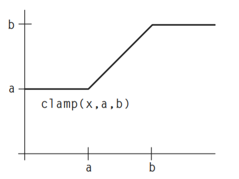
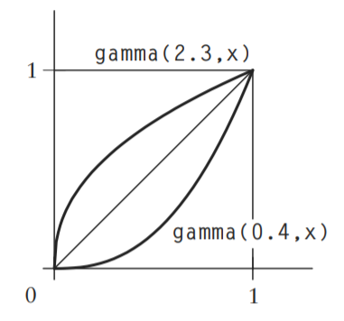

<head>
    <script src="https://cdn.mathjax.org/mathjax/latest/MathJax.js?config=TeX-AMS-MML_HTMLorMML" type="text/javascript"></script>
    <script type="text/x-mathjax-config">
        MathJax.Hub.Config({
            tex2jax: {
            skipTags: ['script', 'noscript', 'style', 'textarea', 'pre'],
            inlineMath: [['$','$']]
            }
        });
    </script>
</head>

# 程序化方法 1

### 程序化纹理

###### 显式方法和隐式方法

原则上，显式和隐式方法可以用于生成相同类别的纹理模式或几何模型(几乎任何东西)，但在实践中，每种方法都有自己的方便或可行的模型类别。

|           Explicit           |                          Implicit                          |
| :--------------------------: | :--------------------------------------------------------: |
|       polygons 多边形        |                     quadrics  二次曲面                     |
| parametric curves 参数化曲线 | patterns of potential or force fields 势场或力场产生的图形 |
|        patches  贴片         |            natural stone textures 自然岩石纹理             |
|                              |                         clouds 云                          |
|                              |                           fog 雾                           |

###### 程序化方法的优势

- 紧凑性，字节数大小
- 没有固定的分辨率。大多数情况下无论分辨率多高，都有精确而详细的纹理。
- 可以参数化，生成相关的一系列纹理

###### 程序化方法的劣势

- 过程纹理很难构建和调试
- 很难能预测生成后的结果
- 时间和空间的权衡，程序化比纹理采样要慢
- 锯齿化和反锯齿带来的问题

###### 贴图空间

- 世界空间是其他空间的起点。It is the starting point for all other spaces.
- 对象空间才是被着色的表面定义的那个 The object space is the one in which the surface being shaded was defined
- 着色器空间

###### 分层和合成

将两个颜色进行混合	C = mix(C0, Cl, f);  这个应该是HLSL中的lerp函数

如果两个颜色相乘，可以理解为一种颜色对另一种颜色的过滤。如果颜色C0表示滤镜对红光、绿光和蓝光的透明度，那么C0·C1表示通过滤镜看到的颜色C1。If color C0 represents the transparency of a filter to red, green, and blue light,then C0·C1 represents the color C1 as viewed through the filter.

###### Steps, Clamps, and Conditionals

**Step**函数可以替换一些条件语句，例如：

```glsl
if (u < 0.5)
	Ci = color (1,1,0.5);
else
	Ci = color (0.5,0.3,1);
//可以替换为:
Ci = mix(color (1,1,0.5), color (0.5,0.3,1), step(0.5, u));
```

两个step函数可以被用来做一个矩形脉冲：

```glsl
#define PULSE(a,b,x) (step((a),(x)) - step((b),(x)))
```


**Clamp**函数可以这么用：

min(x, b) ≡ clamp(x, x, b)

max(x, a) ≡ clamp(x, a, x)

clamp(x, a, b) ≡ min(max(x, a), b)

它的图像是这样的



**Abs**函数的图像是这样：


上面的这些函数都是一些“硬”，那么下面来介绍一下软的函数**smoothstep**，我曾经有写介绍这个函数的一个[学习笔记](shader_learning_5.md)

它的图像是这样：


在许多程序化纹理都用**smoothstep**代替**step**，因为尖锐的过渡总不是很受欢迎，而且还有锯齿，而且在动画的时候也会防止突然的运动和停止。


###### 周期函数

首先，用的最多的是Sin 和 Cos 函数，然后另外一个函数就是mod()，看图就一目了然了：


再结合之前的PULSE函数


###### 样条函数和映射

GLSL里面没有**spline**函数（C样条曲线），但是我们只要理解算法，下面给出C的算法

```c
/* Coefficients of basis matrix. */
#define CROO -0.5
#define CR01 1.5
#define CR02 -1.5
#define CR03 0.5
#define CR10 1.0
#define CR11 -2.5
#define CR12 2.0
#define CR13 -0.5
#define CR20 -0.5
#define CR21 0.0
#define CR22 0.5
#define CR23 0.0
#define CR30 0.0
#define CR31 1.0
#define CR32 0.0
#define CR33 0.0
float
spline(float x, int nknots, float *knot)
{
    int span;
    int nspans = nknots - 3;
    float cO, cl, c2, c3; /* coefficients of the cubic.*/
    if (nspans < 1){/* illegal */
        fprintf(stderr, “Spline has too few knots.\n”);
        return 0;
    }
    /* Find the appropriate 4-point span of the spline. */
    x = clamp(x, 0, 1) * nspans;
    span = (int) x;
    if (span >= nknots - 3)
    	span = nknots - 3;
    x -= span;
    knot += span;
    /* Evaluate the span cubic at x using Horner’s rule. */
    c3 = CROO*knot[0] + CR01*knot[l] + CR02*knot[2] + CR03*knot[3];
    c2 = CR10*knot[0] + CRll*knot[l] + CR12*knot[2] + CR13*knot[3];
    cl = CR20*knot[0] + CR21*knot[l] + CR22*knot[2] + CR23*knot[3];
    cO = CR30*knot[0] + CR31*knot[l] + CR32*knot[2] + CR33*knot[3];
    return ((c3*x + c2)*x + cl)*x + cO;
}
```


接下来，还有一些其他的映射公式：

这个是gamma矫正的公式

```glsl
float gammacorrect(float gamma, float x)
{
	return pow(x, 1/gamma);
}
```



这个图是这个含义，gamma值是0.4和2.3，且x在[0,1]区间内，那么映射结果也在这个区间内。如果gamma值大于1，则曲线向上弯曲(凸)；如果gamma值属于(0,1)区间内，则曲线向下凹。

然后在之后的发展中Perlin 和 Hoffert 修改了gamma矫正函数，成为一个新的函数bias(),定义了有 bias(b,0.5) = b.

```glsl
float bias(float b, float x)
{
	return pow(x, log(b)/log(0.5));
}
```


同时，他们还展示了一个新的函数gain，其中两个部分是由上述的bias构成，当x等于0.5时，总是返回0.5，然后根据代码如下：

```glsl
float gain(float g, float x)
{
    if (x < 0.5)
    	return bias(l-g, 2*x)/2;
    else
    	return 1 - bias(l-g, 2 - 2*x)/2;
}
```


------

###### 案例 制作一个砖墙纹理

```glsl
#define BRICKWIDTH 0.25
#define BRICKHEIGHT 0.08
#define MORTARTHICKNESS 0.01
#define BMWIDTH (BRICKWIDTH+MORTARTHICKNESS)
#define BMHEIGHT (BRICKHEIGHT+MORTARTHICKNESS)
#define MWF (MORTARTHICKNESS*0.5/BMWIDTH)
#define MHF (MORTARTHICKNESS*0.5/BMHEIGHT)
void main() {
    vec2 st = 1. * gl_FragCoord.xy/u_resolution.x;
    vec3 Cbrick = vec3 (0.5, 0.15, 0.14);	//砖的颜色
    vec3 Cmortar = vec3 (0.5, 0.5, 0.5);	//水泥的颜色
    float ss = st.x / BMWIDTH;				//
    float tt = st.y / BMHEIGHT;
    float sbrick = floor(ss); 				//在x轴上共有多少砖
    float tbrick = floor(tt); 				//在y轴上共有多少砖
    ss += 0.5 * step(mod(tt,2.),1.0);		//如果y轴上是偶数行，则向右移动 0.5 块砖
    float sbrick_f = fract(ss);				//取小数部分，即是在当前砖块中，此像素点所在砖块x轴的比例（位置）是？
    float tbrick_f = fract(tt);
    float w = step(MWF,sbrick_f) - step(1.- MWF,sbrick_f);	// 脉冲算法
    float h = step(MHF,tbrick_f) - step(1.- MHF,tbrick_f);
    vec3 Ct = mix(Cmortar, Cbrick, w * h);	//lerp
    gl_FragColor = vec4(Ct,1.0);
}
```


然后，我们需要给它加一个法线，使其更真实，首先，我们要了解法线图的原理


其中，N‘ 是最终的法线，N是模型插值得到的法向量，D是在切面内的扰动向量，且垂直于N，其中F(u, v)是沿法向量N的高度的模拟

$$
U = \frac{\partial F}{\partial u}(N * \frac{\partial P}{\partial v}) \\
V = -(\frac{\partial F}{\partial v}(N * \frac{\partial P}{\partial u})) \\
D = \frac{1}{|N|}(U + V)
$$
然后，回到每一块砖块上来，我们从侧面分析一下：


然后代码如下：

```glsl
float getBump(float m,float p){
    return (smoothstep(0.,m,p) - smoothstep(1.- m,1.,p));	//平滑的脉冲函数曲线
}

vec3 calculatenormal(vec2 PP)
{
    //我们算出此像素前后的偏导数，因为网页版的GLSL不支持dFdx，所以我们自己算一下偏导数，
    //首先我们需要算出此像素相邻的像素点的值，然后再高度Bump上进行采样，然后得出x，y（u，v）轴上偏导数构成的切向量
    //进行叉乘后，进行单位化，可以得出法线 [1] 3D Graphics for Game Programming ,JungHyun Han,2012
	vec2 d = vec2(1.,1.)/ u_resolution.x;
	d = d / vec2(BMWIDTH,BMHEIGHT);
    float ddx = (getBump(MWF,PP.x + d.x) - getBump(MWF,PP.x - d.x)) * 0.5;
    float ddy = (getBump(MHF,PP.y + d.y) - getBump(MHF,PP.y - d.y)) * 0.5;
  	return normalize(cross(vec3(1.0,0.0,ddx),vec3(0.0,1.0,ddy)));
}

void main() {
    vec3 n = calculatenormal(vec2(sbrick_f,tbrick_f));
    vec3 color = Ct;     
	vec3 light = normalize(vec3(cos(u_time), sin(u_time), 1.0));    
    vec3 lit = vec3(clamp(dot(light, n),0.0,1.0)) * 2.;	//简单的光照模拟
    gl_FragColor = vec4(lit * color,1.0);
}
```

最终效果如图：


------

###### 绘制五角星——极坐标

首先先了解极坐标和直角坐标系的转换：
$$
\begin{cases}
x = \rho cos\theta\\
y = \rho sin\theta\\
\end{cases}
<=>
\begin{cases}
\rho^2=x^2+y^2\\
tan\theta = \frac{y}{x} (x \not= 0)
\end{cases}
$$

我门首先要将五角星分解为5个箭头形，然后在极坐标下面进行mod和计算


代码如下：

```glsl
#define PI 3.1415
#define NP 5.;

void main() {
    vec3 star_color = vec3(1.,1.000,0.0);
    vec3 bg_color = vec3(0.,0.,0.);
    float maxR = 0.5;
    float minR = 0.3;
    float angle = PI * 2. / NP;
    float half_angle = angle / 2.;   
    //
    vec2 st = (gl_FragCoord.xy * 2. - u_resolution.xy )/u_resolution.x;//将坐标原点移动到中心
    vec2 p0 = minR * vec2(cos(half_angle),sin(half_angle));
    vec2 p1 = maxR * vec2(cos(0.),sin(0.));
    vec2 d0 = p0-p1;	//得到如图红色的向量
    //在极坐标下，进行mod，将其分为5个周期为angle的图形区域，并且最后除以angle，则是以此角度为单位角度，当前角度占比为多少
    //a的值就缩放到[0,1]的范围内了，便于之后的计算~ uTime是可以让五角星最后旋转起来~
    float a = mod(atan(st.x,st.y) - PI * u_time * 0.2,angle) / angle;
    //0.5 即为中间的分隔线，那么如果大于0.5，则将其镜像过来（相当于沿着中间的分割线对折了一下）
    if (a >= 0.5)	a = 1. - a;
    vec2 p2 = vec2(cos(a),sin(a)) * sqrt(dot(st,st));//将当前在极坐标下面的点转换回直角坐标
    vec2 d1 = p0-p2;
    //通过一个cross判断d0和d1两个向量的左右关系（cross后结果是垂直于d0，d1平面的，而z值的正负号，可以知道其左右关系）
    vec3 color = mix(star_color,bg_color,smoothstep(0.,0.003,cross(vec3(d0,0.),vec3(d1,0.)).z));
    gl_FragColor = vec4(color,1.0);
}
```


------

**信号处理**

采样和重构是图形学的基础。

带宽（bandwidth）：原始信号中的信息量称之为带宽

采样率（sampling rate）：单位距离上采样的点

奈奎斯特频率（Nyquist frequency）


改变aliasing问题，有2个大方案，改变采样率使其更紧密，或者就是修改原始信号，清理其中的高频信号！但是，其中的改变采样率并不是一个很好的办法，因为有些信号有无限带宽。或者信号的急剧变化，例如一个阶跃函数，所以单独提高分辨率可以使锯齿变小，但永远无法消除它们。

由于上述第一种方案不能总是很好的解决，所以，我们需要在采样前去去除信号中的高频，这种技术被称作为低通滤波（low-pass filter），在视觉上面的表现就是模糊。这个技术的挑战就是如何让图像的模糊尽可能小，同时又可以充分减少不想要的高频信号。

但是在采样前的低通滤波比较难，在计算机图形学中，一种常见策略是进行超采样(super-sample/oversample),也就是说以超过预期输出采样率的高速率进行采样(to sample it at a higher rate than the desired output sampling rate)。

综上所述，为了生成具有指定分辨率的抗锯齿图像，最有效的策略是在采样前通过低通滤波去除信号中过高的频率。如果无法对信号进行滤波，最好的策略是随机地（stochastically）以尽可能高的速率对其进行超采样，并对超采样组应用离散低通滤波器。下一节将讨论如何将低通滤波构建到过程纹理中以消除混叠现象

渲染器中都又一些antialiasing的方案，但是并不能解决程序纹理中的锯齿化问题（aliasing problem）。事实上，超采样过程中需要许多的着色样本，以至于速度非常慢。最后随机超采样（stochastic supersampling）只能将锯齿转化为噪声，而无法消除我们不想要的高频。

用smoothstep代替step和if这种越阶函数，是可以的，但是也不是万全之策，需要根据查看纹理的远近，动态的调整smoothstep的步长，不然也会出现锯齿化或者模糊化。所以，过程纹理必须知道渲染器对纹理采样的采样率。采样率就是相关纹理空间或特征空间中相邻样本之间的间隔的倒数（The sampling rate is just the reciprocal of the spacing between adjacent samples in the relevant texture space or feature space）

------

###### 噪音noise

- 狄拉克分布(Dirac distribution) ：理想的冲击是一个重要的输入信号，图像平面上的理想冲击是用狄拉克分布定义的，$\delta(x,y)$

$$
\int_{-\infty}^\infty\int_{-\infty}^\infty\delta(x,y)dxdy = 1\\
\delta(x,y) = 0;x,y \not= 0;
$$

​		狄拉克分布的筛选性，它提供函数$f(x,y)$在点$\lambda,\mu$的值：
$$
\int_{-\infty}^\infty\int_{-\infty}^\infty f(x,y)\delta(x-\lambda,y-\mu)dxdy = f(\lambda,\mu)
$$
​		一幅图像$f$ 可以表示成由狄拉克冲击$\delta$ 表达的点展开的线性组合。假设输入图像$f$ 已经给出，线性系统$L$ 对于输入图像$f$ 的响应 $g$ 由下式给出：
$$
g(x,y) = L\{f(x,y)\} = \int_{-\infty}^\infty\int_{-\infty}^\infty f(a.b)L\{\delta(x-a,y-b)\}dadb\\
=\int_{-\infty}^\infty\int_{-\infty}^\infty f(a.b)h(x-a,y-b)dadb = (f*h)(x,y)
$$
​		其中$h$ 是线性系统 $L$ 的冲击响应。换句话说，线性系统 $L$ 的输出可以表示为输入图像 $f$ 与该线性系统的冲击响应 $h$ 的卷积

- 卷积（convolution）：卷积是一个积分，反应一个函数$f(t)$在另一个函数上$h(t)$移动时所重叠的量。函数$f$和$h$在有限域[0,t]上的1D卷积$f*h$由下式给出：

$$
(f*h)(t) ≡ \int_0^tf(\tau)h(t-\tau)d\tau
$$

​		对卷积进行微分由
$$
\frac{d}{dx}(f*h) = \frac{df}{dx}*h = f*\frac{dh}{dx}
$$


- 白噪音（white noise）

我们需要一种随机函数，是可以通过传参而得到一些看起来是随机的函数。同时这种函数是通过相同的参数而可以复现随机值的。然而，真正的随机函数是不需要参数的。所以当我们传递相同纹理坐标参数输入时，总会输出相同的随机值。我们可以很容易的找到哈希和伪随机数生成的相关文章pseudo random number (PRN)

理想noise函数的性质如下:

- noise是其输入的一个可复现(重复)的伪随机函数。
- noise有一个已知范围，例如从- 1到1。
- noise带宽是受限的，最大频率约为1。（把一个信号所包含谐波的最高频率与最低频率之差，即该信号所拥有的频率范围，定义为该信号的带宽。因此可以说，信号的频率变化范围越大，信号的带宽就越宽）
- noise没有明显的周期性或规律性。这种伪随机函数通常是周期性的，但周期可以很长，因此其周期性不明显。
- noise是固定的（stationary）——也就是说，它的统计特性应该是平移不变性的。
- noise是各向同性的（isotropic）——也就是说，它的统计特性应该是旋转不变性的。

**Lattice Noises** 就是一个伪随机数数组,如perm[256] = {225, 155, 210, 108, 175,.....}，然后通过 index到perm中去定位即可

**Value Noise** 首先，我们动态生成一个每一个格子为[-1,1]的PRN，然后，在栅格PRNs之间做插值是很重要的，其中线性插值不够平滑，带有明显格子的感觉，它的导数也不是连续的。所以，最好插值要用三次Catmull-Rom插值，这样它的一阶和二阶导数都是连续的。但是三次插值的代价也是比较大的，当然二次b样条和三次b样条也是最常用的，但是两个方法并不能得到栅格的PRN值，它们近似于这些值，这也许会导致b样条noise的震荡范围更窄，即振幅更低。还有Lewis(1989)描述了如何使用维纳插值来插值栅格的PRN，而且可以用有限的数值控制噪声的功率谱。