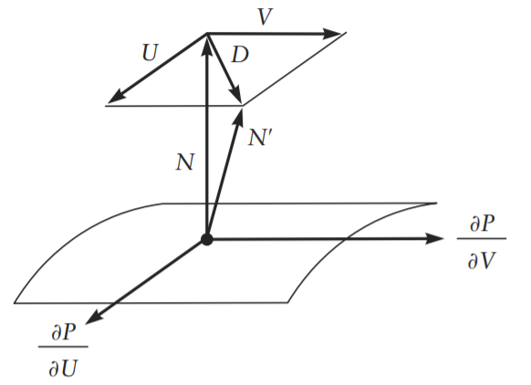
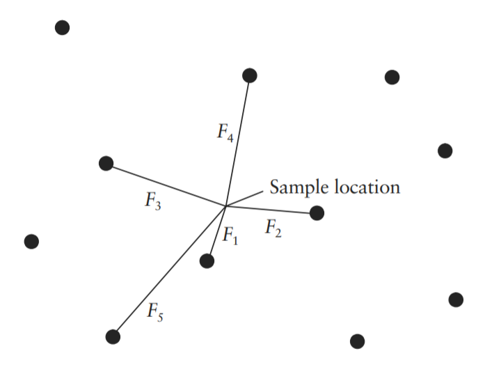

<head>
    <script src="https://cdn.mathjax.org/mathjax/latest/MathJax.js?config=TeX-AMS-MML_HTMLorMML" type="text/javascript"></script>
    <script type="text/x-mathjax-config">
        MathJax.Hub.Config({
            tex2jax: {
            skipTags: ['script', 'noscript', 'style', 'textarea', 'pre'],
            inlineMath: [['$','$']]
            }
        });
    </script>
</head>

# 程序化方法 1

### 程序化纹理

###### 显式方法和隐式方法

原则上，显式和隐式方法可以用于生成相同类别的纹理模式或几何模型(几乎任何东西)，但在实践中，每种方法都有自己的方便或可行的模型类别。

|           Explicit           |                          Implicit                          |
| :--------------------------: | :--------------------------------------------------------: |
|       polygons 多边形        |                     quadrics  二次曲面                     |
| parametric curves 参数化曲线 | patterns of potential or force fields 势场或力场产生的图形 |
|        patches  贴片         |            natural stone textures 自然岩石纹理             |
|                              |                         clouds 云                          |
|                              |                           fog 雾                           |

###### 程序化方法的优势

- 紧凑性，字节数大小
- 没有固定的分辨率。大多数情况下无论分辨率多高，都有精确而详细的纹理。
- 可以参数化，生成相关的一系列纹理

###### 程序化方法的劣势

- 过程纹理很难构建和调试
- 很难能预测生成后的结果
- 时间和空间的权衡，程序化比纹理采样要慢
- 锯齿化和反锯齿带来的问题

###### 贴图空间

- 世界空间是其他空间的起点。It is the starting point for all other spaces.
- 对象空间才是被着色的表面定义的那个 The object space is the one in which the surface being shaded was defined
- 着色器空间

###### 分层和合成

将两个颜色进行混合	C = mix(C0, Cl, f);  这个应该是HLSL中的lerp函数

如果两个颜色相乘，可以理解为一种颜色对另一种颜色的过滤。如果颜色C0表示滤镜对红光、绿光和蓝光的透明度，那么C0·C1表示通过滤镜看到的颜色C1。If color C0 represents the transparency of a filter to red, green, and blue light,then C0·C1 represents the color C1 as viewed through the filter.

###### Steps, Clamps, and Conditionals

**Step**函数可以替换一些条件语句，例如：

```glsl
if (u < 0.5)
	Ci = color (1,1,0.5);
else
	Ci = color (0.5,0.3,1);
//可以替换为:
Ci = mix(color (1,1,0.5), color (0.5,0.3,1), step(0.5, u));
```

两个step函数可以被用来做一个矩形脉冲：

```glsl
#define PULSE(a,b,x) (step((a),(x)) - step((b),(x)))
```


**Clamp**函数可以这么用：

min(x, b) ≡ clamp(x, x, b)

max(x, a) ≡ clamp(x, a, x)

clamp(x, a, b) ≡ min(max(x, a), b)

它的图像是这样的


**Abs**函数的图像是这样：


上面的这些函数都是一些“硬”，那么下面来介绍一下软的函数**smoothstep**，我曾经有写介绍这个函数的一个[学习笔记](shader_learning_5.md)

它的图像是这样：


在许多程序化纹理都用**smoothstep**代替**step**，因为尖锐的过渡总不是很受欢迎，而且还有锯齿，而且在动画的时候也会防止突然的运动和停止。


###### 周期函数

首先，用的最多的是Sin 和 Cos 函数，然后另外一个函数就是mod()，看图就一目了然了：


再结合之前的PULSE函数


###### 样条函数和映射

GLSL里面没有**spline**函数（C样条曲线），但是我们只要理解算法，下面给出C的算法

```c
/* Coefficients of basis matrix. */
#define CROO -0.5
#define CR01 1.5
#define CR02 -1.5
#define CR03 0.5
#define CR10 1.0
#define CR11 -2.5
#define CR12 2.0
#define CR13 -0.5
#define CR20 -0.5
#define CR21 0.0
#define CR22 0.5
#define CR23 0.0
#define CR30 0.0
#define CR31 1.0
#define CR32 0.0
#define CR33 0.0
float
spline(float x, int nknots, float *knot)
{
    int span;
    int nspans = nknots - 3;
    float cO, cl, c2, c3; /* coefficients of the cubic.*/
    if (nspans < 1){/* illegal */
        fprintf(stderr, “Spline has too few knots.\n”);
        return 0;
    }
    /* Find the appropriate 4-point span of the spline. */
    x = clamp(x, 0, 1) * nspans;
    span = (int) x;
    if (span >= nknots - 3)
    	span = nknots - 3;
    x -= span;
    knot += span;
    /* Evaluate the span cubic at x using Horner’s rule. */
    c3 = CROO*knot[0] + CR01*knot[l] + CR02*knot[2] + CR03*knot[3];
    c2 = CR10*knot[0] + CRll*knot[l] + CR12*knot[2] + CR13*knot[3];
    cl = CR20*knot[0] + CR21*knot[l] + CR22*knot[2] + CR23*knot[3];
    cO = CR30*knot[0] + CR31*knot[l] + CR32*knot[2] + CR33*knot[3];
    return ((c3*x + c2)*x + cl)*x + cO;
}
```


接下来，还有一些其他的映射公式：

这个是gamma矫正的公式

```glsl
float gammacorrect(float gamma, float x)
{
	return pow(x, 1/gamma);
}
```


这个图是这个含义，gamma值是0.4和2.3，且x在[0,1]区间内，那么映射结果也在这个区间内。如果gamma值大于1，则曲线向上弯曲(凸)；如果gamma值属于(0,1)区间内，则曲线向下凹。

然后在之后的发展中Perlin 和 Hoffert 修改了gamma矫正函数，成为一个新的函数bias(),定义了有 bias(b,0.5) = b.

```glsl
float bias(float b, float x)
{
	return pow(x, log(b)/log(0.5));
}
```


同时，他们还展示了一个新的函数gain，其中两个部分是由上述的bias构成，当x等于0.5时，总是返回0.5，然后根据代码如下：

```glsl
float gain(float g, float x)
{
    if (x < 0.5)
    	return bias(l-g, 2*x)/2;
    else
    	return 1 - bias(l-g, 2 - 2*x)/2;
}
```


------

###### 案例 制作一个砖墙纹理

```glsl
#define BRICKWIDTH 0.25
#define BRICKHEIGHT 0.08
#define MORTARTHICKNESS 0.01
#define BMWIDTH (BRICKWIDTH+MORTARTHICKNESS)
#define BMHEIGHT (BRICKHEIGHT+MORTARTHICKNESS)
#define MWF (MORTARTHICKNESS*0.5/BMWIDTH)
#define MHF (MORTARTHICKNESS*0.5/BMHEIGHT)
void main() {
    vec2 st = 1. * gl_FragCoord.xy/u_resolution.x;
    vec3 Cbrick = vec3 (0.5, 0.15, 0.14);	//砖的颜色
    vec3 Cmortar = vec3 (0.5, 0.5, 0.5);	//水泥的颜色
    float ss = st.x / BMWIDTH;				//
    float tt = st.y / BMHEIGHT;
    float sbrick = floor(ss); 				//在x轴上共有多少砖
    float tbrick = floor(tt); 				//在y轴上共有多少砖
    ss += 0.5 * step(mod(tt,2.),1.0);		//如果y轴上是偶数行，则向右移动 0.5 块砖
    float sbrick_f = fract(ss);				//取小数部分，即是在当前砖块中，此像素点所在砖块x轴的比例（位置）是？
    float tbrick_f = fract(tt);
    float w = step(MWF,sbrick_f) - step(1.- MWF,sbrick_f);	// 脉冲算法
    float h = step(MHF,tbrick_f) - step(1.- MHF,tbrick_f);
    vec3 Ct = mix(Cmortar, Cbrick, w * h);	//lerp
    gl_FragColor = vec4(Ct,1.0);
}
```


然后，我们需要给它加一个法线，使其更真实，首先，我们要了解法线图的原理



其中，N‘ 是最终的法线，N是模型插值得到的法向量，D是在切面内的扰动向量，且垂直于N，其中F(u, v)是沿法向量N的高度的模拟

$$
U = \frac{\partial F}{\partial u}(N * \frac{\partial P}{\partial v}) \\
V = -(\frac{\partial F}{\partial v}(N * \frac{\partial P}{\partial u})) \\
D = \frac{1}{|N|}(U + V)
$$
然后，回到每一块砖块上来，我们从侧面分析一下：


然后代码如下：

```glsl
float getBump(float m,float p){
    return (smoothstep(0.,m,p) - smoothstep(1.- m,1.,p));	//平滑的脉冲函数曲线
}

vec3 calculatenormal(vec2 PP)
{
    //我们算出此像素前后的偏导数，因为网页版的GLSL不支持dFdx，所以我们自己算一下偏导数，
    //首先我们需要算出此像素相邻的像素点的值，然后再高度Bump上进行采样，然后得出x，y（u，v）轴上偏导数构成的切向量
    //进行叉乘后，进行单位化，可以得出法线 [1] 3D Graphics for Game Programming ,JungHyun Han,2012
	vec2 d = vec2(1.,1.)/ u_resolution.x;
	d = d / vec2(BMWIDTH,BMHEIGHT);
    float ddx = (getBump(MWF,PP.x + d.x) - getBump(MWF,PP.x - d.x)) * 0.5;
    float ddy = (getBump(MHF,PP.y + d.y) - getBump(MHF,PP.y - d.y)) * 0.5;
  	return normalize(cross(vec3(1.0,0.0,ddx),vec3(0.0,1.0,ddy)));
}

void main() {
    vec3 n = calculatenormal(vec2(sbrick_f,tbrick_f));
    vec3 color = Ct;     
	vec3 light = normalize(vec3(cos(u_time), sin(u_time), 1.0));    
    vec3 lit = vec3(clamp(dot(light, n),0.0,1.0)) * 2.;	//简单的光照模拟
    gl_FragColor = vec4(lit * color,1.0);
}
```

最终效果如图：


------

###### 绘制五角星——极坐标

首先先了解极坐标和直角坐标系的转换：
$$
\begin{cases}
x = \rho cos\theta\\
y = \rho sin\theta\\
\end{cases}
<=>
\begin{cases}
\rho^2=x^2+y^2\\
tan\theta = \frac{y}{x} (x \not= 0)
\end{cases}
$$

我门首先要将五角星分解为5个箭头形，然后在极坐标下面进行mod和计算


代码如下：

```glsl
#define PI 3.1415
#define NP 5.;

void main() {
    vec3 star_color = vec3(1.,1.000,0.0);
    vec3 bg_color = vec3(0.,0.,0.);
    float maxR = 0.5;
    float minR = 0.3;
    float angle = PI * 2. / NP;
    float half_angle = angle / 2.;   
    //
    vec2 st = (gl_FragCoord.xy * 2. - u_resolution.xy )/u_resolution.x;//将坐标原点移动到中心
    vec2 p0 = minR * vec2(cos(half_angle),sin(half_angle));
    vec2 p1 = maxR * vec2(cos(0.),sin(0.));
    vec2 d0 = p0-p1;	//得到如图红色的向量
    //在极坐标下，进行mod，将其分为5个周期为angle的图形区域，并且最后除以angle，则是以此角度为单位角度，当前角度占比为多少
    //a的值就缩放到[0,1]的范围内了，便于之后的计算~ uTime是可以让五角星最后旋转起来~
    float a = mod(atan(st.x,st.y) - PI * u_time * 0.2,angle) / angle;
    //0.5 即为中间的分隔线，那么如果大于0.5，则将其镜像过来（相当于沿着中间的分割线对折了一下）
    if (a >= 0.5)	a = 1. - a;
    vec2 p2 = vec2(cos(a),sin(a)) * sqrt(dot(st,st));//将当前在极坐标下面的点转换回直角坐标
    vec2 d1 = p0-p2;
    //通过一个cross判断d0和d1两个向量的左右关系（cross后结果是垂直于d0，d1平面的，而z值的正负号，可以知道其左右关系）
    vec3 color = mix(star_color,bg_color,smoothstep(0.,0.003,cross(vec3(d0,0.),vec3(d1,0.)).z));
    gl_FragColor = vec4(color,1.0);
}
```


------

**信号处理**

采样和重构是图形学的基础。

带宽（bandwidth）：原始信号中的信息量称之为带宽

采样率（sampling rate）：单位距离上采样的点

奈奎斯特频率（Nyquist frequency）


改变aliasing问题，有2个大方案，改变采样率使其更紧密，或者就是修改原始信号，清理其中的高频信号！但是，其中的改变采样率并不是一个很好的办法，因为有些信号有无限带宽。或者信号的急剧变化，例如一个阶跃函数，所以单独提高分辨率可以使锯齿变小，但永远无法消除它们。

由于上述第一种方案不能总是很好的解决，所以，我们需要在采样前去去除信号中的高频，这种技术被称作为低通滤波（low-pass filter），在视觉上面的表现就是模糊。这个技术的挑战就是如何让图像的模糊尽可能小，同时又可以充分减少不想要的高频信号。

但是在采样前的低通滤波比较难，在计算机图形学中，一种常见策略是进行超采样(super-sample/oversample),也就是说以超过预期输出采样率的高速率进行采样(to sample it at a higher rate than the desired output sampling rate)。

综上所述，为了生成具有指定分辨率的抗锯齿图像，最有效的策略是在采样前通过低通滤波去除信号中过高的频率。如果无法对信号进行滤波，最好的策略是随机地（stochastically）以尽可能高的速率对其进行超采样，并对超采样组应用离散低通滤波器。下一节将讨论如何将低通滤波构建到过程纹理中以消除混叠现象

渲染器中都又一些antialiasing的方案，但是并不能解决程序纹理中的锯齿化问题（aliasing problem）。事实上，超采样过程中需要许多的着色样本，以至于速度非常慢。最后随机超采样（stochastic supersampling）只能将锯齿转化为噪声，而无法消除我们不想要的高频。

用smoothstep代替step和if这种越阶函数，是可以的，但是也不是万全之策，需要根据查看纹理的远近，动态的调整smoothstep的步长，不然也会出现锯齿化或者模糊化。所以，过程纹理必须知道渲染器对纹理采样的采样率。采样率就是相关纹理空间或特征空间中相邻样本之间的间隔的倒数（The sampling rate is just the reciprocal of the spacing between adjacent samples in the relevant texture space or feature space）

------

###### 图像处理

**RGB：**首先，来介绍一下RGB的颜色空间，如图，我们可以发现从原点(0,0,0)到(1,1,1)的连线，是灰度连线。其他三个轴为R，G，B三种颜色，


**HSV/HSB：**色相被表示为绕圆锥中心轴的角度，饱和度被表示为从圆锥的横截面的圆心到这个点的距离，明度被表示为在圆锥的横截面上圆心到顶点的距离。当然也可以想象理解为圆柱体的，只不过因为随着区分出的饱和度和色相的级别数目随着明度接近黑色而减少，所以圆锥体更实用。


**去色(**Desaturate**)：** 传统去色方法公式  $Gray = R*0.299 + G*0.587 + B*0.114$  在shader中有：

```glsl
vec4 generic_desaturate(vec3 color, float factor)
{
	vec3 lum = vec3(0.299, 0.587, 0.114);
	vec3 gray = vec3(dot(lum, color));
	return vec4(mix(color, gray, factor), 1.0);
}
```

我们还有另外一种方法，也可以去色：

```glsl
vec4 ps_desaturate(vec3 color)
{
    float bw = (min(color.r, min(color.g, color.b)) + max(color.r, max(color.g, color.b))) * 0.5;
    return vec4(bw, bw, bw, 1.0);
}
```

**灰度图转为二值图** 可以通过一个阈值来将其处理为 0和1，对于一张连续的图，可以用灰度值统计直方图，取峰值间的山谷的灰度值设置为阈值。

**空间相关性** 对于一般的图像，图中相邻的图像单元（即：像素点）是相关的。**椒盐噪声**  是错误且孤立的像素点。消除椒盐噪声，可以用2种方法，中位数方法和clamp方法。

**线性移不变（LSI）** 首先是线性系统，满足叠加原理（可加性和比例性）。其一般表达式为：
$$
\sum_{i=1}^Na_iy_i(n)=T\left[\sum_{i=1}^Na_ix_i(n)\right]
$$
可以形象的理解:
$$
f_1 → SYS → g_1 \\
f_2 → SYS → g_2 \\
\alpha f_1+\beta f_2 → SYS → \alpha g_1 + \beta g_2 \\
$$
其次是移不变系统（时不变），即若系统的响应与激励加于系统的时刻无关，则该系统为移不变系统。有
$$
若\Psi(v) = T[\xi(v)],则\Psi(v-\mu) = T[\xi(v-\mu)]
$$
形象理解为：
$$
f(x,y) → SYS → g(x,y)\\
f(x-\alpha,y-\beta) → SYS → g(x-\alpha,y-\beta)
$$
单位冲击响应为$h(n)$ ：

- 线性移不变系统是因果系统的充分必要条件是：$h(n)=0,n<0$

- 线性移不变系统是稳定系统的充分必要条件是：单位冲击响应绝对可和。

$$
\sum_{n=-\infty}^\infty\left|h(n)\right| = q<\infty
$$

在一个图像处理系统中，给定输入为$f(x,y)$ ，则系统产生的结果有：
$$
g(x,y) =\int_{-\infty}^\infty\int_{-\infty}^\infty f(x-\xi,y-\eta)h(\xi,\eta)d{\xi}d\eta
$$
则称 $g$ 是 $f$ 和 $h$ 的卷积，表示为 $g = f * h$ ，同时有如果一个系统可以被表示为一个卷积的形式，那么该系统是一个LSI系统。

如果我们将上式子中将系统的输出$g(x,y)$变为$h(x,y)$，我们可否找到一个$f(x,y)$ 使得:
$$
h(x,y) =\int_{-\infty}^\infty\int_{-\infty}^\infty f(x-\xi,y-\eta)h(\xi,\eta)d{\xi}d\eta
$$
此时，我们寻找的函数 $f$ 就被称为 $\delta(x,y)$ 函数。这个函数被称作单位冲击函数，这个不是经典意义下的函数，而是一个广义函数。我们知道，如果将$f(x,y)$看作一个曲面，那么对$f(x,y)$积分表示对这个曲面下方那部分空间的体积。所以根据 $\delta(x,y)$ 的定义，它可以被看作:当$\epsilon→0$时，由在 $x$ 和 $y$ 方向宽度为$2\epsilon$ 高度为 $1/(4\epsilon^2)$ 所构成函数序列的极限。然后，我们也可以了解到 $\delta$ 函数的筛选性
$$
\int_{-\infty}^\infty\int_{-\infty}^\infty \delta(x-\xi,y-\eta)h(\xi,\eta)d{\xi}d\eta = h(x,y)
$$
这个$h(x,y)$的物理意义是：当我们用单位冲击函数作为系统的输入时，系统所产生的输出响应。在图像中理解，就是$h(x,y)$函数告诉我们如何将一个点光源散开来。在二维系统中，$h(x,y)$被称为点扩散函数。

我们将系统输入的$f(x,y)$看作是由下列两个过程构成的函数，即：

- 对无数个单位冲击函数$\delta(x,y)$进行移动和尺度变化，即：

$$
k(\xi,\eta)\delta(x-\xi,y-\eta)
$$

- 然后，将上面的公式所有的结果组合在一起

最后，可以证明一个重要的结论，就是：**线性移不变系统对应一个卷积**

因为卷积满足结合律 :  $(a*b)*c = a*(b*c)$

可以考虑由两个点扩散函数$h_1(x,y)$和$h_2(x,y)$的系统级联在一起。
$$
f → h_1 → h_2 → g
$$
等价于:
$$
f → (h_1 * h_2) → g
$$
**Fourier 变换：**
$$
F(u,v) = \int_{-\infty}^\infty\int_{-\infty}^\infty f(x,y)e^{-i(ux+vy)}dxdy
$$
**Fourier 逆变换：**
$$
f(x,y) = \frac{1}{4\pi^2}\int_{-\infty}^\infty\int_{-\infty}^\infty F(u,v)e^{+i(ux+vy)}dudv
$$
**通过傅里叶变换，空间域的卷积变成了频率域的乘积！**
$$
G(u,v) = H(u,v)F(u,v)
$$
其中$f(x,y)$ 总是取实数，因为在我们的情景下，它就是一张图像。但是我们发现$F(u,v)$ 通常为复数， $H(u,v)$ 是点扩散函数 $h(x,y)$ 的Fourier变换的结果。并不是所有函数都有傅里叶变换。而且**空间域的能量和频率域的能量是相等的**。

我们可以把 $\delta(x,y)$ 函数理解成一个函数序列的极限。因为这个函数是一个广义函数，当我们具象化出其一个函数序列来满足这个广义函数的定义。例如：
$$
\delta_\epsilon(x,y) = \begin{cases}
1/(4\epsilon^2),\ 如果：|x|\leq\epsilon\quad并且\quad|y|\leq\epsilon   \\
0,\quad\quad\quad如果：|x|>\epsilon\quad或者\quad|y|>\epsilon\\
\end{cases}
$$
而且不同的函数序列可能定义相同的广义函数，例如，我们可以用高斯函数来定义,如果用高斯函数会比 $\delta_\epsilon(x,y)$ 有无限可微的优点。
$$
\delta_\sigma(x,y) = \frac{1}{2\pi\sigma^2}e^{-\frac{x^2+y^2}{2\sigma^2}}
$$

------

###### 噪音noise

- 狄拉克分布(Dirac distribution) ：理想的冲击是一个重要的输入信号，图像平面上的理想冲击是用狄拉克分布定义的，$\delta(x,y)$

$$
\int_{-\infty}^\infty\int_{-\infty}^\infty\delta(x,y)dxdy = 1\\
\delta(x,y) = 0;x,y \not= 0;
$$

​		狄拉克分布的筛选性，它提供函数$f(x,y)$在点$\lambda,\mu$的值：
$$
\int_{-\infty}^\infty\int_{-\infty}^\infty f(x,y)\delta(x-\lambda,y-\mu)dxdy = f(\lambda,\mu)
$$
​		一幅图像$f$ 可以表示成由狄拉克冲击$\delta$ 表达的点展开的线性组合。假设输入图像$f$ 已经给出，线性系统$L$ 对于输入图像$f$ 的响应 $g$ 由下式给出：
$$
g(x,y) = L\{f(x,y)\} = \int_{-\infty}^\infty\int_{-\infty}^\infty f(a.b)L\{\delta(x-a,y-b)\}dadb\\
=\int_{-\infty}^\infty\int_{-\infty}^\infty f(a.b)h(x-a,y-b)dadb = (f*h)(x,y)
$$
​		其中$h$ 是线性系统 $L$ 的冲击响应。换句话说，线性系统 $L$ 的输出可以表示为输入图像 $f$ 与该线性系统的冲击响应 $h$ 的卷积

- 卷积（convolution）：卷积是一个积分，反应一个函数$f(t)$在另一个函数上$h(t)$移动时所重叠的量。函数$f$和$h$在有限域[0,t]上的1D卷积$f*h$由下式给出：

$$
(f*h)(t) ≡ \int_0^tf(\tau)h(t-\tau)d\tau
$$

​		对卷积进行微分由
$$
\frac{d}{dx}(f*h) = \frac{df}{dx}*h = f*\frac{dh}{dx}
$$


- 白噪音（white noise）

我们需要一种随机函数，是可以通过传参而得到一些看起来是随机的函数。同时这种函数是通过相同的参数而可以复现随机值的。然而，真正的随机函数是不需要参数的。所以当我们传递相同纹理坐标参数输入时，总会输出相同的随机值。我们可以很容易的找到哈希和伪随机数生成的相关文章pseudo random number (PRN)

理想noise函数的性质如下:

- noise是其输入的一个可复现(重复)的伪随机函数。
- noise有一个已知范围，例如从- 1到1。
- noise带宽是受限的，最大频率约为1。（把一个信号所包含谐波的最高频率与最低频率之差，即该信号所拥有的频率范围，定义为该信号的带宽。因此可以说，信号的频率变化范围越大，信号的带宽就越宽）
- noise没有明显的周期性或规律性。这种伪随机函数通常是周期性的，但周期可以很长，因此其周期性不明显。
- noise是固定的（stationary）——也就是说，它的统计特性应该是平移不变性的。
- noise是各向同性的（isotropic）——也就是说，它的统计特性应该是旋转不变性的。

**Lattice Noises** 就是一个伪随机数数组,如perm[256] = {225, 155, 210, 108, 175,.....}，然后通过 index到perm中去定位即可

**Value Noise** 首先，我们动态生成一个每一个格子为[-1,1]的PRN，然后，在栅格PRNs之间做插值是很重要的，其中线性插值不够平滑，带有明显格子的感觉，它的导数也不是连续的。所以，最好插值要用三次Catmull-Rom插值，这样它的一阶和二阶导数都是连续的。但是三次插值的代价也是比较大的，当然二次b样条和三次b样条也是最常用的，但是两个方法并不能得到栅格的PRN值，它们近似于这些值，这也许会导致b样条noise的震荡范围更窄，即振幅更低。还有Lewis(1989)描述了如何使用维纳插值来插值栅格的PRN，而且可以用有限的数值控制噪声的功率谱。

**Gradient Noise** Perlin(1985) 和 Hoffert(1989)所描述的噪声函数是梯度噪声的第一个实现。梯度噪声是产生低通滤波随机(stochastic)函数的最简单的方法。

**Value-Gradient Noise**  为了避免梯度噪声在整数格点处为0而表现出明显的网格，同时又不丧失梯度噪声频谱的优势，尝试将值和梯度结合起来，它是值噪声和梯度噪声的加权和。

**Lattice Convolution Noise** 因为Lattice Noises会经常出现轴对齐的非自然的感觉，我们通过用离散的卷积技术来做插值从而避免各向异性。在格点上的prn被视为随机脉冲的值，并与径向对称滤波器进行卷积

------

###### 开发 Shader 的策略

- 找到真实世界中的照片和视频，或者是风格化的概念图。
- 不要从零开始，找到一个和即将要尝试去完成的shader相似的一个现有的shader作为出发点。如果有offline shader的话，也可以进行一些启迪和参考。还可以去硬件公司的网站上去寻找相关的shader。
- 今天迭代开发，然后不断观察图像的现象变换，而非基于物理的过程模拟。
- 考虑不同的一些方法：在有些情况下，进行纹理采样是最简单最好的，而某些时候程序化的方法又会非常好。
- 而且要考虑和优化着色器的性能。

------

###### 细胞结构体(CELLULAR TEXTURING)

噪音有一种“去色”和“山脉”的感觉，而细胞结构体更像“海绵”，“蜥蜴鳞片”，“鹅卵石”的感觉。它们经常把空间分成小的，随机平铺的区域。虽然这些区域是离散的，细胞的基函数本身是连续的。可以在空间的任何地方计算。噪声和细胞结构体的行为是互补的。



对于像素的采样点$x$和固定的特征点(fixed feature point)的距离$F(x)$,找到最小值$F_1$，根据距离排序$F_1<F_2<F_3...$..当然，我们可以调整函数$F$，使之变形为一些其他的函数，例如：$color = F_1F_2$ 或者是 $ color = F_2 - F_1 $

在shader开发时候，我们可以利用将屏幕切分为网格进行优化，每个网格中随机生成一个特征点，我们知道一个随机函数应该具有hash性(见上文)，所以我们可以缩放代码中的st，然后拆分开st的整数和小数部分，


```glsl
vec2 random2( vec2 p ) {
    return fract(sin(vec2(dot(p,vec2(127.1,311.7)),dot(p,vec2(269.5,183.3))))*43758.5453);
}
void main() {
    vec2 st = gl_FragCoord.xy/u_resolution.xy;
    st.x *= u_resolution.x/u_resolution.y;
    vec3 color = vec3(.0);
    // Scale
    st *= 5.;
    // Tile the space
    vec2 i_st = floor(st);
    vec2 f_st = fract(st);

    float m_dist = 1.;  // minimum distance
    for (int j= -1; j <= 1; j++ ) {
        for (int i= -1; i <= 1; i++ ) {
            // Neighbor place in the grid
            vec2 neighbor = vec2(float(i),float(j));
            // Random position from current + neighbor place in the grid
            vec2 offset = random2(i_st + neighbor);
            // Animate the offset
            offset = 0.5 + 0.5*sin(u_time + 6.2831*offset);
            // Position of the cell
            vec2 pos = neighbor + offset - f_st;
            // Cell distance
            float dist = length(pos);
            // 这个函数会做变形
            //m_dist = min(m_dist, dist);
            m_dist = min(m_dist, m_dist*dist);
        }
    }

    // 绘制函数
    color += step(0.060, m_dist);
    //color += m_dist;

    gl_FragColor = vec4(color,1.0);
}
```

此shader的效果如图:


如果，将28行和35行解注释后，我们可以得到，传统的cellar texturing


------

###### PRACTICAL METHODS FOR TEXTURE DESIGN

**The Art of Noise**

想减少掉分形噪音（fractal noise algorithm）中有人工生成的痕迹（artifacts），隐藏此痕迹的方法是旋转每个累加的缩放对齐到随机方向。因为不同缩放(scales)的格子不会对齐，所以人工的痕迹不会那么明显。例如旋转1/8个圆周。在凹凸贴图部分，这个旋转技巧非常有用，因为噪声值的区别清楚的暴露了格点的痕迹，沿着格点线的二阶导数明显不连续。当你的凹凸贴图进行微分时，这些二阶导数变成了不连续的一阶导数。

另一个帮助隐藏噪声人工痕迹（artifacts）的策略是智能地选择缝隙(连续尺度大小之间的比率)，自然的缝隙是0.5，但是不要用这个，最好使用有很多数字的值(比如0.485743或0.527473)，这样可以得到相同的有效比率。如果用0.5，人工的痕迹会周期性的出现。

不要忽视对分形噪声算法的增强（enhancements ）或变体（variants ）。将噪声插值扩展到四维空间特别有用，因为这允许您创建时间动画分形噪声。

**Color Mappings**

这种映射允许用户对所应用的颜色进行相当多的控制，而且它的简单性使它既容易实现，也便于用户控制，哪怕是使用原始数值作为输入。我曾经非常成功地使用过一种映射方法，它定义了四种“转换”值。这些转换值控制某个映射函数的位置和形状，该映射函数将分形噪声(或其他函数)值转换为从0到1的输出值。图6.2显示了该函数的形状。标记为T1和T2的两个转换分别由开始值和结束值定义。通过设置发生这些转换的不同级别，可以实现从渐变到阶梯函数到更复杂的“带通（bandpass）”形状的各种各样的映射。


[^color]: “颜色”这个词总是被松散地使用。大多数物体表面属性可以通过纹理控制，而物体的漫反射颜色是最经常修改的值，任何其他表面属性都可以使用完全相同的方法控制。它只是说“颜色”比“表面属性指定一些矢量，你可以修改你的纹理界面”容易得多。

**Bump-Mapping Methods**

在基本纹理中添加凹凸贴图并不是很难。如果你有一个函数可以映射标量场到一个数值（例如颜色映射后的分形噪声值或者是一个大理石的扰动的正弦值），你可以把标量函数在三个方向（x,y,z）上的导数，把这些值加到表面的法线上，然后重新单位化（renormalize ）。还应该为用户添加一个参数来控制凹凸的起伏高度，这只是在添加之前乘以了一个导数（derivative），这样用户就可以通过使用一个零值来关闭凹凸贴图，或者通过使用一个负值来让凹凸感相反。

[^derivative]: 上述的这个导数，其实应该想让其乘一个凹凸值的变化量。

在几何图形的例子中(例如，一个六边形网格，甚至一个普通的棋盘格)，没有一个真正的函数可以求导数。在本例中，我喜欢做一个“山脊”，它基本上是沿着图形的外部边界在边界内以固定的(用户定义的)距离延伸的一条线。这个山脊基本上在图形的外边缘形成一个斜面，允许用户使图形看起来向上或向下进入表面。图6.3展示了一个简单的斜面如何使平面图形显示为三维的示例。


但是一个简单的三角形斜角是非常普通的。最好是可以给用户更多的控制形状的外缘，使各种形状，从方形槽到用珠子填补的圆形槽。在棋盘的情况下，用户可以做一个凹圆型凹陷，这将使砖块看起来像他们被砂浆接缝包围。

我尝试了几种方法来让用户控制这些脊线的形状，但其中一种是最有用的。您不想让用户使用太多的参数，但是您仍然希望给他们足够的控制来创建各种各样的关节。我发现只有四个参数的组合在定义各种斜角形状时非常有效。

第一个参数是脊宽。缝或斜角的总宽度是多少？在大多数情况下，这个斜面将会对接到另一个接缝，所以你可能想要在内部平分一半数字。（这方面的一个例子是棋盘:每一块砖都紧挨着它的邻居。对于使用者来说，考虑接合处的总宽度比只考虑一块中接合处部分的宽度更容易。)

第二个参数是我所说的“平台宽度”。“这是山脊外的一段距离，没有受到影响。这允许用户在接缝的中间有一个平的部分，类似由斜面形成的悬崖壁之间的山谷。这个平台显然必须小于斜面的总宽度。

最后两个参数控制斜面的形状。如果你把山脊想象成一个奇特的阶跃函数(它从低到高，中间有一些变化)你就可以用一条直线，一条平滑的S曲线，或者中间的任何东西来定义它。我发现在过渡上使用平滑的三次曲线允许用户通过设置两个数字来定义最有用的形状，这两个数字是曲线在过渡开始和结束时的斜率。坡度为0.0将与表面的其余部分进行平滑的混合，如果两个坡度都为1.0，过渡将是一个经典的直线斜角。图6.4最好地显示了这一点，它还显示了如何使用平台。


这些坡度控制对于制作不同的山脊轮廓很明显是有用的，但是如何将参数转换成可以用于凹凸贴图的数字呢？最好的方法是使用简单的Hermite混合曲线。Hermite曲线是一种简单类型的样条，由一个范围从0到1的三次多项式定义。三次多项式是非常方便的，因为它的计算成本很低，而且有四个自由度来控制它的形状。我们可以通过设置起始值和结束值以及斜率来完全定义这个三次曲线。

我们有四个值(开始和结束高度，开始和结束斜率)，我们可以使用它来构建三次多项式，将四个Hermite函数的加权副本相加。F(t)是唯一的满足这四个约束条件的三次多项式。

这些混合函数被称作$P_1,P_4,R_1,R_4$，表示的值为$F(0),F(1),F'(0),F'(1)$如图：
$$
P_1 = 2t^3 − 3t^2 + 1\\
P_4 = −2t^3 + 3t^2\\
R_1 = t^3 − 2t^2 + t\\
R_4 = t^3 − t^2\\
P_1′ = 6t^2 − 6t\\
P_4′ = −6t^2 + 6t\\
R_1′ = 3t^2 − 4t+1\\
R_4′ = 3t^2 − 2t
$$


在山脊的情况下，起始值和结束值将始终分别固定为0和1，用户提供两个斜坡（slopes）(将底部和顶部称为$s_b$和$s_t$，这个是用户自定义的参数)，因此，脊形的曲线是$P_1 + s_bR_1 + s_tR_4$。曲线在碰撞点处的导数为$P_1'(t) + s_bR_1'(t) + s_tR_4'(t)$。这告诉我们在碰撞点的山脊的斜坡（slope）：当我们添加表面法线时使用的权重。


------

###### PROCEDURAL MODELING OF GASES

**INTRODUCTION**

本章介绍了体积程序化建模和纹理的框架。体积程序化模型是一种通用的程序化技术，对建模自然现象很有帮助。大多数图形应用程序使用基于表面的对象模型；然而，这些模型不足以有效地捕捉许多自然现象(如水、火、烟、蒸汽、云和其他气体现象)错综复杂的空间填充特征。体积模型也广泛用于建模毛皮和其他“软”对象。

本章首先总结了之前的气体建模方法，然后简要介绍了我的气体体积光线追踪系统和几种使用图形硬件实现这些效果的方法。接着介绍三维“solid spaces”的概念，强调程序化（功能/纹理）空间与物体、屏幕空间的关系。最后，详细总结了如何创建气体的静止图像。

**PREVIOUS APPROACHES TO MODELING GASES**

在计算机图形学中模拟气体的尝试始于20世纪70年代末。从那时起，出现了许多不同的方法。这些可以被归类为气体几何建模技术和渲染气体和大气效果场景的技术

我已经开发了几种基于体积密度函数建模气体的方法(Ebert 1991; Ebert and Parent 1990; Ebert, Ebert, and Boyer 1990; Ebert, Boyer, and Roble 1989)。相比以前的技术这些模型是真实的三维模型的几何气体而且提供了更真实的结果。

Stam和Fiume(1991,1993,1995)也使用气体的三维几何模型。该模型使用“模糊斑点（fuzzy blobbies）”，类似于体积元和粒子系统，为气体的几何模型。Stam和Fedkiw已经将这项工作扩展到使用基于物理的Navier-Stokes解决方案来建模气体，并取得了非常逼真的效果(Stam 1999;Fedkiw, Stam, and Jensen 2001)。

Sakas(1993)使用谱合成来定义气体的三维几何模型。许多作者使用了各种技术来详细建模和实时逼近云，这将在第9章中描述。

在计算机图形学中，云、雾、大气扩散效应和其他气体现象的场景渲染也是一个活跃的研究领域。

有几篇论文描述了大气扩散效应（Willis 1987; Nishita, Miyawaki, and Nakamae 1987; Rushmeier and Torrance 1987; Musgrave 1990；）

其他的则详细介绍了这些气体现象的照明情况（Blinn 1982a; Kajiya and Von Herzen 1984; Max 1986; Klassen 1987; Ebert and Parent 1990）。大多数作者使用low-albedo反射模型，少数((Blinn 1982a; Kajiya and Von Herzen 1984; Rushmeier and Torrance 1987; Max 1994; Nishita, Nakamae, and Dobashi 1996; Wann Jensen and Christensen 1998; Fedkiw, Stam, and Wann Jensen 2001)讨论了high-albedo模型的实现。(低反照率模型假定二次散射效应可以忽略，而高反照率光照模型计算二次或更高阶散射效应。)在过去的几年中，在开发气体和云的交互渲染技术方面也做了大量的工作，如第10章所述。

**Volume-Rendering Algorithm**

该系统中用于气体的体渲染技术与Perlin和Hoffert(1989)中讨论的技术类似。光线从眼睛通过像素被追踪通过定义的几何体。对于通过体积截面的每个增量，计算体积密度函数。然后计算每个样本的颜色、密度、不透明度、阴影和光照。照明和密度的积累是基于低反照率（low-albedo）照明模型的气体和大气衰减。

基础的气体体渲染算法如下：

```c
for each section of gas
	for each increment along the ray
		get color, density, & opacity of this element
		if self_shadowing
			retrieve the shadowing of this element from the solid shadow table
		color = calculate the illumination of the gas using opacity, density & the appropriate model
		final_clr = final_clr + color;
		sum_density = sum_density + density;
		if( transparency < 0.01)
			stop tracing
		increment sample_pt
	create the a_buffer fragment
```

沿着光线采样，用蒙特卡罗方法选择采样点，以减少人为现象。不透明度是通过计算体积密度函数乘以步长得到的密度。这种乘法是必要的，因为在气体模型中，我们正在逼近一个积分来计算沿着射线的不透明度(Kajiya和Von Herzen, 1984)。使用的近似是：
$$
opacity = 1-e^{-\tau\times\sum_{t_{near}}^{t_{far}}\rho(x(t),y(t),z(t))\times{\Delta}t}
$$
其中$\tau$是材质的光学深度，$\rho()$是材质的密度，$t_{near}$是体追踪的起始点$t_{far}$是结束点。最终沿着光线的增幅会越来越小，所以它的不透明度是按比例缩放的(Kajiya and Kay 1989)

**Illumination of Gaseous Phenomena**

该系统采用了基于Kajiya和Von Herzen(1984)的低反照率气体照明模型，所使用的相位函数是Blinn (1982a)中描述的Henyey-Greenstein函数的和。光照模型如下:
$$
B= \sum_{t_{near}}^{t_{far}}e^{-\tau\times\sum_{t_{near}}^{t}\rho(x(u),y(u),z(u))\times{\Delta}t}\times{I}\times{\rho(x(t),y(t),z(t))}\times{\Delta{t}}
$$
其中$I$是：


$$
\sum_{i}I_i(x(t),y(t),z(t))\times{phase(\theta)}
$$
${phase(\theta)}$ 是相位函数，这个函数描述了粒子的总亮度是光与眼睛之间角度的函数。$I_i(x(t),y(t),z(t))$是光的数量，这些光来自于这个元素反射的光源$I$。

气体的自阴影通过减弱每盏灯的亮度而并入$I$，高反照率照明模型的近似也可以通过在$I_i$中加入一个基于材料反射率的环境项来实现。由于二阶和高阶散射效应，这个环境项占了从元素反射的光的百分比。

**Volumetric Shadowing**

体积阴影是重要的获取准确的图像。如上所述，自阴影可以通过减弱每盏灯的亮度而纳入到照明模型中。对气体进行自阴影的最简单的方法是从每个体元到每个光跟踪一条射线，利用前面的不透明度方程来确定沿着射线的材料的不透明度。这种方法类似于在光线追踪中执行的阴影计算，可能会非常慢。我的实验表明，光线跟踪自阴影可以占总计算时间的75%到95%。

为了加速阴影计算，可以使用一个预先计算的表。Kajiya在光源处于无穷大的限制下讨论了这种方法(Kajiya and Von Herzen 1984; Kajiya and Kay 1989)。我对这种方法进行了扩展，以消除这种限制。使用我的技术，光源甚至可以在体内部。这种基于阴影表的技术可以比光线跟踪阴影技术提高10-15倍的性能。对这种阴影技术的完整描述可以在Ebert(1991)中找到

阴影表每帧计算一次。要使用阴影表进行体跟踪，需要确定样本点在阴影表中的位置。这个点将位于由八个表项组成的平行六面体中。这八个入口是三边插值，以获得这个样本点和光之间的密度的总和。为了确定光的衰减量，使用下面的公式：


$$
light\_atten = 1 - e^{-\tau\times{densities\times}step_size}
$$
**ALTERNATIVE RENDERING AND MODELING APPROACHES FOR GASES**

对于气体有三种常用的替代渲染方法

- 粒子系统
- 广告版代替
- 三维硬件纹理映射

粒子系统最常用于稀薄气体，如烟雾。用粒子系统处理气体有两个问题：第一个是计算粒子自阴影的复杂性，第二个是模拟大范围或密集区域的气体(模拟可能需要数百万个粒子)的计算复杂性。广告牌代替技术被有效地使用在交互式云渲染中，但为了提高交互渲染的效率，对云的动画和光源施加了一些限制(Dobashi et al. 2000; Harris and Lastra 2001)，三维硬件纹理映射可用于基于切片的体绘制来模拟云和其他致密气体(Kniss, Kindlmann, and Hansen 2002)，一个粗糙的体表现和程序细节的组合，可以在图形处理器中渲染，被用来产生令人信服的体积效果。

**A PROCEDURAL FRAMEWORK: SOLID SPACES**

本节将介绍一种用于过程技术的通用而灵活的框架，称为固体空间。这个框架的发展，它的数学定义，以及它在程序纹理和建模中的作用描述如下：

**· Development of Solid Spaces**

我的气体建模和动画的方法开始于在实体纹理上工作。实体纹理可以看作是创建一个围绕物体的三维色彩空间。当实体纹理被应用到对象上时，就好像定义的空间被分割开了。一个很好的例子是使用实体纹理创建由木头和大理石制成的对象。实体纹理空间定义了对象在木材或大理石的三维体积。

我的大部分实体纹理程序是基于噪音和湍流的功能。当我被要求制作一只蝴蝶从迷雾中出现的图像时，我的工作扩展到了建模气体。由于气体是由湍流控制的，它似乎很自然地以某种方式将噪声和湍流函数的使用纳入到这个模型中。我的渲染系统已经支持多对象特性的实体纹理，所以我开发的方法是使用实体纹理透明度来产生雾或云层。实体纹理透明功能，当然是基于湍流。这种方法与Gardner的方法（Gardner 1985）非常相似，并且有同样的缺点，即不是一个真正的三维模型，虽然实体纹理程序是在整个三维空间中定义的。在这两种情况下，这些三维程序只在物体表面进行评估。为了弥补这个缺点，我的下一个扩展方法是使用基于湍流的程序来定义三维体的密度，而不是控制中空表面的透明度。

正如您所看到的，使用三维空间来表示对象属性（如颜色、透明度甚至几何形状）是这一进度中的一个常见主题。我使用这种思想来表示对象属性的系统称为实体空间。实体空间框架在一个统一的框架内包含了传统的实体纹理、超纹理和体密度功能。

**· Description of Solid Spaces**

实体空间是与对象关联的三维空间，允许控制对象的属性。例如，在第2章和第6章中描述的实体颜色纹理中，纹理空间是与对象相关的实体空间，它定义了对象所占据的体积中每个点的颜色。这个空间可以被认为与创建对象的材料空间相关联描述。

实体空间在描述对象属性时有很多用途。如前所述，实体空间可用于表示对象的颜色属性。对于那些颜色由定义大理石颜色空间的过程决定的对象来说，这是非常自然的。许多作者使用固体色空间来创造自然物体的真实图像（Perlin 1985; Peachey 1985; Musgrave and Mandelbrot 1989）。通常在实体纹理（使用固体色空间（solid color spaces)）中，会有额外的实体空间，它们结合起来定义颜色空间。例如，在我的大部分固体纹理的工作中，噪音和湍流空间被用来定义颜色空间。其他实体空间的例子包括几何（超纹理和体密度函数），粗糙度（实体凹凸贴图），反射率，透明度，光照特性，和物体的阴影。实体空间甚至可以用来控制对象的动画，这将在下一章中描述。

**· Mathematical Description of Solid Spaces**

实体空间可以用简单的数学术语来描述。它们可以被认为是一个从3维空间到n维空间的函数（其中n可以是任意的非零正整数），更正式地，实体空间可以定义为以下函数：
$$
S(x,y,z) = F,F\in{R^n},n\in{1,2,3,...}
$$
当然，实体空间的定义可以随时间而改变；因此，时间可以被认为是一个四维的固体空间函数。对于实体空间的大多数应用，$S$是一个贯穿整个三维空间的连续函数。例外情况是使用实体空间表示几何对象。在这种情况下，$S$通常在物体的边界处不连续。例如，在隐式曲面的情况下，$S$通常在对象的整个曲面上都是连续的，但是阈值法被用于突然将密度值更改为0，对于那些密度不在定义对象表面的狭窄范围值内的点来说。$F$的选择决定了产生的立体空间的频率，因此也决定了最终图像中可能出现的混叠伪影（aliasing artifacts）的数量。

**GEOMETRY OF THE GASES**

现在已经讨论了一些背景资料，这一节将描述建模气体的详细程序。如引言中提到的，气体的几何形状是用基于湍流（turbulent-flow-based）的体积密度函数来建模的。体积密度函数取该点在世界空间中的位置，在湍流空间（一个三维空间）中找到对应位置，并应用湍流函数。湍流函数返回的值用作气体密度的基础，然后用简单的数学函数“塑造”来模拟所需的气体类型。在接下来的讨论中，我将首先描述我的噪声和湍流函数，然后描述用于塑造气体的基本数学函数的使用。最后，探索几个建模几何气体的例子程序的发展。

**· My Noise and Turbulence Functions**

在这本书的早期章节，详细的描述噪音和湍流，包括噪音和湍流函数与更好的谱特征。我提供了我的实现方法，使读者能够再现这一章所描述的气体的图像。如果使用其他噪声实现，则所需的气体形状将略有不同(我已经试过了) 。我的噪声实现使用存储在规则网格的格点上的随机数字的三边线性插值。我使用的网格大小为64×64×64。该3D数组实际为65×65×65，最后一列等于第一列，便于访问条目（$noise[64][64][64] = noise[0][0][0]$）。要使用3D纹理映射硬件实现这一点，您可以简单地创建64×64×64表，并将纹理重复模式改为repeat。这个基于随机数格的噪声实现实际上非常适合3D纹理映射硬件实现，简单的DirectX或OpenGL调用从这个3D纹理映射读取值将自动执行噪声格插值。

```c
// //////////////////////////////////////////////////////
// WRITE_NOISE.C
// This program generates a noise function file for solid texturing.
// by David S. Ebert
// //////////////////////////////////////////////////////
#include <math.h>
#include <stdio.h>
#define SIZE 64
double drand48();
int main(int argc, char **argv )
{
    long i,j, k, ii,jj,kk;
    float noise[SIZE+1][SIZE+1][SIZE+1];
    FILE *noise_file;
    noise_file = fopen(“noise.data”,”w”);
    for (i=0; i<SIZE; i++) 
        for(j=0; j<SIZE; j++) 
            for(k=0; k<SIZE; k++)
            {
            	noise[i][j][k] = (float)drand48( );
            }
    // This is a hack, but it works. Remember this is
    // only done once.
    for (i=0; i<SIZE+1; i++)
    	for (j=0; j<SIZE+1; j++)
            for (k=0; k<SIZE+1; k++)
            {
                ii = (i == SIZE)? 0: i;
                jj = (j == SIZE)? 0: j;
                kk = (k == SIZE)? 0: k;
                noise[i][j][k] = noise[ii][jj][kk];
            }
    fwrite(noise,sizeof(float),(SIZE+1)*(SIZE+1)*(SIZE+1),noise_file);
    fclose(noise_file);
}
```

为了计算三维空间中某一点的噪声，调用下面给出的calc_noise()函数。这个函数复制噪声晶格以填充三空间的正八方向。要用这个方法，这些点必须在空间的这个八方向。我允许用户为每个对象输入比例和平移因子，以在噪声空间中定位对象。

下面给出的噪声程序calc_noise使用格点值的三线性插值来计算该点的噪声。下面给出的turbulence()函数为标准的Perlin湍流函数(Perlin 1985)。

```c
typedef struct xyz_td
{
	float x, y, z;
} xyz_td;
float calc_noise( );
float turbulence( );
// //////////////////////////////////////////////////////
// Calc_noise
// This is basically how the trilinear interpolation works. I
// lerp down the left front edge of the cube, then the right
// front edge of the cube(p_l, p_r). Then I lerp down the left
// back and right back edges of the cube (p_l2, p_r2). Then I
// lerp across the front face between p_l and p_r (p_face1). Then
// I lerp across the back face between p_l2 and p_r2 (p_face2).
// Now I lerp along the line between p_face1 and p_face2.
// //////////////////////////////////////////////////////
float calc_noise(xyz_td pnt)
{
    float t1;
    float p_l,p_l2,// value lerped down left side of face 1 & face 2
    p_r,p_r2, // value lerped down left side of face 1 & face 2
    p_face1, // value lerped across face 1 (x-y plane ceil of z)
    p_face2, // value lerped across face 2 (x-y plane floor of z)
    p_final; //value lerped through cube (in z)
    extern float noise[SIZE+-1][SIZE+-1][SIZE+-1];
    register int x, y, z, px, py, pz;
    px = (int)pnt.x;
    py = (int)pnt.y;
    pz = (int)pnt.z;
    x = px &(SIZE); // make sure the values are in the table
    y = py &(SIZE); // Effectively replicates table throughout space
    z = pz &(SIZE);
    t1 = pnt.y - py;
    p_l = noise[x][y][z+1]+t1*(noise[x][y+1][z+1]-
    noise[x][y][z+1]);
    p_r = noise [x+1][y][z+1]+t1*(noise[x+1][y+1][z+1]-
    noise[x+1][y][z+1]);
    p_l2 = noise[x][y][z]+ t1*(noise[x][y+1][z] -
    noise[x][y][z]);
    p_r2 = noise[x+l][y][z]+ t1*(noise[x+1][y+1][z]-noise[x+1][y][z]);
    t1 = pnt.x - px;
    p_face1 = p_l + t1 * (p_r - p_l);
    p_face2 = p_12 + t1 * (p_r2 - p_l2);
    t1 = pnt.z - pz;
    p_final = p_face2 + t1*(p_face1 - p_face2);
    return(p_final);
}

//
// ///////////////////////////////////////////////////
// TURBULENCE
// ///////////////////////////////////////////////////
float turbulence(xyz_td pnt, float pixel_size)
{
    float t, scale;
    t=0;
    for(scale=1.0; scale >pixel_size; scale/=2.0)
    {
        pnt.x = pnt.x/scale; 
        pnt.y = pnt.y/scale;
        pnt.z = pnt.z/scale;
        t += calc_noise(pnt) * scale;
    }
    return(t);
}
```

这两个例程都没有优化。采用位移操作对整数格进行索引，可以优化噪声格的访问。预先计算缩放乘子表，用乘以倒数来代替除法，可以优化湍流函数。

**· Basic Gas Shaping**

几种基本的数学函数被用来塑造气体的几何形状。第一个是幂函数。让我们来看看创建气体模型的一个简单过程，看看幂函数和其他函数对气体最终形状的影响

```c
void basic_gas(xyz_td pnt, float *density,float *parms)
{
    float turb;
    int i;
    static float pow_table[POW_TABLE_SIZE];
    static int calcd=1;
    if(calcd) 
    { 
        calcd=0;
        for(i=POW_TABLE_SIZE-1; i>=0; i--)
            pow_table[i]=(float)pow(((double)(i))/(POW_TABLE_SIZE-1)*parms[1]*2.0,(double)parms[2]);
    }
    turb = turbulence(pnt, pixel_size);
    *density = pow_table[(int)(turb*(.5*(POW_TABLE_SIZE-1)))];
}
```

------

###### ANIMATING SOLID SPACES

前一章讨论了气体的几何模型。本章讨论了动画气体和其他程序定义的实体空间。有几种方法可以使实体空间动画。本章将考虑两种方法:

1. 随着时间改变固体空间
2. 通过实体空间移动被渲染的点

第一种方法将时间作为参数，随时间改变空间的定义，这是一种非常自然和明显的动画程序技术方式。使用这种方法，在设计过程时必须考虑时间，而过程会随着时间而演变。更改空间以模拟生长、进化或老化的过程是这种方法的常见示例。一个相关的技术在一个四维空间中创建程序，时间作为第四维，例如四维噪声函数。

第二种方法实际上并没有改变实体空间，而是随着时间移动空间中的点或物体，实际上是程序地扭曲或扰动空间。在评估湍流函数使气体产生动画(固体纹理，超纹理)之前，通过固体空间沿路径移动固定的三维屏幕空间点。每个三维屏幕空间点都被反映射回世界空间。从世界空间，它被映射到气体和湍流空间通过使用简单的仿射变换。最后，随着时间的推移，它通过湍流空间产生运动。因此，路径方向会产生相反的视觉效果。例如，应用于屏幕空间点的向下路径将显示上升的纹理或体积对象。图8.1说明了这个过程。


这两种技术都可以应用于固体纹理、气体和超纹理。在动画路径的简短讨论之后，这两种技术的应用到固体纹理被讨论，接着是他们被用于气体动画和超纹理的方式的探索，包括液体。最后，本章以一个额外的程序动画技术，粒子系统的讨论结束。

**· ANIMATION PATHS**

本章将介绍创建动画路径的各种方法，通过固体空间的运动。对于许多例子，我将使用螺旋(螺旋)路径。使用螺旋路径有两个原因。首先，大多数气体不沿线性路径运动。湍流、对流、风等等，改变了运动的路径。根据我的观察，烟、蒸汽和雾在特定方向移动时会产生漩涡。螺旋路径可以捕捉运动的一般感觉。第二，螺旋路径很容易计算。计算包括绕螺旋轴旋转(运动方向)和沿轴运动。为了创建旋转，使用了正弦和余弦函数。这些函数的角度是基于帧编号，以产生随时间的旋转。旋转速率可以通过将帧数模数取为一个常数来控制。同样基于帧号的线性运动将用于创建沿着轴的运动。

下面的代码段创建了一个每100帧围绕轴旋转一次的螺旋路径。沿轴的运动速度由变量linear_speed控制

```c
theta = (frame_number % 100) * (2 * M_PI / 100);
path.x = cos(theta);
path.y = sin(theta);
path.z = theta*linear_speed
```

**· ANIMATING SOLID TEXTURES**

本节将展示前两种动画方法如何用于固体纹理。应用这些技术的颜色固体纹理将首先讨论，然后是固体纹理透明度。一个大理石程序将被用作彩色固体纹理动画的例子。以下简单的大理石程序是基于Perlin的大理石函数（Perlin 1985）。交互式硬件加速版本的大理石描述在第10章。

```c
rgb_td marble(xyz_td pnt)
{
    float y;
    y = pnt.y + 3.0*turbulence(pnt, .0125);
    y = sin(y*M_PI);
    return (marble_color(y));
}

rgb_td marble_color(float x)
{
    rgb_td clr;
    x = sqrt(x+1.0)*.7071;
    clr.g = .30 + .8*x;
    x=sqrt(x);
    clr.r = .30 + .6*x;
    clr.b = .60 + .4*x;
    return (clr);
}
```

这个程序对该点的湍流应用一个正弦函数。然后将结果值映射到颜色。这个过程的结果如图8.2所示(右下)。


**· Marble Forming**

前两种动画方法对这个函数的应用具有非常不同的效果。当使用第一种方法时，随着时间的推移改变固体空间，可以从带状岩石形成大理石。大理石是由不同带的岩石湍流混合而成的。为了模拟这一过程，最初没有湍流添加到点；因此，正弦函数决定了颜色。基于正弦函数的颜色产生带状材料。随着帧数的增加，加在该点上的湍流量增加，使条带变形为大理石脉状图案。得到的过程如下：

```c
rgb_td marble_forming(xyz_td pnt, int frame_num, int start_frame, int end_frame)
{
    float x, turb_percent, displacement;
    if(frame_num < start_frame)
    { 
        turb_percent = 0;
    	displacement = 0;
    }
    else if (frame_num >= end_frame)
    { 
        turb_percent = 1;
    	displacement = 3;
    }
    else
    { 
        turb_percent = ((float)(frame_num-start_frame))/(end_frame-start_frame);
    	displacement = 3 * turb_percent;
    }
    x = pnt.x + turb_percent * 3.0 * turbulence(pnt, .0125) - displacement;
    x = sin( x * M_PI );
    return (marble_color(x));
}
```

这个过程中的*displacement*值用于停止整个纹理的移动。没有*displacement*值，整个带状图案水平移动到图像的左边，而不是在适当的地方形成脉络。

这个过程产生了预期的效果，但结果的真实性可以通过一些小的变化来增加。首先，加速和减速湍流的速度会使运动更自然。其次，可以通过改变大理石的颜色来模拟变形前和变形过程中的加热，以及变形后的冷却。大理石颜色与“发光”大理石颜色混合，以模拟加热和冷却。(尽管这在物理上可能不准确，但它产生了良好的效果 )。

**· Marble Moving**

通过第二种动画方法可以实现不同的效果，即通过实体空间移动点。任何路径都可以通过大理石空间移动。一个简单而明显的选择是一条线性路径。另一种选择是使用湍流路径，它可以在材料中产生非常缥缈的图案。下面的过程使用另一种路径选择。这个过程在评估湍流函数之前，沿着水平螺旋路径移动点，产生大理石图案穿过物体的效果。螺旋路径提供了比线性路径更有趣的结果，但不会像使用通过湍流空间的湍流路径那样改变一般的大理石图案。这种技术可以用来确定大理石的哪一部分“切割”对象，以获得最令人愉快的脉型图案。(实际上，你是在一个三维的大理石空间中移动物体。)

```c
rgb_td moving_marble(xyz_td pnt, int frame_num)
{
    float x, tmp, tmp2;
    static float down, theta, sin_theta, cos_theta;
    xyz_td hel_path, direction;
    static int calcd = 1;
    if(calcd)
    { 
        theta = (frame_num % SWIRL_FRAMES) * SWIRL_AMOUNT;//旋动
        cos_theta = RAD1 * cos(theta) + 0.5;
        sin_theta = RAD2 * sin(theta) - 2.0;
        down = (float)frame_num * DOWN_AMOUNT + 2.0;
        calcd = 0;
    }
    tmp = fast_noise(pnt); // add some randomness
    tmp2 = tmp * 1.75;
    // calculate the helical path
    hel_path.y = cos_theta + tmp;
    hel_path.x = (-down) + tmp2;
    hel_path.z = sin_theta - tmp2;
    XYZ_ADD(direction, pnt, hel_path);
    x = pnt.y + 3.0 * turbulence(direction, .0125);
    x = sin( x * M_PI );
    return (marble_color(x));
}
```

在这个过程中，*SWIRL_FRAMES* 和 *SWIRL_AMOUNT* 决定了螺旋路径一次完整旋转所需的帧数。通过选择*SWIRL_FRAMES* = 126 和*SWIRL_AMOUNT* = $2\pi/126$，路径每126帧旋转一次。*DOWN_AMOUNT* 控制沿螺旋路径向下运动的速度。对于单位大小的对象，向下移动的合理速度是使用 *DOWN_AMOUNT* = 0.0095。*RAD1* 和 *RAD2* 是螺旋路径的y和z半径。

**· Animating Solid Textured Transparency**

本节介绍了第二种实体空间动画技术的使用，通过实体空间移动点，用于动画实体纹理透明。这个动画技术是我最初制作气体动画时使用的，现在仍然是我制作气体的主要技术。这种技术应用于实体纹理透明的结果可以在Ebert, Boyer和Roble(1989)中看到。下面给出的fog过程的动画方法与前面的moving_marble过程类似。它产生的雾通过一个物体的表面移动，可以作为一个基于表面的方法来模拟雾或云。同样在这个过程中，一个向下的螺旋路径被用于通过空间的运动，这产生了一个向上的漩涡的气体运动。

```c++
void fog(xyz_td pnt, float *transp, int frame_num)
{
    float tmp;
    xyz_td direction,cyl;
    double theta;
    pnt.x += 2.0 +turbulence(pnt, .1);
    tmp = noise_it(pnt);
    pnt.y += 4+tmp; pnt.z += -2 - tmp;
    theta =(frame_num%SWIRL_FRAMES)*SWIRL_AMOUNT;
    cyl.x =RAD1 * cos(theta); 
    cyl.z =RAD2 * sin(theta);
    direction.x = pnt.x + cyl.x;
    direction.y = pnt.y - frame_num*DOWN_AMOUNT;
    direction.z = pnt.z + cyl.z;
    *transp = turbulence(direction, .015);
    *transp = (1.0 -(*transp)*(*transp)*.275);
    *transp =(*transp)*(*transp)*(*transp);
}
```

**ANIMATION OF GASEOUS VOLUMES**

如前一节所述，动画技术2，通过实体空间移动点，是我用于动画气体的技术。此技术将在本节的所有示例中使用。移动每个固定的三维屏幕空间点沿路径经过时间通过固体空间评估湍流函数创建气体运动。首先，将每个三维屏幕空间点反向映射回世界空间。其次，它通过使用简单的仿射变换从世界空间映射到气体和湍流空间。最后，随着时间的推移，它通过湍流空间产生气体的运动。因此，路径方向会产生相反的视觉效果。例如，一个向下的路径应用到屏幕空间点将导致气体上升

这种气体动画技术可以被认为是粒子系统的逆，因为三维屏幕空间中的每个点都是通过气体空间移动，以查看气体的哪一部分占据了屏幕空间的当前位置。与粒子系统相比，这种方法的主要优点是不需要非常大的粒子几何数据库来获得真实的图像。复杂性总是由屏幕空间点的数量控制，其中气体是潜在可见的。

一些有趣的动画效果可以通过使用螺旋路径通过实体空间的运动来实现。这些螺旋路径效应将首先被描述，然后使用三维表格来控制气体运动。最后，为创建气体动画的几个额外的原语将被呈现。

**Helical Path Effects**

螺旋路径可以用来创建几种不同的气体动画效果。在本章中，将介绍三个螺旋路径效应的例子:从茶杯上升的蒸汽，滚动的雾，和上升的烟柱。

**· Steam Rising from a Teacup**

在前一章中，描述了产生蒸汽从茶杯上升的平静的图像程序。这个程序可以修改，以产生令人信服的动画蒸汽上升从茶杯通过增加螺旋路径的运动。

体积中的每一点都沿着螺旋路径向下移动，从而产生蒸汽上升并向相反的方向旋转。需要修改的地方如下这个动画技术与在moving_marble过程中使用的技术相同。

```c++
void steam_moving(xyz_td pnt, xyz_td pnt_world, float *density,
float *parms, vol_td vol)
{
    float noise_amt,turb, dist_sq, density_max, offset2, theta, dist;
    static float pow_table[POW_TABLE_SIZE], ramp[RAMP_SIZE],
    offset[OFFSET_SIZE];
    extern int frame_num;
    xyz_td direction, diff;
    int i, indx;
    static int calcd=1;
    static float down, cos_theta, sin_theta;
    if(calcd)
    { 
        calcd=0;
        // determine how to move point through space(helical path)
        theta =(frame_num%SWIRL_FRAMES)*SWIRL;
        down = (float)frame_num*DOWN*3.0 +4.0;
        cos_theta = RAD1*cos(theta) +2.0;
        sin_theta = RAD2*sin(theta) -2.0;
        for(i=POW_TABLE_SIZE-1; i>=0; i--)
        	pow_table[i] =(float)pow(((double)(i))/(POW_TABLE_SIZE-1)*parms[1]* 2.0,(double)parms[2]);
        make_tables(ramp);
    }
    // move the point along the helical path
    noise_amt = fast_noise(pnt);
    direction.x = pnt.x + cos_theta + noise_amt;
    direction.y = pnt.y - down + noise_amt;
    direction.z = pnt.z +sin_theta + noise_amt;
    turb =fast_turbulence(direction);
    *density = pow_table[(int)(turb*0.5*(POW_TABLE_SIZE-1))];
    // determine distance from center of the slab ^2.
    XYZ_SUB(diff,vol.shape.center, pnt_world);
    dist_sq = DOT_XYZ(diff,diff) ;
    density_max = dist_sq*vol.shape.inv_rad_sq.y;
    indx = (int)((pnt.x+pnt.y+pnt.z)*100) & (OFFSET_SIZE -1);
    density_max += parms[3]*offset[indx];
    if(density_max >= .25) // ramp off if > 25% from center
    { // get table index 0:RAMP_SIZE-1
        i = (density_max -.25)*4/3*RAMP_SIZE;
        i=MIN(i,RAMP_SIZE-1);
        density_max = ramp[i];
        *density *=density_max;
    }
    dist = pnt_world.y - vol.shape.center.y;
    if(dist > 0.0)
    { 
        dist = (dist +offset[indx]*.1)*vol.shape.inv_rad.y;
        if(dist > .05)
        { 
            offset2 = (dist -.05)*1.111111;
            offset2 = 1 - (exp(offset2)-1.0)71.718282;
            offset2*=parms[1];
            *density *= offset2;
        }
    }
}
```

这个过程在气体中创建向上的旋转运动，它在每个*SWIRL_FRAMES*帧中旋转360度。噪声应用到路径，使它看起来更随机。参数RAD1和RAD2决定了旋流路径的椭圆形状。在这个程序中的其他变量有：螺旋路径的角度旋转（theta），帧数（frame_num），转动角的余弦值(cos_theta)，转动角的正弦值(sin_theta)，沿螺旋轴的移动量(down)，添加到路径的噪音量(noise_amt)，沿着路径运动后的新位置点(direction)。

通过气体空间的向下螺旋路径产生了气体上升并向相反方向旋转的效果。

为了更真实的蒸汽运动，模拟气流是有帮助的。在螺旋路径上增加湍流可以近似于此，其中增加的湍流量与茶杯上方的高度成正比。(假设表面没有湍流)

**· Fog Animation**

螺旋路径效果的下一个例子是创建滚动雾，在这个动画中，一个水平的螺旋路径将被用于创建场景右边的雾的漩涡运动。通过检查下面的volume_fog_animation过程，可以清楚地看到，这个过程使用了与前面的steam_moving过程相同的动画技术：在计算湍流函数之前，沿着螺旋路径移动每个点。湍流函数返回的值再乘以密度缩放因子parms[1]，并取parms[2]的幂次。与前面的步骤一样，预计算出密度值提升的幂次方表来加速程序计算。在Ebert and Parent(1990)中可以找到关于使用螺旋路径制作雾动画的更完整的描述。

**· Smoke Rising**

螺旋路径效果的最后一个例子是前面给出的smoke_stream程序的动画，用于创建单个柱状烟雾。采用两种不同的螺旋路径产生旋流烟柱。这个smoke_stream程序已经使用了一个螺旋路径来置换每个点，以获得更令人信服的烟柱。现在我们将修改这个螺旋路径，使其基于帧数向下螺旋路径，创建上升的烟柱。第二个螺旋路径实际上会取代圆柱体的中心点，产生一个旋转的烟雾圆柱体(而不是第7章中使用的垂直圆柱体)。这第二个螺旋路径将以不同于第一个螺旋的速度旋转。这个过程可以使用相同的输入参数值。下面是这些修改的结果。


