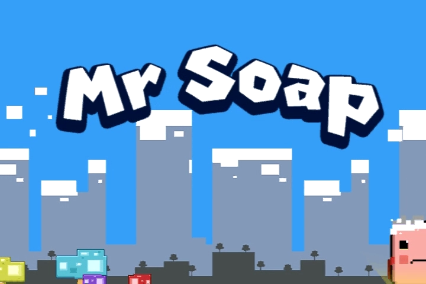
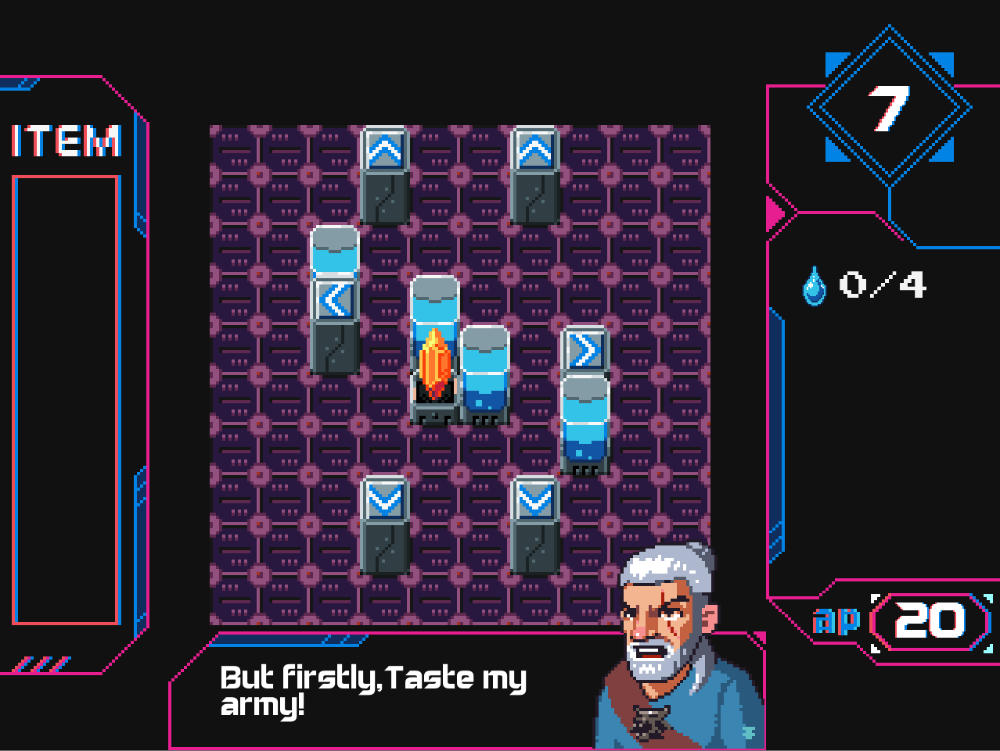

## 个人简历

##### 基本信息

姓名：温伟航

邮箱：410146465@qq.com

电话：18935156521

在读学校：中国传媒大学--计算机技术--研1在读

##### 教育背景

2008.9 - 2012.7		中国传媒大学		动画学院		数字媒体艺术（游戏设计方向）

2019.9 - 至今			中国传媒大学		动画学院		计算机技术

##### 工作经历

**2011-2012    目标软件    MKZ客户端程序**

- 客户端UI界面及其编辑器的开发（C++）
- 客户端地图编辑器的维护 （C++）

**2012-2013    搜狐畅游    3D引擎开发工程师**

- 参与BigWorld引擎的二次开发，世界地图编辑器的相关功能的开发和维护 （C++）
- 引擎中地形及其装饰物OBJ的纹理特效 （C++ & HLSL）
- 作为引擎技术人员与美术人员沟通，为其开发相关3DsMax插件（C++ & MaxScript）

**2014-2015    金刚游戏    ProjectG项目客户端主程**

- 参与ProjectG项目客户端开发，ProjectG是一款卡牌手游，是一款实时操作角色走位和技能战斗的对抗行卡牌手游。（Unity/C#）

**2016-2017   BunkerStudio    合伙人**

- 百威XKTV交互table游戏开发两款，分别是对抗弹球游戏和音乐游戏，包含unity中乐谱编辑器。（Unity/C#）
- 北京赛车在线游戏开发，前后端及开奖辅助工具。（JS & PHP）
- 中国红中麻将，前后端及相关辅助工具（Unity，JS，PHP）
- XM-ARM 项目售前服务

**2017-2019   山西新华电脑学校    VR授课教师**

- 开发新华VR空间站射击游戏，获得校项目研发2等奖（Unity/C#）
- 开发VR过山车游戏，获得集团项目研发2等奖（Unity/C#）
- 研发VR交互全套课程

##### 荣誉奖励

- 获得8Hour-GameJam开发2等奖
- 获得百威Hackathon游戏开发第二名

##### 作品介绍

这些作品都是在早期的作品

48hrs-GameJam [The Rider The Girl]

https://v.youku.com/v_show/id_XMzY0OTIwNTY2NA==.html

LD26 [BloodCleaner]

https://v.youku.com/v_show/id_XMTQxNzAwODY0NA==.html

[MrSoap]

https://v.youku.com/v_show/id_XMTI4NzI2NDY0NA==.html

[DoubleCross]

https://v.youku.com/v_show/id_XMTI4ODc4NTU2NA==.html

下面这些是近期的作品（近期没有录屏）

[Home]

穿越冒险类游戏

[BunkerTreasure]

业余时间写的棋盘策略游戏，已经非常完整。选关，关卡编辑，BOSS关卡等。

