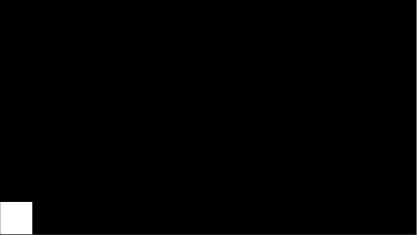
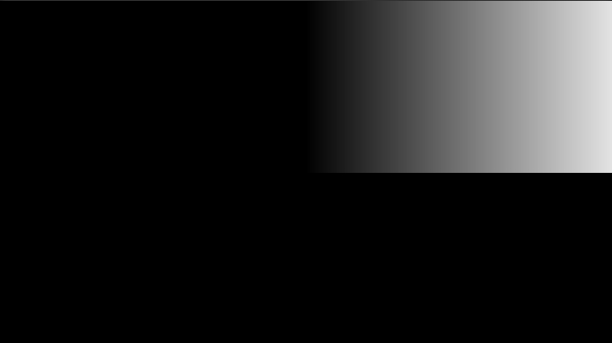

# Shader 学习记录 1

***`written by wenweihang`***

- ###### 屏幕空间坐标系调整

首先在顶点渲染器中

```glsl
v2f vert(appdata_t IN)
{
    v2f OUT;
    OUT.vertex = UnityObjectToClipPos(IN.vertex);
    OUT.texcoord = IN.texcoord;
    return OUT;
}
```

首先，其中的 UnityObjectToClipPos 是将模型空间的点，经过三次变换到裁剪空间。

此时，IN.vertex.xy 在两个轴的范围应该是  *X ∈ (0,_ScreenParams.x)  ;  Y ∈ (0,_ScreenParams.y)* 且坐标轴原点在屏幕的左下角

```glsl
fixed4 frag(v2f IN) : SV_Target
{
	float2 u = IN.vertex.xy;
	if (u.x > 100) u.x = 0;
	if (u.y > 100) u.x = 0;
	return float4(u.x, u.x, u.x,1);
}
```

我们有这样一段代码，我们可以看到，现在游戏界面上是这样的效果(环境为 Unity，给Sprite增加这个材质shader，sprite放大覆盖整个屏幕 , 屏幕分辨率为1280*720)



我们看到左下角白色区域即为100*100的方形，而在Sprite的其他部分则被shader改写为黑色（其实在坐标原点还有一个1像素的黑色，我们忽略它）。

现在我们将原点平移到屏幕的中心应该怎么办呢？

```glsl
fixed4 frag(v2f IN) : SV_Target
{
    float2 u = (IN.vertex.xy - _ScreenParams.xy * 0.5);
    if (u.y < 0) u.x = 0;
    return float4(u.x, u.x, u.x,1);
}
```


我们可以看到，此时我们利用 `u = (IN.vertex.xy - _ScreenParams.xy * 0.5)` 的坐标原点被移动到了屏幕中心。

接下来。我们改写上述代码，则会将 u 的 y轴归一化，此时 *u.y ∈ (-0.5,0.5)*


```glsl
fixed4 frag(v2f IN) : SV_Target
{
    float2 u = (IN.vertex.xy - _ScreenParams.xy * 0.5) / _ScreenParams.y;
    if (u.y < 0) u.x = 0;
    return float4(u.x, u.x, u.x,1);
}
```

则效果如下：



我们如果想缩放u的坐标轴的，我们还可以给其添加一个系数 （下面的系数是4 ）

`float2 u = 4 * (IN.vertex.xy - 0.5 * _ScreenParams.xy) / _ScreenParams.y;`

如果想让 *u.y ∈ (-1,1)* 我们可以这样缩放

 `u = ( 2 * IN.vertex.xy - _ScreenParams.xy) / _ScreenParams.y` 

这也是我们在看其他shader中也有写到的，其实说白了就是在缩放轴的比例。

则我们可以看到，白色的区域更多了

