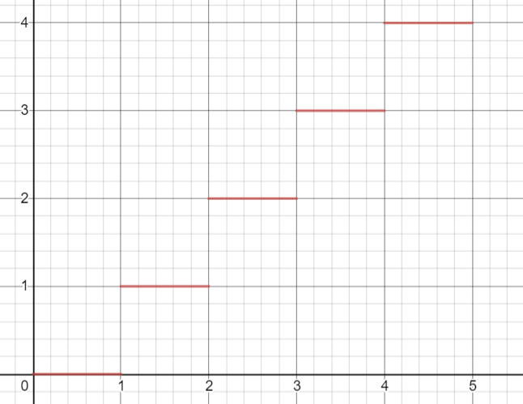
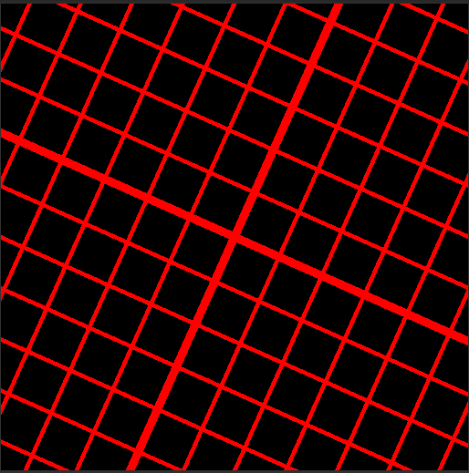

<head>
    <script src="https://cdn.mathjax.org/mathjax/latest/MathJax.js?config=TeX-AMS-MML_HTMLorMML" type="text/javascript"></script>
    <script type="text/x-mathjax-config">
        MathJax.Hub.Config({
            tex2jax: {
            skipTags: ['script', 'noscript', 'style', 'textarea', 'pre'],
            inlineMath: [['$','$']]
            }
        });
    </script>
</head>

# Shader 学习记录 2

***`written by wenweihang`***

- ###### 网格相关

在屏幕空间（当然也可以是其他），我们有一个需求，就是需要绘制网格，那么我们需要的一个函数就是*fmod(a,b)*

首先，我们来观察 $y = mod(x,1)$的图像是怎样的。


我们发现，函数图像已经成为一个周期为1，且  *y ∈ (0,1)*  的区间。且在每一个周期内，X 和 Y 呈线性变化，这与floor()函数的图像是有所区分的。



```glsl
fixed4 frag(v2f IN) : SV_Target
{
    float4 color = float4(0,0,0,1);
    float2 u = _P1 * (IN.vertex.xy) / _ScreenParams.x;
    color.r = step((fmod(u.x, 1),_P2));
    return color;
}
```

我们这段代码中 P1 P2  为2个可变参数。我们来分析一下 首先我们看到 u 是让坐标仍然在屏幕左下角，只是x轴已经归1化 u.x ∈ (0,1) 

然后下面的fmod(u.x,1) 使得函数在x轴具有周期性，且周期为1。接下来求一个step，即  P2 >=  fmod() ？ 1 ： 0


如果想生成网格，在y轴上再来一次就行

```glsl
fixed4 frag(v2f IN) : SV_Target
{
    float4 color = float4(0,0,0,1);
    float2 u = _P1 * (IN.vertex.xy) / _ScreenParams.x;
    color.r = max(step(fmod(u.x, 1),_P2), step(fmod(u.y, 1),_P2));
    return color;
}
```


下面，如果给他加一个旋转呢？我们知道，旋转的变换矩阵为：
$$
\begin{bmatrix}
cos\theta&-sin\theta\\
sin\theta&cos\theta
\end{bmatrix}
$$
那么我们构造一个矩阵，然后进行变换即可：

```glsl
fixed4 frag(v2f IN) : SV_Target
{
    float4 color = float4(0,0,0,1);
    float2 u = _P1 * (IN.vertex.xy - _ScreenParams * 0.5) / _ScreenParams.x;
    float2x2 mat2 = { _CosTime.a, -_SinTime.a, _SinTime.a, _CosTime.a };
	u = mul(mat2,u);
    color.r = max(step(abs(fmod(u.x, 1)), _P2), step(abs(fmod(u.y, 1)), _P2));
    return color;
}
```

其中 mat2 就是我们构造的矩阵， 其中 _CosTime 和  _SinTime 是Unity的自带变量就是 $cos(time)$ 和  $sin(time)$，最后将我们的u进行变换。在下面一行用到了abs函数，是因为，我们在第四行将坐标移动至屏幕中心位置，u.x ∈ (-0.5,0.5) * _P1 ，因为有负号的产生，所以我们需要用一下绝对值就可以了。

