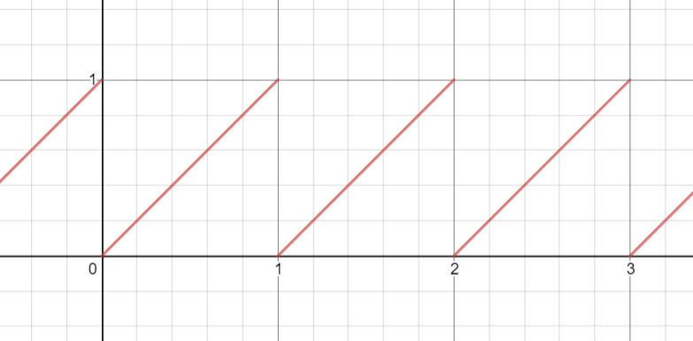
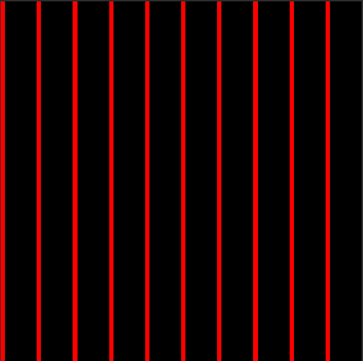
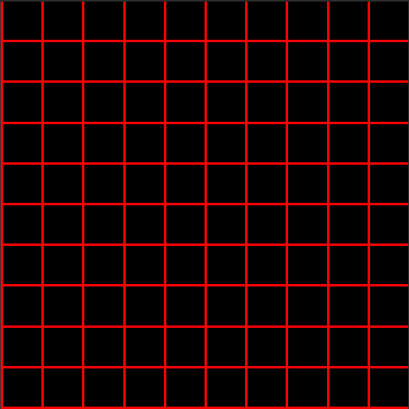

# Shader 学习记录 2

***`written by wenweihang`***

- ###### 网格相关

在屏幕空间（当然也可以是其他），我们有一个需求，就是需要绘制网格，那么我们需要的一个函数就是*fmod(a,b)*

首先，我们来观察 $y = mod(x,1)$的图像是怎样的。



我们发现，函数图像已经成为一个周期为1，且  *y ∈ (0,1)*  的区间。

```glsl
fixed4 frag(v2f IN) : SV_Target
{
    float4 color = float4(0,0,0,1);
    float2 u = _P1 * (IN.vertex.xy) / _ScreenParams.x;
    color.r = step((fmod(u.x, 1),_P2));
    return color;
}
```

我们这段代码中 P1 P2  为2个可变参数。我们来分析一下 首先我们看到 u 是让坐标仍然在屏幕左下角，只是x轴已经归1化 u.x ∈ (0,1) 

然后下面的fmod(u.x,1) 使得函数在x轴具有周期性，且周期为1。接下来求一个step，即  P2 >=  fmod() ？ 1 ： 0



如果想生成网格，在y轴上再来一次就行

```glsl
fixed4 frag(v2f IN) : SV_Target
{
    float4 color = float4(0,0,0,1);
    float2 u = _P1 * (IN.vertex.xy) / _ScreenParams.x;
    color.r = max(step(fmod(u.x, 1),_P2), step(fmod(u.y, 1),_P2));
    return color;
}
```

