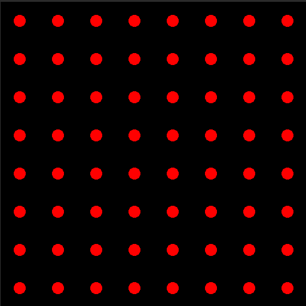
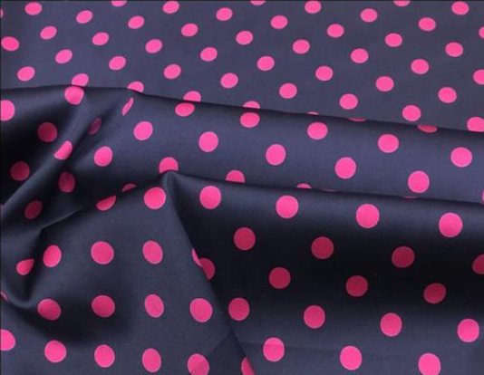
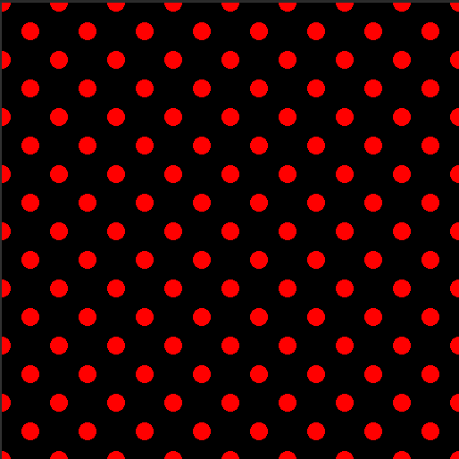

# Shader 学习记录 3

***`written by wenweihang`***

- ###### 网格相关

  我们尝试在网格上绘制一些实心圆，我们还得利用 *X* 和 *Y* 轴的 *fmod* 函数来将其周期化

  然后利用圆的方程来进行填充像素   $X^2+Y^2 = R^2 $

```glsl
fixed4 frag_2(v2f IN) : SV_Target
{
    fixed4 color = fixed4(0,0,0,1);
    fixed2 s = fixed2(1, 1);
    fixed2 u = 8 * (IN.vertex.xy) / _ScreenParams.x;
    fixed2 a = fmod(u, s) * 2 - s;
    color.r = step(dot(a, a), 0.1);
    return color;
}
```

其中，第六行，$fmod(u,s) * 2 - s$ 是将我们的圆心移动到了网格的中心，这个移动的方法是缩放了$X,Y$轴，然后再平移了$S$向量。当然，我们也可以不缩放轴，这样 $fmod(u,s) - 0.5 *s$ 再保持轴不缩放的情况下，$X,Y$轴各平移网格一半的长度，再代码中就是$(0.5,0.5)$了。

第七行代码 $dot(a,a)$其实就是再求 $(a.x)^2 + (a.y)^2$的值。代码效果如下图：



看到这个图，突然灵感而发。这个好像一种波点的布料图案（图片来自网络）



那么，我们如果可以将两组网格点进行错位叠加，就可以了。

```glsl
fixed4 frag_2(v2f IN) : SV_Target
{
    fixed4 color = fixed4(0,0,0,1);
    fixed2 s = fixed2(1, 1);
    fixed2 u = 8 * (IN.vertex.xy) / _ScreenParams.x;
    fixed2 a = fmod(u, s) * 2 - s;
    fixed2 b = fmod(u + s * 0.5, s) * 2 - s;
    color.r = max(step(dot(a, a), 0.1), step(dot(b, b), 0.1));
    return color;
}
```

我们看一下，第七行 $ b = fmod(u + s * 0.5, s) * 2 - s$ 就是在第六行的基础上，做 $fmod()$之前，就将整体的坐标原点平移了  $s*0.5 $的位置。然后在给$color$赋予颜色的时候，我们用到了$max$，即只要符合其中一个满足在半径的平方0.1内的像素，都会被着色为 $color.r = 1$

