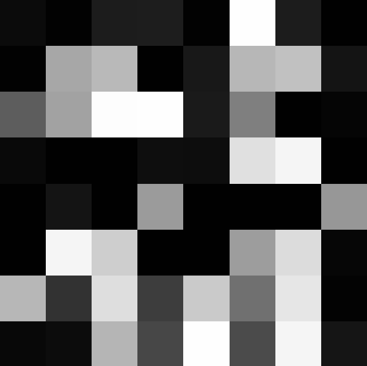

<head>
    <script src="https://cdn.mathjax.org/mathjax/latest/MathJax.js?config=TeX-AMS-MML_HTMLorMML" type="text/javascript"></script>
    <script type="text/x-mathjax-config">
        MathJax.Hub.Config({
            tex2jax: {
            skipTags: ['script', 'noscript', 'style', 'textarea', 'pre'],
            inlineMath: [['$','$']]
            }
        });
    </script>
</head>
# Shader 学习记录 4

***`written by wenweihang`***

- ###### 噪声

接触噪声，还得从一行代码说起，这段glsl的代码来自iq写的hash函数

(本文的代码采用GLSL的语法) 

```glsl
fract(sin(dot(u.xy, vec2(12.9898,78.233))) * 43758.5453123);
```

之前很费解这个代码的含义，但是当看到图像（我们以x轴为自变量，y为代码返回值），就恍然大悟

```glsl
fract(sin(x * 12.9898) * 43758.5453123);
```


这行代码将sin函数的x，y 轴缩放后，取了其小数部分，分析它的行为：$y∈(0,1)$ ，周期为  $2\pi/12.9898$ , 且映射关系还有唯一性，那我们利用这个式子就可以得到很多伪随机点。当然这些点比较离散.如果我们需要将点连续一些，可以用一个floor函数

```glsl
fract(sin(floor(8*x) * 12.9898) * 43234.5453123)
```


我们结合图像思考，在X轴上，随着X作为顶点坐标，在着色器中进行插值后，且又经过计算范围缩放在(0,1)之间，我们可以想得到，X轴上被分为了8份，且在每一份中都保持了同一个随机值。

接下来，我们将这段代码同时作用于 X 和 Y 轴上，再重新看一下这段代码生成的图像

```glsl
float id= fract(sin(dot(floor(8*px),vec2(0.270,0.600)))*43758.545);
gl_FragColor = vec4(id);
```


接下来，我们还可以动态的让它进行连续变化:

```glsl
float id= 0.5 + 0.5*cos(u_time + sin(dot(floor(8.0*px),vec2(0.660,0.320)))*43758.545);
gl_FragColor = vec4(id);
```



