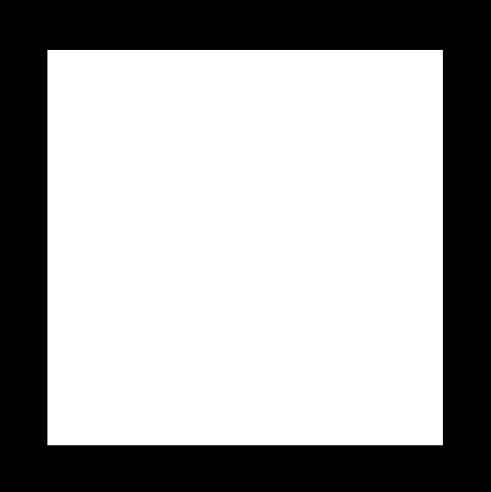

<head>
    <script src="https://cdn.mathjax.org/mathjax/latest/MathJax.js?config=TeX-AMS-MML_HTMLorMML" type="text/javascript"></script>
    <script type="text/x-mathjax-config">
        MathJax.Hub.Config({
            tex2jax: {
            skipTags: ['script', 'noscript', 'style', 'textarea', 'pre'],
            inlineMath: [['$','$']]
            }
        });
    </script>
</head>

# Shader 学习记录 5

***`written by wenweihang`***

###### 函数step和smoothstep

step用于可以在某些时候简化if语句，但是结果会比较生硬，而smoothstep会让结果更平滑

```glsl
vec2 st = gl_FragCoord.xy/u_resolution.xy;
vec3 color = vec3(0.0);
vec2 bl = step(vec2(0.1),st);
vec2 tr = step(vec2(0.1),1.0-st);   
float pct = bl.x * bl.y * tr.x * tr.y;
color = vec3(pct);
gl_FragColor = vec4(color,1.0);
```



我们绘制出边长为 0.1 的黑色边框，其中，我们用step代替了if语句。我们尝试用smoothstep试试看

```glsl
vec2 st = gl_FragCoord.xy/u_resolution.xy;
vec3 color = vec3(0.0);
vec2 bl = smoothstep(vec2(0.0),vec2(0.05),st-vec2(0.1));
vec2 tr = smoothstep(vec2(0.0),vec2(0.05),1.0-st-vec2(0.1));
float pct = bl.x * bl.y * tr.x * tr.y;
color = vec3(pct);
gl_FragColor = vec4(color,1.0);
```


这个效果边缘看上去就软多了，详细解释一下上述smoothstep的含义：

如果 st-vec2(0.1) < vec2(0.0) ，即  st < vec2(0.1)  则返回 0；

如果 st-vec2(0.1) >  vec2(0.0) 且  st-vec2(0.1) <  vec2(0.05)  ，即 vec2(0.1) + vec2(0.05) > st > vec2(0.1) 则进行一个平滑插值

如果 st-vec2(0.1) >  vec2(0.05) ，即  st > vec2(0.1) + vec2(0.05)  则返回 1；

所以我们可以在 0.05 的一个区间内进行一个“羽化”（渐变）效果。