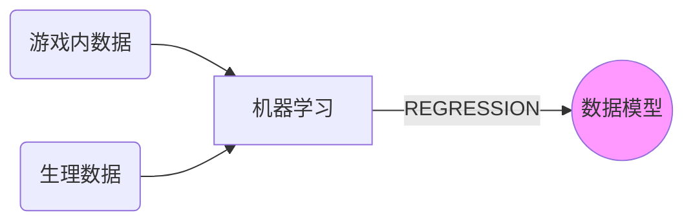

## Thought

##### 论文中心

1. 构建出一个数据模型：通过一段时间内的游戏内数据（容易得到），来得出相应的生理模型（较难得到），通过生理数据又可以反应出心理的情感变化。

2. 论述得到生理数据的重要性，论述此数据模型的重要性。

   $\triangleright$多回答Why，少写How

##### 实验概述

通过体验游戏，测量记录出游戏内数据，同时测量记录生理数据。通过机器学习使其regression。以至于建立出一个数据模型。后期可以通过观测其参与游戏测试时的视频来回答问卷，得出心理情感变化状态和游戏enjoyment

最后达到此目标：

##### 游戏筛选

为什么选择此款游戏。

1. 定制一款2D游戏。传统的平台跳跃游戏（如：无尽的马里奥），游戏操作简易，且游戏感觉和画面基于受众广且成功超级玛丽。
2. 定制一款3D解解谜游戏。游戏流程简短，操作更简易。游戏模式为第一人称的奔跑躲藏和解谜（如：逃生 Outlast）。预想可以更有效的收集到变化强烈的生理数据。

|  #######  | 类马里奥2D                                   | 类逃生解谜3D                                                 |
| :--------: | :------------------------------------------- | :----------------------------------------------------------- |
|  开发难度  | 需要与马里奥手感符合，游戏中相关元素的符合   | 场景气氛的烘托，画面和声音的表现力。解谜部分会带来思考和游戏推动 |
|  选择优势  | 因受众广，游戏模式具有一定的普及度和说服力。 | 游戏模式更简单易上手，同时此类型游戏会有强烈的代入感，预测可以得到很好的游戏数据和生理数据 |
| 游戏数据量 | 多                                           | 一般                                                         |
|  游戏时常  | 规定时间内。规定生命条数                     | 规定时间内。规定生命值。                                     |

##### 游戏数据收集

以显性和隐性 OR 持续和点时间的**通用分类**：

- 游戏中的显性数据：
  - 持续时间汇总：完成任务花费时间，生命点数，获得道具数目等。
  - 事件发生时间点：死亡或收到伤害时间点，获得道具时间点，触发器激活时间点
- 游戏中的隐性数据：
  - 持续时间汇总：角色站在某特定区域内的持续时间，滞空时间等
  - 事件发生时间点：玩家按键状态的时间记录，角色在某种状态下的开始和结束时间等

还可以为特定的游戏内容，按照**内容类别分类**：

如以3D逃生解谜为例：摄像机，时间，探索，生存力，道具

- 摄像机停留某到某特点镜头；摄像机对场景的观察程度；
- 角色停留在门前区域的持续时间；玩家注意到某特定提示的时间；玩家角色移动的总时长；玩家通过的总时长
- 玩家对场景的探索程度（与主线无关）
- 玩家收到伤害的情况
- 玩家获得特定道具的情况

##### 生理数据收集

设备可以收集到的数据统计（Bvp - 血容量脉冲，Gsr - 皮肤电反应，Temp - 皮肤温度，Ibi - 心搏间期（以秒为单位比较坑））

为什么需要收集这些生理数据。

为什么不收集其他的生理数据。

收集后的生理数据如何使用。

收集生理数据的注意事项，是否疲劳，是否初始抵触等。

##### 机器学习模型选择

选择DFF ，RDF，RDJ 等不同的学习模型的优缺点，且为什么选择这些模型。

##### 数据处理

- 丢失数据的处理
- 数据中噪音处理
- 无用数据的剔除

##### 校验

上述学习模型在训练后，建立的数据模型，经过校验得出的结果是否令人满意。

校验的几种方式：

1. 同一款游戏，通过改变可控参数，进行数据模型校验。
2. 不同款游戏，进行数据模型校验。
3. 不同机器学习方法，进行数据模型建立，得出生理指标的校验。

