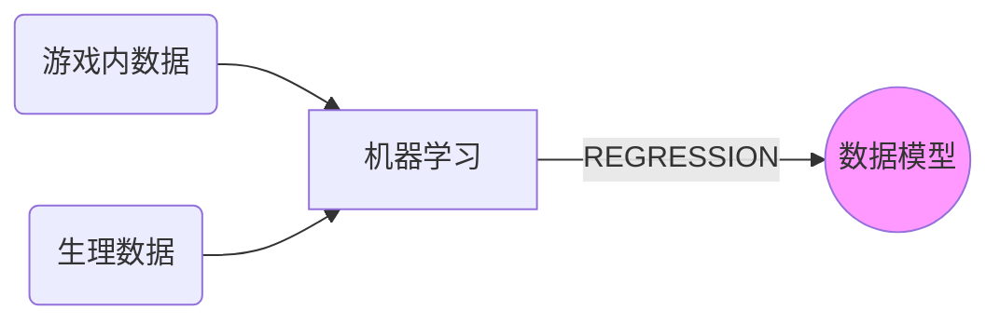

<head>
    
    
</head>

## Thought 

2020-11-4 written by wwh            *[[pdf 下载]](pdf/thought.pdf)*

##### 论文中心

1. 构建出一个数据模型：通过一段时间内的游戏内数据（容易得到），来得出相应的生理模型（较难得到），通过生理数据又可以反应出心理的情感变化。

2. 论述得到生理数据的重要性，论述此数据模型的重要性。

   $\triangleright$多回答Why，少写How

##### 介绍

- 游戏的价值，发展史和趋势。游戏内数据没有被充分榨取价值，而玩家的心理活动可以直接反应对游戏体验的情绪波动。游戏中的可显示的数据会给予玩家隐性的互动，而游戏中的隐性数据又是玩家在游戏进行时的操作水平和心理活动的客观体现。
- 玩家的生理数据是心理数据的客观反映，而生理数据可以获取但是需要相关专业设备。

##### 实验概述

通过体验游戏，测量记录出游戏内数据，同时测量记录生理数据。通过机器学习使其regression。以至于建立出一个数据模型。后期可以通过观测其参与游戏测试时的视频来回答问卷，得出心理情感变化状态和游戏enjoyment

最后达到此目标：

##### 游戏筛选

为什么选择此款游戏。

1. 定制一款2D游戏。传统的平台跳跃游戏（如：无尽的马里奥），游戏操作简易，且游戏感觉和画面基于受众广且成功超级玛丽。
2. 定制一款3D解解谜游戏。游戏流程简短，操作更简易。游戏模式为第一人称的奔跑躲藏和解谜（如：逃生 Outlast）。预想可以更有效的收集到变化强烈的生理数据。

|  #######  | 类马里奥2D                                   | 类逃生解谜3D                                                 |
| :--------: | :------------------------------------------- | :----------------------------------------------------------- |
|  开发难度  | 需要与马里奥手感符合，游戏中相关元素的符合   | 场景气氛的烘托，画面和声音的表现力。解谜部分会带来思考和游戏推动 |
|  选择优势  | 因受众广，游戏模式具有一定的普及度和说服力。 | 游戏模式更简单易上手，同时此类型游戏会有强烈的代入感，预测可以得到很好的游戏数据和生理数据 |
| 游戏数据量 | 多                                           | 一般                                                         |
|  游戏时常  | 规定时间内。规定生命条数                     | 规定时间内。规定生命值。                                     |

##### 游戏数据收集

以显性和隐性 OR 持续和点时间的**通用分类**：

- 游戏中的显性数据：
  - 持续时间汇总：完成任务花费时间，生命点数，获得道具数目等。
  - 事件发生时间点：死亡或收到伤害时间点，获得道具时间点，触发器激活时间点
- 游戏中的隐性数据：
  - 持续时间汇总：角色站在某特定区域内的持续时间，滞空时间等
  - 事件发生时间点：玩家按键状态的时间记录，角色在某种状态下的开始和结束时间等

还可以为特定的游戏内容，按照**内容类别分类**：

如以3D逃生解谜为例：摄像机，时间，探索，生存力，道具

- 摄像机停留某到某特点镜头；摄像机对场景的观察程度；
- 角色停留在门前区域的持续时间；玩家注意到某特定提示的时间；玩家角色移动的总时长；玩家通过的总时长
- 玩家对场景的探索程度（与主线无关）
- 玩家收到伤害的情况
- 玩家获得特定道具的情况

##### 生理数据收集

设备可以收集到的数据统计（Bvp - 血容量脉冲，Gsr - 皮肤电反应，Temp - 皮肤温度，Ibi - 心搏间期（以秒为单位比较坑））

为什么需要收集这些生理数据。

为什么不收集其他的生理数据。

收集后的生理数据如何使用。

收集生理数据的注意事项:

- 是否疲劳
- 是否初始抵触
- 测试室内环境相对干燥，温度适宜，不然会影响皮电的指数。

##### 机器学习模型选择

选择DFF ，RDF，RDJ 等不同的学习模型的优缺点，且为什么选择这些模型。

##### 数据处理

- 丢失数据的处理
- 数据中噪音处理
- 无用数据的剔除

##### 校验

上述学习模型在训练后，建立的数据模型，经过校验得出的结果是否令人满意。

校验的几种方式：

1. 同一款游戏，通过改变可控参数，进行数据模型校验。
2. 不同款游戏，进行数据模型校验。
3. 不同机器学习方法，进行数据模型建立，得出生理指标的校验。

------

#### 相关工作：

Fairclough[144]回顾了与心理生理计算发展相关的文献，以创新人机交互，并得出结论认为心理生理措施具有改善人机交互的巨大潜力，但复杂的问题需要充分解决。基于文献综述，我们发现GSR/EDA最适合记录唤起和精神努力，HR则用于测量情感、亲和力和注意力上的唤起。情绪状态估计主要使用HRV、EMG和呼吸。BVP用于评估松弛，面部输入用于从面部表情中识别情绪。脑电图信号广泛用于检测情绪、沮丧和精神努力

[144] Fairclough, S.H. Fundamentals of physiological computing. Interact. Comput. 2009, 21, 133–145.

视频会议工具在皮肤反应、HR和血容量脉搏(BVP)方面发现了显著差异[128]。在5帧/秒的视频中观察到GSR、HR和BVP的增加，而不是25帧/秒。大多数受试者没有注意到视频质量的差异，这表明心理生理测量方法能够挖掘传统用户体验测量方法无法发现的潜在事实[124]。在对设计良好和设计不良的网页进行比较研究中，Ward等人[129]发现，与设计不良的网页相比，设计良好的网页的GSR和HR有所下降，后者会导致压力水平的增加。

[128] Wilson, G.M. Psychophysiological indicators of the impact of media quality on users. In Proceedings of the CHI’01 extended abstracts on Human Factors in Computing Systems, Seattle, WA, USA, 31 March–5 April 2001; pp. 95–96.

[124] Yao, L.; Liu, Y.; Li, W.; Zhou, L.; Ge, Y.; Chai, J.; Sun, X. Using physiological measures to evaluate user experience of mobile applications. In Proceedings of the International Conference on Engineering Psychology and Cognitive Ergonomics, Heraklion, Crete, Greece, 22–27 June 2014; Springer: Berlin/Heidelberg,Germany, 2014; pp. 301–310

与马丁内斯等人在2013年[28]的工作类似,他们利用血容量脉搏(BVP)和皮肤电导(SC)数据来训练情感的深度学习神经网络模型

[28] Martinez, H.P.; Bengio, Y.; Yannakakis, G.N. Learning deep physiological models of affect. IEEE Comput. Intell. Mag. 2013, 8, 20–33

