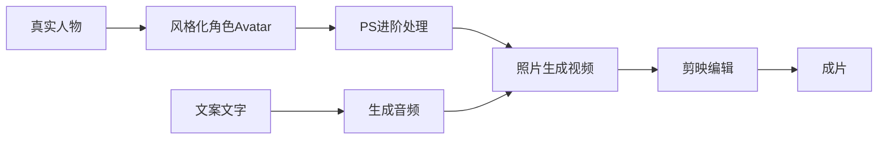

## AIGC行业相关软件价格调研

*written by 温伟航*

### 调研原由

围绕今年的计划安排，即整合AIGC系统工具，以及用AIGC为内容生产赋能。我们作为AIGC工具的集成者和使用者，对AIGC相关工具价格调研的原由主要基于以下几点：

- **考量成本效益比**：通过价格调研，我们通过可以比较不同AIGC工具的功能优劣、稳定性和产出质量与其收费标准之间的关系，选择性价比最高的工具。
- **预算和财务规划**：在规划购买AIGC功能服务时候，过了解市场价格趋势和各服务商的具体收费模式，可以帮助我们精确计算长期使用的总成本，并据此做出合理的预算规划。
- **用户和系统需求**：从用户角度和AIGC系统工具集整合的角度触发，通过参与或关注价格调研，有利于发现更适合自己的工具，也使得我们可以在保持AIGC功能质量的同时优化支出成本，提高用户满意度和效益比。

### 案例分析

我们会以基于短视频生成需求为例。如下图所示：

视频所需的AI功能工作流如下：

#### 真实角色生成风格化Avatar

现有的为真人图片转为风格化的方案流行且可控的方式有如下：

利用完全开源且免费的Stable Diffuse，利用收费的国内版Midjourney，利用第三方AIGC工具包平台如：起号等。其中，起号包含众多AI工具。

|                    | Stable Diffuse | Midjourney(国内) | 起号 |
| ------------------ | -------------- | ---------------- | ---- |
| 可控性             | 高             | 高               | 低   |
| API接口            | 有             | 无               | 无   |
| 实现效果           | 好             | 好               | 好   |
| 可否本地部署       | 是             | 否               | 否   |
| 本机/云端          | 本机           | 云端             | 云端 |
| 价格(以最低档每年) | 免费           | 298              | 375  |
| 默认预计出图       | 无限           | 5000+            | 300W |

#### 文字转音频(TTS)

利用飞桨TTS等，利用国内外的相关的TTS的API进行对接，如：讯飞语音，naturalreaders。或使用第三方整合工具包：如剪映、必剪。

|                    | 飞桨PP | 讯飞     | 剪映 | 必剪 | naturalreaders  |
| ------------------ | ------ | -------- | ---- | ---- | --------------- |
| 可控性             | 一般   | 高       | 一般 | 一般 | 一般            |
| API接口            | 有     | 有       | 无   | 无   | 无              |
| 实现效果           | 一般   | 好       | 好   | 一般 | 好              |
| 可否本地部署       | 是     | 否       | 否   | 否   | 否              |
| 本机/云端          | 本机   | 云端     | 云端 | 云端 | 云端            |
| 价格(以最低档每年) | 免费   | 540      | 258  | 免费 | 110USD = 796RMB |
| 默认时常           | 无限   | 每天80次 | 无限 | 无限 | 无限            |
|                    |        |          |      |      |                 |

#### 照片转视频

利用完全开源且免费的Stable Diffuse，利用国外专业的照片生视频的工具或API如：DID，或者利用国内的相关APP进行制作，如：闪剪

|                    | Stable Diffuse | DID               | 闪剪    |
| ------------------ | -------------- | ----------------- | ------- |
| 可控性             | 好             | 一般              | 低      |
| API接口            | 有             | 有                | 无      |
| 实现效果           | 一般           | 好                | 好      |
| 价格(以最低档每年) | --             | 56.4USD = 400 RMB | 298+269 |
| 默认时常           | --             | 100min            | 100min  |

#### 剪映编辑

利用免费的必剪或者剪映进行编辑，当然VIP版本的剪映拥有非常多实用方便的AIGC的功能。见上文。

#### 整体价格评估

预计每天发布3个视频，每个视频长度为30s，则为：
$$
3*0.5*30 = 45min
$$
故，默认挡位无法支持次价格，需要后续按需购买算力。且算力的价格会根据会员等级和单次购买次数有关。且算力转化为功能能力也是根据厂商进行浮动的。

#### 附录

