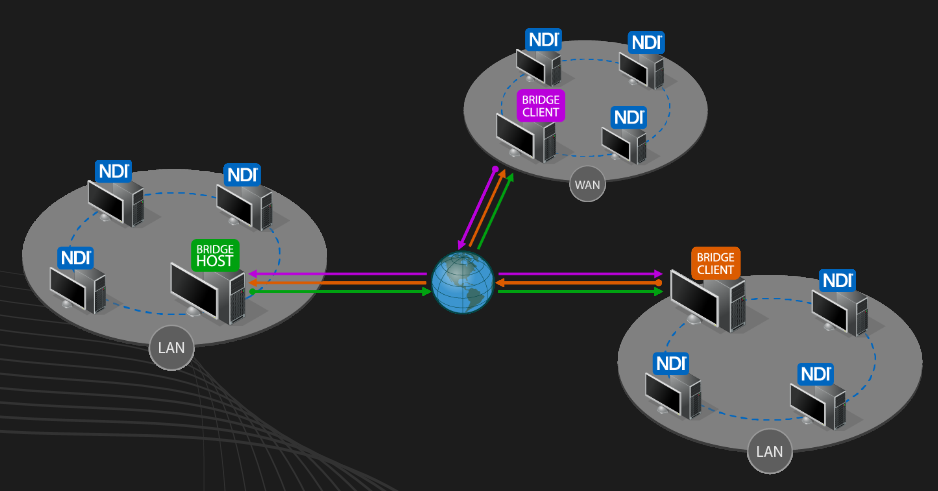

# 便捷轻量的搭建多路直播服务器

### 背景

​		整个人类社会也在迈入视频天下的大时代[1]，自媒体行业逐步成熟，传统的电视新闻直播受到来自网络直播的巨大冲击，行业面临着极大的挑战。我们不难发现网络直播之所以可以异军突起，是因为它有着实时性，互动性和广泛性等特点。传统的电视新闻直播可以汲取网络直播的优点，利用轻量级 4G / 5G 手机设备的便捷性，随时开启新闻直播跟随热点事件，对于大场景中不同地点，可以进行多路同时直播连线采访。于此同时，官媒对内容的审核，控制和分发等优势应予以传承。直播流可推至导播间进行预处理、审核等操作流程。最终在电视大屏和新媒体小屏进行播出。

​		在现有最新的商业解决方案中，高额的软硬件设备购置费用，后续额外的维护费用，都无疑增加了电视台或传媒公司的负担。另一方面，产品内的细节信息对于公司或事业单位并不会真正拥有完全的控制权，从而导致两方面的问题：视频流的安全性并不会得到可控的有效保障；以及使用者无法拥有其知识产权和针对性的定制扩展。

​		利用开源项目，轻量便捷的搭建可多路直播推拉流服务器的解决方案，则可以解决上述问题，即可以以低成本的方式搭建简单高效的实时视频服务器，又可以对其进行二次开发，满足其在实际场景和工作中的需求。

### 相关调研

通过对网络音视频流协议的调研，筛选出更符合实时性要求的相关协议。那些延迟较高的协议，诸如HLS、HTTP-FLV等则不在我们的讨论范围之内。因为，HLS是将音视频流进行切片后，进行http的短链接进行下载，不适合做实时推送。HTTP-FLV，是通过将RTMP再次封装成基于HTTP协议的长链接流，这样会更好的支持HTML5。故下文仅用RTMP做对比。

##### 基于IP化的音视频流协议

当前，在基于IP的音视频流协议当中，已有很多成熟的连续音视频流协议，诸如 SRT，WebRTC(下述简称为RTC)，NDI 和 RTMP等。我们通过对比不同协议在平均延迟、协议是否开源、API 可控性、抗网络抖动能力和支持前端浏览器这几个方面进行了对比：

|                | SRT   | WebRTC | NDI    | RTMP     |
| -------------- | ----- | ------ | ------ | -------- |
| 平均延迟       | <1sec | <1sec  | <1 sec | 0.8~3sec |
| 协议是否开源   | 是    | 是     | 否     | 是       |
| API 可控性     | 多    | 多     | 少     | 一般     |
| 抗网络抖动能力 | 强    | 强     | 一般   | 一般     |
| 支持前端浏览器 | 否    | 是     | 否     | 是       |

从表格中，我们不难看出，在新兴的音视频流协议中，SRT、RTC和NDI在平均延迟性方面均小于1秒，而RTMP在进行特殊配置的GOP和Send/ReciveBuffer时，也可以将延时降低至1秒内[2] [3]。在开源性方面，SRT、RTC和RTMP均已开源，且生态良好，开发可控性强，而NDI作为商业化的音视频流协议，虽然有开放SDK，但API可控性小，技术核心完全掌握在NewTek公司中。从另一个角度来看，有公司支持的流媒体协议，对付费用户会相对友好，技术问题应该能够更快速的得到解决。与此同时，因为NDI协议在诞生之初是优质高效的进行局域网内的音视频流传输，基于UDP协议，但抗网络的抖动能力一般。而生而为实时媒体流远距离传输而生的SRT和RTC，则有较强的抗网络抖动能力。随着，智能移动设备的全民化，支持前端浏览器作为一个考察因素，对于便捷化的推广和使用尤为重要，其中RTC和RTMP则有较强的优势。

根据搭建场景的具体需求，可以根据上表灵活选择。在本文中，我们选择更适用于移动端的技术RTC和局域网较强的NDI作为我们搭建服务器的音视频流协议。

##### SRS + NDI Tools的优势

SRS是Simple Realtime Streaming Server的缩写，名如其能，它的易用性更好，经济成本更低 [4]。相比于其他开源的流媒体服务框架live555 或 Nginx+nginx-rtmp-module 而言，SRS是由国人开发，丰富的中文说明文档，良好的项目生态环境，都是使得其成为便捷搭建音视频流服务的优质选择。

另一方面，在NDI官方推出的工具集中，利用 Brige 、 Webcam Input 以及手机端的 NewTek NDI 三个免费工具可以组成完整的工具流。Bridge用于将多个远程NDI数据源彼此发现，Webcam Input 用于为PC设备中链接的摄像机提供输入源的支持。移动端的NewTek NDI 是一个App，通过调用手机的摄像机和麦克风对视音频进行采集后，进行NDI推流到主机端。

### 服务器搭建

在项目的初期设计中，

##### 多路直播架构设计

##### NDI TOOLS

##### SRS配置

### 直播测试

### 结论

### 引用

1. 廖祥忠，视频天下时代的你：为未来而来——在中国传媒大学2022级新生开学典礼上的讲话。
2. https://ossrs.net/lts/zh-cn/docs/v4/doc/low-latency
2. Haivision，White Paper RTMP VS. SRT: Comparing Latency and Maximum Bandwidth
2. 殷汶杰，FFMpeg 音视频开发基础与实战

