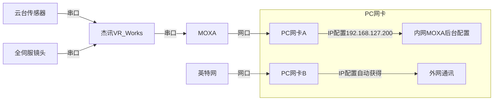
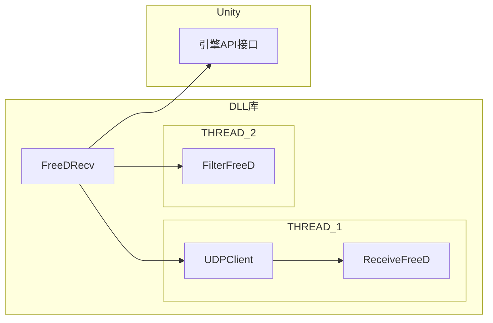

# Unity下开发FreeD协议插件

### 云台和PC的链接关系



### MOXA后台配置项

##### 串口：


##### 网口：

其中，注意packing length


### FreeD协议的包结构

```xml
<D1>         消息类型
<CA>         摄像机ID
<PH><PM><PL> 摄像机Pan方向的角度
<TH><TM><TL> 摄像机Tilt方向的角度
<RH><RM><RL> 摄像机Roll方向的角度
<XH><XM><XL> 摄像机x轴方向位置
<YH><YM><YL> 摄像机y轴方向位置
<HH><HM><HL> 摄像机z轴方向位置(高度信息)
<ZH><ZM><ZL> 摄像机推拉
<FH><FM><FL> 摄像机聚焦
<SH><SL>     空余/用户自定义
<CK>         总和校验码
```

现在用UDP进行数据通信



