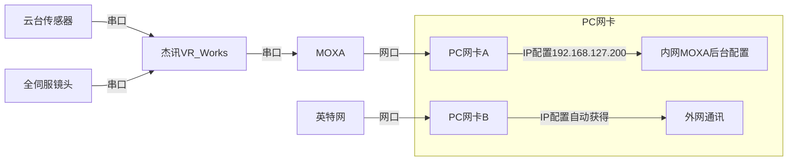
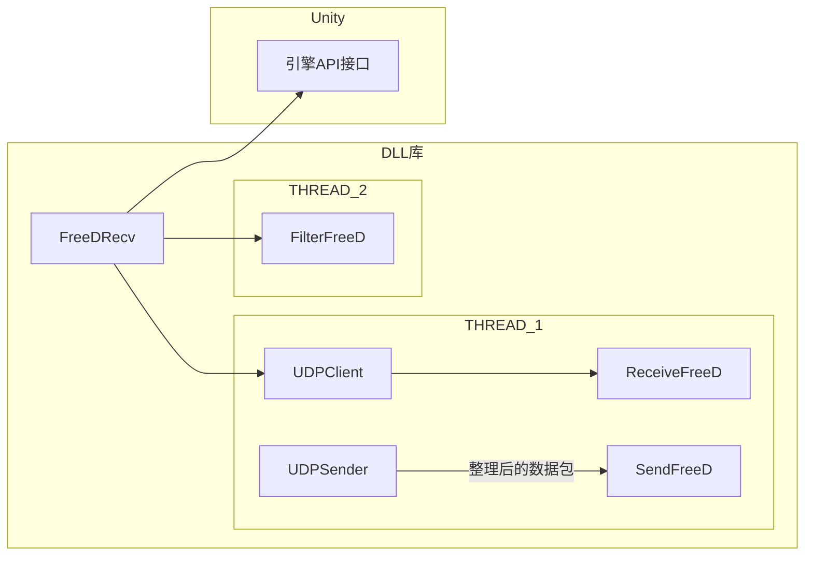
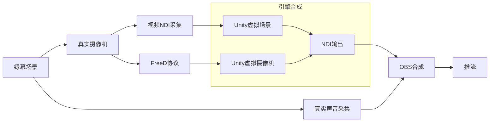

# Unity下开发FreeD协议插件

### 云台和PC的链接关系



其中，杰讯的设备云台、摇臂等均用了FreeD协议，但是其输出端为串口，我们需要利用第三方的MOXA设备，将串口数据转为UDP发包。

### MOXA后台配置项

##### 串口：


##### 网口：

其中，注意packing length，我们应该设置为29，因为，经过调研得知，FreeD协议的结构体长度为29个字节


### FreeD协议的包结构

```xml
<D1>         消息类型
<CA>         摄像机ID
<PH><PM><PL> 摄像机Pan方向的角度
<TH><TM><TL> 摄像机Tilt方向的角度
<RH><RM><RL> 摄像机Roll方向的角度
<XH><XM><XL> 摄像机x轴方向位置
<YH><YM><YL> 摄像机y轴方向位置
<HH><HM><HL> 摄像机z轴方向位置(高度信息)
<ZH><ZM><ZL> 摄像机推拉
<FH><FM><FL> 摄像机聚焦
<SH><SL>     空余/用户自定义
<CK>         总和校验码
```

现在用UDP进行数据通信



图中，我们将利用DLL与游戏引擎接口进行通讯（目前以Unity引擎为例）。DLL中开启2个线程，一个线程用于接受FreeD协议，另一个线程用于对收到的FreeD协议进行缓存和过滤，处理后的数据最终会交给接口让游戏引擎调用。

> 我们前期对Unity中相关于FreeD的插件进行搜索，没有找到可以链接设备并解析的插件。故我们在此“蓝海”进行开发实验。

### FreeD包转发

我们经过实验发现，UE4的LiveLink插件无法正确解析杰讯设备输出的FreeD数据，原因在于串口转网口，导致的包内数据错位。我们开发的插件，利用新的算法，连续对数据包进行对齐和校验，然后通过本机地址+端口（127.0.0.1:6688）进行UPD转发，转发后的数据包则可以方便的为UE4进行使用。

### 引擎对接：

以Unity引擎为例，我们仅需要将写好的插件导入到项目中，即将EasyFreeD.DLL放置到项目中的Plugins的文件夹下。然后在场景中新建一个FreeDControllor对象：

```c#
using EasyFreeD;
public class FreeDControllor : MonoBehaviour
{
    FreeDRecv recv;
    void Start()
    {
        recv = new FreeDRecv("192.168.127.200", 4001);
    }
    void Update()
    {
        FreeD freed = recv.GetCurFreeD();
        Camera.main.transform.rotation = Quaternion.Euler(-freed.Yaw, freed.Pitch, freed.Roll);
    }
    private void OnDestroy()
    {
        recv?.Close();
        Debug.Log("FreeDRecv 关闭");
    }
}
```

而且非常方便进行使用，最后记得OnDestroy时候释放资源。

### 打通完整XR项目流



#### 在Unity中导入NDI插件

在项目中，我们利用Unity中的NDI插件，由第三方开发，Git地址为：https://github.com/keijiro/KlakNDI ，接下来我们将其导入至项目，以包的形式导入：


- Name: `Keijiro`
- URL: `https://registry.npmjs.com`
- Scope: `jp.keijiro`

然后，将 **NDI Sender Component** 和 **NDI Receiver Component** 两个组件添加到场景中。

#### 网口配置

为了一边使用FreeD协议接收摄像机信息，一边利用局域网接收NDI流和上网，我们需要双网卡，并进行相关配置。网口转USB设备：


将FreeD输出的网口链接到上述外接设备，并进行如下网络配置：（其IP地址和MOXA后台配置项相匹配）


另外，将本机内置的网卡链接到我们的路由器，设置为自动(DHCP)获取IP地址，这样，路由器会分配给我们一个局域网上网IP。

#### 引擎合成

引擎合成时，我们需要一个抠像插件，对摄像机实拍后传入的视频流进行抠像处理。我们选择 **Chroma Key Kit 2.3** 作为我们的抠像插件，具体教程可以参加此插件的帮助文档和官方示例。

引擎中相机要以常规视频的分辨率进行配置输出，否则NDI推流时颜色会出现问题，会有警告提示。

#### OBS 推拉流

最后，将我们从引擎中推出的NDI流和真实场景中获取的音频流进行合成，我们利用OBS的NDI插件进行此结点的功能实现。我们需要给OBS 28.0.0 安装插件 **obs-ndi-4.10.1-windows-x64-Installer** 和 NDI的运行时库 **ndi-runtime-5.0.10.1-Windows** 

安装完成后，我们即可用OBS对NDI进行推拉流。由于NDI配置比较简单，在此不过于赘述。

### 在UE4.27中使用FreeD

#### 插件启用

当下，UE作为影视工具非常成熟，而且官方内置了许多相关工具，其中的 **LiveLink** 就可以轻松将FreeD设备链接入UE。打开菜单--编辑--插件，搜索LiveLinkFreeD插件，并启用。


然后，打开菜单--窗口--LiveLink，对FreeD进行配置。配置后我们也可以保存配置，之后就不需要每次配置，只需直接载入就好。


注意，右下角的**黄点**是尚未链接，**绿点**则意味着通讯正常。我们可以点击FreeD后，观察和配置右侧的细节面板，如果使用的是品牌设备，则可以直接选择其默认配置


#### 场景配置

在场景中，我们为摄像机挂接 LiveLinkComponentController组件


然后，进行如下配置，就可以方便与FreeD设备进行对接了。


更进一步，如果需要进行特殊的控制，我们则需要在蓝图中，将FreeD的帧内的数据按需进行使用即可，例如（仅作为示例）：


镜头方面（下面是全部）：


