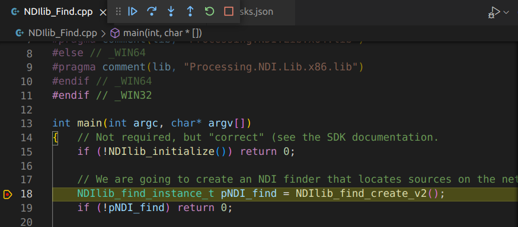

## NDI在Linux平台的开发初探

#### 背景介绍

​	NDI的全称为网络设备接口（Network Device Interface），是由NewTek公司公开发布且版权免费的IP网络视频传输协议。该技术不依赖行业内传统 HDMI、SDI 的链接方式，而是在IP空间内对音视频进行编码和简单高效的传输。使音视频在高质量、低延迟下，可利用同步或异步的方式进行发送和接收。同比其他协议，诸如SMPTE 2022、SMPTE2110和ASPEN所需的万兆网络环境，NDI所需的千兆网络环境则显示出其优势，我们利用NDI也会有更多可能的产品开发。

​	Linux、Windows和MacOS是当下计算机流行的三大平台，其中开源的Linux是国产操作系统的技术基石和嵌入式系统的主流。现如今所有视频渲染、图像处理系统和切换台都是在计算机上运行，而且，上述这些设备几乎都是通过IP进行通信的。所以，在Linux平台中进行基于NDI开发探索是十分有必要的。

#### 开发实践与分析

​	在软件开发上，以围绕网络安全和自主知识产权的网络会议系统为方向，借助 NDI-SDK 5.0 进行探索。其所依托的硬件设备，是基于国内自主品牌的计算机“百信太行220E-M”进行实践。“百信太行220E-M”搭载ARM架构的鲲鹏920处理器，内置UOS国产统信操作系统。

##### 开发环境配置

​	工欲善其事必先利其器，我们需要确认系统内的编译器和调试器是否已经安装，其中gcc、g++为编译器，gdb为调试器。在终端内输入如下指令来查看相关工具版本信息：

```
gcc --version
g++ --version
gdb --version
```

若无版本信息，说明相关工具尚未正确安装，则需要通过指令来安装：

```
sudo apt install gcc
sudo apt install g++
sudo apt install gdb
```

​	图形化的IDE会使开发事半功倍，在商店中找到VSCode并安装，启动VSCode后下载所需插件 C/C++ , C/C++ Extension Pack , Code Runner, Makefile Tools。用IDE打开NDI-SDK中的案例文件夹，则默认为此案例建立了工作区。接下来要对Tasks.json进行修改来配置编译所需的相关参数。其中有下列参数项配置时需要注意：

- -g	编译生成调试信息
- -std=c++11   标准库使用版本
- -pthread     多线程编译加此参数
- -I    （大写I）设置include路径
- -L   （大写L）设置lib路径
- -l    （小写L）设置要连接的文件，例如 -lndi，则会在设置的路径中，查找 libndi.so文件。其中，lib和.so是编译器默认加上的前缀和扩展名。
- -Wl    设置编译选项
  - -Wl,--rpath='$ORIGIN'	这个可以在开发版时候，为编译好的执行程序设置搜索动态库位置。变量$ORIGIN是当前执行文件所在目录地址。我们在终端窗口用命令行  readelf -d ./NDIlib_Find 查看可执行程序动态节的RUNPATH
  - -Wl,--as-needed	链接过程中，链接器会检查所有的依赖库，没有实际被引用的库，不再写入可执行文件头。最终生成的可执行文件头中包含的都是必要的链接库信息。-Wl,--no-as-needed 选项则不会做这样的检查，会把用户指定的链接库完全写入可执行文件中。

​	配置成功后，选择调试该CPP文件，则会对其进行编译操作。编译完成后，我们能够看到程序在断点处停下，并且可以进行调试，如图1所示：



​	当使用NDI-SDK默认的MakeFile执行make操作时，会出现编译失败的提示。这是因为在make读取MakeFile后，会自动执行其中收集当前编译器的目标机型的信息，但编译器寻找不到所需的so文件。所以，我们需要修改MakeFile来指定所需的so文件。上文提到开发所用硬件设备的处理器是鲲鹏920，属于ARM架构，将example/C++/MakeFile文件中的41行的变量$NDILIB替换为指定的ARM架构的lib文件夹路径即可。

##### 启用相关服务

​	通过对NDI-SDK文档的解读，Linux上的NDI库依赖于两个第三方库：libavahi-common.so.3 和 libavahi-client.so.3，而这些库的使用取决于将要安装和运行的avahi-daemon服务。其中，avahi-daemon即是mDNS的网络发现服务。如不启用mDNS服务，则NDI无法定位到网络上的数据源。然而，在UOS国产统信操作系统中，mDNS服务默认是关闭的，我们需要启动mDNS服务。在终端窗口输入 /etc/init.d/avahi-daemon start 来启动mDNS服务即可。我们也可以利用chkconfig avahi-daemon on对此服务进行自启动。

##### 发送视频数据

​	在Windows平台下，NDI提供了整套工具包NDI Tools，其中最常用到的有：StudioMonitor 用于通过网络实时展示NDI视频源；ScreenCapture用来捕捉当前计算机的屏幕、摄像头作为视频源；AccessManager用于管理NDI源的网络发现和权限。我们在Windows平台下，启动StudioMonitor，在成功启用相关的服务后，则能够远程链接到我们的百信设备视频源，成功接收到其发出的视频数据，如图2所示：


#### 未来工作

​	通过对NDI在Linux平台的开发初探后，无论从软硬件的支持来说，内部网络的视频会议系统开发是可行的，同时还可以满足网络安全、自主知识产权等前提需求。在未来的工作中，利用此技术特点，还可以进行内网KVM对目标机器进行链接，为其进行远程排故，可大幅减少运维人员排故的时间成本，以提升工作效率，可以说未来可期。


