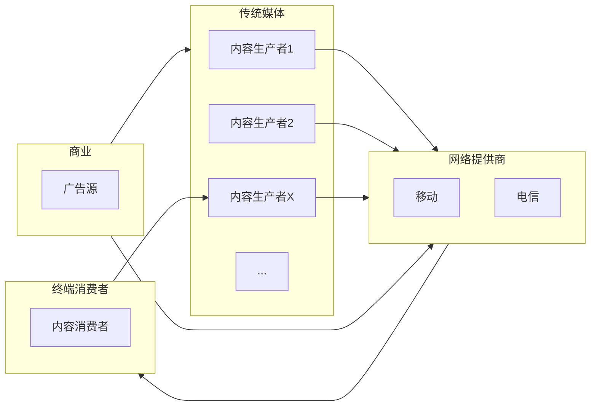

# 观世界电视日-中国电视大会之心得

*温伟航写于2022-11-22*

### 电视创新改革与新媒体融合

电视创新改革的必要性，我们先看表格来关注电视在30年的变化：

|        | 广告收入 | 媒介              | 特点                         |
| ------ | -------- | ----------------- | ---------------------------- |
| 90年代 |          | 电视屏+有线电视   | 单向广播                     |
| 2006年 | 959亿    | 电视屏+数字信号网 | 兴趣导向选择                 |
| 2014年 | 3635亿   | 跨屏+互联网       | 突破时间限制，互动方式更丰富 |
| 2021年 | 9676亿   |                   |                              |

我们不难看出，广告收入的增涨在持续走低，传统广电的压力可想而知。而且，随着通货膨胀率平均每年2.3%来说，电视行业的收入能力比起所看到的，实则收入下降更为严重。

从人们对几种媒体的权威性调（可信任度）调查来看：

|        | 电视 | 报纸 | 互联网 | 广播 | 杂志 | 户外媒体 |
| ------ | ---- | ---- | ------ | ---- | ---- | -------- |
| 权威性 | 32%  | 14%  | 16%    | 9%   | 9%   | 13%      |

电视的权威性还是远高于其他媒体的，这是可以利用的特点，或者要寻找这样受众的广告提供商。

对于高新视频，有下列几个方向：

互动视频：分支选择，事件互动、画面互动、时间域互动；劣势，需要内容的精心设计。

沉浸式视频：优势身临其境，超强沉浸感，多方位的视听信息；劣势，需要硬件支持，内容的支持。

VR视频：头显设备，同样增加沉浸感，在虚拟世界营造“真实”场景；劣势，需要硬件支持，仅是单人设备体验，无法同时分享快乐。

视频从单屏，多屏，跨屏，再到高新视频的无屏。

**思考**：可以看到，随着媒体行业的不断变化，电视作为主流媒体，逐渐被互联网新媒体分流。虽然，传统电视内容的制作水平还是高标准，高质量的。但是，观众被互联网媒体平台这样的“口水”视频所吸引。思考这样的成因或许是几个原因导致：

1. 内容的生产上，从少量规模化组织到大量即是生产者又是消费者的素人生产者。导致内容的数量和差异性会使得观众更青睐于互联网视频平台。
2. 内容的娱乐化严重，严肃性降低。作为网络视频平台中的内容审核而言，仅仅只是底线的审核。从而导致“奶头乐”效应逐步提升，消费者或观众的大脑过度依恋于简单获取视觉或者听觉的刺激。也有少部分看似严肃的视频内容，但是内容的真实性无从考证，实则是通过“严肃的”表现来迎合观众的某种观点来进行吸粉。
3. 硬件设备的局限性和对时间片的控制力差，所导致电视相比于手机、pad等媒介更难能突破空间限制；而内容体量的长度，又在时间的限制上很难突破。只能借助“跨屏”。
4. 所谓的“跨屏”，实则是放弃了电视这个单一的战场，转到互联网多媒体，此时的流量入口已经被资本所垄断，传统电视，只能通过与互联网大厂合作或者推流而达到曝光率。实则的真正受益人却是互联网大厂，传统媒体只能沦为二线，拾人牙慧。

**分析**：上述在高新视频的方向中，虽然紧抓技术不错，但是无法撼动传统媒体一路走低的现状。应该考虑在顶层设计中布局，正如这次汇报中所说，搭建全媒体传播体系（生态）。要打通上下流。

作为传统媒体，可以建立工作室机制，激发基层一线团队融合创新的热情和动力。而且，随着广告收入的高低进行绩效考核。另一方面，要保留终端消费者，也是内容的生产者。但是终端入口的所有权不能被资本垄断。

在整体流程中，传统媒体需要和网络运营商相统一。要进行一个媒体生态的整合，不但要有媒体功能，进一步发展平台功能，同时兼顾起社会的治理功能。充分利用消费者或观众对传统媒体的信任，进行引流。同时，抹除其对传统媒体内容中，古板无趣的印象误区，进行对内容的创新。就像会议中所讲：

- 顶层设计的几个方面有内容提升，技术赋能，服务拓展，机制改革，人才支持。
- 供给侧结构性改革要推动优质资源向移动端汇聚
- 内容创新化，平台集聚化，技术智能化，人才专业化

我相信，在政策导向，资金支持，创新改革的多方面的推进下，传统媒体会东山再起。

