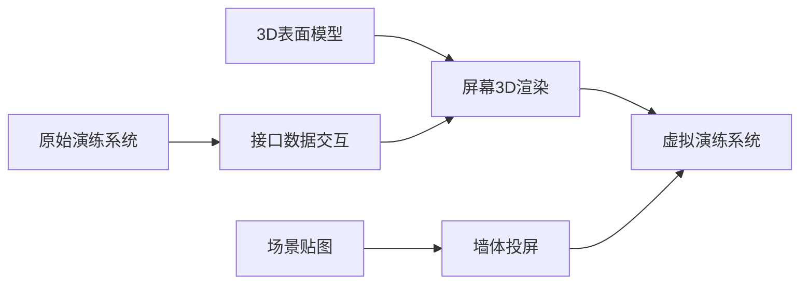

# 虚拟演练系统方案

### 1、全3D场景模拟系统

利用3D建模技术，将需要模拟的实景场景进行数字孪生3D化，然后通过3D游戏引擎对其进行PBR渲染输出和开发。达到真实场景的虚拟仿真。另一方面，仿真系统的内部逻辑需要全部移植到模拟系统内部。以保证真实模拟和训练的目的。

> 此方法，因为建模的数量和精度，原始模拟演练系统缺少源码文件，3D孪生建模和仿真模拟的逻辑程序的移植工作量较大

### 2、部分3D场景+原有模拟系统嵌入

利用3D建模技术，仅将场景大环境3D建模，通过3D游戏引擎进行渲染和开发。环境内的交互演练系统将原有2D模拟系统嵌入，达到虚拟演练模拟的目的。但是，体验感和交互感提升不大。

> 此方法，建模量最小，3D环境与原有2D程序的嵌入工作量可控。

### 3、部分3D场景系统+真实场景结合

利用3D建模技术，将所需要模拟的设备的交互表面进行3D建模，通过3D游戏引擎进行渲染和开发。同时，虚拟演练系统的逻辑通过第三方通信与原有演练系统接口进行对接。真实场景布置的表现上，可以利用投影效果与屏幕3D场景进行叠加，可以在一定程度上提升用户的体验感，身临其境。

