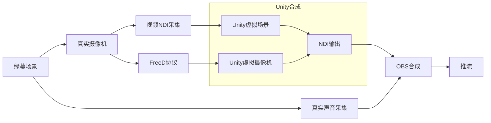
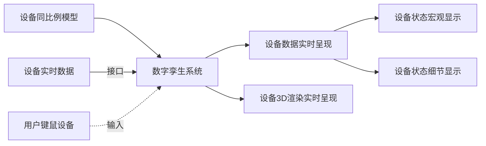
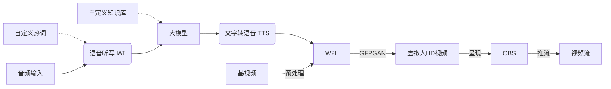
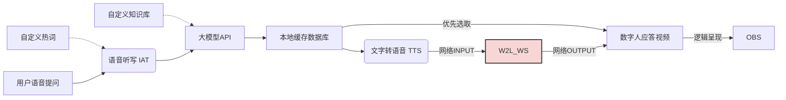
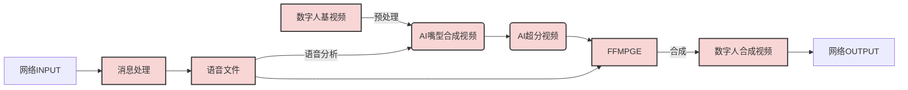
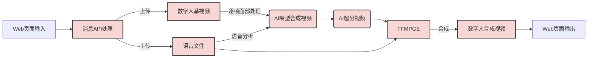

# 工作内容记录

*记录在山西广播电视台（SXRTS ）的工作内容  written by WenWeihang*

### 2022年7月 至 8月

首次来台实习，在网络部轮岗，跟随高健老师。巡检数据中心机房，视频制作机房，广播设备等。了解巡检流程和日常网络部的职责。

### 2022年8月 至 9月

在5G实验室轮岗，跟随刘鹏老师。对新兴OverIP的流媒体协议——NDI进行了调研和开发初探。翻译了部分NDI官方的相关视频，并完成了对NDI-5.0-SDK英文文档的核心翻译。同时对NDI源码在Linux系统上的编译和调试环境的搭建进行实践，并在内刊《三晋声屏》发文。

### 2022年9月 至 10月

在5G实验室轮岗，参与保障二十大安全播出。为二级平台大屏可视化——“党的二十大网络直播安全指挥中心”提供了技术支持。参加了台人事教育中心为期一周的培训，并提交了培训心得。

开始调研OverIP 的相关其他协议，诸如：SRT、SMPTE、WebRTC等，并总结调研内容至文字化。并锁定SRS作为实时推拉流服务器。

### 2022年10月 至 11月

对SRS其进行进一步的调研，实践搭建SRS服务器，并可以用其进行WebRTC和RTMP的推拉流。

跟随范老师走访台内各个办公部门，记录办公网的交换机位置和链接情况，绘制相关的网络拓扑图。

### 2023年1月至2月

利用Unity，完成虚拟党建VR系统，打包为H5发布，支持移动端，Windows等多平台。并可以通过不同平台进行适配界面。同时，其中的答题系统，可以与技术板块学习考核系统对接，进行沉浸有趣的答题体验。

### 2023年2月至3月

利用UIKit，完成三个APP的入口前端，同时界面上利用threeJS进行3D渲染台标。

尝试完成Unity中的FreeD协议插件，以打通直播XR工作流。

### 2023年3月至4月

去河南电视台交流学习

完成第一阶段FreeD工具的开发，加上了界面。

### 2023年5月至8月

参加山西广播电视台学习党的二十大精神知识竞赛

参加台内组织的“高举旗帜守初心 守正创新担使命”主题宣讲活动

协助刘老师调研并实践AIGC，以及深入数字虚拟主播技术。

在AIGC方面，搭建和引入Stable Diffuse，并应用其“文生图，图生图”等功能。

在数字虚拟主播方面，调研了多个开源模型 

- Wav2lip 及其二次开发结合GFPGAN的高清版本
- Video-Retalking
- Roop
- SadTalker
- DINet
- realesrgan 视频超分，对动画友好

其中，目前用到的是Wav2lip+Sadtalker+Opencv融合

阅读并学习了《机器学习实战》《生成式深度学习》《PyTorch生成对抗网编程》对相关的AI框架和技术有了全面的了解，对下一步的工作会有积极的促进作用。

### 2023年8月底

去北京参加BIRTV，调研AIGC相关集成技术和工具，并完成了AIGC技术调研的PPT和视频讲解。

### 2023年9月至10月

#### 文博会技术板块的视频展示

前期筹备策划工作，步骤依次为：

1. 与媒资部沟通洽谈，初步交换工作内容摘要。
2. 收集并调研关于“XXX随着时代变化”相关视频，选择出有代表性的三个优质视频。
3. 对上述优质视频进行细致分析，镜头语言、表现手法、视音结合等。
4. 提炼规划视频脚本。
5. 让领导审核并寻求核心和表达方向。
6. 修改视频脚本。
7. 向媒资部申请相关素材。
8. 制作AI数字人相关串场视频。
9. 合成最终视频。

十月份伊始，文博会任务取消了，仅完成到第3步。

#### 数字孪生项目

用于制播网机房的数字孪生展示。机房设备3D模型提供方为制作中心，机房设备数据提供方为融媒技术中心网络部。数字孪生项目制作为融媒技术中心5G实验室。

项目简介：

此项目对制播网机房设备的数字孪生展示。通过一比一对机房设备的建模复刻。利用Unity3D引擎对美术提供的高精度服务器和交换机等设备模型进行实时渲染。于此同时，此项目与Prometheus（普罗米修斯）设备监控后台实时通讯，将所需的设备数据进行收集，解析后将其数据正确映射并控制相应设备模型的状态。

第一版制作内容：

一个服务器机柜，两个交换机设备，两个存储设备，一个KVM，一个服务器。场景载入后，摄像机会以第一人称视角面向机柜。用户可以通过鼠标交互，全视角环视镜头。场景会以一定的刷新频率访问并获得服务器后台状态数据，并反馈在服务器外在表象上（例如：灯光闪烁和颜色）

当用户选择查看指定的设备后，摄像机会移动至服务器一侧，弹出展示服务器细节数据的全息面板（例如：服务器设备的CPU占用率，内存占用率等）。此时锁定摄像机镜头和移动。用户此时可以查看服务器内容。选择关闭面板后，摄像机后撤移动至上一个点选时的位姿状态。

异常处理，当后台数据访问失败或超时，会给予显著提示，并告知用户。

开发工作照：

测试和修改BUG，截至日期（2023年12月中旬前）：

- 10月11日与陈老师讨论交流模型制作事宜
- 10月17日与许飞老师讨论交流服务器数据接口问题

#### 与健康广播沟通洽谈虚拟数字人落地。

筹备技术板块技术交流务虚会。组织分享一波技术风向的变现和展望。技术团队组织结构的改革和创新等等。

#### 思考在线答题的游戏小游戏

类似于玩家在奔跑中选择题目的答案。可以尝试分为两步走：

- 单机登录网页或者下载APP后即可使用

- 多人联机后在线同时竞技

  

回答正确问题后，可以武装自己（特效什么的），比如都是走路，回答对就是自行车，摩托车，开汽车 等等~

#### 夜间值班培训及上岗

- 10月10日贾老师为我们在广播站做了第一次全面培训
- 10月17日贾老师为我们在文艺广播站教学主备播机器重启

### 2023年11月至12月

#### 光立方

焊接LED8x8，反编译相关工具，并开发自己的串口工具。

#### 本地部署大模型

本地部署Qwen通意千问。具体方法，参见相关文档 [ [Here](./部署Qwen) ]。

### 2024年1月

短视频相关，只是学习和前期调研

### 2024年2月

在小红书和抖音发布恐怖短视频（二日更），短视频采用SD生成分镜图片，AI配音，后期人工进行剪辑。播放效果正常，但是吸粉能力较差。

在B站发布桌游方向视频（月更），视频完全为原创，播放量效果好，超越一般桌游方向up主。

### 2024年3月

协助科室制作短视频。

### 2024年4月

参加北京CCBN会议，参会了一些关于AI相关的会议，参观了与AIGC相关的厂商展台

#### 启动虚拟人(Vman项目)

开始搭建实时虚拟人对话项目 vman 流程图

修改后的VMAN流程图

修改后的W2L_WS流程图

WEB

### 2024年5月 和 2024年6月

#### 优化数字人

优化数字人的方案有如下:

| 序号 | 方法                        | 完成情况 | 效果               |
| ---- | --------------------------- | -------- | ------------------ |
| 1    | W2L 的基视频预处理          | 已完成   | 提速明显           |
| 2    | GFPGAN  的基视频预处理      | 测试完成 | 提速一般           |
| 3    | 回答视频的缓存机制          | 已完成   | 回答范围内提速明显 |
| 4    | 超分GFPGAN任务拆分到多个GPU | 未完成   |                    |
| 5    | W2L模型重新进行学习         | 未完成   |                    |

数字人目前存在的不足

| 序号 | 问题描述                      | 解决方案                        | 完成情况   |
| ---- | ----------------------------- | ------------------------------- | ---------- |
| 1    | 超分GFPGAN速度慢              | 训练W2L高清模型，跳过GFPGAN过程 |            |
|      |                               | 超分GFPGAN任务拆分到多个GPU     |            |
| 2    | 大模型屏蔽敏感词              | 本地部署大模型                  |            |
|      |                               | 敏感词在发送端前置过滤          |            |
|      |                               | 忽略大模型返回的错误码          | **已完成** |
| 3    | IAT语音听写人名不准确         |                                 |            |
| 4    | TTS音色                       | 本地部署TTS                     | 已完成     |
|      |                               | 第三方TTS接口充值               |            |
| 5    | BUG -- 仅用了第一秒的视频生成 | 代码排查                        | **已完成** |
|      |                               |                                 |            |

### 2024年7月

山西新闻生产能力平台项目

APP与小程序开发对接【参会内容在本上记录】

5G频道项目

1. 签收了来自JDL的1个货物和来自SF的3件货物
2. 海洋和我讨论欲用我的身份证办理台内项目移动盒子的用户
3. 2024-7-3 跟着中国移动光纤机顶盒人员去播送中心做前期安装调研。
4. 2024-7-5 王总已经开始安装卫星天线接收装置等设备

继续优化数字人

##### 5G频道项目工作总结

[[HERE DOC]](\信源处理系统项目工作总结_20240731.md)

### 2024年8月

防火墙节点，安装，授权，配置。

借着智慧新闻生产平台的技术报告会，展示了新完成的数字人，反响可以。

#### 参加BIRTV心得

去北京参加BIRTV后，我会从AI论坛会议，展台AI系统相关以及非AI相关系统，这几个方面进行参会整理。

##### AI论坛会议相关

听了多场涉及AI相关的论坛会议，现在利用AI进行赋能，在各个领域均有不同程度的提现，从形而上的媒体融合大方向，到形而下的特定专业领域的AI辅助设计。

与去年BIRTV拥抱大模型、使用大模型不同的是，今年会议更在深度且多模态（文字，图像，视频，声音）的对大模型进行输入输出，而且，针对于特定的工作场景进行挖掘后，串接多种AI模型的能力，与传统业务流程进行融合。更进一步来说，有资金和研发能力的其他电视台也建立了相关的“实验室”，无论他们是否与厂家合作，他们的目标会是对大模型进行一定程度的本地化部署，或对大模型进行专业化的定制性微调，确保其在行业内的准确度和适用度。

针对数据集而言，公开的一些包括文本、代码、图像、视频等其中涉及的领域也逐步细分，而且广电行业也利用结合媒资抽取出适合于对大模型进行微调而使用的特定数据集。对此数据集也会进行二次数据清洗和标注。

另外一个AI应用的亮点，是在这次巴黎奥运会中的呈现。InnomotionAI 数据采集和虚拟化呈现，在乒乓球和射箭项目中使用。在羽毛球项目中，AI进行图像增强微型摄像机拍摄系统，该系统包括摄像头部署，AI模型搭建，视频预处理，插帧等。REAL+在攀岩项目中，实现了高质量的数字孪生、AR和实时解读。子弹时间效果，在涉及14个场馆内的诸多项目中，运动员特定的回放中，进行子弹时间的回放效果，效果良好。

AI可以赋能在“采，传，编，播，存”各个环节中，在转播中的三个方向，云转播远程制作；智慧AI转播；MR+数据的电竞化呈现。

##### 展台AI系统相关

在各个厂商的展台，涉及AI的相关系统中，各个厂商并无很大差异。经我与某厂商技术人员深度沟通后，了解到，相似性的原因是由于源代码的相似性，以及后台大模型服务提供商的相似性导致。

今年新增较为亮眼的有AI微电影制作，AI图+文生成质量较为良好的短视频片段，这两项以视频生成为主的AI应用。

在数字人方面，中小型厂商均在不同的显示设备上（诸如显示灯箱）进行展示，但数字人质量均不高于山西台5G实验室的数字人质量。不同与2D数字人的是中国传媒大学的3D数字人，依托AI进行骨骼控制，在UE5中实时渲染，但嘴型匹配程度并不非常理想。

在专业领域方向上，某国外厂商在AI智能调色系统给我对AI落地项目一些提示，“专业化，关键化”应该是区别于依托雄厚资本的大厂在AI“泛化”上强有力的竞争点。AI要想掷地有声，必须要在项目制作流程的关键节点上，提供专业化的辅助能力。而不是考虑取代某些非专业化非关键节点的人力。（例如：横屏转竖屏的智能裁切，往往少数情况下无法很好的识别，导致花费了此AI工具的资金还需要人工进行进一步校对。）这样，会提升专业化人员的工作效率，而且他们有精力会发挥他们的创造力，我认为这才是AI在中小厂商中未来的落地方向。

##### 非AI相关系统

在包括各个老牌大型厂商展台中，此次MR制作应用系统如雨后春笋般，在虚拟影视拍摄方面非常成熟，不限于摄像机定位，LED屏渲染技术，环境光影的动态匹配等等。且这些技术日趋成熟，对于视频拍摄的效果和效率上均有很大的提升。

### 2024年9月

测试模型chattts，musepose等，本地化部署大模型知识库，对接数字人后台，更新API接口

### 2024年10月

